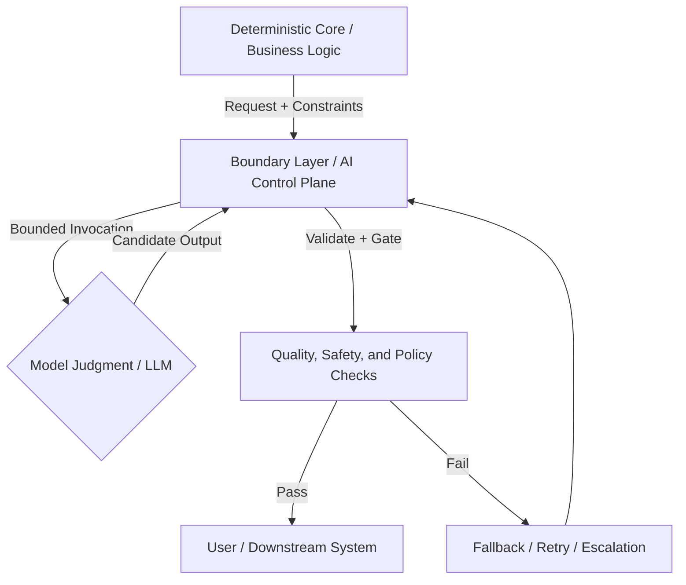

# Uncertainty Architecture (UA)

## Engineering at the AI–Code Boundary

**Uncertainty Architecture** is an open doctrine and pattern language for building and operating software in which part of the system's behavior is delegated to **non-deterministic model judgment**, while the surrounding system remains **deterministic, inspectable, and governable**.

UA is not about eliminating uncertainty or pretending that AI can be made fully deterministic. It is about **containing uncertainty**: deciding where determinism must hold, where judgment is unavoidable, and how the boundary between the two is engineered, observed, and corrected over time.

The project is designed primarily for small and medium-sized engineering organizations that need practical control without building a large governance bureaucracy.

## Start Here

- **Read the specification boundary and status model:** [`SPECIFICATION.md`](SPECIFICATION.md)
- **Understand the core concepts:** [`00-doctrine/`](00-doctrine/)
- **Use the canonical vocabulary:** [`00-doctrine/glossary.md`](00-doctrine/glossary.md)
- **Apply reusable engineering patterns:** [`01-patterns/`](01-patterns/)
- **Design the control loop:** [`02-ai-control-plane/`](02-ai-control-plane/)
- **Review concrete architectures:** [`03-reference-architectures/`](03-reference-architectures/)
- **Study recurring failure modes:** [`04-failure-modes/`](04-failure-modes/)
- **Trace the research behind UA:** [`content/research/`](content/research/)
- **See project direction:** [`ROADMAP.md`](ROADMAP.md)

## The Core Shift

Traditional software is mostly built from deterministic components and predefined execution paths. LLM-backed and agentic systems introduce components whose behavior remains probabilistic at runtime.

UA calls this broader class **Thinking Systems** (previously described in historical UA publications as **Behavioral Software** or **Behavioral Applications**):

- **Linear Software** follows explicitly coded paths.
- **Thinking Systems** delegate part of runtime interpretation, judgment, planning, or path selection to probabilistic models while retaining explicit deterministic boundaries and control.

Agentic systems are a higher-autonomy subset of Thinking Systems, not a synonym for the whole category.

The architectural problem is therefore not only model quality. It is how probabilistic judgment is connected to business rules, permissions, data, human authority, release processes, monitoring, and correction.

## Core Model

UA treats AI governance as an engineering control problem.

> **Reliable AI = Actuators + Sensors + Controller**

- **Actuators** shape and constrain behavior: prompts, schemas, policies, permissions, tools, model settings, and execution boundaries.
- **Sensors** detect deviation: evaluations, golden scenarios, runtime signals, incidents, qualitative review, and drift monitoring.
- **Controller** determines corrective action: release gates, ownership, escalation, rollback, retraining, prompt or policy changes, and human decision authority.

This control loop surrounds a critical distinction:

- **Deterministic Core** — business rules, invariants, authentication, data handling, auditability, and safety constraints.
- **Model Judgment** — interpretation, synthesis, classification under ambiguity, open-ended generation, and uncertain tool choice.

UA focuses on the boundary between these regions.


```mermaid
graph TD;
    A[Deterministic Core / Business Logic] -->|Request + Constraints| B[Boundary Layer / AI Control Plane];
    B -->|Bounded Invocation| C{Model Judgment / LLM};
    C -->|Candidate Output| B;
    B -->|Validate + Gate| D[Quality, Safety, and Policy Checks];
    D -->|Pass| E[User / Downstream System];
    D -->|Fail| F[Fallback / Retry / Escalation];
    F --> B;
```

## What UA Is — and Is Not

UA is:

- a shared way of thinking about systems at the AI–code boundary;
- a set of patterns for containment, evaluation, escalation, and fallback;
- an operational doctrine for governing probabilistic behavior;
- a tool-neutral specification intended to evolve through research and implementation evidence.

UA is not:

- an SDK or universal agent framework;
- a prompt-template collection;
- a single metric or evaluation method;
- a compliance certification;
- a claim that uncertainty can be removed from model behavior.

## Repository Structure

### Specification modules

- [`00-doctrine/`](00-doctrine/) — core concepts, terminology, and boundary thinking.
- [`01-patterns/`](01-patterns/) — reusable containment and interface patterns.
- [`02-ai-control-plane/`](02-ai-control-plane/) — actuators, sensors, controllers, and operating controls.
- [`03-reference-architectures/`](03-reference-architectures/) — worked architectural applications.
- [`04-failure-modes/`](04-failure-modes/) — recurring technical and socio-technical failure modes.

The canonical boundary, status vocabulary, and conformance model are defined in [`SPECIFICATION.md`](SPECIFICATION.md).

### Supporting material

- [`content/research/`](content/research/) — research corpus, notes, provenance, analysis, synthesis, and research-to-framework traceability.
- [`content/history/`](content/history/) — project milestones, talks, discussions, independent references, and superseded process records.
- [`content/raw/`](content/raw/) — preserved source snapshots used for normalized research editions.
- [`ROADMAP.md`](ROADMAP.md) — current direction and future priorities.
- [`CHANGELOG.md`](CHANGELOG.md) — changes to repository and specification artifacts.
- [`CONTRIBUTING.md`](CONTRIBUTING.md) — contribution and review workflow.

### Navigation for Obsidian and AI tools

- [`DOCUMENT-METADATA.md`](DOCUMENT-METADATA.md) defines the controlled frontmatter fields and hierarchical `ua/...` tag vocabulary.
- [`AGENTS.md`](AGENTS.md) provides a tool-neutral repository map, authority order, reading strategies, and editing invariants for language models and coding agents.

These files improve navigation and retrieval. They are informative and do not create a second specification or change document authority.

## Evidence and Project History

UA keeps different kinds of evidence separate:

- [**Research**](content/research/) explains where ideas and claims originated and how they evolved.
- [**Public discussions and stress tests**](content/history/community-discussions.md) record critique, alternatives, unresolved questions, and external pressure on the concepts.
- [**Independent references and recognition**](content/history/external-recognition.md) record how third parties cited, interpreted, recommended, or used the work.
- [**Talks and presentations**](content/history/talks.md) record practitioner sessions and public presentations without treating invitations as technical validation.
- The [**changelog**](CHANGELOG.md) records changes to repository and specification artifacts.

This separation prevents visibility, attention, recommendations, advisory relationships, or invited talks from being mistaken for technical validation, certification, institutional endorsement, or formal adoption.

The evidence policy and complete historical index are maintained in [`content/history/`](content/history/).

## Current Status

**Active specification development.**

The repository structure, document-status model, canonical entry points, draft glossary, and navigation metadata are now aligned. The current substantive priority is cross-publication research synthesis and extraction of the framework spine, followed by a practical SMB-facing artifact for mapping risks, required controls, and control cost.

See [`ROADMAP.md`](ROADMAP.md) for current sequencing.

## Community and Contributions

GitHub is the canonical home for doctrine and specification changes. Community discussion and early design review may happen elsewhere, but accepted changes must be represented in the repository.

Useful contributions include operational failure reports, pattern proposals, critiques of terminology or control assumptions, examples of escalation and evaluation design, and provenance corrections.

See [`CONTRIBUTING.md`](CONTRIBUTING.md).

## Authors, Maintainers, and Advisors

**Vitalii Oborskyi — Creator and Lead Architect**  
Operational framing, governance, delivery systems, adoption scaffolding, and system-level control. [LinkedIn](https://www.linkedin.com/in/vitaliioborskyi/) · [GitHub](https://github.com/oborskyivitalii)

**Sam “stunspot” Walker — Technical Co-Author**  
AI–code boundary placement, containment patterns, prompt-as-medium realism, and real-world failure modes.

**Markus Kopko — Strategic Advisor on Governance and Alignment**  
Project-management standards, organizational alignment, and operationalization of AI governance. [LinkedIn](https://www.linkedin.com/in/markuskleinpmp/)

**Otman Basir, Ph.D. — Academic Advisor**  
Professor of Intelligent Systems at the University of Waterloo and author of the Social Responsibility Stack. [LinkedIn](https://www.linkedin.com/in/otman-basir-ba1258178)

Advisory relationships are part of the project's operating context. They do not imply institutional endorsement, certification, or formal adoption of UA. Supporting public evidence and precise claim boundaries are recorded in [`content/history/external-recognition.md`](content/history/external-recognition.md).

## Citation

```bibtex
@misc{oborskyi_walker2025uncertainty,
  author = {Oborskyi, Vitalii and Walker, Sam},
  title = {Uncertainty Architecture: An Operational Model for AI Governance},
  year = {2025},
  publisher = {GitHub},
  howpublished = {\url{https://github.com/UncertaintyArchitectureGroup/uncertainty-architecture}}
}
```

## Licensing

This repository uses a dual-license model:

- documentation and specifications: CC BY 4.0;
- code and reference implementations: Apache 2.0.

See [`LICENSING.md`](LICENSING.md).
