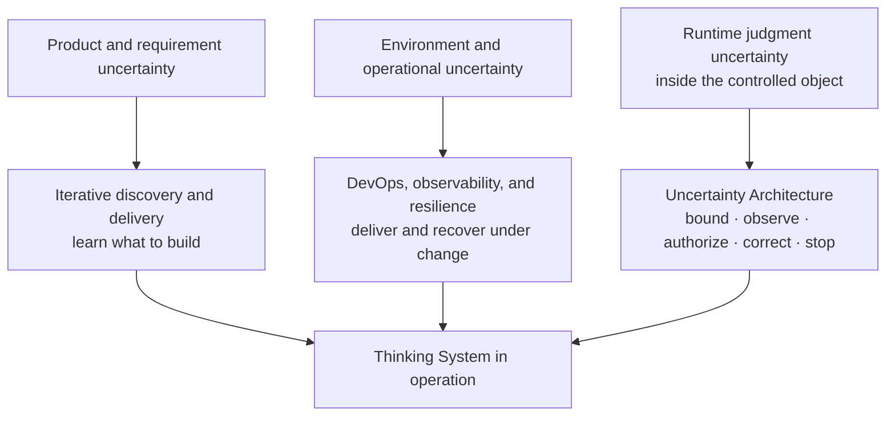
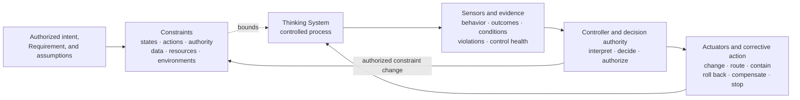
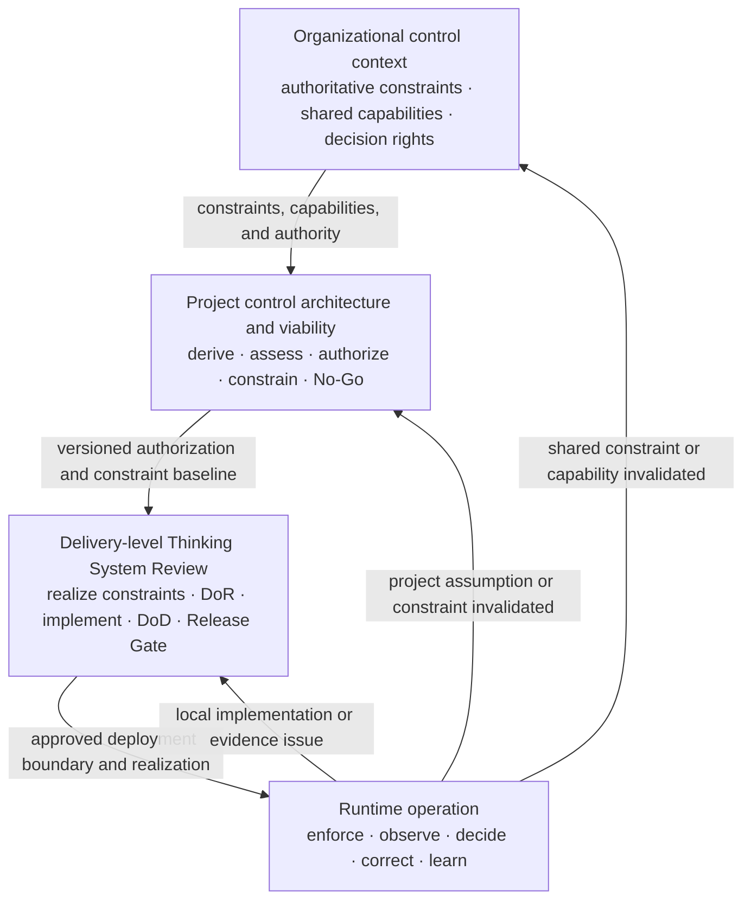

# Uncertainty Architecture (UA)

## Engineering at the AI–Code Boundary

**Uncertainty Architecture** is an open doctrine and pattern language for building and operating software in which part of the system's behavior is delegated to **non-deterministic model judgment**, while the surrounding system remains **deterministic, inspectable, constrained, and governable**.

UA is not about eliminating uncertainty or pretending that AI can be made fully deterministic. It is about **containing uncertainty**: deciding where determinism must hold, where judgment is useful or unavoidable, how the reachable operating space is bounded, and how behavior is observed and corrected over time.

The project is designed primarily for small and medium-sized engineering organizations that need practical control without building a large governance bureaucracy.

## Why UA Exists

Traditional software is engineered primarily as explicitly encoded behavior:

```text
y = f(x)
```

A Thinking System delegates part of runtime interpretation, judgment, planning, or path selection to a probabilistic model:

```text
y ~ P(y | x, context, model configuration)
```

Each model-mediated execution selects one behavior from a space of plausible outcomes. The complete application still contains deterministic code, rules, permissions, data handling, and infrastructure, but part of its consequential behavior is generated at runtime rather than fully enumerated in advance.

This changes the controlled object itself. Uncertainty no longer exists only outside the software—in requirements, product assumptions, users, infrastructure, or deployment environments. Part of it is produced inside the operating system through Model Judgment.

Different engineering disciplines remain necessary because they address different control problems:


```mermaid
flowchart TB
    P[Product and requirement uncertainty]
    A[Iterative discovery and delivery<br/>learn what to build]
    O[Environment and operational uncertainty]
    D[DevOps, observability, and resilience<br/>deliver and recover under change]
    J[Runtime judgment uncertainty<br/>inside the controlled object]
    U[Uncertainty Architecture<br/>bound · observe · authorize · correct · stop]

    P --> A
    O --> D
    J --> U

    A --> S[Thinking System in operation]
    D --> S
    U --> S
```

Plan-driven methods reduce uncertainty through analysis and upfront planning. Agile and related iterative methods shorten the learning cycle when product knowledge changes. DevOps responds to operational variability through automation, observation, feedback, and recovery.

Thinking Systems introduce another problem: the deployed object itself continuously produces probabilistic judgment. Agile and DevOps do not automatically define where that judgment may act, which states and actions must remain unreachable, which consequences are acceptable, which evidence is sufficient, who has authority to intervene, what corrective mechanisms exist, or whether the full control perimeter leaves a viable business case.

UA supplies that missing control lifecycle. It connects organizational constraints, project authorization, delivery-level realization and review, runtime enforcement and evidence, correction, and reauthorization around model-mediated behavior. It complements existing engineering disciplines rather than replacing them.

Read the draft doctrine: [`Uncertainty in the Controlled Object`](00-doctrine/uncertainty-in-the-controlled-object.md).

## Start Here

- **Understand why the control problem changed:** [`00-doctrine/uncertainty-in-the-controlled-object.md`](00-doctrine/uncertainty-in-the-controlled-object.md)
- **Understand the four control capabilities:** [`00-doctrine/control-loop-anatomy.md`](00-doctrine/control-loop-anatomy.md)
- **See how the four decision levels work together:** [`00-doctrine/nested-control-lifecycle.md`](00-doctrine/nested-control-lifecycle.md)
- **Read the specification boundary and status model:** [`SPECIFICATION.md`](SPECIFICATION.md)
- **Use the canonical vocabulary:** [`00-doctrine/glossary.md`](00-doctrine/glossary.md)
- **Apply reusable engineering patterns:** [`01-patterns/`](01-patterns/)
- **Decide whether the project has a viable control architecture:** [`01-patterns/project-control-architecture-and-viability-review.md`](01-patterns/project-control-architecture-and-viability-review.md)
- **Copy the project-level review template:** [`01-patterns/project-control-architecture-and-viability-review-template.md`](01-patterns/project-control-architecture-and-viability-review-template.md)
- **Run the delivery-level review flow:** [`01-patterns/thinking-system-review.md`](01-patterns/thinking-system-review.md)
- **Copy the delivery review template:** [`01-patterns/thinking-system-review-template.md`](01-patterns/thinking-system-review-template.md)
- **Design the distributed control plane:** [`02-ai-control-plane/`](02-ai-control-plane/)
- **Design Constraints and enforcement:** [`02-ai-control-plane/01-constraints/`](02-ai-control-plane/01-constraints/)
- **Review implementation mechanisms:** [`02-ai-control-plane/01-constraints/constraint-realization-catalog.md`](02-ai-control-plane/01-constraints/constraint-realization-catalog.md)
- **See one completed delivery-level review:** [`03-reference-architectures/worked-thinking-system-review-support-triage.md`](03-reference-architectures/worked-thinking-system-review-support-triage.md)
- **Review minimal placement architectures:** [`03-reference-architectures/judgment-placement-examples.md`](03-reference-architectures/judgment-placement-examples.md)
- **Study recurring failure modes:** [`04-failure-modes/`](04-failure-modes/)
- **Trace the research behind UA:** [`content/research/`](content/research/)
- **See project direction:** [`ROADMAP.md`](ROADMAP.md)

## Suggested Reader Path

[`Glossary`](00-doctrine/glossary.md)
→ [`Uncertainty in the Controlled Object`](00-doctrine/uncertainty-in-the-controlled-object.md)
→ [`Control-Loop Capability Anatomy`](00-doctrine/control-loop-anatomy.md)
→ [`Nested Control Lifecycle`](00-doctrine/nested-control-lifecycle.md)
→ [`Requirements, Correctness, and Bugs`](00-doctrine/requirements-correctness-and-bugs.md)
→ [`Model Judgment Placement`](00-doctrine/model-judgment-placement.md)
→ [`Project Control Architecture and Viability Review`](01-patterns/project-control-architecture-and-viability-review.md)
→ [`Constraint Capabilities`](02-ai-control-plane/01-constraints/)
→ [`Judgment Node Boundary`](01-patterns/judgment-node-boundary.md)
→ [`Thinking System Review`](01-patterns/thinking-system-review.md)
→ [`Judgment Placement Reference Architectures`](03-reference-architectures/judgment-placement-examples.md)
→ [`Worked Support Triage Review`](03-reference-architectures/worked-thinking-system-review-support-triage.md)

## The Core Shift

UA calls this broader class **Thinking Systems** (previously described in historical UA publications as **Behavioral Software** or **Behavioral Applications**):

- **Linear Software** follows explicitly coded paths.
- **Thinking Systems** delegate part of runtime interpretation, judgment, planning, or path selection to probabilistic models while retaining explicit deterministic responsibilities, constraints, evidence, decision rights, and corrective paths.

Agentic systems are a higher-autonomy subset of Thinking Systems, not a synonym for the whole category.

Useful variance is part of the capability. Contextual interpretation, synthesis, and adaptive judgment are why the model is present. The engineering objective is not to crush the distribution into one exact output. It is to preserve the useful region while preventing, detecting, containing, and correcting behavior that violates the approved operating contract.

The architectural problem is therefore not only model quality. It is how probabilistic judgment is connected to business rules, Constraints, permissions, data, Human Authority, release processes, evidence, correction, project viability, and economic boundaries.

## Two Orthogonal Models

UA separates two questions that are often collapsed.

### Four decision levels

These identify **where a decision is owned**:

1. **Organizational control context**;
2. **Project control architecture and viability**;
3. **Delivery-level Thinking System Review**;
4. **Runtime control and reauthorization**.

### Four control capabilities

These identify **which functions make a control decision operational**:

1. **Constraints**;
2. **Sensors and evidence**;
3. **Controllers and decision authority**;
4. **Actuators and corrective action**.

The levels are not the capabilities. Every level may use the same capability vocabulary, but it owns a different decision, time horizon, and authority boundary.

## Core Control Model

UA treats AI governance as an engineering control problem.

A functioning loop requires:

- **Constraints** that define or enforce the allowed operating space across states, actions, authority, data, context, tools, resources, environments, outputs, deployment scope, and Human Authority requirements;
- **Sensors and evidence** that make relevant behavior, outcomes, drift, incidents, operating conditions, constraint violations, and control health observable;
- **A Controller** with decision authority to interpret evidence relative to an approved Requirement and authorize corrective action;
- **Actuators** capable of executing authorized changes to behavior or operating conditions through configuration, routing, limitation, fallback, containment, rollback, compensation, or shutdown.

These capabilities are necessary parts of control, not a formula that guarantees reliability. Their adequacy depends on consequences, uncertainty, authority, reversibility, evidence quality, feedback latency, constraint strength, operational capacity, and context.


```mermaid
flowchart LR
    I[Authorized intent,<br/>Requirement, and assumptions]
    K[Constraints<br/>states · actions · authority<br/>data · resources · environments]
    P[Thinking System<br/>controlled process]
    S[Sensors and evidence<br/>behavior · outcomes · conditions<br/>violations · control health]
    C[Controller and decision authority<br/>interpret · decide · authorize]
    A[Actuators and corrective action<br/>change · route · contain<br/>roll back · compensate · stop]

    I --> K
    K -. bounds .-> P
    P --> S
    S --> C
    C --> A
    A --> P
    C -->|authorized constraint change| K
```

The diagram defines logical functions, not four mandatory services. A schema validator may realize a structural Constraint; its violation log may act as a Sensor; a feature flag may act as an Actuator; the person or software deciding whether to change the schema may perform the Controller function.

A Prompt Registry, dashboard, policy engine, Human-in-the-Loop interface, kill switch, API, or agent framework is not automatically a complete control layer. Classification follows the function, guarantee, evidence, authority, and corrective path it actually provides.

### Constraint versus Actuator

- A **Constraint** defines or enforces what is allowed.
- An **Actuator** executes an authorized change.

An Actuator may install, tighten, relax, replace, or disable a Constraint within delegated authority. A Constraint may block an attempted action. The distinction is needed to reason about source, scope, guarantee, failure behavior, evidence, and change authority.

## Nested Control Lifecycle

UA distinguishes four connected decision levels:


```mermaid
flowchart TB
    O[Organizational control context<br/>authoritative constraints · shared capabilities · decision rights]
    P[Project control architecture and viability<br/>derive · assess · authorize · constrain · No-Go]
    D[Delivery-level Thinking System Review<br/>realize constraints · DoR · implement · DoD · Release Gate]
    R[Runtime operation<br/>enforce · observe · decide · correct · learn]

    O -->|constraints, capabilities, and authority| P
    P -->|versioned authorization and constraint baseline| D
    D -->|approved deployment boundary and realization| R
    R -->|local implementation or evidence issue| D
    R -->|project assumption or constraint invalidated| P
    R -->|shared constraint or capability invalidated| O
```

The canonical [`Nested Control Lifecycle`](00-doctrine/nested-control-lifecycle.md) explains decision ownership, constraint inheritance, delivery realization, upward evidence flow, and reauthorization.

Constraints do not merely move downward as copied policy text. Their authority is inherited while the realization becomes more concrete:

```text
Organizational source
→ project interpretation and derived constraint architecture
→ delivery implementation, configuration, verification, and release
→ runtime enforcement, evidence, corrective action, and reassessment
```

### Organizational level

The organization supplies authoritative sources and shared capabilities: prohibited uses, legal and contractual boundaries, approved data, vendors, models, geographies and deployment modes, risk appetite, identity, audit, incident processes, Human Authority, fallback, and shutdown capability.

### Project level

The [`Project Control Architecture and Viability Review`](01-patterns/project-control-architecture-and-viability-review.md) maps the business outcome, intended Judgment and authority, material risk scenarios, organizational and project-specific Constraints, required Sensors, Controllers, Actuators and Human Authority, evidence feasibility, operational capacity, control economics, residual risk, project authorization, delivery inheritance, and reauthorization triggers.

Its [`project-level template`](01-patterns/project-control-architecture-and-viability-review-template.md) keeps the authorization decision and versioned constraint baseline in one living artifact. `No-Go`, bounded research, redesign, deferral, and constrained authorization are valid outcomes.

### Delivery level

The [`Thinking System Review`](01-patterns/thinking-system-review.md) implements the delivery level for a bounded whole system, feature, or material change. It owns implementation-level Judgment Nodes, local Requirements, concrete constraint realization, model-mediated DoR, bounded experimentation or implementation, DoD, deployment-specific Release Gate, and local reassessment.

Its [`delivery template`](01-patterns/thinking-system-review-template.md) links the project decision and records source, scope, hard or soft strength, enforcement, failure behavior, evidence, configuration, and change authority without silently expanding or weakening project authorization.

### Runtime level

Runtime exercises the approved capability loop. It enforces the deployed Constraints, observes behavior and control health, routes evidence to an authorized Controller, and applies available Actuators. Evidence may remain a local delivery issue, invalidate a project constraint, capacity, evidence, or economic assumption, or reveal that an organizational boundary or shared capability must change.

## Practical SMB Path

The default project-to-runtime path uses two living reviews with different ownership:

```text
Link organizational constraints, shared capabilities, and decision rights
→ open the Project Control Architecture and Viability Review
→ map outcome, Judgment landscape, risk scenarios, constraint architecture, capabilities, evidence, capacity, and economics
→ authorize, condition, redirect to research, redesign, defer, escalate, or reject the AI path
→ pass one versioned authorization and constraint baseline to delivery reviews
→ run a Thinking System Review for each bounded system, feature, or material change
→ realize and verify inherited constraints
→ complete DoR, bounded experiment or implementation, DoD, and the Release Gate
→ enforce, observe, correct, and reassess at the local, project, or organizational level
```

The project review does not require separate risk maps, Constraint Registers, responsibility matrices, financial records, governance-board protocols, or Project Launch Gate records when linked evidence and one review are sufficient.

The delivery review does not require separate readiness records, completion packages, Constraint Registers, Judgment Node registries, responsibility matrices, governance-board protocols, or Release Decision Records.

A successful demo is not project authorization. A completed implementation is not release authorization. A release decision does not silently expand the project boundary or relax an inherited hard Constraint. `No-Go` remains a valid architectural result.

## What UA Is — and Is Not

UA is:

- a shared way of thinking about systems at the AI–code boundary;
- a doctrine for separating Model Judgment, deterministic responsibilities, and control capabilities;
- a set of patterns for Constraints, evidence, authority, containment, evaluation, escalation, fallback, and reassessment;
- a project-to-runtime control lifecycle for consequential model-mediated work;
- a lightweight SMB-facing project authorization review;
- a lightweight SMB-facing delivery review for a bounded system, feature, or material change;
- a tool-neutral specification intended to evolve through research and implementation evidence.

UA is not:

- an SDK or universal agent framework;
- a prompt-template or guardrail collection;
- a single policy engine, metric, or evaluation method;
- a mandatory four-service topology;
- a replacement for product discovery, Agile, DevOps, QA, security, or incident response;
- a mandatory governance department or committee;
- a compliance certification;
- a claim that uncertainty can be removed from model behavior.

## Repository Structure

### Specification modules

- [`00-doctrine/`](00-doctrine/) — the controlled-object shift, four-capability Control-Loop Anatomy, nested decision lifecycle, terminology, Requirements and diagnostic models, and Model Judgment placement.
- [`01-patterns/`](01-patterns/) — reusable technical and socio-technical responses, including project constraint architecture and authorization, Judgment Node boundaries, and delivery constraint realization through the Thinking System Review.
- [`02-ai-control-plane/`](02-ai-control-plane/) — distributed capability model:
  - [`00-actuators/`](02-ai-control-plane/00-actuators/) — authorized corrective change;
  - [`01-constraints/`](02-ai-control-plane/01-constraints/) — operating-space boundaries and realization;
  - [`02-sensors/`](02-ai-control-plane/02-sensors/) — evidence and control health;
  - [`03-controller/`](02-ai-control-plane/03-controller/) — interpretation and decision authority.
- [`03-reference-architectures/`](03-reference-architectures/) — worked, non-prescriptive architectural applications.
- [`04-failure-modes/`](04-failure-modes/) — recurring model, Constraint, Sensor, Controller, Actuator, boundary, capacity, and governance failures.

The canonical boundary, status vocabulary, and conformance model are defined in [`SPECIFICATION.md`](SPECIFICATION.md).

### Supporting material

- [`content/research/`](content/research/) — research corpus, notes, provenance, analysis, synthesis, and research-to-framework traceability.
- [`content/history/`](content/history/) — project milestones, talks, discussions, independent references, and superseded process records.
- [`content/raw/`](content/raw/) — preserved source snapshots used for normalized research editions.
- [`ROADMAP.md`](ROADMAP.md) — current direction and future priorities.
- [`CHANGELOG.md`](CHANGELOG.md) — changes to repository and specification artifacts.
- [`CONTRIBUTING.md`](CONTRIBUTING.md) — contribution and review workflow.

### Navigation for Obsidian and AI tools

- [`DOCUMENT-METADATA.md`](DOCUMENT-METADATA.md) defines the controlled frontmatter fields and hierarchical `ua/...` tag vocabulary.
- [`AGENTS.md`](AGENTS.md) provides a tool-neutral repository map, authority order, control-level and capability checks, reading strategies, and editing invariants for language models and coding agents.

These files improve navigation and retrieval. They are informative and do not create a second specification or change document authority.

## Reference Applications

Use the [`Judgment Placement Reference Architectures`](03-reference-architectures/judgment-placement-examples.md) to see how Input Interpretation, Decision Logic, Output Mediation, and a composite system can distribute Constraints, deterministic responsibilities, Sensors, Controllers, Actuators, Human Authority, and fallback without becoming mandatory topologies.

Then inspect the [`Worked Support Triage Review`](03-reference-architectures/worked-thinking-system-review-support-triage.md) to see one full illustrative delivery path. Its synthesized evidence and local thresholds are teaching devices, not claims about a real production deployment or UA-wide defaults.

## Evidence and Project History

UA keeps different kinds of evidence separate:

- [**Research**](content/research/) explains where ideas and claims originated and how they evolved.
- [**Public discussions and stress tests**](content/history/community-discussions.md) record critique, alternatives, unresolved questions, and external pressure on the concepts.
- [**Independent references and recognition**](content/history/external-recognition.md) record how third parties cited, interpreted, recommended, or used the work.
- [**Talks and presentations**](content/history/talks.md) record practitioner sessions and public presentations without treating invitations as technical validation.
- The [**changelog**](CHANGELOG.md) records changes to repository and specification artifacts.

This separation prevents visibility, attention, recommendations, advisory relationships, invited talks, or synthesized examples from being mistaken for technical validation, certification, institutional endorsement, formal adoption, or production evidence.

The evidence policy and complete historical index are maintained in [`content/history/`](content/history/).

## Current Status

**Active specification development.**

The repository now contains:

- doctrine for the controlled-object shift;
- a four-capability Control-Loop Anatomy with Constraints as a first-class capability;
- a nested organizational, project, delivery, and runtime lifecycle;
- a project-level Control Architecture and Viability Review with embedded constraint architecture;
- mixed Requirements, Model Judgment placement, and constrained Judgment Node boundaries;
- a delivery-level Thinking System Review with concrete constraint realization;
- a reorganized AI Control Plane and implementation-oriented constraint catalog;
- placement-focused reference architectures and one illustrative delivery review;
- an expanded failure taxonomy including constraint, evidence, authority, corrective-path, and economic failures.

The next substantive application step is a two-level worked example that traces at least one material Constraint from organizational source through project derivation, delivery realization, runtime enforcement and evidence, and project reauthorization. That should be followed by real-team application and evidence-driven refinement.

Risk and tolerance derivation, deeper control-economics methods, Human Authority design, incident loops, additional failure modes, and real-team validation remain active development areas.

See [`ROADMAP.md`](ROADMAP.md) for current sequencing.

## Community and Contributions

GitHub is the canonical home for doctrine and specification changes. Community discussion and early design review may happen elsewhere, but accepted changes must be represented in the repository.

Useful contributions include operational failure reports, pattern proposals, critiques of terminology or constraint assumptions, examples of enforcement and escalation design, and provenance corrections.

See [`CONTRIBUTING.md`](CONTRIBUTING.md).

## Authors, Maintainers, and Advisors

**Vitalii Oborskyi — Creator and Lead Architect**  
Operational framing, governance, delivery systems, adoption scaffolding, and system-level control. [LinkedIn](https://www.linkedin.com/in/vitaliioborskyi/) · [GitHub](https://github.com/oborskyivitalii)

**Sam “stunspot” Walker — Technical Co-Author**  
AI–code boundary placement, containment patterns, prompt-as-medium realism, and real-world failure modes.

**Markus Kopko — Strategic Advisor on Governance and Alignment**  
Project-management standards, organizational alignment, and operationalization of AI governance. [LinkedIn](https://www.linkedin.com/in/markuskleinpmp/)

**Otman Basir, Ph.D. — Academic Advisor**  
Professor of Intelligent Systems at the University of Waterloo and author of the Social Responsibility Stack. [LinkedIn](https://www.linkedin.com/in/otman-basir-ba1258178)

Advisory relationships are part of the project's operating context. They do not imply institutional endorsement, certification, or formal adoption of UA. Supporting public evidence and precise claim boundaries are recorded in [`content/history/external-recognition.md`](content/history/external-recognition.md).

## Citation

```bibtex
@misc{oborskyi_walker2025uncertainty,
  author = {Oborskyi, Vitalii and Walker, Sam},
  title = {Uncertainty Architecture: An Operational Model for AI Governance},
  year = {2025},
  publisher = {GitHub},
  howpublished = {\url{https://github.com/UncertaintyArchitectureGroup/uncertainty-architecture}}
}
```

## Licensing

This repository uses a dual-license model:

- documentation and specifications: CC BY 4.0;
- code and reference implementations: Apache 2.0.

See [`LICENSING.md`](LICENSING.md).
