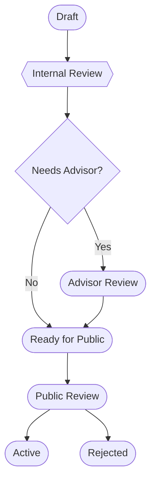

# RFC 0001: The Uncertainty Architecture Governance Model

> **Historical status:** This January 2026 proposal was never adopted as the current governance model. Its mandatory private-repository, co-author-consensus, advisor-review, and staged RFC assumptions were superseded by the maintainer-led workflow in [`CONTRIBUTING.md`](../../../CONTRIBUTING.md) and the change-control rules in [`SPECIFICATION.md`](../../../SPECIFICATION.md). The text below is retained as historical decision context.

## Summary

This RFC proposed an official process for proposing, reviewing, and adopting changes to the Uncertainty Architecture specification. It introduced a **Kitchen & Restaurant** repository model to separate internal drafting from public consumption, defined a formal role for an advisory board, and standardized an RFC template.

## Motivation

The proposal treated Uncertainty Architecture as an operational doctrine whose conceptual errors could lead teams to build unsafe or unmanageable systems. It therefore argued for a higher standard of review than routine open-source code changes.

The proposed process aimed to:

1. **Separate drafting from publishing:** allow a core team to debate incomplete ideas privately before presenting them publicly.
2. **Integrate expert review:** formally include academic and governance advisors in selected changes.
3. **Standardize proposals:** require major changes to be motivated by an engineering problem rather than theoretical preference.

## Detailed design

### 1. The Kitchen & Restaurant model

The proposal assumed two repositories:

- **Private repository — the Kitchen:** drafting, internal disputes, and sensitive partner discussions.
- **Public repository — the Restaurant:** canonical public source containing internally approved proposals for community review.

### 2. Proposed RFC lifecycle

The proposed states were:

- **Draft:** created in a private repository.
- **Internal Review:** co-authors were expected to reach consensus.
- **Advisor Review:** triggered for selected strategic or theoretical changes.
- **Public Review:** published to the public repository for community feedback.
- **Active:** merged into the core specification.

### 3. Proposed RFC structure

The proposal referenced the then-current [`0000-template.md`](0000-template.md), containing:

- metadata and scope;
- summary and motivation;
- detailed architecture, interfaces, behavior, and failure modes;
- alternatives and drawbacks;
- unresolved questions;
- an internal governance log.

### 4. Proposed roles and responsibilities

| Role | Proposed responsibility |
|---|---|
| Core team | Drafting, internal consensus, and public merging |
| Advisors | Requested review of selected governance or theoretical questions |
| Community | Public stress-testing and pattern proposals |

## Drawbacks identified by the proposal

- **Complexity:** maintaining two repositories and synchronizing material between them.
- **Latency:** formal review stages could slow the development of patterns and doctrine.

The proposal suggested limiting advisor review to doctrine-level changes as a mitigation.

## Alternatives considered

### Single public repository

The proposal rejected fully public drafting because incomplete or contradictory doctrine could confuse readers.

### GitHub Issues only

The proposal rejected issues as the sole decision record because RFC documents could provide a more durable explanation of why a decision was made.

## Unresolved questions recorded at the time

1. Whether synchronization between private and public repositories should be automated.
2. How community-authored proposals should move through internal or advisor review.
3. How doctrine changes should affect UA versioning.

## Historical governance log

The original proposal contained unchecked internal-review, advisor-review, and ready-for-public fields. No evidence in the repository establishes that the proposal completed those stages or became active.