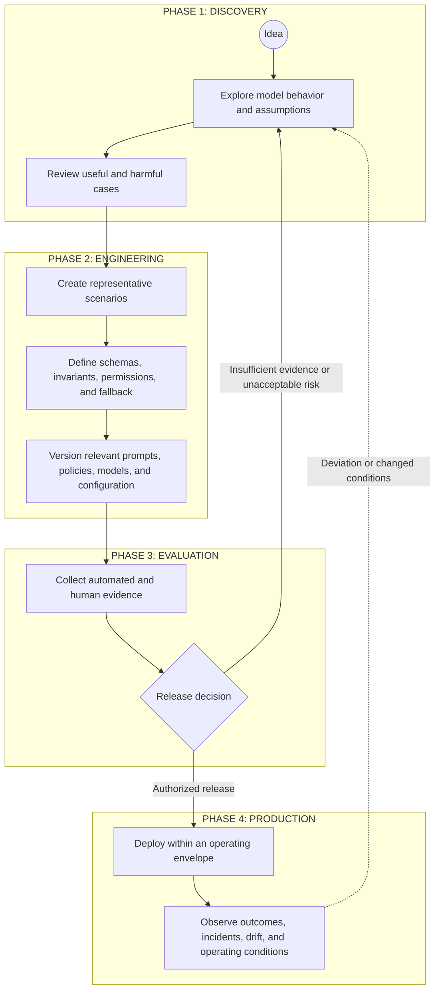

# AI Delivery Lifecycle Working Note

> **Research status:** This document preserves an early lifecycle sketch for engineering model-mediated behavior. It was moved out of `00-doctrine/` because it is a working process hypothesis, not canonical doctrine or a mandatory UA lifecycle. Numerical thresholds, role names, sequence, and cadence must be derived from context and risk before any part is promoted into normative guidance.

## Research question

How should a delivery process change when part of the system's runtime behavior is produced through probabilistic Model Judgment rather than only explicitly coded paths?

The sketch below proposes one possible loop from exploration to evidence-based release and production feedback. It is intended to expose control responsibilities, not prescribe one universal SDLC.

## Illustrative lifecycle

## Phase 1: Discovery

### Goal

Learn whether the proposed use of Model Judgment creates enough value to justify further engineering and control cost.

### Possible activities

- explore model behavior across ordinary and adversarial cases;
- identify assumptions about users, context, data, tools, and operating conditions;
- record useful variance as well as unacceptable behavior;
- identify where deterministic responsibilities must remain intact;
- decide whether the use case should proceed at all.

### Exit question

Is there enough evidence of potential value, and a credible path to bounding the important risks, to justify engineering work?

A favorable demonstration is not by itself sufficient evidence.

## Phase 2: Engineering

### Goal

Convert an exploratory model interaction into a reviewable system design.

### Possible artifacts

- representative scenarios, including edge cases and failure cases;
- explicit invariants and permissions;
- schemas and deterministic validation where appropriate;
- bounded tool access and execution authority;
- fallback, escalation, rollback, and shutdown paths;
- versioned prompts, policies, context assembly, models, and evaluation configuration;
- ownership and traceability for behavior-affecting changes.

Representative scenarios should be selected for risk coverage and learning value. UA does not prescribe a universal sample size or one ideal-output format.

## Phase 3: Evaluation and release decision

### Goal

Collect evidence proportional to the consequences, uncertainty, autonomy, reversibility, and operating context of the change.

### Possible evidence

- deterministic contract checks;
- scenario-based evaluations;
- statistical sampling;
- qualitative expert review;
- adversarial or boundary testing;
- model-assisted evaluation with calibration and limits made explicit;
- latency, cost, reliability, and operational-readiness evidence;
- rollback and incident-response exercises.

### Release gate

The release decision should identify:

1. which evidence is required;
2. who or what has authority to approve or block release;
3. which deviations are tolerable;
4. which conditions require limitation, escalation, or rejection;
5. what recovery mechanisms are available.

UA does not prescribe a universal accuracy percentage, service-level threshold, or fixed evidence count. Thresholds should be derived from the use case and the cost of error.

## Phase 4: Production feedback

### Goal

Operate the system inside an explicit envelope and maintain a path from observation to corrective action.

### Possible activities

- monitor technical behavior and business outcomes;
- review incidents, complaints, overrides, and near misses;
- detect changes in models, prompts, context, data, tools, user behavior, or environment;
- reassess evidence when operating conditions change;
- authorize configuration changes, containment, rollback, or shutdown;
- feed production learning back into scenarios, boundaries, and design assumptions.

Production telemetry does not close the loop unless evidence is connected to decision authority and a mechanism capable of changing or stopping behavior.

## Lifecycle scope split

The early sketch compressed several decision levels into one loop. Current framework work now distinguishes:

1. **Organizational control context** — shared constraints, capabilities, risk boundaries, and decision rights.
2. **Project control architecture and viability** — whether the proposed Thinking System has a credible, operable, and economically viable control architecture.
3. **Feature and change delivery** — whether one feature or material change is ready, complete, and acceptable for a specific deployment context.
4. **Runtime control and reauthorization** — whether production evidence requires feature correction, project reauthorization, organizational review, rollback, or shutdown.

This distinction is owned at doctrine level by [`Uncertainty in the Controlled Object`](../../../00-doctrine/uncertainty-in-the-controlled-object.md).

The four-phase diagram above remains useful as an illustrative engineering loop, especially inside an authorized project boundary. It should not be interpreted as proving that one release decision can answer all of the following:

- whether the overall AI project should begin;
- whether the project-wide control architecture is viable;
- whether one feature is ready for release;
- whether runtime evidence invalidates the project itself.

## Project authorization research question

Before feature-level delivery, the project layer needs a proportional way to reason about:

- business outcome and the necessity of Model Judgment;
- domain, stakeholders, and material consequence scenarios;
- intended Judgment landscape, authority, and autonomy;
- deterministic invariants and prohibited authority;
- Operating Envelope assumptions;
- required sensors, constraints, controllers, Human Authority, fallback, containment, rollback, escalation, and shutdown;
- evidence feasibility and feedback latency;
- operational and human-review capacity;
- control build cost and recurring run cost;
- residual risk and expected business value;
- architectural veto and reauthorization triggers.

The research problem is not to produce one universal risk score. It is to determine the minimum decision surface an SMB team needs to justify, constrain, redirect, or reject a proposed Thinking System before ordinary feature delivery begins.

## Roles and responsibilities

Early versions of this sketch used titles such as **Prompt Steward**, **Eval Owner**, and **Reliability Engineer**. These remain useful examples of responsibility bundles, not mandatory job titles.

A real implementation should assign responsibility for:

- behavior-affecting configuration;
- evaluation design and calibration;
- deterministic boundaries and infrastructure;
- project authorization and feature release decisions;
- runtime observation and incident handling;
- escalation and human judgment;
- traceability and controlled change.

One person or existing team may hold several responsibilities in a small organization. Project authorization and feature release may also use existing product, architecture, financial, security, quality, or delivery authority rather than new specialist roles.

## Open questions

- What is the minimum viable Project Control Architecture and Viability Review for an SMB team?
- How should material risk scenarios be represented without reducing the decision to a misleading universal score?
- Which evidence types are useful for different consequence and autonomy classes?
- How should project constraints and shared control capabilities be inherited by feature-level reviews?
- Which changes require local feature reassessment versus project reauthorization?
- How should release and reassessment cadence scale with feedback latency and operating change?
- When does the cost of control make the proposed automation structurally unattractive?
- Which conditions are hard vetoes rather than expected-value trade-offs?
- Which incident and learning-loop refinements are needed beyond the current review pattern?
- Which lifecycle distinctions remain useful across very different delivery organizations and product types?

## Framework translation status

Several questions from the original sketch have now been translated into current draft framework components:

| Earlier lifecycle question | Current framework decision |
|---|---|
| Why does model-mediated delivery require a distinct control response? | [`Uncertainty in the Controlled Object`](../../../00-doctrine/uncertainty-in-the-controlled-object.md) defines the shift from uncertainty around delivery to consequential uncertainty produced inside the operating system through Model Judgment. |
| Is one lifecycle decision sufficient? | The doctrine distinguishes organizational context, project authorization, feature/change delivery, and runtime reauthorization. The detailed project-level pattern remains pending. |
| Where should feature-level lifecycle responsibilities live? | Reusable delivery responsibilities are expressed through the [`Thinking System Review`](../../../01-patterns/thinking-system-review.md) pattern rather than embedded in doctrine or placed in a new top-level Operating Model module. |
| Which lightweight artifacts can SMB teams maintain? | One living [`Thinking System Review Template`](../../../01-patterns/thinking-system-review-template.md) contains Judgment Node cards, DoR, DoD, residual risk, deployment scope, release decision, and reassessment history for a feature or change. |
| How should readiness, completion, and release differ? | Full model-mediated DoR and DoD extensions have one canonical owner in the review pattern, while the Release Gate remains a distinct residual-risk decision. |
| Are specialist AI role titles mandatory? | Implementation, evaluation, operation, and release decision authority are responsibility bundles, not mandatory job titles. |
| Does every change require separate governance records? | The default SMB feature path uses versioned snapshots of one review artifact rather than separate readiness, completion, role, node-registry, and release records. |
| Can a project be rejected before feature implementation? | Doctrine now recognizes architectural veto and project non-viability as valid outcomes. The operational decision process remains Proposed for Framework Review. |

These translations do not make the four-phase diagram a mandatory lifecycle. The remaining open questions concern project-level risk and viability reasoning, evidence proportionality, control economics, incident learning, reassessment cadence, and compatibility across delivery contexts.

## Framework relationship

This note may continue to inform future work on:

- a Project Control Architecture and Viability Review pattern;
- risk and tolerance mapping;
- control-economics guidance;
- evaluation and evidence patterns;
- change and incident loops;
- project and feature inheritance;
- project reauthorization;
- SMB-facing application examples;
- failure modes revealed through practical use.

It does not activate those elements as normative requirements. Research-state changes should be reconciled through [`content/research/review-process.md`](../review-process.md) and the existing traceability matrix rather than a parallel lifecycle ledger.
