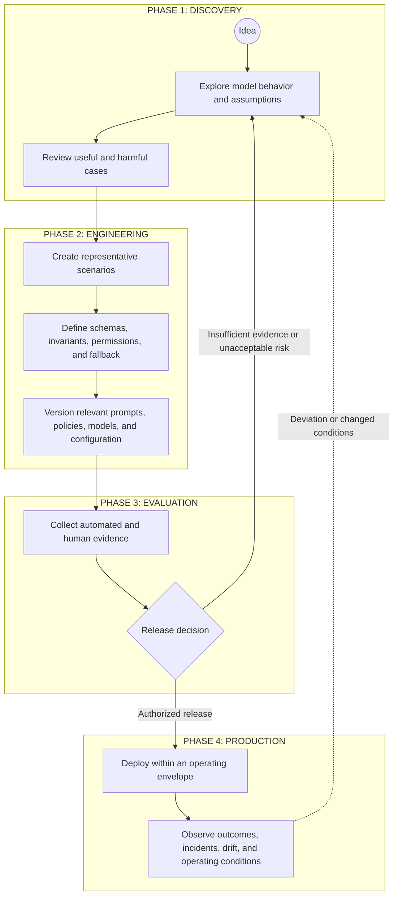

# AI Delivery Lifecycle Working Note

> **Research status:** This document preserves an early lifecycle sketch for engineering model-mediated behavior. It was moved out of `00-doctrine/` because it is a working process hypothesis, not canonical doctrine or a mandatory UA lifecycle. Numerical thresholds, role names, sequence, and cadence must be derived from context and risk before any part is promoted into normative guidance.

## Research question

How should a delivery process change when part of the system's runtime behavior is produced through probabilistic Model Judgment rather than only explicitly coded paths?

The sketch below proposes one possible loop from exploration to evidence-based release and production feedback. It is intended to expose control responsibilities, not prescribe one universal SDLC.

## Illustrative lifecycle

## Phase 1: Discovery

### Goal

Learn whether the proposed use of Model Judgment creates enough value to justify further engineering and control cost.

### Possible activities

- explore model behavior across ordinary and adversarial cases;
- identify assumptions about users, context, data, tools, and operating conditions;
- record useful variance as well as unacceptable behavior;
- identify where deterministic responsibilities must remain intact;
- decide whether the use case should proceed at all.

### Exit question

Is there enough evidence of potential value, and a credible path to bounding the important risks, to justify engineering work?

A favorable demonstration is not by itself sufficient evidence.

## Phase 2: Engineering

### Goal

Convert an exploratory model interaction into a reviewable system design.

### Possible artifacts

- representative scenarios, including edge cases and failure cases;
- explicit invariants and permissions;
- schemas and deterministic validation where appropriate;
- bounded tool access and execution authority;
- fallback, escalation, rollback, and shutdown paths;
- versioned prompts, policies, context assembly, models, and evaluation configuration;
- ownership and traceability for behavior-affecting changes.

Representative scenarios should be selected for risk coverage and learning value. UA does not prescribe a universal sample size or one ideal-output format.

## Phase 3: Evaluation and release decision

### Goal

Collect evidence proportional to the consequences, uncertainty, autonomy, reversibility, and operating context of the change.

### Possible evidence

- deterministic contract checks;
- scenario-based evaluations;
- statistical sampling;
- qualitative expert review;
- adversarial or boundary testing;
- model-assisted evaluation with calibration and limits made explicit;
- latency, cost, reliability, and operational-readiness evidence;
- rollback and incident-response exercises.

### Release gate

The release decision should identify:

1. which evidence is required;
2. who or what has authority to approve or block release;
3. which deviations are tolerable;
4. which conditions require limitation, escalation, or rejection;
5. what recovery mechanisms are available.

UA does not prescribe a universal accuracy percentage, service-level threshold, or fixed evidence count. Thresholds should be derived from the use case and the cost of error.

## Phase 4: Production feedback

### Goal

Operate the system inside an explicit envelope and maintain a path from observation to corrective action.

### Possible activities

- monitor technical behavior and business outcomes;
- review incidents, complaints, overrides, and near misses;
- detect changes in models, prompts, context, data, tools, user behavior, or environment;
- reassess evidence when operating conditions change;
- authorize configuration changes, containment, rollback, or shutdown;
- feed production learning back into scenarios, boundaries, and design assumptions.

Production telemetry does not close the loop unless evidence is connected to decision authority and a mechanism capable of changing or stopping behavior.

## Roles and responsibilities

Early versions of this sketch used titles such as **Prompt Steward**, **Eval Owner**, and **Reliability Engineer**. These remain useful examples of responsibility bundles, not mandatory job titles.

A real implementation should assign responsibility for:

- behavior-affecting configuration;
- evaluation design and calibration;
- deterministic boundaries and infrastructure;
- release authority;
- runtime observation and incident handling;
- escalation and human judgment;
- traceability and controlled change.

One person or existing team may hold several responsibilities in a small organization.

## Open questions

- Which lifecycle responsibilities belong in doctrine, patterns, or an operating model?
- Which evidence types are useful for different consequence and autonomy classes?
- How should release and reassessment cadence scale with feedback latency and operating change?
- Which process artifacts can remain lightweight enough for SMB teams?
- When does the cost of control make the proposed automation structurally unattractive?

## Framework relationship

This note may inform future work on:

- release-gate patterns;
- evaluation and evidence patterns;
- change and incident loops;
- operating-model responsibilities;
- SMB-facing risk and control mapping.

It does not activate any of those elements as normative requirements.