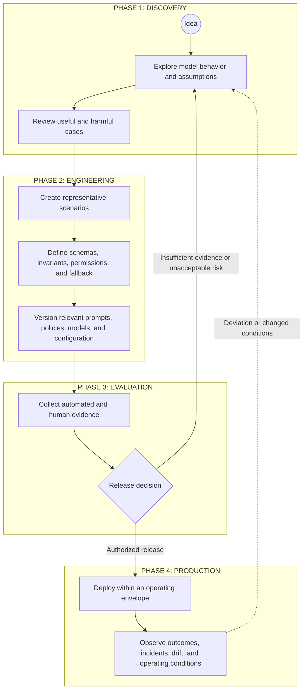

# AI Delivery Lifecycle Working Note

> **Research status:** This document preserves an early lifecycle sketch for engineering model-mediated behavior. It was moved out of `00-doctrine/` because it is a working process hypothesis, not canonical doctrine or a mandatory UA lifecycle. Numerical thresholds, role names, sequence, and cadence must be derived from context and risk before any part is promoted into normative guidance.

## Research question

How should a delivery process change when part of the system's runtime behavior is produced through probabilistic Model Judgment rather than only explicitly coded paths?

The sketch below proposes one possible loop from exploration to evidence-based release and production feedback. It is intended to expose control responsibilities, not prescribe one universal SDLC.

## Illustrative lifecycle

## Phase 1: Discovery

### Goal

Learn whether the proposed use of Model Judgment creates enough value to justify further engineering and control cost.

### Possible activities

- explore model behavior across ordinary and adversarial cases;
- identify assumptions about users, context, data, tools, and operating conditions;
- record useful variance as well as unacceptable behavior;
- identify where deterministic responsibilities must remain intact;
- decide whether the use case should proceed at all.

### Exit question

Is there enough evidence of potential value, and a credible path to bounding the important risks, to justify engineering work?

A favorable demonstration is not by itself sufficient evidence.

## Phase 2: Engineering

### Goal

Convert an exploratory model interaction into a reviewable system design.

### Possible artifacts

- representative scenarios, including edge cases and failure cases;
- explicit invariants and permissions;
- schemas and deterministic validation where appropriate;
- bounded tool access and execution authority;
- fallback, escalation, rollback, and shutdown paths;
- versioned prompts, policies, context assembly, models, and evaluation configuration;
- ownership and traceability for behavior-affecting changes.

Representative scenarios should be selected for risk coverage and learning value. UA does not prescribe a universal sample size or one ideal-output format.

## Phase 3: Evaluation and release decision

### Goal

Collect evidence proportional to the consequences, uncertainty, autonomy, reversibility, and operating context of the change.

### Possible evidence

- deterministic contract checks;
- scenario-based evaluations;
- statistical sampling;
- qualitative expert review;
- adversarial or boundary testing;
- model-assisted evaluation with calibration and limits made explicit;
- latency, cost, reliability, and operational-readiness evidence;
- rollback and incident-response exercises.

### Release gate

The release decision should identify:

1. which evidence is required;
2. who or what has authority to approve or block release;
3. which deviations are tolerable;
4. which conditions require limitation, escalation, or rejection;
5. what recovery mechanisms are available.

UA does not prescribe a universal accuracy percentage, service-level threshold, or fixed evidence count. Thresholds should be derived from the use case and the cost of error.

## Phase 4: Production feedback

### Goal

Operate the system inside an explicit envelope and maintain a path from observation to corrective action.

### Possible activities

- monitor technical behavior and business outcomes;
- review incidents, complaints, overrides, and near misses;
- detect changes in models, prompts, context, data, tools, user behavior, or environment;
- reassess evidence when operating conditions change;
- authorize configuration changes, containment, rollback, or shutdown;
- feed production learning back into scenarios, boundaries, and design assumptions.

Production telemetry does not close the loop unless evidence is connected to decision authority and a mechanism capable of changing or stopping behavior.

## Lifecycle scope split

The early sketch compressed several decision levels into one loop. Current framework work distinguishes:

1. **Organizational control context** — shared constraints, capabilities, risk boundaries, and decision rights.
2. **Project control architecture and viability** — whether the proposed Thinking System has a credible, operable, and economically viable control architecture.
3. **Delivery-level review** — whether a bounded whole system, feature, or material change is ready, complete, and acceptable for a specific deployment context.
4. **Runtime control and reauthorization** — whether production evidence requires local correction, project reauthorization, organizational review, rollback, or shutdown.

This distinction is owned at doctrine level by [`Uncertainty in the Controlled Object`](../../../00-doctrine/uncertainty-in-the-controlled-object.md).

The four-phase diagram above remains useful as an illustrative engineering loop, especially inside an authorized project boundary. It should not be interpreted as proving that one release decision can answer all of the following:

- whether the overall AI project should begin;
- whether the project-wide control architecture is viable;
- whether one bounded delivery scope is ready for release;
- whether runtime evidence invalidates the project itself.

## Project authorization question

The project-level question has now been translated into the draft-normative [`Project Control Architecture and Viability Review`](../../../01-patterns/project-control-architecture-and-viability-review.md) and its informative [`template`](../../../01-patterns/project-control-architecture-and-viability-review-template.md).

The active project review reasons about:

- business outcome, non-AI alternatives, and the necessity of Model Judgment;
- domain, stakeholders, and material consequence scenarios;
- intended Judgment landscape, authority, and autonomy;
- deterministic invariants and prohibited authority;
- required sensors, constraints, controllers, Human Authority, fallback, containment, rollback, escalation, and shutdown;
- evidence feasibility and feedback latency;
- operational and human-review capacity;
- control build cost, recurring run cost, and residual exposure;
- project authorization, limitation, bounded research, redesign, escalation, deferral, or No-Go;
- delivery inheritance and project reauthorization triggers.

The pattern does not produce one universal risk score. It defines a proportional decision surface that an SMB team can integrate into existing product, architecture, financial, security, risk, or delivery processes.

## Roles and responsibilities

Early versions of this sketch used titles such as **Prompt Steward**, **Eval Owner**, and **Reliability Engineer**. These remain useful examples of responsibility bundles, not mandatory job titles.

The current framework assigns responsibilities across two decision levels.

At project level:

- business outcome responsibility;
- control architecture responsibility;
- evidence and risk responsibility;
- operational capacity responsibility;
- project authorization authority.

At delivery level:

- implementation responsibility;
- evaluation responsibility;
- operational responsibility;
- release decision authority.

One person or existing team may hold several responsibilities in a small organization. Existing product, architecture, finance, security, legal, quality, delivery, or operations authority may perform them without creating new specialist titles.

## Remaining open questions

The minimum project and delivery surfaces are now represented in active draft patterns. The remaining questions are application and refinement questions:

- Which project-review fields can be completed briefly for low-consequence SMB use without hiding material risk?
- Does scenario-based risk mapping lead to better control decisions than aggregate scoring in practice?
- Which evidence methods are useful for different consequence, autonomy, and feedback-latency classes?
- How should tolerances be derived from authority, consequence, detectability, reversibility, propagation, exposure, and capacity?
- How should teams estimate control build cost, recurring control cost, review capacity, incident burden, and residual exposure with honest ranges?
- Does the project inheritance package prevent duplication while giving delivery teams enough context?
- Which runtime findings remain local, and which require project reauthorization or organizational review?
- How should release and reassessment cadence scale with feedback latency and operating change?
- Which conditions consistently function as hard vetoes rather than expected-value trade-offs?
- Which incident and learning-loop refinements are needed after a two-level worked application and real-team use?
- Which lifecycle distinctions remain useful across very different delivery organizations and product types?

## Framework translation status

| Earlier lifecycle question | Current framework decision |
|---|---|
| Why does model-mediated delivery require a distinct control response? | [`Uncertainty in the Controlled Object`](../../../00-doctrine/uncertainty-in-the-controlled-object.md) defines the shift from uncertainty around delivery to consequential uncertainty produced inside the operating system through Model Judgment. |
| Is one lifecycle decision sufficient? | The doctrine distinguishes organizational context, project authorization, delivery-level review, and runtime reauthorization. |
| Where should project viability and authorization live? | The [`Project Control Architecture and Viability Review`](../../../01-patterns/project-control-architecture-and-viability-review.md) owns project risk scenarios, required controls, evidence feasibility, Human Authority, capacity, economics, authorization, inheritance, and reauthorization. |
| Where should delivery responsibilities live? | The [`Thinking System Review`](../../../01-patterns/thinking-system-review.md) owns delivery-level Judgment Nodes, DoR, bounded experimentation, DoD, Release Gate, and local reassessment. |
| Which lightweight artifacts can SMB teams maintain? | One living project template and one living delivery template preserve separate decision ownership while passing a versioned inheritance package by reference. |
| How should readiness, completion, and release differ? | Full model-mediated DoR and DoD extensions have one canonical owner in the delivery review, while the Release Gate remains a distinct deployment-specific residual-risk decision. |
| Are specialist AI role titles mandatory? | Project and delivery responsibility bundles define accountability and decision rights without mandatory job titles. |
| Does every decision require separate governance records? | The default SMB path uses one project review and one delivery review rather than separate risk maps, role matrices, gate records, node registries, completion packages, and release records. |
| Can a project be rejected before delivery implementation? | The project review recognizes redesign, deferral, escalation, bounded research, and No-Go as valid engineering outcomes. |
| How does runtime evidence return to the correct decision level? | Local delivery evidence stays in the Thinking System Review; evidence invalidating project risk, authority, capacity, evidence, or economics triggers project reauthorization; shared constraint changes trigger organizational review. |

These translations do not make the four-phase diagram a mandatory lifecycle. They establish separate canonical owners for project and delivery decisions while leaving practical effectiveness subject to worked and real-team validation.

## Framework relationship

This note may continue to inform future work on:

- two-level worked applications;
- real-team validation of the project and delivery reviews;
- risk and tolerance derivation;
- deeper control-economics guidance;
- evaluation and evidence patterns;
- change and incident loops;
- Human Authority and operating-capacity patterns;
- project reauthorization;
- failure modes revealed through practical use;
- simplification of the current review surfaces.

The framework translations above are active subject to the status of their owning documents. This research note remains non-normative and should be updated only when evidence, interpretation, or the state of the research question materially changes.
