# Uncertainty Architecture: Engineering Thinking Systems with Consequential Runtime Responsibilities

## Abstract

Software engineering repeatedly expands when an important source of uncertainty can no longer remain outside the engineering model. **Plan-driven development (including Waterfall)** attempts to reduce requirement and design uncertainty before implementation. **Iterative delivery (including Agile and related approaches)** accepts that product understanding changes through use and shortens the distance to feedback. **Modern operations (commonly associated with DevOps)** accepts that production conditions cannot be reproduced exhaustively before release and extends engineering into runtime through observability, progressive delivery, and recovery.

This paper introduces **Thinking Systems** as a distinct engineering category: software systems in which one or more **Consequential Runtime Responsibilities** depend partly on probabilistic Model Judgment rather than being fully specified through explicitly encoded logic in advance. The term names the changed engineering object, not a maturity level or architecture style. Fixed or dynamic orchestration, agent labels, autonomy, and delegated authority are separate dimensions; a simple predefined workflow can already be a Thinking System when at least one **Consequential Runtime Responsibility** depends partly on probabilistic Model Judgment.

Thinking Systems move consequential uncertainty inside the controlled object. Once that happens, model quality and observability are no longer sufficient descriptions of the engineering problem. For production use of a Thinking System, an incomplete control architecture means the application is not ready for production release at the intended scope even when the model and code pass local tests. Governance becomes operational only through the active socio-technical control architecture spanning organizational authority, project and architecture viability, delivery realization and release, and runtime operation and reassessment. This paper derives the capability families and decision levels required by that shift and shows how they can be expressed through a small number of living engineering artifacts.

## 1. Engineering Evolves Around Dominant Uncertainty

Software-engineering methods are often discussed as competing schools: planning versus iteration, development versus operations, process versus autonomy. That framing hides a more useful pattern. Engineering expands when a consequential source of uncertainty can no longer be managed adequately by the assumptions and feedback structures already in place.

The pattern is not a clean historical sequence, and none of the approaches below is reducible to one idea. Plan-driven development, iterative delivery, and modern operations are broader engineering responses; Waterfall, Agile, and DevOps are familiar but non-equivalent examples. The comparison here is narrower: each broader response can be read as characteristic of a different location of uncertainty and feedback.

**Plan-driven development (including Waterfall)** treats significant requirement and design uncertainty as something to reduce before implementation. The engineering response is analysis, decomposition, specification, approval, and planned execution. This remains rational where the problem can be understood sufficiently in advance, the cost of change is high, and late feedback is dangerous.

**Iterative delivery (including Agile and related approaches)** starts from a different limit: important requirements often cannot be stabilized through analysis alone because users, markets, and teams learn by interacting with working software. The response is not to abandon planning, but to shorten the cycle between assumption, delivery, use, and revision. Feedback moves closer to implementation and becomes part of the product-development mechanism.

**Modern operations (commonly associated with DevOps)** exposes another limit. Even a well-understood feature cannot be exhaustively validated against every production combination of traffic, infrastructure, device, operating system, dependency, configuration, user behavior, and failure condition. Engineering therefore extends beyond release. Telemetry, progressive delivery, canary exposure, rollback, resilience, and incident response make production behavior part of the evidence used to operate and improve the system.

Thinking Systems add a distinct source of uncertainty. The uncertainty is not only in what should be built or in the environment in which software runs. It also appears in the runtime selection or construction of behavior inside the software boundary. **This is the engineering problem Uncertainty Architecture is designed to address: how to build and operate systems that use probabilistic Model Judgment without surrendering explicit boundaries, evidence, decision authority, and corrective control.**

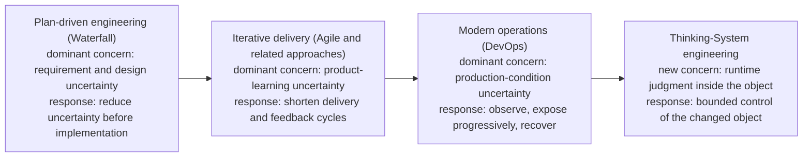

**Figure 1 — Engineering expands its feedback model as consequential uncertainty moves closer to runtime and eventually enters the controlled object.** The final transition is the problem space addressed by Uncertainty Architecture: engineering and operating systems in which consequential behavior is partly produced through probabilistic Model Judgment inside the software boundary. Waterfall, Agile, and DevOps are shown as familiar examples of the broader plan-driven, iterative-delivery, and modern-operations responses. The progression is conceptual, not replacement history.

| Characteristic engineering response | Uncertainty emphasized | Primary mechanism | Where decisive feedback appears |
|---|---|---|---|
| Plan-driven development (including Waterfall) | Requirements, design, coordination | Analysis and planning | Primarily before and during implementation |
| Iterative delivery (including Agile and related approaches) | Product understanding and value | Short delivery and learning cycles | Between iterations and releases |
| Modern operations (commonly associated with DevOps) | Production conditions and system behavior | Runtime telemetry, progressive exposure, and recovery | During operation |
| Thinking-System engineering — problem space addressed by Uncertainty Architecture | Model-Judgment-dependent Consequential Runtime Responsibilities and their effects | Bounded control architecture: explicit Constraints, evidence, decision authority, correction, and reassessment | Inside and around the active controlled object |

The table does not imply that requirement uncertainty disappeared after Agile or that operational uncertainty began with DevOps. The point is cumulative. Each expansion preserves earlier responsibilities while adding mechanisms for uncertainty that became too important to leave outside the engineering model.

### Introducing Thinking Systems

In this paper, a **Thinking System** is:

> A software system in which one or more **Consequential Runtime Responsibilities** depend partly on probabilistic Model Judgment rather than being fully specified through explicitly encoded logic in advance.

This paper calls a runtime responsibility a **Consequential Runtime Responsibility** when its output, decision, path, action, or downstream state can materially affect an intended outcome, satisfaction of an applicable Requirement or Constraint, the exercise of delegated authority, resource use, or a person or system downstream. **Consequential describes material causal relevance, not implementation mechanism or risk severity.** A Consequential Runtime Responsibility may be fulfilled entirely through explicitly encoded logic or may depend partly on probabilistic Model Judgment; Thinking-System classification changes only in the latter case. Harm, severity, likelihood, autonomy, regulation, control adequacy, and production readiness are separate questions. A model invocation with no material influence on any Consequential Runtime Responsibility does not establish the category by itself.

The definition identifies the changed engineering object; it does not certify control adequacy. A Thinking System can be well controlled, poorly controlled, or not ready for production. Constraints, evidence, decision rights, and corrective mechanisms are part of the engineering response UA expects around Model-Judgment-dependent Consequential Runtime Responsibilities, not the condition that makes the category exist.

The word **Thinking** is functional rather than anthropomorphic. It does not claim consciousness or human-like cognition; it gives engineering a stable name for software in which one or more **Consequential Runtime Responsibilities** depend partly on probabilistic Model Judgment.

**Model Judgment** means interpretation, synthesis, classification, generation, planning, ranking, routing, or action selection performed through a probabilistic model under uncertainty. It is useful precisely because the required behavior cannot always be exhaustively encoded in advance.

The category must not be collapsed into "agentic application." The classification question is narrower: does any **Consequential Runtime Responsibility** depend partly on probabilistic Model Judgment? If not, the relevant **Consequential Runtime Responsibility** remains explicitly encoded and the software remains Linear Software even when orchestration is dynamic. If yes, the software contains the changed object described here even when orchestration is fixed. Deterministic code before, between, or after that judgment does not make the delegated judgment deterministic. Orchestration topology, autonomy, and delegated authority affect architecture and control demand, but they do not decide the category. The precise boundary of agentic terminology remains an open research question.


**Figure 2 — Thinking-System classification turns on whether a Consequential Runtime Responsibility depends partly on probabilistic Model Judgment, not workflow topology or autonomy.** Fixed and dynamic workflows can fall on either side of the category boundary. The category changes when a **Consequential Runtime Responsibility** is no longer fully specified through explicitly encoded logic and instead depends partly on probabilistic Model Judgment. Autonomy and delegated authority remain additional dimensions that affect risk and control design rather than classification.

Thinking-System engineering still requires product discovery, deterministic software engineering, testing, security, deployment discipline, observability, and incident response. The new category does not invalidate those practices. It changes the object they are controlling.

A team can adopt all of those practices and still lack a governable system. It may have a production model, retrieval or tools, traces, evaluation suites, policies, human approval, and a pilot deployment. Each component can be competent. The dashboard may be green. The demo may be impressive. The complete system may still lack a defensible connection between what the organization permits, what the project authorizes, what the delivery team has realized, what runtime evidence means, and what action follows when assumptions fail.

The components alone do not answer the connected questions. Was Model Judgment necessary for the intended outcome? What authority was delegated to the model-mediated path? Which consequences are prohibited rather than merely undesirable? Which Constraints are authoritative, and how are they realized? Which evidence informs which decision? Who may narrow exposure, roll back, disable, redesign, or stop operation? When does runtime evidence invalidate project authorization rather than only a local implementation? Does the business case survive once evaluation, Human Authority, fallback, observability, incident handling, and control capacity are included in the cost?

This is a practitioner observation about fragmentation, not a claim that governance, safety, architecture, or control practices do not exist. Relevant practices are often separated by product boundary, decision level, or organizational function. Observability can show what happened without establishing who may act. Evaluation can estimate behavior without defining an approved operating boundary. A policy can express intent without creating an operational realization. A human approval step can exist without adequate information, time, power, or capacity. An orchestration platform can execute a delegated workflow without deciding whether that workflow was legitimate to authorize.

Without the connection, local confidence is easily substituted for system control. A good evaluation score becomes evidence that the product is ready. A prompt becomes a policy. A policy becomes a supposed control. A human-in-the-loop label becomes evidence of accountability. A rollback button becomes evidence that recovery is possible. Each substitution may be understandable, and each may be wrong.

> **Release-readiness consequence.** For production use of a Thinking System, these are not gaps that can be delegated to a post-release governance review. If the complete control architecture is absent across organizational authority, project and architecture viability, delivery realization and release, and runtime operation and reassessment, the application is not ready for production release at the intended scope. Governance becomes operational through that socio-technical stack; it is not a document layered over the system. The stack makes the system bounded, observable, correctable, and reauthorizable.

> **Previous engineering methods learned to manage uncertainty surrounding software. Thinking Systems require engineering to manage consequential uncertainty produced by the software itself.**

The missing layer is not another AI component. It is the engineering connection between delegated judgment, authorized boundaries, evidence, decision authority, corrective action, and reassessment. Understanding why that connection is necessary requires examining the object being controlled.

## 2. The Controlled Object Has Changed

A controlled object is the thing whose behavior engineering seeks to keep within acceptable conditions. In software, that object is never only source code. It includes deployed components, data, configuration, dependencies, users, infrastructure, operational processes, and the effects the system can create.

Thinking Systems change this object by making one or more Consequential Runtime Responsibilities depend partly on probabilistic Model Judgment.

The term **Thinking System** is introduced to name this changed engineering object, not a future maturity stage of AI software. The boundary can be crossed in the first model-enabled iteration. A project-planning workflow, for example, may still follow a predefined sequence—interpret a brief, generate requirements, construct a plan, identify risks, and draft work items. If at least one of those responsibilities is a **Consequential Runtime Responsibility** and depends partly on probabilistic Model Judgment, the application already contains the changed object that UA is concerned with. Later versions may add tools, memory, dynamic routing, multiple models, cooperating agents, or greater autonomy. Those changes can increase complexity and control demand, but they do not create the category; the category began when a **Consequential Runtime Responsibility** first depended partly on probabilistic Model Judgment.

The distinction matters because engineering needs a stable name for the thing being designed, released, operated, and controlled. In Linear Software, relevant **Consequential Runtime Responsibilities** are fully specified before runtime through inspectable code, rules, or state transitions. In a Thinking System, part of the mapping from situation to consequential behavior is completed during runtime through Model Judgment. Deterministic software may surround that judgment, but it no longer exhaustively specifies the behavior that matters.

Uncertainty Architecture therefore treats the **whole Thinking System—not the model call—as the controlled object**. The engineering problem is to preserve useful judgment while making the surrounding deterministic responsibilities, Constraints, evidence, decision authority, and corrective mechanisms explicit enough to keep that object within acceptable conditions.

### Why not simply call these AI systems?

Because the broader labels answer different engineering questions. [ISO/IEC TR 29119-11:2020](https://www.iso.org/standard/79016.html) defines an **AI-based system** as a system that includes at least one AI component. [NIST AI RMF 1.0](https://www.nist.gov/publications/artificial-intelligence-risk-management-framework-ai-rmf-10) uses a broader **AI system** concept centered on machine-generated outputs that influence real or virtual environments. Both scopes are useful, but neither uses the narrower responsibility boundary required here: whether **Consequential Runtime Responsibility** depends partly on probabilistic Model Judgment.

A conventional application can therefore qualify under a broad AI-system label while no **Consequential Runtime Responsibility** depends partly on probabilistic Model Judgment. Conversely, a simple fixed workflow can cross the Thinking-System boundary as soon as requirement generation, planning, risk identification, output mediation, or another **Consequential Runtime Responsibility** depends partly on probabilistic Model Judgment.

| Neighboring label | What it primarily signals in this comparison | Why it does not provide the UA boundary |
|---|---|---|
| **AI-based system (ISO/IEC TR 29119-11)** | Presence of at least one AI component | Component presence alone does not say whether any **Consequential Runtime Responsibility** depends partly on probabilistic Model Judgment |
| **AI system (NIST AI RMF)** | An engineered or machine-based system that, for a given set of objectives, generates outputs influencing real or virtual environments | Broader system scope; it does not classify by whether any **Consequential Runtime Responsibility** depends partly on probabilistic Model Judgment |
| **LLM application** | Use of a particular model technology | Implementation-specific; it does not say what consequential responsibility the model carries |
| **Agentic system** | Agency-oriented behavior or orchestration | Agentic terminology raises autonomy and authority questions that are separate from the Thinking-System category test |
| **Autonomous system** | Degree of independent operation | Autonomy changes risk and control demand but does not establish whether any **Consequential Runtime Responsibility** depends partly on probabilistic Model Judgment |
| **Thinking System (UA usage)** | Consequential runtime responsibility depends partly on probabilistic Model Judgment | Directly identifies the changed engineering object that UA seeks to control |

This table is an analytical comparison, not a claim that every field uses each neighboring label identically. **Thinking System** is not proposed as a replacement for *AI system*. It is a UA engineering category with a more specific responsibility boundary for identifying when the controlled object changes in the specific way addressed by the rest of this paper.

A responsibility implemented through explicitly encoded deterministic logic is designed to behave as:

```text
y = f(x)
```

This is a design-contract distinction, not a claim of perfect physical repeatability. The intended mapping is explicitly encoded, inspectable, and testable against specified conditions.

A model-mediated responsibility behaves more like:

```text
y ~ P(y | x, context, model configuration, system state)
```

For the same apparent request, plausible behavior may vary with context, model version, instructions, retrieval results, tools, configuration, prior interaction, data distribution, or operating conditions. The system does not merely execute a fully enumerated decision. It selects or constructs an outcome from a set of plausible outcomes.

The architectural difference can be shown without pretending that conventional software consists of one linear function or that every Thinking System follows one pipeline.

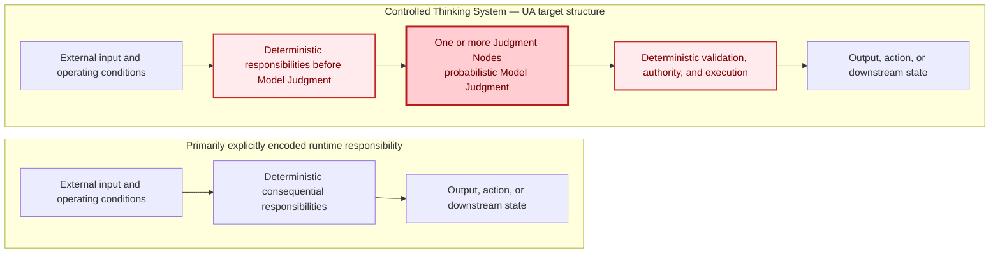

**Figure 3 — The controlled-object shift.** Two vertical responsibility structures are placed side by side for direct comparison. On the left, consequential runtime behavior is produced through an explicitly encoded deterministic chain. On the right, the article shows the control structure UA seeks to make explicit around a Thinking System: deterministic responsibilities surround one or more bounded Judgment Nodes, with validation, authority, and execution kept explicit after them. The red-highlighted blocks identify responsibilities whose control boundary changes because Model Judgment is present; they do not imply that the whole Thinking System is probabilistic or unsafe. The right-hand structure is an engineering target for controlled production use, not a condition for category membership.

Model Judgment can affect a workflow through several functional placements.

**Input Interpretation** converts ambiguous, unstructured, incomplete, or context-dependent input into a representation the rest of the system can use. It may affect what the system believes the user requested, which entities matter, which policy or context is relevant, and which deterministic path becomes available.

**Decision Logic** influences or selects a route, ranking, plan, priority, tool, or action. It may recommend an action, choose among bounded alternatives, or initiate a step only where the surrounding authority boundary permits it.

**Output Mediation** creates, adapts, filters, summarizes, explains, or transforms information for a person or downstream system. Even when underlying data remains unchanged, mediation can alter what someone understands, trusts, approves, discloses, or does next.

These are placement functions, not a mandatory three-stage architecture.

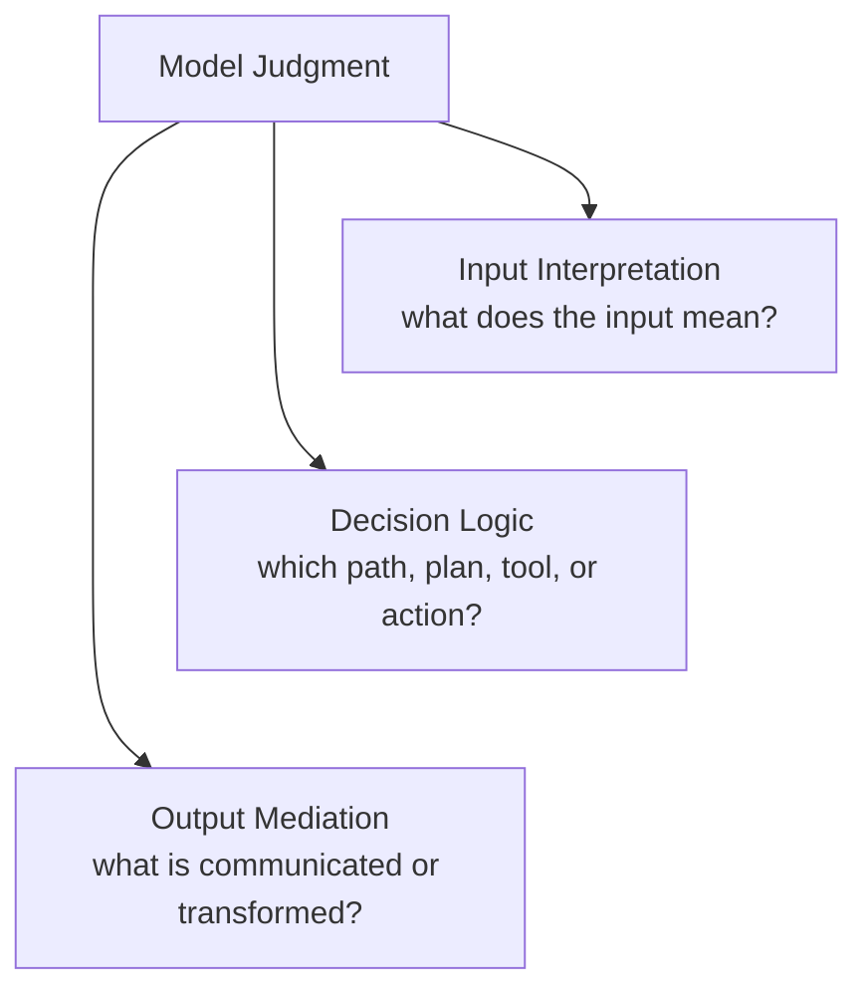

**Figure 4 — Functional placement of Model Judgment.** Model Judgment is shown as the parent concept; Input Interpretation, Decision Logic, and Output Mediation are three functional placements beneath it. They are not mandatory stages or a prescribed execution order. A system may use one, several, or repeated instances of them, and each placement changes the controlled object in a different way.

The useful variance created by these placements cannot be governed by treating every output difference as a defect. A Requirement for a Thinking System usually defines acceptable conditions, prohibited states, tolerances, authority boundaries, and expected outcomes rather than one exact output for every possible input.

Engineering must therefore preserve two truths at once:

1. useful judgment is the reason the model-mediated responsibility exists;
2. consequential deterministic responsibilities must remain explicit.

A model may interpret a request, but deterministic identity and permission checks may still decide which data is reachable. A model may recommend an action, while a deterministic boundary prevents execution outside an authorized tool set. A model may draft a customer response, while outbound send authority remains reserved to a human-operated path. A model may estimate semantic acceptability, while a release decision and the mechanism executing that decision remain separate responsibilities.

This mixed structure is why model quality alone is insufficient. Evaluation may estimate whether behavior is useful or acceptable. It does not, by itself, define which states are prohibited, establish who may accept residual risk, restrict reachable authority, execute rollback, or determine when the original project should be reconsidered.

The uncertainty has moved, but it has not replaced earlier uncertainty.

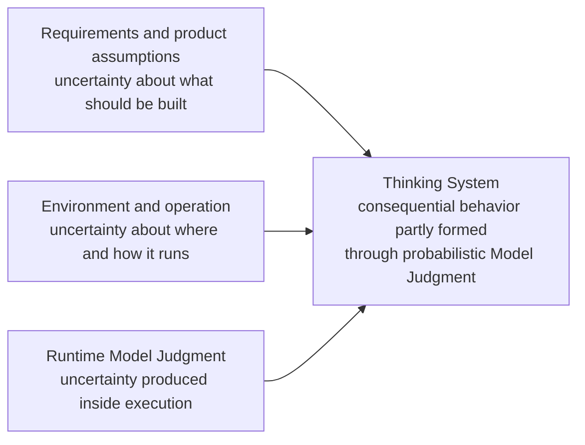

**Figure 5 — Three connected uncertainty locations.** Product methods, software engineering, DevOps, resilience, and incident response remain necessary. Thinking-System engineering adds explicit treatment of runtime judgment uncertainty and connects it back to earlier decisions.

Once probabilistic judgment enters the controlled object, the consequences do not remain inside a model call. Every decision that authorizes, shapes, releases, or operates that object must account for the changed behavior. The next sections develop these connected engineering horizons explicitly.

**Organizational control context.** The organization determines which authoritative boundaries, shared capabilities, prohibited uses, and decision rights apply to the Thinking System.

**Project / architecture control and viability.** The project decides whether a proposed use of Model Judgment can be made technically credible, operationally supportable, and economically viable. Within that same decision horizon, architecture allocates Model Judgment, deterministic responsibilities, evidence, authority, Human Authority, fallback, and corrective mechanisms across the system boundary.

**Delivery realization and release.** Delivery realizes those decisions for a bounded change and determines whether the resulting system is complete and acceptable for release.

**Runtime operation and reassessment.** Runtime operation determines whether active behavior remains within the conditions under which it was authorized and routes invalidating evidence back to the level that owns the affected decision.

These activities use different evidence, participants, time horizons, and actions. They are not interchangeable. An operational Controller cannot silently rewrite an organizational prohibition. A Release Gate cannot expand project authority. A project decision cannot claim a Hard Constraint without a complete realized path. An organizational policy does not become an operable boundary merely because it is authoritative.

Yet the levels are structurally connected because they control the same object.

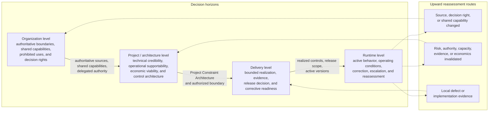

**Figure 6 — One controlled object across four decision horizons.** The four decision horizons remain aligned in one vertical spine. Authority and Constraints flow downward by reference and become more concrete in realization. The separate return lane preserves the upward routes by which runtime evidence is sent directly to Delivery, Project / Architecture, or Organization when it invalidates the basis of a decision owned at that level.

At each level, the concrete subject changes, but a recurring control structure appears:

```text
What outcome or condition is intended?
→ What operating space is acceptable?
→ What uncertainty or disturbance can move the object outside it?
→ What evidence reveals behavior, outcome, conditions, and control state?
→ Who or what may decide that action is required?
→ Which mechanism can change operation?
→ When does new evidence require reassessment at this or an earlier level?
```

This recurrence is the bridge to control theory. The claim is not that organizations, projects, delivery teams, and runtime services are equivalent to one mathematical Controller. Nor can social authority, legal interpretation, business viability, and model behavior be reduced to a single error signal.

The useful transfer is structural. Bounded control requires an intended condition, an approved operating space, evidence about the controlled process, decision authority, a path to corrective action, and a mechanism for revisiting assumptions when the control basis changes.

Applied to a socio-technical system whose controlled object contains probabilistic Model Judgment, that structure produces different but connected engineering forms: organizational boundaries and delegated authority; project-level viability and control architecture; architectural placement of Judgment Nodes, deterministic responsibilities, evidence, and action paths; delivery-level readiness, completeness, and release decisions; and runtime sensing, correction, containment, fallback, escalation, and reassessment.

These are not independent governance practices assembled around AI. They are level-specific realizations of one control problem. Existing disciplines remain necessary; what changes is the connection among them when probabilistic judgment becomes consequential inside the controlled object.

The next section develops the first half of that connection: the capabilities required to define boundaries, produce evidence, decide, and act.

## 3. From Model Quality to Bounded Control

A common response to probabilistic behavior is to improve measurement. Teams assemble test sets, run evaluators, inspect traces, monitor cost and latency, and compare model versions. This is necessary work. It can reveal regression, drift, weak grounding, unexpected tool use, or changes in business outcomes.

Measurement, however, is not the same as control.

A system can produce extensive evidence while nobody has authority to act on it. A review process can identify unacceptable behavior while no mechanism can prevent recurrence. An automated loop can detect degradation, select a response, and change the system while still permitting prohibited actions, exceeding delegated authority, or destroying the economics that justified the project.

Control begins when evidence about a process reaches a decision function and an authorized action can affect the process again:

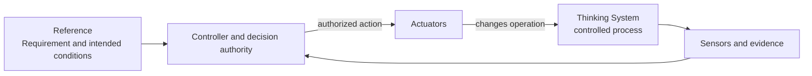

**Figure 7 — A closed feedback loop.** Evidence reaches a decision function and an authorized action changes the controlled process. The figure does not yet show whether the loop operates inside an approved boundary.

Closing the loop solves only part of the problem. The loop may optimize the wrong objective. It may respond too slowly for the consequence. Its Controller may possess authority that was never legitimately delegated. Its Actuator may change a prompt but be unable to block an external action. Its Sensor may observe average quality while missing a low-frequency prohibited state. The loop may keep a metric inside tolerance while Human Authority, fallback capacity, latency, or unit economics collapse.

A complete bounded control architecture therefore asks a broader question:

> Is the feedback loop operating inside an approved and credibly realized boundary, with bounded authority, fit-for-purpose evidence, effective corrective action, and a valid path for reassessment?

Four logical capability families answer different parts of that question.

### Constraints and their realizations

A **Constraint** is an approved condition limiting the allowed operating space. It may restrict reachable actions, side effects, authority, autonomy, data, tools, resources, deployment population, geography, or the conditions under which Human Authority is required.

A Constraint is an authoritative decision object. It does not enforce itself.

A **Constraint Realization** is the technical or socio-technical mechanism through which the Constraint is implemented, configured, enforced or influenced, evidenced, and operated for a defined scope. Permissions, typed interfaces, transaction guards, approval paths, prompts, evaluators, tool restrictions, isolation boundaries, rate limits, and manual procedures may all participate in realization.

Constraint and Constraint Realization belong to one capability family because either one without the other is incomplete. A realization without an authoritative Constraint is a mechanism with no defensible boundary. A declared Constraint without realization is an intention with no operational effect. Constraint Realization is not a fifth capability family.

Hard and Soft claims apply to a scoped Constraint together with its complete realized path. A **Hard Constraint** deterministically prevents or rejects violation within stated assumptions, subject, path, scope, and enforcement boundaries. A **Soft Constraint** influences probabilistic behavior but does not make the prohibited state unreachable.

A prompt, natural-language policy, model preference, or probabilistic evaluator is not hard by itself. A permission boundary may support a Hard Constraint for one action path while the same business intent remains soft for generated wording. Those are different guarantees and should be recorded separately rather than hidden inside one ambiguous control claim.

### Sensors and evidence

**Sensors** produce evidence about behavior, outcomes, operating conditions, realization state, control health, Actuator execution, and the assumptions on which authorization depends.

An evaluator usually performs a Sensor function. So do runtime telemetry, denied-action events, downstream outcomes, complaints, incidents, Human Authority response times, fallback load, and evidence that a realization is active or degraded.

A Sensor need not produce one objective truth value. Semantic quality, harmfulness, usefulness, or business acceptability may remain uncertain. The requirement is that evidence be fit enough for a bounded decision and expose its coverage, uncertainty, latency, and blind spots.

Telemetry without a decision path is observation. It may be valuable observation, but it is not control.

### Controllers and decision authority

A **Controller** compares or interprets evidence relative to approved Requirements, Constraints, assumptions, and a defined decision boundary, then selects or authorizes action.

The Controller may be deterministic software, bounded automated decision logic, a human decision-maker, a review or incident process, or a distributed socio-technical responsibility. What makes it a Controller is not intelligence or automation. It is ownership of a defined decision and legitimate authority over the available response.

Logic selecting `block`, `canary`, or `release` performs a Controller function. A dashboard does not become a Controller merely because a human views it. A human approval step is not substantive Human Authority unless the person has sufficient information, time, capacity, and power to change the outcome.

### Actuators and corrective action

An **Actuator** executes an authorized change in operation or in a Constraint Realization. It may block an action, narrow exposure, change routing, require Human Authority, switch to fallback, roll back a model or configuration, isolate a feature, compensate downstream state, or stop the system.

A Controller decides or authorizes. An Actuator executes. One component may perform both functions, but collapsing the concepts hides decision rights, execution rights, failure behavior, and evidence about whether the selected action actually occurred.

A Controller without an effective Actuator can diagnose but cannot correct. A kill-switch endpoint that nobody may legitimately invoke is not an operable response path. A feature flag that changes exposure is an Actuator only when it connects an authorized decision to a real operational change.

The complete relationship is wider than a vertical stack or one synchronous pipeline:


**Figure 8 — Complete bounded control architecture.** The four capability families are logical functions, not mandatory services, products, teams, layers, or one execution order. Realizations may act before, during, or after Model Judgment; Controllers and Actuators may be synchronous or asynchronous; one component may perform several functions.

What is often called AI governance is therefore not a fifth capability family and not a post-hoc checkpoint. It becomes operational through the complete socio-technical control architecture formed by these capabilities across the decision levels developed next. Until that architecture has credible boundaries, evidence, authority, effective Actuators, Human Authority and fallback where needed, and a path for reassessment, the application may be demonstrable or testable, but it is not ready for production release at the intended scope.

The distinction matters because a loop can be technically closed and still unacceptable. The relevant question is not only whether the system learns from feedback, but whether operation remains inside an approved, credibly realized, observable, and correctable boundary—and whether evidence can force reconsideration when that boundary or its assumptions no longer hold.

The capability anatomy explains how bounded control functions. It does not yet say where organizational authority, project authorization, delivery release, runtime correction, and reassessment are owned. That is the role of the second model.

## 4. Four Decision Levels for Thinking Systems

The same capability functions appear at different decision horizons, but the decisions are not interchangeable.

An organization may prohibit autonomous customer communication. A project may determine that a draft-only support workflow is viable under that boundary. A delivery team may implement permissions, tests, Human Authority, and fallback for one release. Runtime logic may reject an attempted send and disable the feature. These actions concern the same controlled object, but they operate with different authority, evidence, scope, and time horizon.

Four connected decision levels prevent a lower-level response from silently rewriting the basis on which the system was authorized. They are not four documents or approval meetings. They are the decision-ownership horizons through which governance becomes operational: organizational authority, project and architecture viability, delivery realization and release, and runtime operation and reassessment. Consequential production release requires the relevant decisions and capability functions to be connected across all four levels.

### Two orthogonal models

The **decision levels** identify where a decision is owned. The **capability families** identify how boundaries, evidence, decisions, and actions become operational. Every capability family may appear at every decision level. The models must not be mapped one-to-one.

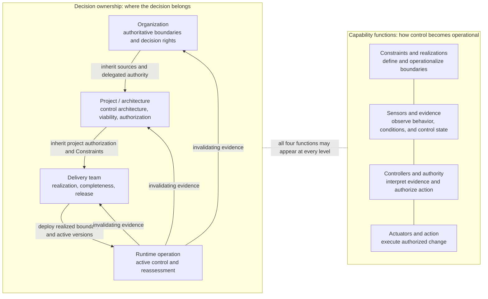

**Figure 9 — Two orthogonal models.** Decision ownership flows downward through inherited authority and upward through reassessment. Capability families apply at every level. The figure does not prescribe sixteen components, four services, or a one-way lifecycle.

### Organizational control context

**Question owned:** Within which authoritative boundaries, shared capabilities, and decision rights may projects operate?

The organizational level links the sources that already authorize or restrict the work: legal and contractual commitments, privacy and security requirements, procurement and vendor rules, geography, prohibited uses, approved deployment modes, incident obligations, shared capabilities, and exception authority.

The organizational question is not limited to identifying policy sources. The organization must determine which existing functions have legitimate influence over the Thinking System, which decisions each function owns, what evidence each requires, and which escalation or exception paths apply. Depending on the use case, the relevant functions may include product, engineering, architecture, operations, security, privacy, legal, compliance, procurement, finance, customer support, domain specialists, and executive authority.

This does not mean that every department participates in every decision. It means that material dependencies and decision rights are explicit before they are needed. Security may own an identity boundary, legal a contractual prohibition, finance the acceptance of control economics, operations a shutdown capability, and a domain function the Human Authority required to interpret ambiguous cases. A system becomes ungovernable when these functions influence it informally while their authority, evidence obligations, and response commitments remain undefined.

The answer is not necessarily a new governance department. Existing sources should be linked rather than copied into parallel policy prose. A small company may assign several responsibilities to the same people. The requirement is explicit authority and accountability, not organizational ceremony.

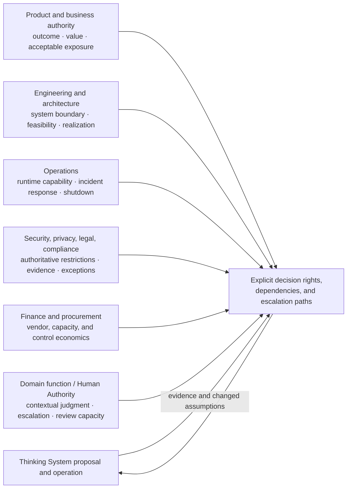

**Figure 10 — Organizational influence architecture.** The organization identifies which existing functions legitimately shape the system and what each owns. The figure does not prescribe departments, committees, or one participant per function; several responsibilities may be combined in a small organization.

Authority at this level does not automatically create an operable technical guarantee. An organizational prohibition becomes a project Constraint only after it is interpreted for a defined subject, path, and scope. It becomes hard only where a complete realized path deterministically prevents or rejects violation within stated assumptions.

Organizational change is required when the authoritative source, approved vendor or deployment mode, decision right, exception authority, or shared capability changes. Runtime evidence may trigger that review; runtime does not perform it automatically.

### Project control architecture and viability

**Question owned:** Does a credible, operable, and economically viable control architecture exist for this proposed Thinking System within a defined boundary?

This is the architecture decision that must exist before a successful prototype is mistaken for an authorized project.

Before substantial implementation begins, the project should be able to describe at least one complete and credible control loop for each material scenario. This does not require final production configuration, but it requires more than a list of controls to be added later. The project must identify the intended Requirement and Operating Envelope, material risks and reachable consequences, scoped Constraints, candidate Constraint Realizations, evidence needed to detect loss of acceptable operation, Controller authority, effective Actuator paths, Human Authority and fallback where required, expected feedback latency, and the assumptions under which the loop can work.

The project review owns the intended outcome and the necessity of Model Judgment, the project boundary, material scenarios, Project Constraint Architecture, required control capabilities and assumptions, evidence feasibility, Human Authority, fallback and recovery, operating capacity, control economics, residual exposure, and the conditions for reauthorization.

The cost of the control perimeter belongs in viability from the beginning. Evaluation, observability, semantic review, Human Authority, fallback capacity, incident response, model and vendor dependencies, control maintenance, and expected operational friction are not post-launch overhead accidentally discovered after the prototype succeeds. They are part of the architecture and economics of the proposed system.

The question is not simply whether the model can perform the task. It is whether the complete controlled system can operate credibly and affordably. A design that requires more review capacity than the organization can provide, cannot detect violations before unacceptable harm, depends on an unrealizable Hard Constraint, or destroys the expected unit economics may be technically impressive and architecturally non-viable.

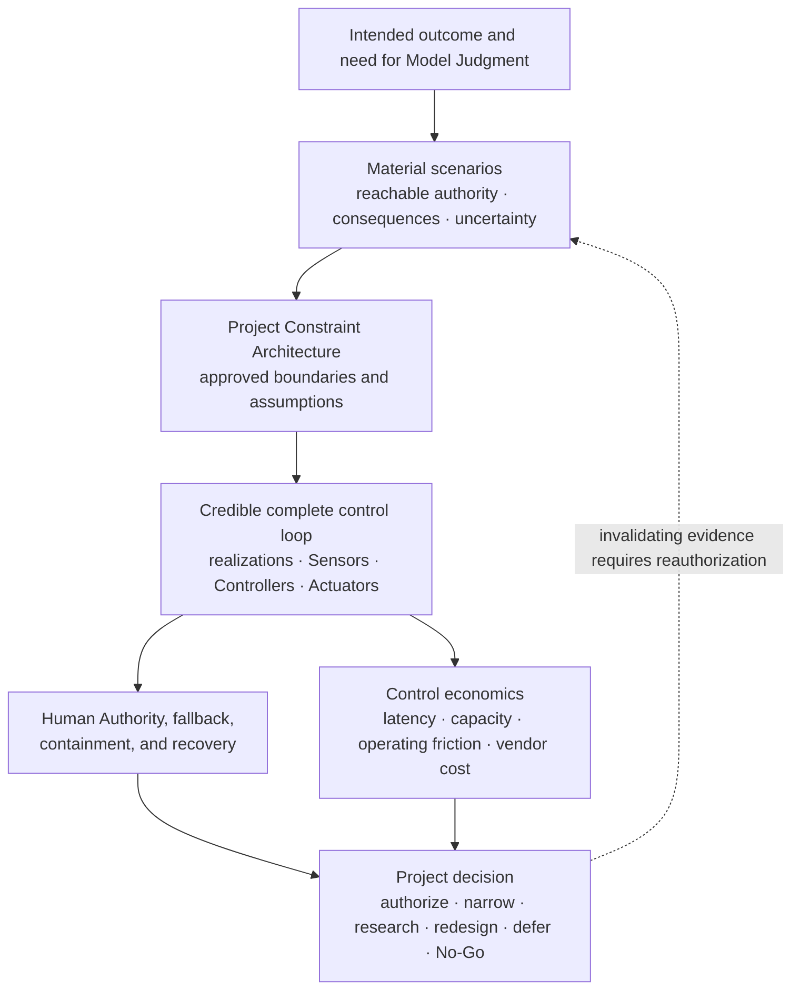

**Figure 11 — Project control architecture and viability.** Project authorization requires a credible model of the complete control perimeter and its cost before the production path is authorized. The figure permits bounded research when the loop is not yet sufficiently understood; research authorization is not production authorization.

#### Designing the control architecture

Project authorization depends on architecture work that translates material business and operational risks into a realizable control structure.

Architectural analysis identifies where Model Judgment is placed, what authority and consequences are reachable from each Judgment Node, which deterministic responsibilities must surround it, and which scenarios could produce unacceptable outcomes. From that analysis the project derives required Constraints, candidate Constraint Realizations, Sensor evidence, Controller decisions, Actuator paths, Human Authority, fallback, containment, recovery, and reassessment mechanisms.

Sensor design must reflect the property being controlled. Machine-checkable or syntactic evidence may verify schema, type, structure, permissions, tool arguments, state transitions, resource limits, or other deterministic conditions. Semantic evidence may estimate grounding, relevance, harmfulness, intent alignment, factual support, policy meaning, or downstream business acceptability. Semantic Sensors remain probabilistic and must expose coverage, uncertainty, latency, and blind spots rather than being treated as oracles.

Human participation, where required, is part of the system architecture rather than an external safety decoration. The design must account for the information available to the person, the decision they own, the time available, expected volume, expertise, fatigue, escalation rights, and what happens when Human Authority is unavailable or overloaded.

The resulting architecture is driven by the risks, authority, and consequences of the system. It should not be assembled from a generic requirement to deploy every possible control component.

Project outcomes may include authorization, narrowed scope, conditions, further research, redesign, deferral, escalation, or No-Go. **Architectural Veto** is a valid engineering result, not a failure of enthusiasm.

The project level produces one versioned Project Constraint Architecture and authorization baseline. Delivery inherits that baseline by reference. It may refine and narrow it. It may not silently expand delegated authority or weaken an inherited Hard Constraint.

### Delivery-level Thinking System Review

**Question owned:** Is a bounded system, feature, or material change ready, complete, and acceptable for a specific deployment context under project authorization?

Delivery turns project intent into a concrete realization. It identifies implementation-level Judgment Nodes, defines the delivery Requirement and Operating Envelope, maps inherited and local Constraints to one canonical Constraint Realization Map, implements or experiments within authority, produces evidence, and makes a deployment decision.

Delivery readiness concerns the team's capability as well as the implementation. The delivery responsibility must understand how deterministic responsibilities and Model Judgment are separated; how Constraints become realizations; how behavioral evidence is produced; how changes in model, prompt, context, retrieval, tools, data, evaluators, configuration, and population can create drift; and how corrective actions remain inside delegated authority.

This does not require every team member to become a control theorist or AI-safety specialist. It requires the team as a whole to cover the necessary responsibilities: architecture, implementation, deterministic verification, semantic evaluation, release decisions, observability, runtime operation, Human Authority, and escalation.

The team must also translate in both directions. Technical signals such as evaluator regression, distribution change, prompt-version drift, increased override rate, fallback saturation, denied-action events, rising review latency, or realization degradation do not become useful project evidence until their business consequence is understood. Conversely, statements such as customer-trust risk, unacceptable financial exposure, or legal concern do not become operable engineering inputs until they are translated into scoped scenarios, Constraints, evidence requirements, authority boundaries, and response paths.

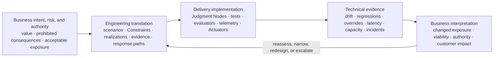

**Figure 12 — Delivery translation loop.** The team converts business risks and authority into an operable control design, then converts technical evidence back into business exposure and decision consequences. The figure describes a responsibility of the delivery system, not a reporting handoff between two isolated groups.

Three decisions remain distinct.

**Definition of Ready** establishes whether bounded work or an experiment may begin. The inherited authority, scope, Judgment Nodes, required realizations, evidence plan, Human Authority, fallback, assumptions, and escalation path must be explicit enough to proceed.

**Definition of Done** establishes whether implementation and evidence are complete for the reviewed scope. Required paths are covered, unavailable and bypass behavior are tested, active versions are traceable, Sensors and Actuators are operational, and known gaps are visible.

**Release Gate** accepts, limits, conditions, escalates, or rejects a deployment for a specific population and context. A system may satisfy DoD and still fail the Release Gate because evidence, capacity, residual risk, economics, or operational readiness are unacceptable.

Delivery may repair a local realization, narrow exposure, roll back, or change configuration within delegated authority. It must request project reauthorization when new evidence changes the project risk, authority boundary, feasibility, evidence basis, Human Authority capacity, or economics.

### Runtime operation and reassessment

**Question owned:** Does active operation remain within the approved Requirement, Constraint baseline, authority, capacity, and economics, with required realizations active and healthy—and what action follows when it does not?

Runtime is where the realized control architecture is exercised. Monitoring must cover the active controlled system rather than only the model. Relevant evidence may include model behavior, downstream outcomes, active model and prompt versions, context and retrieval state, tool use, authorization failures, Constraint Realization activation and bypass, machine-checkable and semantic evidence, drift, complaints, overrides, Human Authority capacity, fallback load, cost, latency, incidents, Actuator execution, and whether corrective action produced the intended state.

Monitoring becomes control only when a signal is tied to a decision. Material evidence should have an interpretation boundary, expected decision latency, responsible Controller, available Actuator, and escalation or reassessment route. A dashboard that accumulates signals without these connections is an observability surface, not a complete runtime control system.

Runtime Controllers may select or authorize responses within their delegated boundary. Runtime Actuators may reject, contain, compensate, route to fallback, narrow exposure, roll back, disable, or stop operation. These actions can restore a known authorized state or limit harm. They do not automatically authorize a new project boundary.

Runtime control must distinguish restoration from redesign. Rolling back, narrowing exposure, blocking an action, or switching to fallback may return the system to a previously authorized state. Persistent drift, changed business exposure, unsustainable Human Authority load, loss of Sensor validity, or broken control economics may require delivery reassessment or project reauthorization rather than another local tuning cycle.

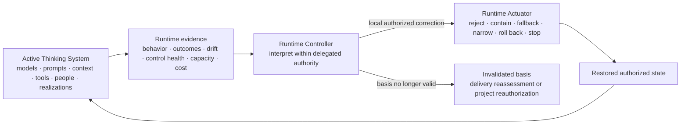

**Figure 13 — Runtime control and reassessment.** Runtime observes the complete socio-technical system, not only model outputs. Local action may restore an authorized state; persistent invalidation routes upward rather than silently redesigning the project in production.

Evidence must route according to the decision basis it invalidates:

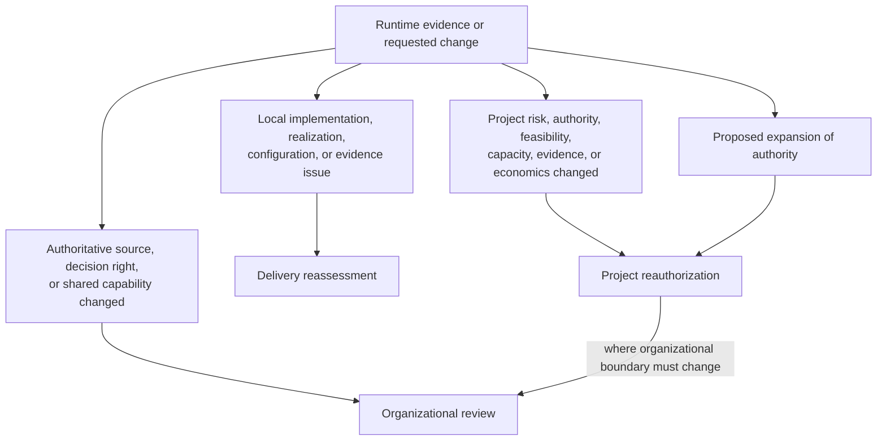

**Figure 14 — Evidence and change routing.** The destination is determined by the basis of the decision being challenged or changed, not merely by where the signal first appears. A proposed authority expansion is not normalized as runtime tuning.

This routing prevents two opposite failures. The first is escalation theater, where every runtime defect becomes a governance meeting. The second is silent authority drift, where repeated local fixes gradually change the project without an explicit architecture decision.

The levels form a nested lifecycle rather than a waterfall. Higher-level authority and Constraints flow downward by reference and become more concrete in delivery and runtime realization. Evidence flows upward when it invalidates an earlier basis. Lower levels may refine and narrow. They may not silently expand authority, weaken an inherited Hard Constraint, or normalize evidence that the project is no longer viable.

The capability anatomy and decision levels now define the conceptual center of the engineering problem. The next practical question is how a small team can preserve these distinctions without maintaining four governance processes and a cemetery of synchronized documents.
