# Uncertainty Architecture: Engineering Thinking Systems with Consequential Runtime Responsibilities

## Abstract

Software engineering repeatedly expands when an important source of uncertainty can no longer remain outside the engineering model. **Plan-driven development (including Waterfall)** attempts to reduce requirement and design uncertainty before implementation. **Iterative delivery (including Agile and related approaches)** accepts that product understanding changes through use and shortens the distance to feedback. **Modern operations (commonly associated with DevOps)** accepts that production conditions cannot be reproduced exhaustively before release and extends engineering into runtime through observability, progressive delivery, and recovery.

This paper introduces **Thinking Systems** as a distinct engineering category: software systems in which one or more **Consequential Runtime Responsibilities** depend partly on probabilistic Model Judgment rather than being fully specified through explicitly encoded logic in advance. The term names the changed engineering object, not a maturity level or architecture style. Fixed or dynamic orchestration, agent labels, autonomy, and delegated authority are separate dimensions; a simple predefined workflow can already be a Thinking System when at least one **Consequential Runtime Responsibility** depends partly on probabilistic Model Judgment.

Thinking Systems move consequential uncertainty inside the controlled object. Once that happens, model quality and observability are no longer sufficient descriptions of the engineering problem. A Thinking System is not ready for production at the intended scope while any material control responsibility remains unowned, unrealized, insufficiently evidenced for its decision, or without a credible corrective or reassessment path—even when the model and code pass local tests. Governance becomes operational through the active socio-technical control architecture spanning organizational authority, project and architecture viability, delivery realization and release, and runtime operation and reassessment. This paper derives a control-capability and decision-horizon model for reasoning about that architecture, explains how to apply the complete map proportionally, examines adjacent methods, tools, standards, and regulation through a substitution analysis, and identifies the resulting synthesis as **Uncertainty Architecture**—an open specification whose claims remain subject to practical validation, simplification, contradiction, and revision.

## 1. Engineering Evolves Around Dominant Uncertainty

Software-engineering methods are often discussed as competing schools: planning versus iteration, development versus operations, process versus autonomy. That framing hides a more useful pattern. Engineering expands when a consequential source of uncertainty can no longer be managed adequately by the assumptions and feedback structures already in place.

The pattern is not a clean historical sequence, and none of the approaches below is reducible to one idea. Plan-driven development, iterative delivery, and modern operations are broader engineering responses; Waterfall, Agile, and DevOps are familiar but non-equivalent examples. The comparison here is narrower: each broader response can be read as characteristic of a different location of uncertainty and feedback.

**Plan-driven development (including Waterfall)** treats significant requirement and design uncertainty as something to reduce before implementation. The engineering response is analysis, decomposition, specification, approval, and planned execution. This remains rational where the problem can be understood sufficiently in advance, the cost of change is high, and late feedback is dangerous.

**Iterative delivery (including Agile and related approaches)** starts from a different limit: important requirements often cannot be stabilized through analysis alone because users, markets, and teams learn by interacting with working software. The response is not to abandon planning, but to shorten the cycle between assumption, delivery, use, and revision. Feedback moves closer to implementation and becomes part of the product-development mechanism.

**Modern operations (commonly associated with DevOps)** exposes another limit. Even a well-understood feature cannot be exhaustively validated against every production combination of traffic, infrastructure, device, operating system, dependency, configuration, user behavior, and failure condition. Engineering therefore extends beyond release. Telemetry, progressive delivery, canary exposure, rollback, resilience, and incident response make production behavior part of the evidence used to operate and improve the system.

Thinking Systems add a distinct source of uncertainty. The uncertainty is not only in what should be built or in the environment in which software runs. It also appears in the runtime selection or construction of behavior inside the controlled object. **The engineering problem is how to build and operate systems that use probabilistic Model Judgment without surrendering explicit boundaries, evidence, decision authority, and corrective control.**

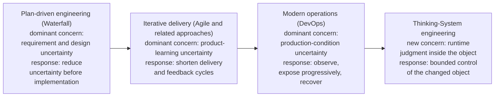

**Figure 1 — Engineering expands its feedback model as consequential uncertainty moves closer to runtime and eventually enters the controlled object.** The final transition introduces the problem of engineering and operating systems in which consequential behavior is partly produced through probabilistic Model Judgment inside the controlled object. Waterfall, Agile, and DevOps are shown as familiar examples of the broader plan-driven, iterative-delivery, and modern-operations responses. The progression is conceptual, not replacement history.

| Characteristic engineering response | Uncertainty emphasized | Primary mechanism | Where decisive feedback appears |
|---|---|---|---|
| Plan-driven development (including Waterfall) | Requirements, design, coordination | Analysis and planning | Primarily before and during implementation |
| Iterative delivery (including Agile and related approaches) | Product understanding and value | Short delivery and learning cycles | Between iterations and releases |
| Modern operations (commonly associated with DevOps) | Production conditions and system behavior | Runtime telemetry, progressive exposure, and recovery | During operation |
| Thinking-System engineering | Model-Judgment-dependent Consequential Runtime Responsibilities and their effects | Bounded control architecture: explicit Constraints, evidence, decision authority, correction, and reassessment | Inside and around the active controlled object |

The table does not imply that requirement uncertainty disappeared after Agile or that operational uncertainty began with DevOps. The point is cumulative. Each expansion preserves earlier responsibilities while adding mechanisms for uncertainty that became too important to leave outside the engineering model.

### Introducing Thinking Systems

In this paper, a **Thinking System** is:

> A software system in which one or more **Consequential Runtime Responsibilities** depend partly on probabilistic Model Judgment rather than being fully specified through explicitly encoded logic in advance.

This paper calls a runtime responsibility a **Consequential Runtime Responsibility** when its output, decision, path, action, or downstream state can materially affect an intended outcome, satisfaction of an applicable Requirement or Constraint, the exercise of delegated authority, resource use, or a person or system downstream. **Consequential describes material causal relevance, not implementation mechanism or risk severity.** A Consequential Runtime Responsibility may be fulfilled entirely through explicitly encoded logic or may depend partly on probabilistic Model Judgment; Thinking-System classification changes only in the latter case. Harm, severity, likelihood, autonomy, regulation, control adequacy, and production readiness are separate questions. A model invocation with no material influence on any Consequential Runtime Responsibility does not establish the category by itself.

The definition identifies the changed engineering object; it does not certify control adequacy. A Thinking System can be well controlled, poorly controlled, or not ready for production. Constraints, evidence, decision rights, and corrective mechanisms belong to the engineering response around Model-Judgment-dependent Consequential Runtime Responsibilities; they are not the condition that makes the category exist.

The word **Thinking** is functional rather than anthropomorphic. It does not claim consciousness or human-like cognition; it gives engineering a stable name for software in which one or more **Consequential Runtime Responsibilities** depend partly on probabilistic Model Judgment.

**Model Judgment** means interpretation, synthesis, classification, generation, planning, ranking, routing, or action selection performed through a probabilistic model under uncertainty. It is useful precisely because the required behavior cannot always be exhaustively encoded in advance.

The category must not be collapsed into "agentic application." The classification question is narrower: does any **Consequential Runtime Responsibility** depend partly on probabilistic Model Judgment? If not, the relevant **Consequential Runtime Responsibility** remains explicitly encoded and the software remains Linear Software even when orchestration is dynamic. If yes, the software contains the changed object described here even when orchestration is fixed. Deterministic code before, between, or after that judgment does not make the delegated judgment deterministic. Orchestration topology, autonomy, and delegated authority affect architecture and control demand, but they do not decide the category. The precise boundary of agentic terminology remains an open research question.

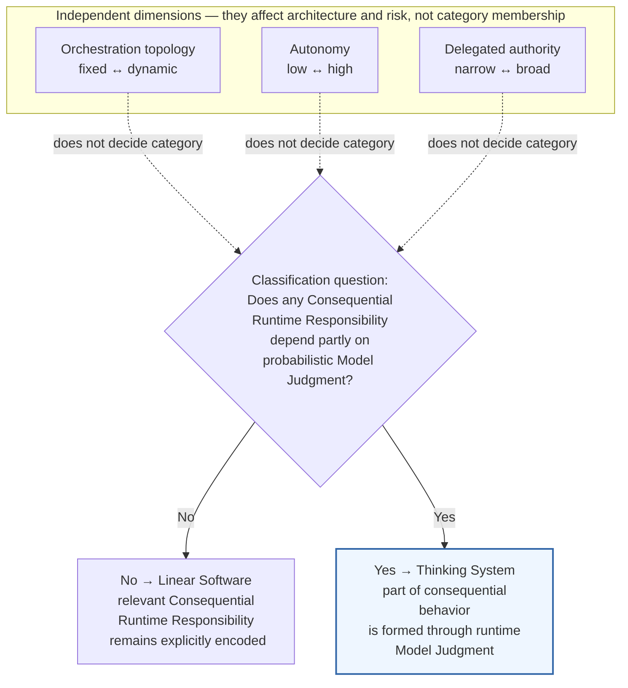

**Figure 2 — Thinking-System classification turns on whether a Consequential Runtime Responsibility depends partly on probabilistic Model Judgment, not workflow topology or autonomy.** Fixed and dynamic workflows can fall on either side of the category boundary. The category changes when a **Consequential Runtime Responsibility** is no longer fully specified through explicitly encoded logic and instead depends partly on probabilistic Model Judgment. Autonomy and delegated authority remain additional dimensions that affect risk and control design rather than classification.

Thinking-System engineering still requires product discovery, deterministic software engineering, testing, security, deployment discipline, observability, and incident response. The new category does not invalidate those practices. It changes the object they are controlling.

---

### Running Example | Bounded Customer-Support Resolution

**Lens in this section:** business proposal, controlled-object identity, and intentionally unresolved control paths.

Throughout this paper, one fictional system will make the control model concrete: a company wants to reduce the cost and latency of customer-support resolution while preserving explicit authority over consequential decisions and downstream effects.

The proposed system receives a customer request, retrieves authorized account, order, product, and support-policy context, interprets the issue, selects or recommends a resolution path, and drafts consequential customer communication. In explicitly authorized low-impact cases it may eventually be allowed to invoke a tool that changes downstream business state, such as issuing a bounded credit or refund; cases requiring reserved judgment or authority remain under Human Authority.

The controlled object in this example is not the model or chatbot interface. It is the whole support-resolution system: deterministic identity, access, retrieval, policy, tool, and execution paths; one or more Model-Judgment-dependent responsibilities; Human Authority where required; and the downstream effects the system can create. The same controlled object will be carried through the rest of the paper—from category classification and AI-necessity questions through authorization, architectural viability, concrete realization, active operation, and reassessment. The evidence, decision, and corrective paths required to control that object are deliberately left unresolved here; the following sections derive them rather than assuming them. Details will be introduced only when the corresponding concept requires them.

At this point, assume only a credible pilot: a capable model, retrieval and tool access, traces, evaluation suites, policy guidance, and a human-review path. Each local component can be competent. The dashboard may be green. The demo may be impressive. The complete system may still lack a defensible connection between the authoritative limits of the system, the assumptions under which it is designed, the boundary actually realized, the evidence produced in operation, and the corrective decisions available when those assumptions fail. For now, the important fact is only that consequential interpretation and resolution may depend partly on Model Judgment while the surrounding controls and decision rights are not yet connected.

The components alone do not answer the connected questions. Was Model Judgment actually necessary for the intended support outcome, or would a deterministic or narrower human-assisted design be enough? What authority was delegated to the model-mediated path? Which consequences are prohibited rather than merely undesirable? Which Constraints are authoritative, and how are they realized? Which evidence informs which decision? Who may narrow exposure, roll back, disable, redesign, or stop operation? When does runtime evidence invalidate Project Authorization rather than only a local implementation? Does the business case survive once evaluation, Human Authority, fallback, observability, incident handling, and control capacity are included in the cost?

**What this adds to the case:** the support-resolution system is established as the stable controlled object; authority, evidence, control, and reassessment paths are deliberately left unresolved for later sections.

---

This is a practitioner observation about fragmentation, not a claim that governance, safety, architecture, or control practices do not exist. Relevant practices are often separated by product boundary, decision level, or organizational function. Observability can show what happened without establishing who may act. Evaluation can estimate behavior without defining an approved operating boundary. A policy can express intent without creating an operational realization. A human approval step can exist without adequate information, time, power, or capacity. An orchestration platform can execute a delegated workflow without deciding whether that workflow was legitimate to authorize.

Without the connection, local confidence is easily substituted for system control. A good evaluation score becomes evidence that the product is ready. A prompt becomes a policy. A policy becomes a supposed control. A human-in-the-loop label becomes evidence of accountability. A rollback button becomes evidence that recovery is possible. Each substitution may be understandable, and each may be wrong. None of these substitutions establishes the missing control relationship by itself.

> **Release-readiness consequence.** For production use of a Thinking System, these are not gaps that can be delegated to a post-release governance review. The system is not ready for production at the intended scope while any material control responsibility remains unowned, unrealized, insufficiently evidenced for its decision, or without a credible corrective or reassessment path. “Complete control architecture” therefore means materially complete for the authorized scope, not maximal control implementation. Governance becomes operational through that socio-technical architecture; it is not a document layered over the system.

> **Previous engineering methods learned to manage uncertainty surrounding software. Thinking Systems require engineering to manage consequential uncertainty produced by the software itself.**

The missing layer is not another AI component. It is the engineering connection between delegated judgment, authorized boundaries, evidence, decision authority, corrective action, and reassessment. Understanding why that connection is necessary requires examining the object being controlled.

## 2. The Controlled Object Has Changed

A controlled object is the thing whose behavior engineering seeks to keep within acceptable conditions. In software, that object is never only source code. It includes deployed components, data, configuration, dependencies, infrastructure, operational processes, relevant human roles and interactions within the declared system boundary, and the effects the system can create.

Thinking Systems change this object by making one or more **Consequential Runtime Responsibilities** depend partly on probabilistic Model Judgment. The change can occur in the first model-enabled iteration; it does not require autonomous agents, dynamic orchestration, multiple models, memory, or a mature AI platform.

Application topology does not determine the category. A Thinking System may contain a single model call inside an otherwise deterministic application, several model-enabled steps in a predefined workflow, dynamic routing, or agentic orchestration. Conversely, neither the presence of a probabilistic model nor any of these topologies is sufficient by itself. The category begins only when at least one **Consequential Runtime Responsibility** depends partly on probabilistic Model Judgment. Later additions such as memory, dynamic routing, cooperating agents, or broader autonomy may increase complexity and control demand, but they do not create the category.

The distinction matters because engineering needs a stable name for the object being designed, released, operated, and controlled. In Linear Software, no **Consequential Runtime Responsibility** depends partly on probabilistic Model Judgment; its **Consequential Runtime Responsibilities**, if any, are fulfilled entirely through explicitly encoded logic. In a Thinking System, part of the mapping from situation to consequential behavior is instead completed during runtime through Model Judgment. Deterministic software may surround that judgment, but it no longer exhaustively specifies the consequential responsibility that depends on it.

The controlled object is therefore the **whole Thinking System, not the model invocation**. The engineering problem is to preserve useful runtime judgment while keeping the surrounding deterministic responsibilities, boundaries, evidence, decision authority, and corrective mechanisms explicit enough to control the system as a whole. Whether those controls are adequate is a separate question from whether the object belongs to the Thinking-System category.

### Why not simply call these AI systems?

Because the broader labels answer different questions. [ISO/IEC TR 29119-11:2020](https://www.iso.org/standard/79016.html) defines an **AI-based system** by the presence of at least one AI component. [NIST AI RMF 1.0](https://www.nist.gov/publications/artificial-intelligence-risk-management-framework-ai-rmf-10) uses a broader **AI system** concept centered on machine-generated outputs that influence real or virtual environments. Those scopes are useful. The narrower question needed here is different: does any **Consequential Runtime Responsibility** depend partly on probabilistic Model Judgment?

A conventional application can therefore fall within a broad AI-system category while no **Consequential Runtime Responsibility** depends partly on Model Judgment. Conversely, a simple fixed workflow can cross the Thinking-System boundary as soon as a **Consequential Runtime Responsibility** such as interpretation, planning, routing, risk identification, or output mediation depends partly on probabilistic Model Judgment.

| Neighboring label | What it primarily signals in this comparison | Why it does not identify this controlled-object boundary |
|---|---|---|
| **AI-based system (ISO/IEC TR 29119-11)** | Presence of at least one AI component | Component presence alone does not say whether a **Consequential Runtime Responsibility** depends partly on probabilistic Model Judgment |
| **AI system (NIST AI RMF)** | A broader system producing machine-generated outputs that influence real or virtual environments | The scope is broader than the responsibility boundary used here |
| **LLM application** | Use of a particular model technology | Technology choice does not say what consequential responsibility the model carries |
| **Agentic system** | Agency-oriented behavior or orchestration | Agency, autonomy, and authority are separate dimensions from the category test |
| **Autonomous system** | Degree of independent operation | Autonomy changes risk and control demand but does not establish whether a consequential responsibility depends partly on Model Judgment |
| **Thinking System (this paper)** | A **Consequential Runtime Responsibility** depends partly on probabilistic Model Judgment | Directly identifies the controlled-object change examined in the rest of the paper |

This is a narrow analytical comparison, not a judgment that broader AI-system concepts, NIST AI RMF, ISO standards, or agentic terminology are technically shallow or operationally incomplete. Their capability, authority, lifecycle, and governance coverage is a different question and belongs in the later landscape analysis. **Thinking System** is not proposed as a replacement for *AI system*; it names the responsibility boundary relevant to the engineering argument developed here.

A useful design-contract abstraction for explicitly encoded deterministic responsibility is:

```text
y = f(x, context, configuration, system state)
```

This does not claim perfect physical repeatability. It means that the intended mapping over the relevant input, context, configuration, and state is authored through explicit logic, rules, state transitions, or other inspectable mechanisms and can be tested against specified conditions.

Over the same classes of relevant conditions, a model-mediated responsibility is better represented as selection from plausible outcomes:

```text
y ~ P(y | x, context, configuration, system state)
```

For the same apparent request, plausible behavior may vary with context, model version, instructions, retrieval results, tools, configuration, prior interaction, data distribution, or operating conditions. The system does not merely execute a fully enumerated decision; part of the consequential mapping is selected or constructed at runtime.

The architectural difference can be shown without pretending that conventional software consists of one linear function or that every Thinking System follows one pipeline.

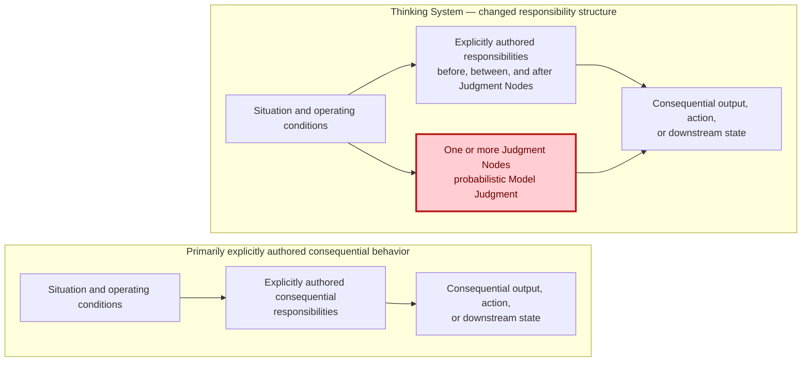

**Figure 3 — The controlled-object shift.** On the left, Consequential Runtime Responsibilities are fulfilled through explicitly authored logic. On the right, explicitly authored responsibilities remain part of the system while one or more Consequential Runtime Responsibilities depend partly on probabilistic Model Judgment, so part of the consequential mapping is completed at runtime. The parallel paths are schematic responsibility relationships, not a prescribed execution topology. Red marks only the Judgment Node where the responsibility structure changes; it does not imply that the whole system is probabilistic, unsafe, or erroneous. The figure is descriptive of the category boundary, not a prescribed control architecture. The deterministic boundaries, evidence, authority, and corrective mechanisms required for controlled production use are derived in the sections that follow.

Model Judgment can enter a system through several functional placements.

**Input Interpretation** converts ambiguous, unstructured, incomplete, or context-dependent input into a representation the rest of the system can use. It may affect what the system believes the user requested, which entities matter, which policy or context is relevant, or which deterministic path becomes available.

**Decision Logic** influences or selects a route, ranking, plan, priority, tool, or action. It may recommend an action, choose among bounded alternatives, or initiate a step only where the surrounding authority boundary permits it.

**Output Mediation** creates, adapts, filters, summarizes, explains, or transforms information for a person or downstream system. Even when underlying data remains unchanged, mediation can alter what someone understands, trusts, approves, discloses, or does next.

These are placement functions, not a mandatory three-stage pipeline.

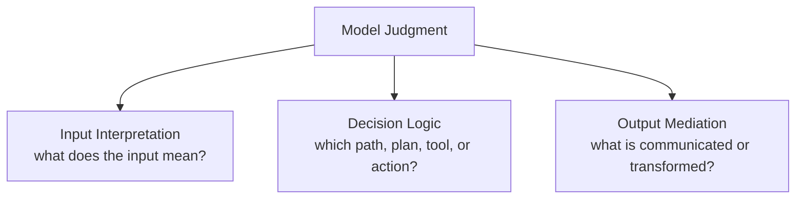

**Figure 4 — Functional placement of Model Judgment.** Model Judgment is the parent concept; Input Interpretation, Decision Logic, and Output Mediation are functional placements beneath it. They are not mandatory stages or a prescribed execution order. A system may use one, several, or repeated instances of them.

The reason to introduce Model Judgment is its ability to resolve consequential situations whose relevant interpretation or decision space cannot be exhaustively specified in advance. Useful behavioral variance may be part of that capability, but variance is not itself the engineering objective. The objective is to preserve useful judgment while keeping the resulting operation bounded.

That requires a mixed-system view. A model may interpret a support request while deterministic identity and permission checks constrain which customer data is reachable. It may recommend a resolution while deterministic tool permissions limit what can be executed. It may draft a customer response while outbound authority remains on a separate human or deterministic path. It may estimate semantic acceptability while the release decision and the mechanism executing that decision remain separate responsibilities.

---

### Running Example | The Controlled Object Expands

**Lens in this section:** how Model Judgment changes the engineering boundary and the reach of the required control perimeter.

The bounded support-resolution system already contains this mixed structure. Retrieval, identity, permissions, tool access, and execution paths can remain deterministic while request interpretation, resolution selection, or response generation depends partly on Model Judgment. That is enough to change the controlled object even before the paper decides whether the resulting authority, evidence, Human Authority, fallback, and economics are adequate for production.

The support workflow can use predefined stages and permitted transitions: receive request → retrieve authorized context → interpret issue → select or recommend a resolution → prepare consequential communication → check authority → execute a bounded action or route to Human Authority. Its fixed orchestration topology neither creates nor prevents the category. The system crosses the boundary if a **Consequential Runtime Responsibility** within that workflow depends partly on Model Judgment.

Now follow the consequential responsibility rather than the model boundary. If Model Judgment can influence which remedy applies, what the customer is told, whether a refund is proposed, or whether an authorized tool changes downstream business state, then the engineering perimeter cannot stop at the model-serving component. That perimeter includes the path by which runtime judgment becomes a consequential outcome and connects it to the people, permissions, evidence, and corrective mechanisms needed to keep the path inside an authorized boundary.

For a material case, that control perimeter may therefore become explicitly **socio-technical** and cross technical, delivery, architectural, human-authority, and organizational decision boundaries. In the running example, a bounded-refund authority may originate outside the runtime system, depend on architectural choices about where Model Judgment is permitted, require a concrete delivery realization, and ultimately constrain whether a runtime transaction can execute. The point here is the **reach of the perimeter**, not yet the ownership model inside it. Where authority, exposure, reversibility, or downstream effects make the control problem material, the engineering boundary therefore cannot be limited to the model, application, or runtime architecture alone; a socio-technical control architecture may have to be designed around the whole controlled object.

This does **not** mean every Thinking System needs separate departments, committees, or a maximal governance stack. The same people or platform may carry several responsibilities, and lower-consequence systems may realize the required control perimeter lightly. The point is causal: once probabilistic Model Judgment participates in a consequential responsibility, the required control perimeter follows the authority and effects of the **whole controlled object**, potentially all the way to organizational decision rights.

**What this adds to the case:** the same support system now exposes why consequential responsibility can require a socio-technical control perimeter that extends beyond the model and runtime component.

---

This is why model quality alone is insufficient. Evaluation may estimate whether behavior is useful or acceptable. It does not, by itself, define prohibited states, establish who may accept residual exposure, restrict reachable authority, execute correction, or determine when the basis of Project Authorization must be reconsidered.

The new uncertainty also does not replace earlier uncertainty. It adds another location that engineering must connect to the others.

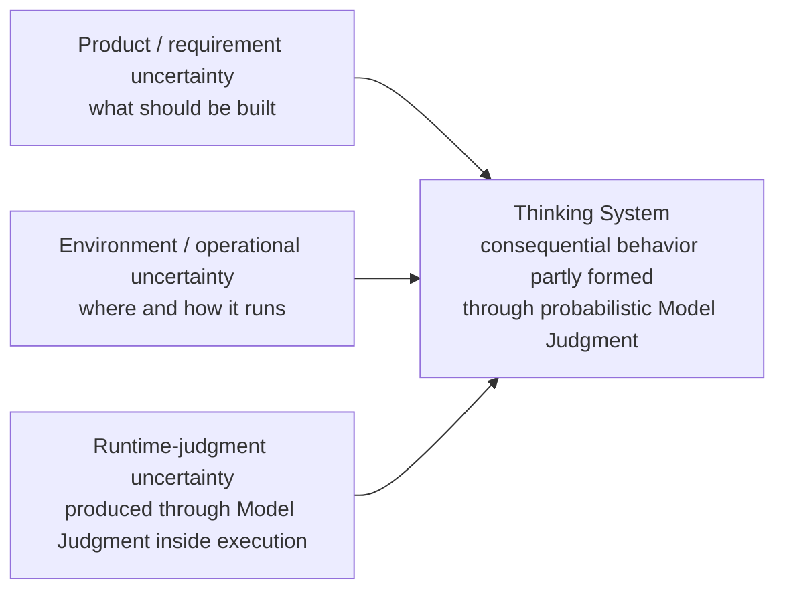

**Figure 5 — Three connected uncertainty locations.** Product and requirement uncertainty, environment and operational uncertainty, and runtime-judgment uncertainty coexist. Product methods, deterministic software engineering, DevOps, resilience, security, and incident response remain necessary; Thinking-System engineering adds explicit treatment of uncertainty produced through runtime judgment inside the controlled object.

The example exposes a broader consequence: the control perimeter of a Thinking System may cross technical, delivery, architectural, human-authority, and organizational decision boundaries. Different decisions across that perimeter require different evidence, authority, and corrective mechanisms. Before assigning those decisions to explicit horizons, however, the engineering problem is more basic: **what capabilities must exist for bounded control to be possible at all?**

Across that expanded perimeter, the concrete subject changes but a recurring control structure appears:

```text
What outcome or condition is intended?
→ What operating space is acceptable?
→ What uncertainty or disturbance can move the object outside it?
→ What evidence reveals behavior, outcome, conditions, and control state?
→ Who or what may decide that action is required?
→ Which mechanism can change operation?
→ When does new evidence require reassessment at this or an earlier level?
```

This recurrence is the bridge to control theory. The transfer is structural, not literal. Organizations, projects, delivery teams, and runtime services are not one mathematical Controller, and legal interpretation, business viability, social authority, and model behavior cannot be collapsed into one scalar error signal.

The useful transfer is that bounded control requires an intended condition, an approved operating space, evidence about the controlled process, legitimate decision authority, a path to corrective action, and a mechanism for revisiting assumptions when the control basis changes. Existing product, architecture, software-engineering, security, operations, safety, and governance disciplines remain necessary. The changed object requires their decisions to be connected around the same system rather than treated as independent practices assembled around an AI component.

The problem is therefore not merely that AI is harder to test. Part of the controlled object's consequential behavior is now produced through runtime judgment, and every decision that controls that object must account for the change.

The next section therefore asks what capabilities are required to make that expanded control perimeter operational. Only after establishing those control functions does the paper assign consequential decisions to explicit decision horizons.

## 3. From Model Quality to Bounded Control

The controlled-object shift changes what counts as sufficient engineering evidence. Once a **Consequential Runtime Responsibility** depends partly on probabilistic Model Judgment, teams naturally invest in measurement: test sets, evaluators, traces, model comparisons, cost and latency monitoring, incident data, and downstream outcome analysis. All of that is necessary. None of it, by itself, establishes control.

Measurement answers questions such as *what happened, how often, under which conditions, and with what confidence?* Control adds different questions: *relative to which approved boundary, who or what may decide that action is required, which action can actually change operation, and what happens when the assumptions behind the boundary no longer hold?*

A feedback loop becomes closed when evidence about the controlled process reaches a decision function and an authorized action can affect the process again:

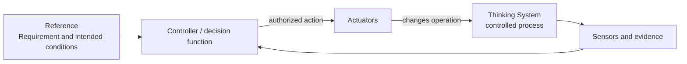

**Figure 6 — A closed feedback loop.** Evidence reaches a Controller / decision function and an authorized action changes the controlled process. Decision authority comes from the applicable authorized decision boundary; the Controller operates within that boundary rather than constituting its source. The figure deliberately does not yet claim that the loop operates inside a legitimate or adequately realized boundary.

A closed loop can still be unacceptable. It may optimize the wrong objective, react too slowly for the consequence, rely on evidence that misses the relevant failure, or possess authority that was never legitimately delegated. Its Actuator may be able to change a prompt but not prevent a transaction. It may keep an evaluator score inside tolerance while Human Authority, fallback capacity, latency, or unit economics collapse. Closing feedback is therefore weaker than bounding operation.

---

### Running Example | From Authority to a Complete Control Path

**Lens in this section:** how one refund-authority boundary becomes operational through Constraints, Sensors, Controller functions, Human Authority, and Actuators.

Take one boundary in the same support-resolution system: automated refunds are permitted only up to a delegated amount; above that amount, execution requires **Human Authority**. The important engineering object is not the sentence “large refunds require approval.” The control problem is whether that authoritative boundary survives the complete path from Model Judgment to downstream transaction.

The same boundary requires four distinct capability functions around it. They are parallel control functions, not an execution sequence:

**Constraint and Constraint Realization**
- Constraint: refunds above the delegated amount must not execute without Human Authority.
- Realization: transaction permission + amount precondition + valid approval state/token + rejecting endpoint.

**Sensors**
- attempted and blocked high-value refunds;
- approval outcomes and bypass attempts;
- realization health and downstream transaction result;
- Human Authority latency and capacity evidence.

**Controller**
- for a given refund attempt, interpret the relevant evidence against the applicable Constraint and determine the authorized response within its delegated decision boundary;
- where substantive judgment is reserved to Human Authority, select or authorize routing of the case and evidence to that authority rather than treating the Controller as the source of the authority itself;
- for accumulated evidence, select or authorize, within delegated authority, either narrowing or disabling runtime operation or routing the evidence for reassessment by the authority that owns the challenged decision basis.

**Actuators**
- block, route, narrow, disable, roll back, fallback, or compensate within delegated authority.

If any part is missing, the sentence “large refunds require approval” has not yet become a complete control path. A policy without a credible realization can be bypassed; a realization without evidence can silently degrade; evidence without a Controller able to interpret it and act within an authorized decision boundary is observation; a Controller without an effective Actuator cannot correct the system.

**What this adds to the case:** the refund rule is no longer only policy intent; the case now has the logical anatomy of a complete control path around that boundary.

---

The four capability families describe the logical functions needed to make such a boundary operational. The order below is a pedagogical traversal, not a mandatory execution pipeline or physical stack.

### Actuators and corrective action

An **Actuator** executes an authorized change in operation or in a Constraint Realization. It is the part of the control path that can actually make the system behave differently.

In the support system, Actuators may block a transaction, route a case to Human Authority, narrow autonomous scope, switch to a manual path, disable refund execution, roll back a model or configuration, or compensate downstream state. A feature flag, API call, workflow step, deployment action, or human intervention is an Actuator only when it provides a real path from an authorized decision to changed operation.

The distinction from decision authority matters. A Controller selects or authorizes a bounded response within delegated authority; an Actuator executes the authorized change. One component may perform both, but treating them as the same concept hides who may decide, who may execute, what happens when execution fails, and what evidence proves that the requested change actually occurred. A Controller without an effective Actuator can diagnose but cannot correct.

### Constraints and their realizations

A **Constraint** is an approved condition limiting the allowed operating space. A **Constraint Realization** is the technical or socio-technical mechanism through which that condition is implemented, enforced or influenced, evidenced, and operated for a defined scope. They belong to one capability family because either side alone is incomplete: policy without realization is intent; realization without an authoritative Constraint is mechanism without a defensible boundary. **Constraint Realization is not a fifth capability family.**

For the running example, an authoritative Constraint might state that refunds above the delegated amount must not execute without Human Authority. That statement is not yet a technical guarantee. A credible realization might combine transaction permissions, an amount precondition, an approval token or equivalent authorization state, and a transaction endpoint that rejects execution when the precondition is absent.

This is also where **Hard** and **Soft** must be separated carefully. A Hard Constraint is a scoped claim that the complete realized path deterministically prevents or rejects violation within stated assumptions, subject, path, scope, and enforcement boundaries. A prompt saying “never issue a refund above the threshold,” a natural-language policy, a model preference, or a probabilistic evaluator is not hard by itself. Those mechanisms may influence behavior, but they do not make the prohibited transaction unreachable.

Where a prohibited consequential state can feasibly be made unreachable through deterministic enforcement, deterministic realization should carry that boundary. Where deterministic prevention is not feasible, the remaining uncertainty should stay explicit rather than being renamed “Hard” because the business intent is important. The same business rule may therefore require separate records for a hard transaction boundary and a soft semantic boundary around customer communication.

### Sensors and evidence

**Sensors** produce evidence about behavior, outcomes, operating conditions, realization state, control health, Actuator execution, and the assumptions on which authorization depends.

For the refund boundary, useful evidence includes attempted and blocked high-value refunds, approval requests and outcomes, realization health, bypass attempts, downstream transaction results, false blocks, Human Authority queue size and latency, fallback load, and the state produced after an Actuator fires. Evaluators may also estimate semantic properties such as whether the model applied policy appropriately or whether a customer explanation is grounded.

A Sensor need not produce one objective truth value. Semantic acceptability may remain uncertain. Evidence must instead be fit for the decision it informs and expose coverage, uncertainty, latency, and blind spots. A detector that identifies a prohibited transaction only after settlement may be accurate and still be useless for prevention. An average-quality dashboard may be informative and still miss the low-frequency event that defines the relevant boundary.

Telemetry without a decision path is observation. Valuable observation is not yet control. An evaluator normally performs a Sensor function; logic that interprets its evidence and selects `block`, `canary`, or `release` performs a Controller function; the mechanism that applies that decision performs an Actuator function.

### Controllers and bounded decision functions

A **Controller** compares or interprets evidence relative to approved Requirements, Constraints, assumptions, and a defined decision boundary, then selects or authorizes action within delegated authority. What makes something a Controller is not intelligence, automation, a dashboard, or a job title. It is the control function that turns evidence into a bounded response decision. A Controller does not create its own authority: it may select or authorize action only within an applicable delegated boundary and must escalate reserved decisions to Human Authority or another authorized decision process.

In the running example, one Controller function may determine that a transaction cannot proceed automatically and must be routed to Human Authority. Another may decide, from repeated realization failures or abnormal financial behavior, that autonomous refund execution should be disabled or narrowed. The associated Actuator performs that change. A dashboard presenting the evidence is not itself the Controller.

Controllers are often socio-technical. Human decision authority may be combined with automated evidence collection, invariant checks, routing, decision support, and bounded automated decisions where delegation permits them. **Human Authority** is substantive only when the person has enough information, time, competence, capacity, independence, and power to change the outcome. An approval button attached to an overloaded queue is not a complete control path.

Automation should remove repetitive sensing, checking, routing, evidence aggregation, and safe bounded response where evidence quality, failure behavior, reversibility, and delegated authority make the automated path credible. Maximum automation is not an independent objective. Automated Controller and Actuator behavior is itself part of the control architecture: its decisions, configuration, latency, failures, execution, and resulting state must remain observable and correctable.

Read together, the four families form a bounded control relationship: Controllers turn evidence into bounded response decisions within delegated authority; Actuators execute authorized changes to operation or a Constraint Realization; Constraints define what changes and operating states are legitimate; Realizations enforce or influence those boundaries; Sensors expose behavior, outcomes, realization health, and action effects; evidence returns to Controllers.

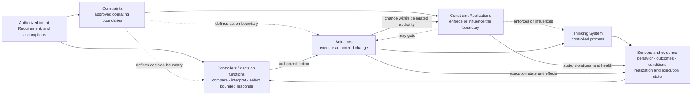

**Figure 7 — Complete bounded control architecture.** The four capability families are logical functions, not mandatory services, products, teams, layers, or one execution order. Realizations may act before, during, or after Model Judgment; Controllers and Actuators may be synchronous or asynchronous; one component may perform several functions.

This is the difference between a measured system, a closed feedback loop, and a bounded controlled system. The last requires not merely feedback but an approved and credibly realized operating boundary, evidence fit for the decisions being made, legitimate decision authority, effective corrective action, and a path for reassessment when the basis of control changes. Here, a **complete control architecture** means materially complete for the authorized scope, not maximal instantiation of every possible control mechanism or every cell in the later operating map.

What is often called AI governance is therefore not a fifth capability family and not a post-hoc checkpoint. Governance becomes operational through this socio-technical control architecture across the expanded control perimeter. Until material boundaries are credibly realized, required evidence can reach and inform legitimate decision authority, effective Actuators exist, Human Authority and fallback are viable where needed, and invalidated assumptions can trigger reassessment, the system may be demonstrable or testable but is not ready for production at the intended scope.

The capability anatomy explains **how** bounded control becomes possible. It does not yet determine **where** organizational authorization, project viability, delivery release, runtime correction, and reauthorization decisions belong. That is the role of the second model.

## 4. Four Decision Levels for Thinking Systems

The second model answers a different problem: **where does each consequential decision legitimately belong?** The same Thinking System may require an organizational permission decision, a project architecture and viability decision, a delivery release decision, and a runtime correction decision. Those decisions concern one controlled object, but they require different evidence, authority, time horizons, automation, and corrective actions.

The four levels below are therefore not four governance documents, four mandatory teams, or four approval meetings. They are **decision-ownership horizons** inside one socio-technical control system:

- **Organization** decides what may be authorized, which authority remains reserved, which shared capabilities and source obligations apply, and which exceptions are legitimate.
- **Project / Architecture** decides whether Model Judgment is necessary for the intended outcome and whether a credible, operable, economically viable controlled system can exist inside the organizational boundary.
- **Delivery** decides whether one bounded realization is ready to begin, complete enough to review, and acceptable for a specific deployment context.
- **Runtime** decides whether active operation remains inside the authorized boundary and which local response is permitted when evidence says that it does not.

One person may hold several of these responsibilities in a small organization. One automated platform may implement parts of several Controller functions. That does **not** collapse the decisions themselves. A runtime rollback is not Project Reauthorization; a successful build is not a Release Gate; Project Authorization does not create an organizational exception; an organizational policy does not prove that a concrete system is viable.

The decision-ownership model can therefore be shown on its own before it is combined with the capability anatomy from Section 3:

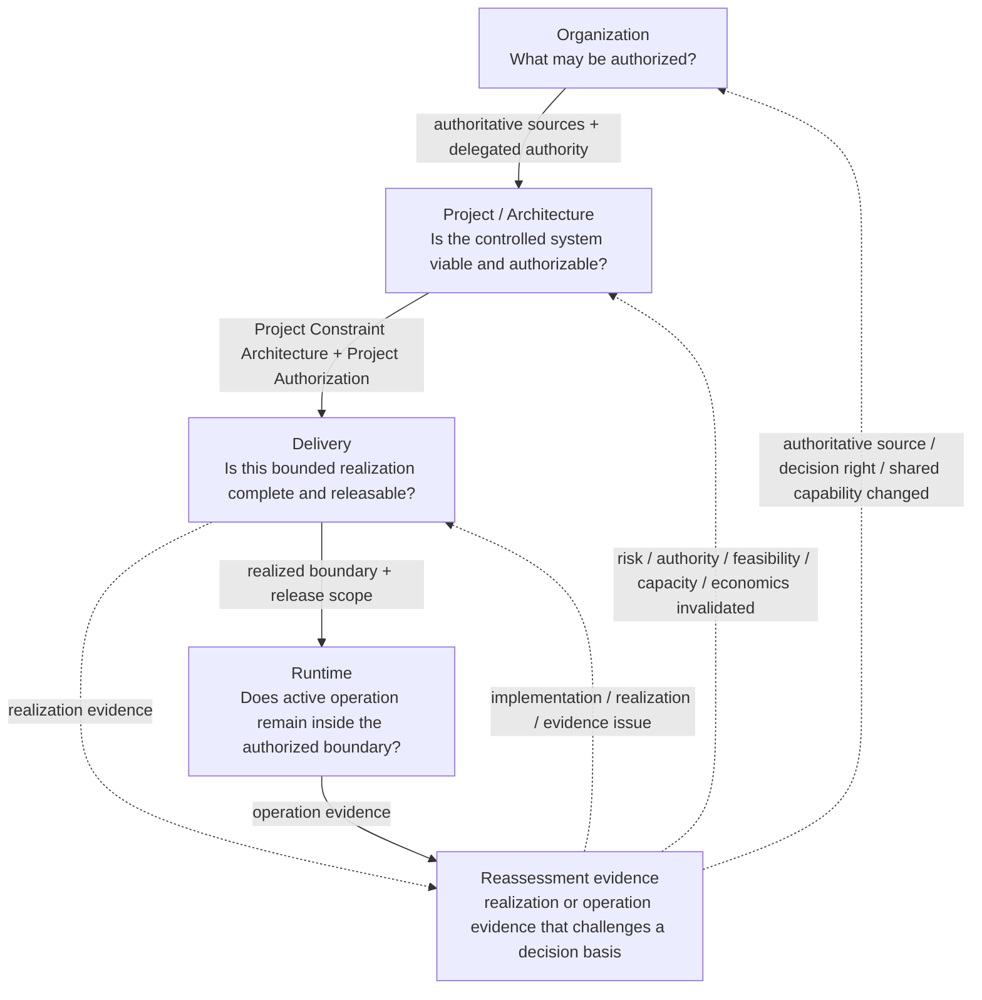

**Figure 8 — Four decision-ownership horizons around one controlled object.** Downward paths carry authoritative sources, delegated authority, architecture, release scope, and realized boundaries toward operation. Realization or operation evidence that challenges a standing decision basis becomes reassessment evidence and returns directly to the horizon that owns that basis; reassessment is therefore not a mandatory upward sequence and need not originate only at Runtime.

### Two orthogonal models

The standalone model above establishes **where consequential decisions belong**. Section 3 established a different structure: the capability functions required to make bounded control operational. The **decision horizons** answer *where a decision is owned*. The **capability families** answer *how boundaries, evidence, decisions, and actions become operational*. Every capability family may appear at every horizon; the models must not be mapped one-to-one. The next step is therefore to place the capability anatomy across the decision-ownership horizons rather than assign one family to one level.

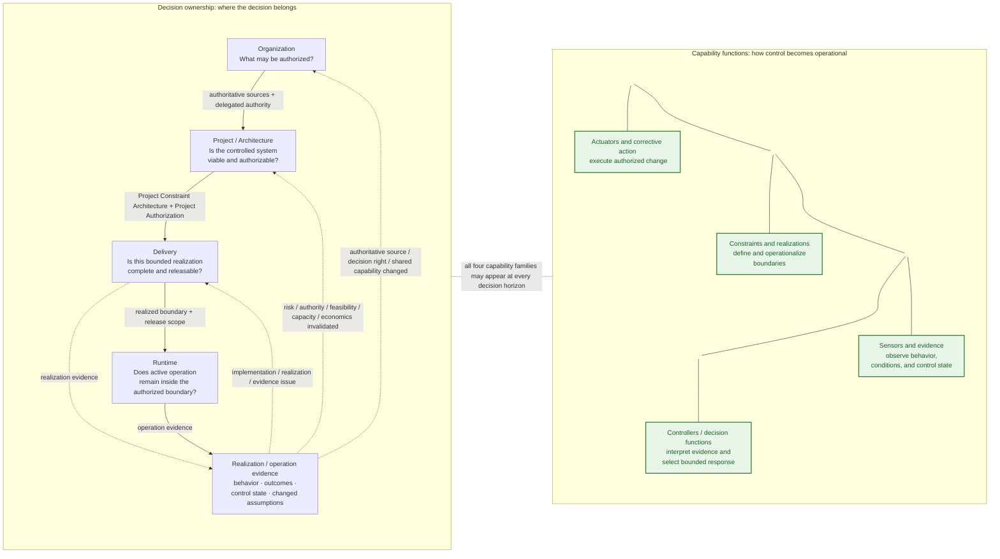

**Figure 9 — Two orthogonal models.** The left side reuses the four-horizon model introduced earlier: authority and Constraints become more concrete downward; reassessment evidence from realization or operation returns directly to the horizon whose decision basis it invalidates. The green side is the orthogonal capability anatomy. Its ordering is a reading aid, not a pipeline. All four capability families may appear at every horizon.

### The full map is a reasoning reference, not a maximum-process mandate

The complete map should be inspected before implementation depth is chosen:

```text
full map = inspect every decision horizon and capability family
implementation depth = proportionate to the actual controlled object
```

A low-consequence internal assistant with narrow authority, reversible effects, strong feedback, and simple fallback may require only a small explicit control surface, with the same people carrying several responsibilities. A system with broad downstream authority, weak reversibility, slow or uncertain evidence, expensive Human Authority, fragile fallback, or tight unit economics may require much more of the map to be explicit and operational.

The point of showing the whole map is therefore not to maximize governance. It is to **expose hidden complexity before deciding what can safely remain lightweight**. “One model call,” “one prompt,” “one feature,” or “one engineer” does not by itself imply a simple controlled object. The relevant dimensions are consequence, reachable authority and side effects, reversibility, Sensor quality and latency, Constraint Realization difficulty and bypass surface, Human Authority capacity, dependency fragility, and the cost of the control perimeter.

Production release at the intended scope requires the **relevant** decisions and capability functions to be connected across all four horizons at a depth proportionate to that consequence and control problem.

Each horizon below follows the same operating rhythm without turning it into an eight-box bureaucracy: **what activates the level; what authoritative basis and evidence enter; what decisions it owns; which control capabilities those decisions require; what flows downward; what evidence returns; what may be handled locally versus escalated; and what negative cases teach about the decision basis.**

### Organization — authorization context and reserved authority

**Question owned:** Within which authoritative boundaries, shared capabilities, and decision rights may a proposed project explore or operate?

Organization becomes active when a new use of Model Judgment is proposed, when a project asks for wider autonomy, data, geography, vendor, deployment mode, population, or downstream action capability, or when legal, contractual, security, privacy, procurement, audit, vendor, cross-project, or shared-capability evidence changes the basis on which projects were allowed to operate.

Its inputs are not one “AI policy.” They are the existing sources that legitimately constrain the system: contracts, law, security and privacy obligations, customer commitments, prohibited uses, approved vendors and deployment modes, data and geography restrictions, incident obligations, shared identity/audit/rollback capabilities, exception rights, and evidence from projects or operations that may invalidate those assumptions.

Organization owns **admissibility and reserved authority**. It may prohibit a use category, permit only bounded research, reserve certain decisions to Human Authority, require a shared capability, define who may grant an exception, or delegate a bounded decision to Project, Delivery, or Runtime. It does **not** own the project-specific conclusion that Model Judgment is necessary for one business outcome or that the resulting architecture is economically viable. Those are Project / Architecture decisions.

For every material organizational boundary, downstream engineering needs an operable relationship:

```text
authoritative source or organizational decision
→ scoped project Constraint or explicit assumption
→ required realization properties
→ evidence obligation
→ legitimate decision owner and expected decision latency
→ available exception, suspension, escalation, or reauthorization path
```

Organization does not need to design the concrete Sensor or transaction guard. It must make clear **which evidence and decision obligations Project / Architecture must make realizable**. An authoritative policy sentence is not automatically a Hard Constraint; guarantee strength still depends on the complete realized path.

The organizational Controller is a legitimate decision function, not a committee by definition. In one company it may be distributed across product, security, legal, operations, finance, procurement, architecture, and domain authority; in another, several of those responsibilities may sit with the same two people. Automation may track source versions, aggregate evidence, verify explicit policy-as-code conditions, route exceptions, or detect shared-capability degradation. It cannot invent authority that was never delegated.

Organizational Actuators operate on the **authorization context**: approve or deny eligibility, narrow or suspend a project, grant or reject a scoped exception, change an approved vendor or deployment mode, reserve a decision to Human Authority, require additional evidence, or fund, restrict, or withdraw a shared capability. These actions differ from a Runtime rollback even if the same person ultimately has permission to trigger both.

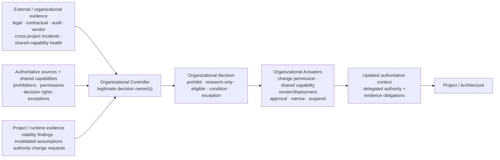

**Figure 10 — Organizational control process.** Authoritative sources provide the reference basis while external/organizational evidence and lower-level evidence converge on legitimate decision owners. The figure is a decision horizon and control relationship, not a required department structure or a claim that Organization directly performs downstream technical actions.

The running support system makes the boundary concrete. Organization might permit automated refunds only inside a delegated amount, require Human Authority above it, restrict which customer data can reach the model, and require use of approved identity and transaction capabilities. Project / Architecture must then decide whether a useful support system can actually be built and operated inside those limits.

Organization should be revisited when the **organizational basis** changes: an authoritative source, reserved decision right, exception authority, vendor/deployment permission, or shared capability changes or proves inadequate. A lower-level workaround cannot silently normalize an organizationally prohibited state. Repeated exceptions, cross-project incidents, or recurrent requests for the same workaround should also test whether the source is ambiguous, delegated authority is wrong, a shared capability is inadequate, or the organization is repeatedly admitting project classes whose control perimeter later proves unattractive.

### Project / Architecture — AI necessity, control architecture, and viability

**Question owned:** Does a credible, operable, and economically viable controlled system exist for the intended outcome inside the organizationally authorized boundary?

This horizon activates when Organization permits project assessment or bounded research, when Model Judgment is proposed inside an existing system, when a material Judgment Node, tool path, vendor, deployment mode, population, or authority boundary changes, or when Delivery/Runtime evidence invalidates project assumptions about risk, feasibility, evidence, Human Authority, capacity, or economics.

The first project decision is deliberately uncomfortable: **is Model Judgment necessary at all?** The comparison is not “AI versus no innovation.” It is between credible alternatives: deterministic logic, a manual path, a narrower model-assisted path, or a broader Thinking System. The relevant value is the value attributable to Model Judgment after the Constraints required to make it acceptable have narrowed autonomy, speed, data, tool access, or reachable actions.

If Model Judgment remains justified, Project / Architecture owns the concrete controlled-object model: intended outcome; system boundary and Judgment Nodes; reachable authority and consequences; material scenarios; Requirement and Operating Envelope; project Constraints; candidate Constraint Realizations and guarantee strength; Sensors and evidence feasibility; Controller authority; Actuator paths; Human Authority, fallback, containment, recovery, and shutdown; dependencies and shared capabilities; and the assumptions that would require Project Reauthorization.

For every material scenario, the project should be able to describe **at least one credible complete control loop** before a production path is authorized. This does not mean final configuration exists before implementation. It means the architecture is more than “we will add guardrails later.” If the system cannot detect the relevant failure before the consequence, cannot realize an inherited boundary at the claimed strength, lacks an effective corrective path, or requires Human Authority capacity the organization cannot supply, then the control architecture is not yet credible.

The business case must include the control perimeter from the beginning. The decision should consider five dimensions together rather than collapse them into one pseudo-precise score:

```text
expected value attributable to Model Judgment
considered against:
- solution lifecycle economics
- complete control-perimeter lifecycle economics
- residual exposure and uncertainty after control
- hard authorization constraints that cannot be traded away
→ authorize / narrow / bounded research / redesign / defer / No-Go
```

Solution lifecycle economics may include model, platform, data, integration, and ordinary operation. Control-perimeter economics may include Constraint design and realization, evaluations and evidence, Human Authority, fallback, observability, incident response, false blocks, control maintenance, reassessment, added latency, and control-specific operational friction. Residual exposure and uncertainty remain separate decision dimensions unless they are credibly translated into comparable expected-loss or range estimates. These are reasoning buckets, not a universal accounting standard.

A hard prohibition or missing authority cannot be averaged away by expected ROI. Conversely, control cost that destroys the business case is not “governance overhead” to be hidden after launch. It is evidence that the proposed architecture may be non-viable.

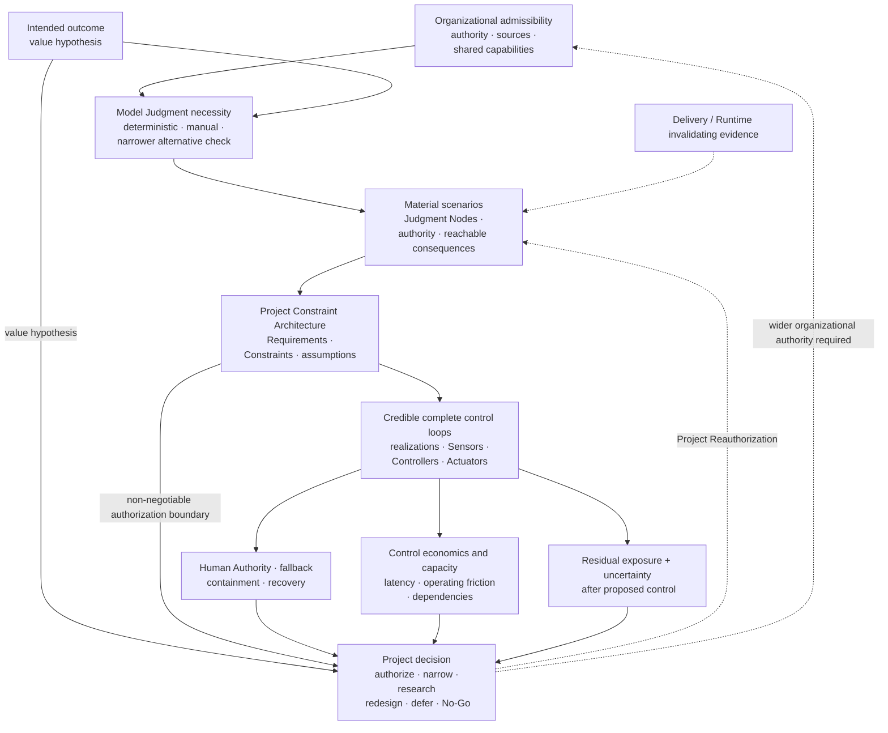

**Figure 11 — Project control architecture and viability.** Organizational admissibility becomes a concrete system decision only after AI necessity, material scenarios, complete control loops, Human Authority/fallback, capacity, and control economics are examined. Bounded research is a legitimate outcome; prototype success is not Project Authorization.

For the support system, this is where the refund boundary becomes a Project Constraint Architecture rather than a policy slogan. The project asks whether high-value refund execution can be made unreachable without valid Human Authority, what evidence verifies that realization, whether semantic policy application remains soft, whether the approval queue can absorb expected volume, and whether the combined latency and cost preserve the support business case.

The output is a **versioned Project Authorization and Project Constraint Architecture**. Delivery inherits it by reference and may refine or narrow the authorized scope. Delivery may not silently expand delegated authority or weaken an inherited Hard Constraint. Project Reauthorization is required when evidence changes the project basis—risk, authority, feasibility, evidence coverage, Human Authority, capacity, dependencies, or economics. If the required change exceeds organizational authority, Project escalates to Organization.

**Architectural Veto is a valid engineering result.** A system can be impressive as a prototype and still deserve deterministic redesign, narrower scope, further research, deferral, or No-Go. Repeated Delivery or Runtime workarounds should be treated as evidence against the project model when they expose a missing scenario, non-credible Constraint, weak Sensor basis, ineffective Actuator, unrealistic Human Authority capacity, or invalid control economics rather than as an endless queue of local defects.

#### Designing the control architecture

This is work **inside** the Project / Architecture horizon, not a fifth level. Architectural analysis locates Model Judgment, the deterministic responsibilities around it, reachable tools and consequences, and scenarios that could produce unacceptable outcomes. It then derives the required Constraints, candidate realizations, Sensors, Controller decisions, Actuator paths, Human Authority, fallback, containment, recovery, and reassessment mechanisms.

Sensor design must match the property being controlled. Machine-checkable evidence can verify schema, type, permissions, tool arguments, state transitions, resource limits, and other deterministic conditions. Semantic evidence may estimate grounding, relevance, harmfulness, factual support, policy meaning, or business acceptability. Semantic Sensors remain probabilistic; they should expose coverage, uncertainty, latency, and blind spots rather than being treated as oracles.

Human Authority, where required, is part of the architecture: information available, decision right, expertise, time, expected volume, fatigue, independence, escalation authority, overload behavior, and what happens when the human path is unavailable all affect viability.

### Delivery — realization, evidence, and release

**Question owned:** Is this bounded realization complete, evidence-bearing, operationally supportable, and acceptable for a specific deployment context under Project Authorization?

Delivery activates when Project authorizes bounded implementation or research, when a material model/prompt/context/retrieval/tool/evaluator/realization/configuration change enters scope, when a new deployment population or environment is proposed inside existing authority, or when Runtime exposes a local defect or evidence gap that Delivery is authorized to repair.

Delivery receives a project baseline rather than a blank page: Project Authorization, Project Constraint Architecture, inherited Constraints and assumptions, Judgment Nodes, required realization properties, evidence obligations, shared-capability dependencies, delegated authority, reauthorization triggers, and a control-economics baseline. Its job is to turn those decisions into a **concrete bounded realization** and prove enough about that realization for the next decision.

The delivery team therefore needs to translate in both directions. Business statements such as unacceptable financial exposure or customer-trust risk must become scoped scenarios, Constraints, evidence needs, authority boundaries, and response paths. Technical evidence such as evaluator regression, version drift, override rate, fallback saturation, denied-action events, realization degradation, or Human Authority latency must be translated back into changed exposure and decision consequences.

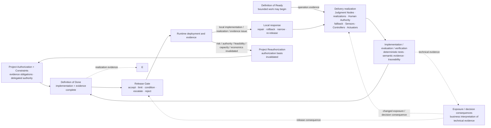

**Figure 12 — Delivery realization and release loop.** Delivery translates the project authorization into one bounded realization, while the dotted translation path converts technical evidence back into changed business exposure and decision consequences. That translation informs engineering and release decisions; it is not an additional gate or execution stage. Local repair remains distinct from Project Reauthorization.

Three decisions must remain distinct even when one lightweight workflow carries all three.

**Definition of Ready** asks whether bounded work or an experiment may begin. Authority, scope, Judgment Nodes, required realizations, evidence plan, Human Authority, fallback, assumptions, and escalation path must be explicit enough to proceed.

**Definition of Done** asks whether implementation and evidence are complete for the reviewed scope. Required paths are covered; unavailable, bypass, and degraded behavior are tested; active versions are traceable; required Sensors and Actuators operate; and known gaps are visible.

**Release Gate** asks whether this specific deployment should be accepted, limited, conditioned, escalated, or rejected for its population, environment, active versions, evidence, residual exposure, capacity, economics, and operational readiness. Passing DoD does not force a release decision.

Automation can carry repeatable invariant checks, tests, evaluations, evidence aggregation, version comparison, routing, policy-as-code checks, blocked-action verification, release-condition checks, and safe bounded Actuation when those mechanisms are observable, reversible, and inside delegated authority. Human decision owners retain contextual release acceptance, bounded engineering judgment, and residual-risk acceptance within delegated release authority; changes to project architecture or authority must be escalated to Project / Architecture or Organization as appropriate.

For the support system, Delivery implements the actual refund guard, authorization state, evaluator suite, approval routing, fallback, telemetry, and rollback/disable paths; verifies bypass behavior; records active versions; and tests whether the human queue can meet the latency assumed by Project. If implementation discovers that the claimed Hard path can be bypassed or that approval capacity destroys the assumed service target, that is not merely “QA feedback.” It may invalidate Project Authorization.

Delivery may repair, reconfigure, roll back, narrow exposure, disable, or re-release within delegated authority. It may not silently expand project authority, weaken an inherited Hard Constraint, change an organizational prohibition, or normalize evidence that project viability has failed. Material negative cases should improve the weakest delivery control element and its verification—Sensor coverage, Constraint clarity, realization integrity, Controller logic or latency, Actuator effectiveness, Human Authority, automation, deterministic validation, or version traceability—rather than defaulting to prompt tuning because the model produced the visible symptom.

### Runtime — operation, correction, and reassessment

**Question owned:** Does active operation remain inside the authorized Requirement, Constraint baseline, authority, capacity, and economics, with required realizations active and healthy—and what response is authorized when it does not?

Runtime is continuously active while the Thinking System operates. Specific Controller decisions are activated by Sensor evidence: prohibited or unusual behavior, realization degradation or bypass, version mismatch, drift, downstream outcomes, complaints, Human Authority overload, fallback saturation, cost or latency thresholds, failed Actuators, incidents, or evidence that an authorization assumption is false.

The controlled object at runtime is still the **whole socio-technical system**, not the model response. Evidence may include model behavior and downstream outcomes; model, prompt, retrieval, context, tool, evaluator, realization, and deployment versions; authorization failures; semantic and deterministic evidence; complaints and overrides; Human Authority capacity; fallback load; cost and latency; incident state; Actuator execution; and whether the corrective action produced the intended resulting state.

A signal becomes control-relevant only when it is connected to a decision boundary. For material evidence, the system should know the intended consumer, coverage and uncertainty, expected decision latency, responsible Controller, available Actuator, and escalation or reassessment route. A dashboard that aggregates signals without those connections remains an observability surface.

Runtime may automate control as far as evidence quality, consequence, failure behavior, reversibility, and delegated authority make credible. Deterministic permission checks, rate limits, circuit breakers, fallback selection, exposure narrowing, or rollback may be automated. Semantic interpretation, ambiguous exception decisions, or expansion of authority may still require Human Authority or an earlier decision horizon. Automation does not create authority simply because it can execute an action.

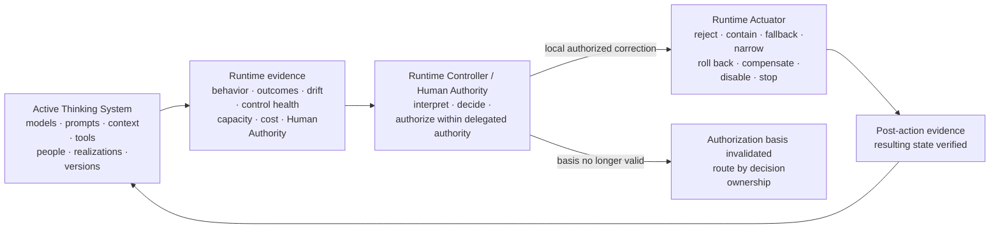

**Figure 13 — Runtime control and reassessment.** Runtime control covers the active socio-technical system and verifies the result of corrective action. When the authorization basis is invalidated, the exit routes by decision ownership; Figure 14 resolves the concrete destination. Local response may restore a previously authorized state; it does not authorize redesign or wider authority.

The key distinction is **restoration versus redesign**. Blocking a transaction, narrowing exposure, switching to fallback, rolling back, or disabling a feature may restore a known authorized state. Persistent drift, degraded Human Authority, invalid Sensor assumptions, recurring realization failure, new reachable consequences, or broken control economics may show that there is no authorized state to “tune back to” without revisiting an earlier decision.

Evidence routes according to the **decision basis it invalidates**, not according to where the signal first appeared:

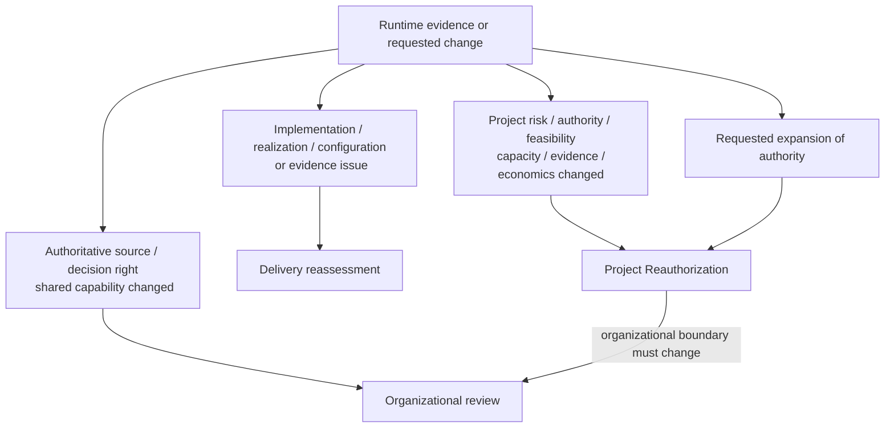

**Figure 14 — Evidence and change routing.** The destination follows the challenged decision basis. This avoids both escalation theater—where every runtime defect becomes a governance meeting—and silent authority drift—where repeated local fixes gradually redesign the project in production.

---

### Running Example | One Refund Case Across Four Decision Horizons

**Lens in this section:** who owns the standing decision bases around the same controlled object, and where runtime evidence belongs when one of those bases is challenged.

The same support system is governed by four standing decision bases. Assume it may execute refunds automatically only up to **€50**, while larger refunds require Human Authority. A single runtime event does not activate all four horizons. Instead, it produces evidence that must be routed to whichever horizon owns the decision basis that evidence challenges.

| Horizon | Standing question / decision basis | Illustrative decision owner | What that horizon may decide |
|---|---|---|---|
| **Organization** | May this class of system ever exercise refund authority, and what authority must remain reserved? | The organizational authority that legitimately owns the commercial, financial, customer, security/privacy, or exception boundary; several bundles may sit with the same person in an SMB. | Permit, prohibit, condition, or change delegated refund authority; define reserved Human Authority and evidence obligations. |
| **Project / Architecture** | Is Model Judgment justified for this resolution path, and can a credible control perimeter keep the system inside the organizational boundary at viable cost and capacity? | Product/architecture/engineering decision authority operating inside the organizational boundary. | Project Authorization, Project Constraint Architecture, narrower scope, bounded research, redesign, defer, or No-Go. |
| **Delivery** | Has the €50 boundary actually been realized and evidenced for this release, and is this deployment acceptable? | Delivery/release decision authority within Project Authorization. | DoR/DoD/Release decisions; repair a bypassable guard, improve evidence, narrow the release, or escalate when the project basis is invalid. |
| **Runtime** | Does active operation remain inside the authorized refund boundary, and what correction is authorized locally? | Runtime Controller and, where required, Human Authority within delegated authority. | Block, route, verify resulting state, narrow/disable/rollback locally, or emit reassessment evidence. |

Now apply one concrete runtime event to those standing decision bases. Suppose the model selects or proposes a **€450** refund and the workflow reaches the transaction-authority check.

- If the €450 transaction is deterministically blocked and the case is routed correctly, the deterministic transaction guard preserved the authorized boundary; the event is Runtime evidence and no higher-level reassessment is implied.
- If one release contains a bypassable amount precondition, the evidence belongs to Delivery reassessment; Delivery may repair and re-release **if** the authorized architecture remains credible.
- If repeated evidence shows that no available realization can make the required transaction boundary credible, or that Human Authority capacity cannot meet the Project assumption, the evidence challenges a Project / Architecture decision basis and requires **Project Reauthorization**.
- If the business wants to raise the delegated threshold beyond the organizationally reserved limit, the project cannot grant that authority to itself; the request must return through Project / Architecture to Organization.
- If abnormal refund patterns or repeated exceptions reveal that the organizational source, delegated decision right, or shared capability itself is wrong, Organization owns that reassessment.

The point is not that one incident traverses four horizons. The four horizons maintain different standing decision bases around the same controlled object; a concrete event activates local control and only the reassessment path required by the basis its evidence invalidates.

**What this adds to the case:** the same €50/€450 refund boundary now exposes standing ownership across the four horizons and routes reassessment by the decision basis that evidence invalidates.

---

### Cross-level operating discipline — learn from negative cases without turning every deviation into governance

The Nested Control Lifecycle already establishes downward inheritance, local reassessment, Project Reauthorization, and Organizational review. The following learning discipline is a **publication-facing operating hypothesis under validation**, not a claim that UA has already empirically proven a universal stabilization law.

First, **measure for decisions, not dashboards**. Every material control claim or decision basis should be observable enough for its Controller to decide inside the consequence-relevant time horizon. Evidence needs a consumer, decision boundary, latency expectation, coverage, uncertainty, and known blind spots. More Sensors are not automatically better.

Second, **treat a negative case as evidence requiring diagnosis, not as a diagnosis by itself**. A bad output, near miss, denied action, complaint, realization failure, false block, Actuator failure, Human Authority overload, fallback saturation, cost break, or violated assumption may later be classified as a Bug, Constraint violation, realization defect, accepted residual behavior, false positive, capacity problem, changed assumption, or something else. It should route to the horizon that owns the affected decision basis.

Third, **analyze control failure, not only model failure**. For a material negative case ask:

```text
Did the Sensor fail to observe, or observe too late?
Did the Constraint fail to express the needed boundary?
Did the Constraint Realization fail, degrade, or permit bypass?
Did the Controller have the wrong evidence, rule, authority, or latency?
Did the Actuator fail to execute or verify correction?
Did Human Authority lack information, time, capacity, independence, or power?
Did automation introduce hidden failure, coupling, latency, or false confidence?
Was the project scenario, assumption, dependency, or economics wrong?
Was the organizational source, decision right, or shared capability wrong or changed?
```

The visible model output is only one possible failure location.

Fourth, **improve the weakest control element and its evidence**. Corrective learning may change Sensors, Constraints, realizations, Controller logic, Actuators, Human Authority, fallback, automation, project assumptions, tests/evaluators, delegated authority, shared capabilities, or project economics. Repeated prompt tuning should not be the default response simply because the model produced the visible symptom.

Fifth, **prefer deterministic prevention for prohibited states where feasible**, and automate control work only when the automated path is itself controllable. Repetitive sensing, invariant checks, evidence aggregation, routing, version comparison, alerting, decision support, and safe bounded Actuation are good automation candidates when evidence quality, failure behavior, reversibility, consequence, and delegated authority make them credible. Automated decisions and actions must themselves expose health, configuration, failures, and resulting state.

The stabilization objective is not zero variance from Model Judgment. It is progressive reduction of **uncontrolled or poorly understood recurrence**: make important failures structurally impossible where feasible, detect them earlier, route them faster, reduce consequence through narrower authority, improve corrective reliability, lower recovery cost, or revise the authorization basis when the original system model was wrong.

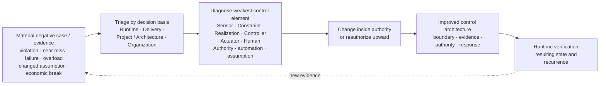

**Figure 15 — Cross-level learning and stabilization loop.** Negative cases route to the horizon that owns the failed decision basis, then improve the weakest control element or trigger reauthorization. The figure does not imply that every case escalates, that every deviation is a Bug, or that stabilization is already empirically validated across real systems.

The four horizons therefore form a nested lifecycle rather than a waterfall. Higher-level authority and Constraints flow downward by reference and become more concrete in Project, Delivery, and Runtime realization. Evidence flows upward when it invalidates an earlier basis. Lower levels may refine and narrow. They may not silently expand authority, weaken an inherited Hard Constraint, or normalize evidence that the earlier authorization is no longer valid.

> **Lower levels may refine and narrow a higher-level decision. They may not silently expand its authority or normalize evidence that invalidates it.**

> **A decision owner that receives no fit-for-purpose evidence is authority on paper, not an operational Controller.**

> **The complete map should be inspected even when implementation is deliberately lightweight; proportionality is justified reduction, not permission to ignore complexity that is actually present.**

The capability anatomy and the four decision horizons now define the conceptual operating map. The next practical question is not which UA form a team must fill in. It is **how much of this map must be made explicit for this controlled object, and which existing engineering and organizational mechanisms can carry those decisions without overbuilding the process?**
