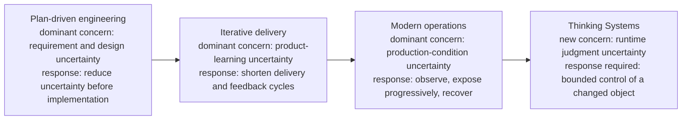
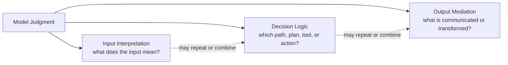
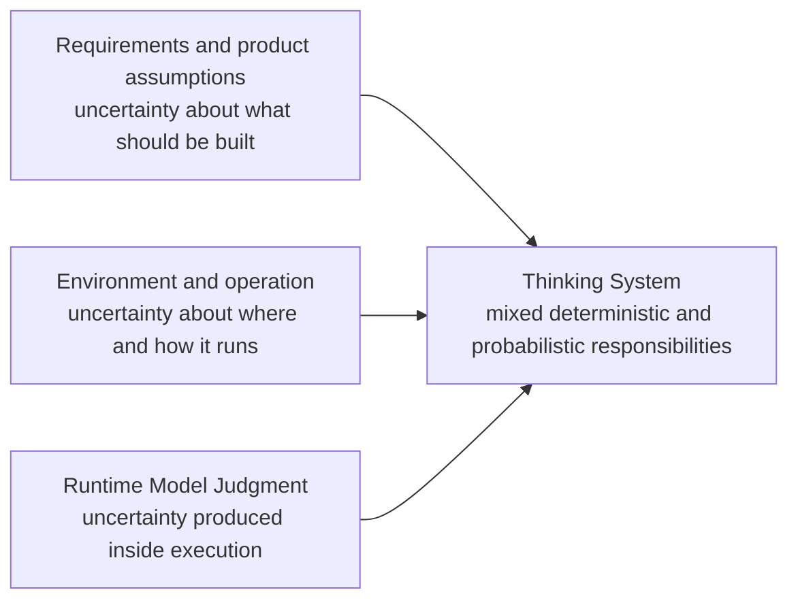
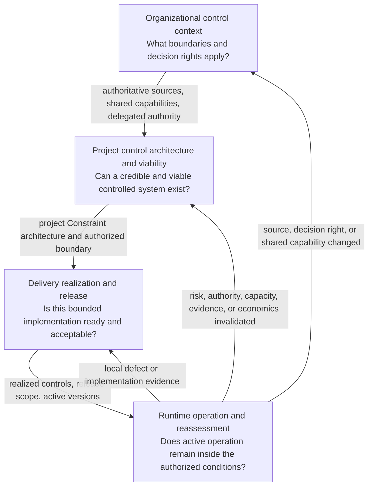

# Uncertainty Architecture: An Open Engineering Specification for Thinking Systems

*From the Controlled-Object Shift to Bounded Control*

> **Draft status:** This article is being developed section by section from the repository's current draft specification. It is not itself a normative specification source.

## Abstract

Software engineering repeatedly expands when an important source of uncertainty can no longer be contained by the assumptions of the previous engineering model. Up-front planning attempts to reduce uncertainty before implementation. Iterative delivery accepts that product understanding changes through use and shortens the distance to feedback. Modern operations accepts that production conditions cannot be reproduced exhaustively before release and extends engineering into runtime through observability, progressive delivery, and recovery.

Thinking Systems introduce a further shift. Consequential uncertainty no longer arises only from requirements, implementation, users, infrastructure, or the operating environment. Part of it is produced inside the controlled object through probabilistic Model Judgment. A system may interpret ambiguous input, rank alternatives, construct a plan, select a tool, or mediate what a person sees next without that behavior being fully enumerated in deterministic logic.

Once the controlled object changes, every decision concerned with controlling it must be reconsidered. Organizational boundaries, project viability, architecture, delivery readiness, release, runtime operation, and reauthorization become connected control problems operating at different scopes and time horizons. Evaluation, observability, policy, human approval, and orchestration remain useful, but none is sufficient when disconnected from approved Constraints, concrete Constraint Realizations, decision authority, corrective action, and reassessment.

This paper develops the current architectural spine of Uncertainty Architecture: an open, tool-neutral draft specification for connecting those responsibilities. It distinguishes four control-capability families from four decision levels and provides a proportional operating path for small and medium-sized teams. The framework is coherent enough to apply, criticize, and test. It is not yet mature enough to claim universal sufficiency, broad independent validation, or standard status.

## 1. Engineering Evolves Around Dominant Uncertainty

Software-engineering methods are often discussed as competing schools: planning versus iteration, development versus operations, process versus autonomy. That framing hides a more useful pattern. Major engineering approaches tend to expand around the forms of uncertainty that the previous operating model could not manage well enough.

The pattern is not a clean historical sequence, and none of the approaches below is reducible to one idea. Waterfall, Agile, and DevOps each include diverse practices, interpretations, and institutional histories. The comparison here is narrower: each can be read as a characteristic response to a different location of uncertainty and feedback.

Plan-driven development treats significant requirement and design uncertainty as something to reduce before implementation. The engineering response is analysis, decomposition, specification, approval, and planned execution. This is rational where the problem can be understood sufficiently in advance, the cost of change is high, and late feedback is dangerous.

Iterative product development starts from a different limit: important requirements often cannot be stabilized through analysis alone because users, markets, and teams learn by interacting with working software. The response is not to abandon planning, but to shorten the cycle between assumption, delivery, use, and revision. Feedback moves closer to implementation and becomes part of the product-development mechanism.

Modern operations exposes another limit. Even a well-understood feature cannot be exhaustively validated against every production combination of traffic, infrastructure, device, operating system, dependency, configuration, user behavior, and failure condition. Engineering therefore extends beyond release. Telemetry, progressive delivery, canary exposure, rollback, resilience, and incident response make production behavior part of the evidence used to operate and improve the system.

Thinking Systems add a distinct source of uncertainty. The uncertainty is not only in what should be built or in the environment in which software runs. It also appears in the runtime selection of behavior inside the software boundary.



**Figure 1 — Engineering responses expand as consequential uncertainty moves closer to runtime and eventually enters the controlled object.** The diagram is a conceptual progression, not a claim that one methodology replaces another or that each approach has only one purpose.

The location of feedback changes with the problem.

| Characteristic engineering response | Uncertainty emphasized | Primary mechanism | Where decisive feedback appears |
|---|---|---|---|
| Plan-driven development | Requirements, design, coordination | Analysis and planning | Primarily before and during implementation |
| Iterative product delivery | Product understanding and value | Short delivery and learning cycles | Between iterations and releases |
| Modern operations | Production conditions and system behavior | Runtime telemetry, progressive exposure, and recovery | During operation |
| Thinking-System control | Probabilistic runtime judgment and its consequences | Bounded authority, evidence, correction, and reassessment | Inside and around the active controlled object |

The table does not imply that requirement uncertainty disappeared after Agile or that operational uncertainty began with DevOps. The point is cumulative. Each engineering expansion preserves earlier responsibilities while adding mechanisms for uncertainty that became too important to leave outside the engineering model.

That cumulative view matters. A Thinking System still requires product discovery, deterministic software engineering, testing, security, deployment discipline, observability, and incident response. The new problem does not invalidate those practices. It changes what they are controlling.

> **Previous engineering methods learned to manage uncertainty surrounding software. Thinking Systems require engineering to manage consequential uncertainty produced by the software itself.**

This statement is narrower than saying that conventional software is certain or that models are random boxes. Traditional systems can be nondeterministic because of concurrency, distributed execution, timing, hardware, external services, or environmental state. Thinking Systems are different because probabilistic judgment is deliberately introduced to perform part of the system's consequential interpretation, decision, planning, generation, routing, or action selection.

The variance is not merely an implementation defect. It is often the capability being purchased. If every acceptable response could be enumerated cheaply and reliably, Model Judgment might not be needed.

The next question is therefore not how to eliminate all variance. It is what happens to engineering when useful probabilistic judgment becomes part of the controlled object.

## 2. The Controlled Object Has Changed

A controlled object is the thing whose behavior engineering seeks to keep within acceptable conditions. In software, that object is never only source code. It includes deployed components, data, configuration, dependencies, users, infrastructure, operational processes, and the effects the system can create.

Thinking Systems change this object by placing consequential Model Judgment inside it.

A responsibility implemented through explicitly encoded deterministic logic is designed to behave as:

```text
y = f(x)
```

This is a design-contract distinction, not a claim of perfect physical repeatability. The intended mapping is explicitly encoded, inspectable, and testable against specified conditions.

A model-mediated responsibility behaves more like:

```text
y ~ P(y | x, context, model configuration, system state)
```

For the same apparent request, plausible behavior may vary with context, model version, instructions, retrieval results, tools, configuration, prior interaction, data distribution, or operating conditions. The system does not merely execute a fully enumerated decision. It selects or constructs an outcome from a set of plausible outcomes.

The architectural difference can be shown without pretending that conventional software consists of one linear function or that every Thinking System follows one pipeline.

```mermaid
flowchart TB
    subgraph A["Primarily explicitly encoded runtime responsibility"]
        A1[External input and operating conditions]
        A2[Deterministic decision and action responsibilities]
        A3[Output, action, or downstream state]
        A1 --> A2 --> A3
    end

    subgraph B["Thinking System boundary"]
        B1[External input and operating conditions]
        B2[Deterministic responsibilities]
        J1["Judgment Node<br/>probabilistic Model Judgment"]
        B3[Deterministic validation, authority, and execution]
        J2["Optional additional<br/>Judgment Node"]
        B4[Output, action, or downstream state]

        B1 --> B2 --> J1 --> B3 --> B4
        B3 -. optional composition .-> J2 -.-> B4
    end
```



**Figure 2 — The controlled-object shift.** A Thinking System remains a mixed system. Deterministic responsibilities remain before, between, and after Judgment Nodes. Judgment Nodes may be absent, repeated, or combined; the diagram is illustrative rather than a prescribed execution topology.

Model Judgment can affect the workflow through several functional placements.

**Input Interpretation** converts ambiguous, unstructured, incomplete, or context-dependent input into a representation the rest of the system can use. It may affect what the system believes the user requested, which entities matter, which policy or context is relevant, and which deterministic path becomes available.

**Decision Logic** influences or selects a route, ranking, plan, priority, tool, or action. It may recommend an action, choose among bounded alternatives, or initiate a step only where the surrounding authority boundary permits it.

**Output Mediation** creates, adapts, filters, summarizes, explains, or transforms information for a person or downstream system. Even when underlying data remains unchanged, mediation can alter what someone understands, trusts, approves, discloses, or does next.

These are placement functions, not a mandatory three-stage architecture.



**Figure 3 — Functional placement of Model Judgment.** The classes identify what judgment changes in a workflow. They do not prescribe order, topology, consequence, authority, or risk.

The useful variance created by these placements cannot be governed by treating every output difference as a defect. A Requirement for a Thinking System usually defines acceptable conditions, prohibited states, tolerances, authority boundaries, and expected outcomes rather than one exact output for every possible input.

Engineering must therefore preserve two truths at once:

1. useful judgment is the reason the model-mediated responsibility exists;
2. consequential deterministic responsibilities must remain explicit.

A model may interpret a request, but deterministic identity and permission checks may still decide which data is reachable. A model may recommend an action, while a deterministic boundary prevents execution outside an authorized tool set. A model may draft a customer response, while outbound send authority remains reserved to a human-operated path. A model may estimate semantic acceptability, while a release decision and the mechanism executing that decision remain separate responsibilities.

This mixed structure is why model quality alone is insufficient. Evaluation may estimate whether behavior is useful or acceptable. It does not, by itself, define which states are prohibited, establish who may accept residual risk, restrict reachable authority, execute rollback, or determine when the original project should be reconsidered.

The uncertainty has moved, but it has not replaced earlier uncertainty.



**Figure 4 — Three connected uncertainty locations.** Product methods, software engineering, DevOps, resilience, and incident response remain necessary. Thinking-System control adds explicit treatment of runtime judgment uncertainty and connects it back to earlier decisions.

The consequence is not merely that AI is harder to test. Part of the controlled object's consequential behavior is now produced through runtime judgment. Once that happens, every decision that authorizes, shapes, releases, or operates the object must account for that change.

## 3. One Control Problem Across Multiple Decision Horizons

A runtime model call is the lowest visible point of the problem, but the control problem does not begin or end there.

The organization determines which authoritative boundaries, shared capabilities, prohibited uses, and decision rights apply. A project decides whether a proposed use of Model Judgment can be made technically credible, operationally supportable, and economically viable. Architecture allocates judgment, deterministic responsibility, evidence, authority, and corrective mechanisms across the system boundary. Delivery realizes those decisions for a bounded change and decides whether the resulting system is ready to release. Runtime operation determines whether active behavior remains within the conditions under which it was authorized and routes invalidating evidence back to the level that owns the affected decision.

These activities use different evidence, participants, time horizons, and actions. They are not interchangeable. An operational controller cannot silently rewrite an organizational prohibition. A release gate cannot expand project authority. A project decision cannot claim a Hard Constraint without a complete realized path. An organizational policy does not become an operable boundary merely because it is authoritative.

Yet the levels are structurally connected because they control the same object.



**Figure 5 — One controlled object across four decision horizons.** Authority and Constraints flow downward by reference and become more concrete in realization. Evidence flows upward when it invalidates the basis of an earlier decision.

At each level, the concrete subject changes, but a recurring control structure appears:

```text
What outcome or condition is intended?
→ What operating space is acceptable?
→ What uncertainty or disturbance can move the object outside it?
→ What evidence reveals behavior, outcome, conditions, and control state?
→ Who or what may decide that action is required?
→ Which mechanism can change operation?
→ When does new evidence require reassessment at this or an earlier level?
```

This recurrence is the bridge to control theory. The claim is not that organizations, projects, delivery teams, and runtime services are equivalent to one mathematical controller. Nor is the claim that social authority, legal interpretation, business viability, and model behavior can be reduced to a single error signal.

The useful transfer is structural. Bounded control requires an intended condition, an approved operating space, evidence about the controlled process, decision authority, a path to corrective action, and a mechanism for revisiting assumptions when the control basis changes.

Applied to a socio-technical system whose controlled object contains probabilistic Model Judgment, that structure produces different but connected engineering forms:

- organizational boundaries and delegated authority;
- project-level viability and control architecture;
- architectural placement of Judgment Nodes, deterministic responsibilities, evidence, and action paths;
- delivery-level readiness, completeness, and release decisions;
- runtime sensing, decision, correction, containment, fallback, escalation, and reassessment.

These are not independent governance practices assembled around AI. They are level-specific realizations of one control problem.

This observation explains both the scope and the restraint of Uncertainty Architecture. UA does not attempt to replace product discovery, software architecture, Agile delivery, DevOps, QA, security, resilience, incident response, legal review, or organizational governance. It specifies the connections those disciplines need when probabilistic judgment becomes consequential inside the controlled object.

The remainder of this paper develops that specification through two orthogonal models:

1. **control-capability families**, which identify the functions needed to define boundaries, produce evidence, decide, and act;
2. **decision levels**, which identify where authorization, realization, release, runtime correction, and reassessment are owned.

The next section begins with the first model. A system may be measured without being controlled, and a feedback loop may be closed while the system remains unsafe, over-authorized, operationally fragile, or economically irrational. The relevant question is therefore not only whether feedback exists, but whether operation is bounded by approved Constraints, credible realizations, fit-for-purpose evidence, legitimate decision authority, and effective corrective action.

## 4. From Model Quality to Bounded Control

*Draft pending in the next article block.*

## 5. Four Decision Levels of Uncertainty Architecture

*Draft pending in the next article block.*

## 6. From Authority to Operation: Two Living Reviews

*Draft pending in a later article block.*

## 7. One Constraint Across the Full Lifecycle

*Draft pending in a later article block.*

## 8. What Platforms Can Implement — and What Authority They Do Not Acquire by Default

*Draft pending in the final article block.*

## 9. Open Specification: Current State, Limits, and Invitation

*Draft pending in the final article block.*
