# Uncertainty Architecture: Engineering Thinking Systems with Consequential Runtime Responsibilities

## Abstract

Software engineering repeatedly expands when an important source of uncertainty can no longer remain outside the engineering model. **Plan-driven development (including Waterfall)** attempts to reduce requirement and design uncertainty before implementation. **Iterative delivery (including Agile and related approaches)** accepts that product understanding changes through use and shortens the distance to feedback. **Modern operations (commonly associated with DevOps)** accepts that production conditions cannot be reproduced exhaustively before release and extends engineering into runtime through observability, progressive delivery, and recovery.

This paper makes **Thinking Systems** explicit as an engineering category: software systems in which one or more **Consequential Runtime Responsibilities** depend partly on probabilistic Model Judgment rather than being fully specified through explicitly encoded logic in advance. The current definition is written without an LLM-only condition, but whether that breadth remains coherent with the paper's release-contract thesis is still under validation—especially for fixed learned models whose deployed mapping may be fully determined before release. Particular pre-LLM systems therefore remain boundary tests rather than established members. General-purpose generative models have made model-mediated interpretation, generation, routing, planning, and action selection much easier to embed across ordinary software. The term names the changed engineering object, not a maturity level or architecture style. Fixed or dynamic orchestration, agent labels, autonomy, and delegated authority are separate dimensions; a simple predefined workflow can already be a Thinking System when at least one **Consequential Runtime Responsibility** depends partly on probabilistic Model Judgment.

For the motivating class developed in this paper—systems in which Model Judgment leaves part of a Consequential Runtime Responsibility unresolved until operation—consequential uncertainty moves inside the controlled object. For that class, model quality and observability are no longer sufficient descriptions of the engineering problem. Whether the broader current Thinking-System definition should also include fixed learned probabilistic functions whose deployed mapping is determined before release remains under validation (`TS-SCOPE-001`). A Thinking System is not ready for production at the intended scope while any material control responsibility remains unowned, unrealized, insufficiently evidenced for its decision, or without a credible corrective or reassessment path—even when the model and code pass local tests. Category membership does not prescribe a maximal control stack: implementation depth remains proportionate to consequence, authority, exposure, reversibility, evidence latency, Human Authority load, and control economics. Governance becomes operational through the active socio-technical control architecture spanning organizational authority, project and architecture viability, delivery realization and release, and runtime operation and reassessment. This paper derives a control-capability and decision-horizon model for reasoning about that architecture, explains how to apply the complete map proportionally, examines adjacent methods, tools, standards, and regulation through a substitution analysis, and situates that research synthesis in relation to the existing open draft **Uncertainty Architecture** specification; paper-only extensions remain research unless explicit framework review accepts them through a corresponding status-bearing change.

## 1. Engineering Evolves Around Dominant Uncertainty

Software-engineering methods are often discussed as competing schools: planning versus iteration, development versus operations, process versus autonomy. That framing hides a more useful pattern. Engineering expands when a consequential source of uncertainty can no longer be managed adequately by the assumptions and feedback structures already in place.

The pattern is not a clean historical sequence, and none of the approaches below is reducible to one idea. Plan-driven development, iterative delivery, and modern operations are broader engineering responses; Waterfall, Agile, and DevOps are familiar but non-equivalent examples. The comparison here is narrower: each broader response can be read as characteristic of a different location of uncertainty and feedback.

**Plan-driven development (including Waterfall)** treats significant requirement and design uncertainty as something to reduce before implementation. The engineering response is analysis, decomposition, specification, approval, and planned execution. This remains rational where the problem can be understood sufficiently in advance, the cost of change is high, and late feedback is dangerous.

**Iterative delivery (including Agile and related approaches)** starts from a different limit: important requirements often cannot be stabilized through analysis alone because users, markets, and teams learn by interacting with working software. The response is not to abandon planning, but to shorten the cycle between assumption, delivery, use, and revision. Feedback moves closer to implementation and becomes part of the product-development mechanism.

**Modern operations (commonly associated with DevOps)** exposes another limit. Even a well-understood feature cannot be exhaustively validated against every production combination of traffic, infrastructure, device, operating system, dependency, configuration, user behavior, and failure condition. Engineering therefore extends beyond release. Telemetry, progressive delivery, canary exposure, rollback, resilience, and incident response make production behavior part of the evidence used to operate and improve the system.

The motivating class in this paper adds a distinct source of uncertainty. The uncertainty is not only in what should be built or in the environment in which software runs. It also appears where Model Judgment leaves part of a Consequential Runtime Responsibility unresolved until operation and the consequential behavior is selected or constructed inside the controlled object. The broader category boundary remains under `TS-SCOPE-001` rather than being assumed by this deduction. **The engineering problem is how to build and operate systems that use probabilistic Model Judgment without surrendering explicit boundaries, evidence, decision authority, and corrective control.**

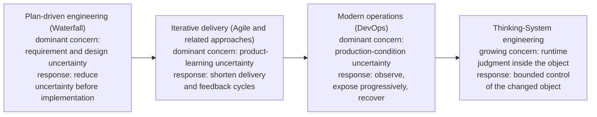

**Figure 1 — Engineering expands its feedback model as consequential uncertainty moves closer to runtime and eventually enters the controlled object.** The final transition identifies the problem of engineering and operating systems in which consequential behavior is partly produced through probabilistic Model Judgment inside the controlled object. The current definition is written without an LLM-only condition, but this figure does not establish that fixed learned probabilistic systems and runtime judgment processes share the same release-contract property, which remains under validation. LLMs and other general-purpose models make runtime model-mediated judgment substantially easier to instantiate across ordinary software. Waterfall, Agile, and DevOps are shown as familiar examples of the broader plan-driven, iterative-delivery, and modern-operations responses. The progression is conceptual, not replacement history.

| Characteristic engineering response | Uncertainty emphasized | Primary mechanism | Where decisive feedback appears |
|---|---|---|---|
| Plan-driven development (including Waterfall) | Requirements, design, coordination | Analysis and planning | Primarily before and during implementation |
| Iterative delivery (including Agile and related approaches) | Product understanding and value | Short delivery and learning cycles | Between iterations and releases |
| Modern operations (commonly associated with DevOps) | Production conditions and system behavior | Runtime telemetry, progressive exposure, and recovery | During operation |
| Thinking-System engineering | Model-Judgment-dependent Consequential Runtime Responsibilities and their effects | Bounded control architecture: explicit Constraints, evidence, decision authority, correction, and reassessment | Inside and around the active controlled object |

The table does not imply that requirement uncertainty disappeared after Agile or that operational uncertainty began with DevOps. The point is cumulative. Each expansion preserves earlier responsibilities while adding mechanisms for uncertainty that became too important to leave outside the engineering model.

### Introducing Thinking Systems

In this paper, a **Thinking System** is:

> A software system in which one or more **Consequential Runtime Responsibilities** depend partly on probabilistic Model Judgment rather than being fully specified through explicitly encoded logic in advance.

The formulation **“Thinking Systems”** entered this research through my exchange with **Arkadiy Dobkin** following his public *From Fall to Rise* post. I am grateful to Arkadiy for the formulation. This is formulation provenance, not authorship of the UA-specific definition, endorsement, or framework authority.

This paper calls a runtime responsibility a **Consequential Runtime Responsibility** when its output, decision, path, action, or downstream state can materially affect an intended outcome, satisfaction of an applicable Requirement or Constraint, the exercise of delegated authority, resource use, or a person or system downstream. **Consequential describes material causal relevance, not implementation mechanism or risk severity.** A Consequential Runtime Responsibility may be fulfilled entirely through explicitly encoded logic or may depend partly on probabilistic Model Judgment; Thinking-System classification changes only in the latter case. Harm, severity, likelihood, autonomy, regulation, control adequacy, and production readiness are separate questions. A model invocation with no material influence on any Consequential Runtime Responsibility does not establish the category by itself.

The definition identifies the changed engineering object; it does not certify control adequacy. A Thinking System can be well controlled, poorly controlled, or not ready for production. Constraints, evidence, decision rights, and corrective mechanisms belong to the engineering response around Model-Judgment-dependent Consequential Runtime Responsibilities; they are not the condition that makes the category exist.

The word **Thinking** is functional rather than anthropomorphic. It does not claim consciousness or human-like cognition; it gives engineering a stable name for software in which one or more **Consequential Runtime Responsibilities** depend partly on probabilistic Model Judgment.

**Model Judgment** means interpretation, synthesis, classification, generation, planning, ranking, routing, or action selection performed through a probabilistic model under uncertainty. It is useful precisely because the required behavior cannot always be exhaustively encoded in advance.

The current Thinking-System definition is written in technology-neutral terms, but that breadth is now an explicit research question rather than a resolved historical claim. A traditional credit-scoring model may use a learned probabilistic function whose deployed input-to-output mapping is fixed before release; such a system can look like Model Judgment under the current wording without necessarily sharing the release-contract property developed in Section 2, where part of the consequential situation-to-consequence mapping remains unresolved until runtime. Credit scoring and other pre-LLM models are therefore historical boundary tests, not established examples. Separately, a document summarizer or code-completion suggestion tests a different axis: Output Mediation may make a low-consequence responsibility materially consequential, but that case must independently satisfy the category test. LLMs remain the practical trigger for this paper because they make runtime model-mediated interpretation, synthesis, generation, routing, planning, and action selection general-purpose and easy to embed across ordinary software.

Category membership does not determine consequence severity or control depth. If an internal summarizer used for a reversible, inspectable prioritization decision independently satisfies the category test, it may require only a small explicit control surface; an agent able to change financial or operational state may require much stronger Constraints, evidence, Human Authority, fallback, and runtime intervention. The full map developed later is a diagnostic reference. Implementation remains proportionate to the actual consequence, authority, exposure, reversibility, uncertainty, feedback latency, and control economics.

The category must not be collapsed into "agentic application." The classification question is narrower: does any **Consequential Runtime Responsibility** depend partly on probabilistic Model Judgment? If not, the relevant **Consequential Runtime Responsibility** remains explicitly authored. For comparison, this paper uses **Explicitly Authored Software** as a paper-level research label under validation; the current UA glossary still uses **Linear Software** pending separate framework terminology review. If yes, the software satisfies the current Thinking-System classification test even when orchestration is fixed. Whether every system admitted by that wording also exhibits the runtime-unresolved responsibility structure developed in Section 2 remains under `TS-SCOPE-001`. Deterministic code before, between, or after a runtime judgment process does not make that delegated judgment deterministic. Orchestration topology, autonomy, and delegated authority affect architecture and control demand, but they do not decide the category. The precise boundary of agentic terminology remains an open research question.

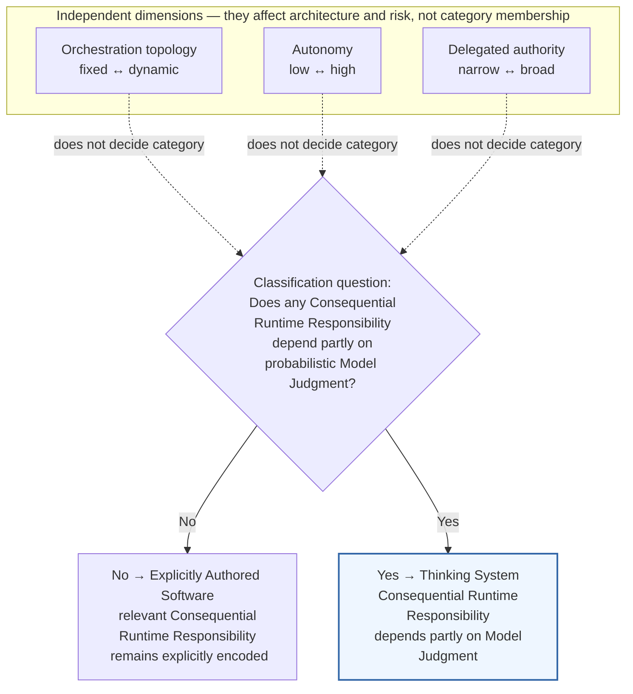

**Figure 2 — Thinking-System classification turns on whether a Consequential Runtime Responsibility depends partly on probabilistic Model Judgment, not workflow topology or autonomy.** Fixed and dynamic workflows can fall on either side of the category boundary. The category changes when a **Consequential Runtime Responsibility** is no longer fully specified through explicitly encoded logic and instead depends partly on probabilistic Model Judgment. Autonomy and delegated authority remain additional dimensions that affect risk and control design rather than classification.

Thinking-System engineering still requires product discovery, deterministic software engineering, testing, security, deployment discipline, observability, and incident response. The current category test does not invalidate those practices. For the motivating runtime-judgment class developed in Section 2, it identifies the responsibility structure that changes the object they are controlling; whether that deduction extends to every case admitted by the broader wording remains under `TS-SCOPE-001`.

---

### Running Example | Bounded Customer-Support Resolution

**Lens in this section:** business proposal, controlled-object identity, and intentionally unresolved control paths.

Throughout this paper, one fictional system will make the control model concrete: a company wants to reduce the cost and latency of customer-support resolution while preserving explicit authority over consequential decisions and downstream effects.

The proposed system receives a customer request, retrieves authorized account, order, product, and support-policy context, interprets the issue, selects or recommends a resolution path, and drafts consequential customer communication. In explicitly authorized low-impact cases it may eventually be allowed to invoke a tool that changes downstream business state, such as issuing a bounded credit or refund; cases requiring reserved judgment or authority remain under Human Authority.

The controlled object in this example is not the model or chatbot interface. It is the whole software support-resolution system: deployed components, data, configuration, dependencies, infrastructure, deterministic identity/access/retrieval/policy/tool/execution paths, and one or more Model-Judgment-dependent responsibilities inside its declared software boundary. Human Authority and the logical functions of evidence, decision authority, Constraint Realization, and corrective action remain conceptually distinct within the socio-technical control architecture around that object; one software component may still perform both system and control functions without collapsing the distinction. The downstream effects define what the Thinking System can cause rather than becoming additional components of it. The same controlled object will be carried through the rest of the paper—from category classification and Model-Judgment-necessity questions through authorization, architectural viability, concrete realization, active operation, and reassessment. The control paths required around it are deliberately left unresolved here; the following sections derive them rather than assuming them. Details will be introduced only when the corresponding concept requires them.

At this point, assume only a credible pilot: a capable model, retrieval and tool access, traces, evaluation suites, policy guidance, and a human-review path. Each local component can be competent. The dashboard may be green. The demo may be impressive. The complete system may still lack a defensible connection between the authoritative limits of the system, the assumptions under which it is designed, the boundary actually realized, the evidence produced in operation, and the corrective decisions available when those assumptions fail. For now, the important fact is only that consequential interpretation and resolution may depend partly on Model Judgment while the surrounding controls and decision rights are not yet connected.

The components alone do not answer the connected questions. Was Model Judgment actually necessary for the intended support outcome, or would a deterministic or narrower human-assisted design be enough? What authority was delegated to the model-mediated path? Which consequences are prohibited rather than merely undesirable? Which Constraints are authoritative, and how are they realized? Which evidence informs which decision? Who may narrow exposure, roll back, disable, redesign, or stop operation? When does runtime evidence invalidate Project Authorization rather than only a local implementation? Does the business case survive once evaluation, Human Authority, fallback, observability, incident handling, and control capacity are included in the cost?

**What this adds to the case:** the support-resolution system is established as the stable controlled object; authority, evidence, control, and reassessment paths are deliberately left unresolved for later sections.

---

This is a practitioner observation about fragmentation, not a claim that governance, safety, architecture, or control practices do not exist. Relevant practices are often separated by product boundary, decision level, or organizational function. Observability can show what happened without establishing who may act. Evaluation can estimate behavior without defining an approved operating boundary. A policy can express intent without creating an operational realization. A human approval step can exist without adequate information, time, power, or capacity. An orchestration platform can execute a delegated workflow without deciding whether that workflow was legitimate to authorize.

Without the connection, local confidence is easily substituted for system control. A good evaluation score becomes evidence that the product is ready. A prompt becomes a policy. A policy becomes a supposed control. A human-in-the-loop label becomes evidence of accountability. A rollback button becomes evidence that recovery is possible. Each substitution may be understandable, and each may be wrong. None of these substitutions establishes the missing control relationship by itself.

> **Release-readiness consequence.** For production use of a Thinking System, these are not gaps that can be delegated to a post-release governance review. The system is not ready for production at the intended scope while any material control responsibility remains unowned, unrealized, insufficiently evidenced for its decision, or without a credible corrective or reassessment path. “Complete control architecture” therefore means materially complete for the authorized scope, not maximal control implementation. Governance becomes operational through that socio-technical architecture; it is not a document layered over the system.

> **Previous engineering methods learned to manage uncertainty surrounding software. Thinking Systems require engineering to manage consequential uncertainty produced by the software itself.**

The missing layer is not another AI component. It is the engineering connection between delegated judgment, authorized boundaries, evidence, decision authority, corrective action, and reassessment. Understanding why that connection is necessary requires examining the object being controlled.

## 2. The Controlled Object Has Changed

A controlled object is the thing whose behavior engineering seeks to keep within acceptable conditions. For this paper's category, that object is never only source code or a model invocation. It is the whole software system within its declared boundary: deployed components, data, configuration, dependencies, infrastructure, and software-operated processes and interfaces. The behavior being controlled must be assessed through the downstream effects that system can produce; those effects do not become additional software components. Relevant human roles and interactions may belong to the socio-technical control perimeter around that object; they do not become part of the controlled process merely because they observe, authorize, or change it. A software component may implement a control function while remaining physically inside the system boundary, but the controlled-process and control-function relationships remain conceptually distinct.

Application topology does not determine the category. A Thinking System may contain a single model call inside an otherwise deterministic application, several model-enabled steps in a predefined workflow, dynamic routing, or agentic orchestration. Conversely, neither the presence of a probabilistic model nor any of these topologies is sufficient by itself. The category begins only when at least one **Consequential Runtime Responsibility** depends partly on probabilistic Model Judgment. Later additions such as memory, dynamic routing, cooperating agents, or broader autonomy may increase complexity and control demand, but they do not create the category.

The distinction matters because engineering needs a stable name for the object being designed, released, operated, and controlled. This paper uses **Explicitly Authored Software** for software in which no **Consequential Runtime Responsibility** depends partly on probabilistic Model Judgment; its **Consequential Runtime Responsibilities**, if any, are fulfilled entirely through explicitly encoded logic. For the motivating runtime-judgment class developed in this paper, part of the mapping from situation to consequential behavior is instead completed during runtime through Model Judgment. Deterministic software may surround that judgment, but it no longer exhaustively specifies the consequential responsibility that depends on it. Whether the broader current Thinking-System definition should also include fixed learned probabilistic functions with a release-time-determined mapping remains under `TS-SCOPE-001`.

The controlled object is therefore the **whole Thinking System, not the model invocation**. The engineering problem is to preserve useful runtime judgment while keeping the surrounding deterministic responsibilities, boundaries, evidence, decision authority, and corrective mechanisms explicit enough to control the system as a whole. Whether those controls are adequate is a separate question from whether the object belongs to the Thinking-System category.

### Why not simply call these AI systems?

Because the broader labels answer different questions. [ISO/IEC TR 29119-11:2020](https://www.iso.org/standard/79016.html) defines an **AI-based system** by the presence of at least one AI component. [NIST AI RMF 1.0](https://www.nist.gov/publications/artificial-intelligence-risk-management-framework-ai-rmf-10) uses a broader **AI system** concept centered on machine-generated outputs that influence real or virtual environments. Those scopes are useful. The narrower question needed here is different: does any **Consequential Runtime Responsibility** depend partly on probabilistic Model Judgment?

A conventional application can therefore fall within a broad AI-system category while no **Consequential Runtime Responsibility** depends partly on Model Judgment. Conversely, a simple fixed workflow can cross the Thinking-System boundary as soon as a **Consequential Runtime Responsibility** such as interpretation, planning, routing, risk identification, or output mediation depends partly on probabilistic Model Judgment.

| Neighboring label | What it primarily signals in this comparison | Why it does not identify this controlled-object boundary |
|---|---|---|
| **AI-based system (ISO/IEC TR 29119-11)** | Presence of at least one AI component | Component presence alone does not say whether a **Consequential Runtime Responsibility** depends partly on probabilistic Model Judgment |
| **AI system (NIST AI RMF)** | A broader system producing machine-generated outputs that influence real or virtual environments | The scope is broader than the responsibility boundary used here |
| **LLM application** | Use of a particular model technology | Technology choice does not say what consequential responsibility the model carries |
| **Agentic system** | Agency-oriented behavior or orchestration | Agency, autonomy, and authority are separate dimensions from the category test |
| **Autonomous system** | Degree of independent operation | Autonomy changes risk and control demand but does not establish whether a consequential responsibility depends partly on Model Judgment |
| **Thinking System (this paper)** | A **Consequential Runtime Responsibility** depends partly on probabilistic Model Judgment | Identifies the responsibility boundary under test; the controlled-object/release-contract shift is developed for the motivating runtime-judgment class while broader scope remains under validation |

This is a narrow analytical comparison, not a judgment that broader AI-system concepts, NIST AI RMF, ISO standards, or agentic terminology are technically shallow or operationally incomplete. Their capability, authority, lifecycle, and governance coverage is a different question and belongs in the later landscape analysis. **Thinking System** is not proposed as a replacement for *AI system*; it names the responsibility boundary relevant to the engineering argument developed here.

The controlled-object argument developed here concerns the motivating class in which one or more Consequential Runtime Responsibilities depend on Model Judgment in a way that leaves part of the consequential mapping unresolved until operation. That change can occur in the first model-enabled iteration; it does not require autonomous agents, dynamic orchestration, multiple models, memory, or a mature AI platform. Whether the broader current definition should also include fixed learned probabilistic functions whose deployed mapping is determined before release remains an explicit boundary question under `TS-SCOPE-001`.

A useful design-contract abstraction for explicitly encoded deterministic responsibility is:

```text
y = f(x, context, configuration, system state)
```

This does not claim perfect physical repeatability. It means that the intended mapping over the relevant input, context, configuration, and state is authored through explicit logic, rules, state transitions, or other inspectable mechanisms and can be tested against specified conditions.

Over the same classes of relevant conditions, a model-mediated responsibility is better represented as selection from plausible outcomes:

```text
y ~ P(y | x, context, configuration, system state)
```

For the same apparent request, plausible behavior may vary with context, model version, instructions, retrieval results, tools, configuration, prior interaction, data distribution, or operating conditions. The system does not merely execute a fully enumerated decision; part of the consequential mapping is selected or constructed at runtime.

> **Release-contract shift.** For an explicitly authored consequential responsibility, Delivery releases an implementation whose intended situation-to-consequence mapping is specified in inspectable logic before release, even when that mapping is branching, stateful, concurrent, or operationally uncertain. A release in the motivating class examined here also places into operation a judgment process that will complete part of that mapping at runtime. The important distinction is not the number of terminal outputs but whether the consequential decision structure is determined through explicitly authored logic before release or partly completed by Model Judgment at runtime. In LLM-based systems, a few allowed actions may still depend on Model Judgment over a large, context-dependent space of situations, meanings, and evidence. Production readiness therefore depends not only on the implementation already written, but on whether the surrounding control architecture can keep the resulting system operation, reachable authority, and consequential effects within the approved boundary despite judgment that remains unresolved until runtime.

What remains open is therefore not necessarily the set of terminal actions, but the judgment-dependent mapping from situations and context to consequential behavior. In the LLM use cases that motivate this category, the space of possible situations, meanings, evidence, and relevant distinctions can be large and only partly characterized in advance even when downstream actions are tightly enumerated. Three different questions must remain separate: whether the resulting behavior is desired, accepted only within stated conditions or residual bounds, or prohibited; whether the relevant case is sufficiently characterized or remains uncertain or unclassified; and whether execution or acceptance is within delegated authority or reserved for Human Authority. The complete distribution or decision boundary need not be known or measurable for this distinction to matter.

This does not mean conventional software had one path, no nondeterminism, or no surprises. Randomization, concurrency, distributed failure, unmodeled states, changing environments, and ordinary implementation defects already existed. The narrower change is that explicitly authored logic no longer fully determines the intended consequential mapping before release: part of the business-relevant situation-to-consequence relationship is completed by runtime Model Judgment. This is a qualitative shift in the failure surface, not a claim that every Thinking System necessarily produces more errors.

That changes both failure analysis and reassessment. Unexpected behavior is no longer limited to a defect or unanticipated condition around a fixed intended mapping. It can also be a semantically wrong, contextually inappropriate, unsupported, or unauthorized selection inside the runtime judgment space. A local realization or configuration fault may remain a Delivery correction. Other evidence may invalidate the Delivery release basis itself—for example, deployment-specific evidence coverage, Operating Envelope assumptions, control capacity, or Release Gate acceptance—and require Delivery reassessment before continued release. Evidence from a single material outcome or from a repeated pattern may instead invalidate Project / Architecture assumptions about Model-Judgment necessity, the broader Operating Envelope, Human Authority, or control economics. Other outcomes may show that an Organizational authority or business premise must be narrowed or changed. The control architecture therefore needs not only local error handling but evidence and escalation paths to the decision horizon whose basis the runtime outcome challenges.

The architectural difference can be shown without pretending that conventional software consists of one linear function or that every Thinking System follows one pipeline.

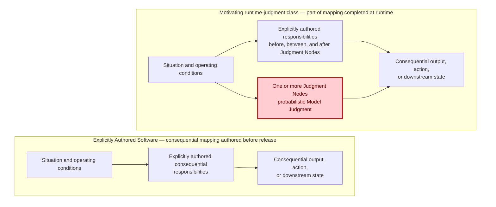

**Figure 3 — The controlled-object shift for the motivating class.** On the left, Consequential Runtime Responsibilities are fulfilled through explicitly authored logic. On the right, the motivating runtime-judgment class retains explicitly authored responsibilities while Model Judgment leaves part of a Consequential Runtime Responsibility unresolved until operation, so part of the consequential mapping is completed at runtime. The figure does not resolve whether fixed learned probabilistic functions with a release-time-determined mapping belong to the broader Thinking-System category. The parallel paths are schematic responsibility relationships, not a prescribed execution topology. Red marks only the Judgment Node where the responsibility structure changes; it does not imply that the whole system is probabilistic, unsafe, or erroneous. The figure is descriptive of the motivating class under the release-contract deduction, not a resolution of the broader category boundary or a prescribed control architecture. The deterministic boundaries, evidence, authority, and corrective mechanisms required for controlled production use are derived in the sections that follow.

Model Judgment can enter a system through several functional placements.

**Input Interpretation** converts ambiguous, unstructured, incomplete, or context-dependent input into a representation the rest of the system can use. It may affect what the system believes the user requested, which entities matter, which policy or context is relevant, or which deterministic path becomes available.

**Decision Logic** influences or selects a route, ranking, plan, priority, tool, or action. It may recommend an action, choose among bounded alternatives, or initiate a step only where the surrounding authority boundary permits it.

**Output Mediation** creates, adapts, filters, summarizes, explains, or transforms information for a person or downstream system. Even when underlying data remains unchanged, mediation can alter what someone understands, trusts, approves, discloses, or does next.

These are placement functions, not a mandatory three-stage pipeline.

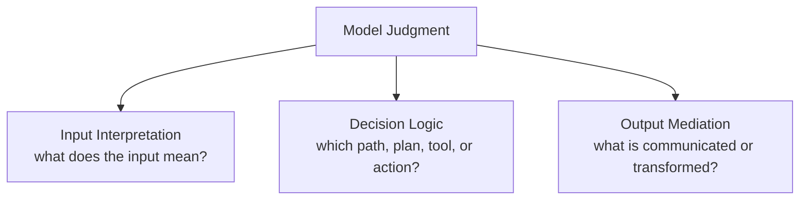

**Figure 4 — Functional placement of Model Judgment.** Model Judgment is the parent concept; Input Interpretation, Decision Logic, and Output Mediation are functional placements beneath it. They are not mandatory stages or a prescribed execution order. A system may use one, several, or repeated instances of them.

These placements are useful precisely where consequential interpretation, synthesis, or selection cannot be exhaustively specified in advance. The engineering problem is therefore to preserve that useful judgment while bounding the resulting operation.

That requires a mixed-system view. A model may interpret a support request while deterministic identity and permission checks constrain which customer data is reachable. It may recommend a resolution while deterministic tool permissions limit what can be executed. It may draft a customer response while outbound authority remains on a separate human or deterministic path. It may estimate semantic acceptability while the release decision and the mechanism executing that decision remain separate responsibilities.

---

### Running Example | The Controlled Object Expands

**Lens in this section:** how Model Judgment changes the engineering boundary and the reach of the required control perimeter.

The bounded support-resolution system already contains this mixed structure. Retrieval, identity, permissions, tool access, and execution paths can remain deterministic while request interpretation, resolution selection, or response generation depends partly on Model Judgment. That is enough to change the controlled object even before the paper decides whether the resulting authority, evidence, Human Authority, fallback, and economics are adequate for production.

The support workflow can use predefined stages and permitted transitions: receive request → retrieve authorized context → interpret issue → select or recommend a resolution → prepare consequential communication → check authority → execute a bounded action or route to Human Authority. Its fixed orchestration topology neither creates nor prevents the category. The system crosses the boundary if a **Consequential Runtime Responsibility** within that workflow depends partly on Model Judgment.

Now follow the consequential responsibility rather than the model boundary. If Model Judgment can influence which remedy applies, what the customer is told, whether a refund is proposed, or whether an authorized tool changes downstream business state, then the engineering perimeter cannot stop at the model-serving component. That perimeter includes the path by which runtime judgment becomes a consequential outcome and connects it to the people, permissions, evidence, and corrective mechanisms needed to keep the path inside an authorized boundary.

For a material case, that control perimeter may therefore become explicitly **socio-technical** and cross technical, delivery, architectural, human-authority, and organizational decision boundaries. In the running example, a bounded-refund authority may originate outside the runtime system, depend on architectural choices about where Model Judgment is permitted, require a concrete delivery realization, and ultimately constrain whether a runtime transaction can execute. The point here is the **reach of the perimeter**, not yet the ownership model inside it. Where authority, exposure, reversibility, or downstream effects make the control problem material, the engineering boundary therefore cannot be limited to the model, application, or runtime architecture alone; a socio-technical control architecture may have to be designed around the whole controlled object.

This does **not** mean every Thinking System needs separate departments, committees, or a maximal governance stack. The same people or platform may carry several responsibilities, and lower-consequence systems may realize the required control perimeter lightly. The point is causal: once probabilistic Model Judgment participates in a consequential responsibility, the required control perimeter follows the authority and effects of the **whole controlled object**, potentially all the way to organizational decision rights.

**What this adds to the case:** the same support system now exposes why consequential responsibility can require a socio-technical control perimeter that extends beyond the model and runtime component.

---

This is why model quality alone is insufficient. Evaluation may estimate whether behavior is useful or acceptable. It does not, by itself, define prohibited states, establish who may accept residual exposure, restrict reachable authority, execute correction, or determine when the basis of Project Authorization must be reconsidered.

The new uncertainty also does not replace earlier uncertainty. It adds another location that engineering must connect to the others.

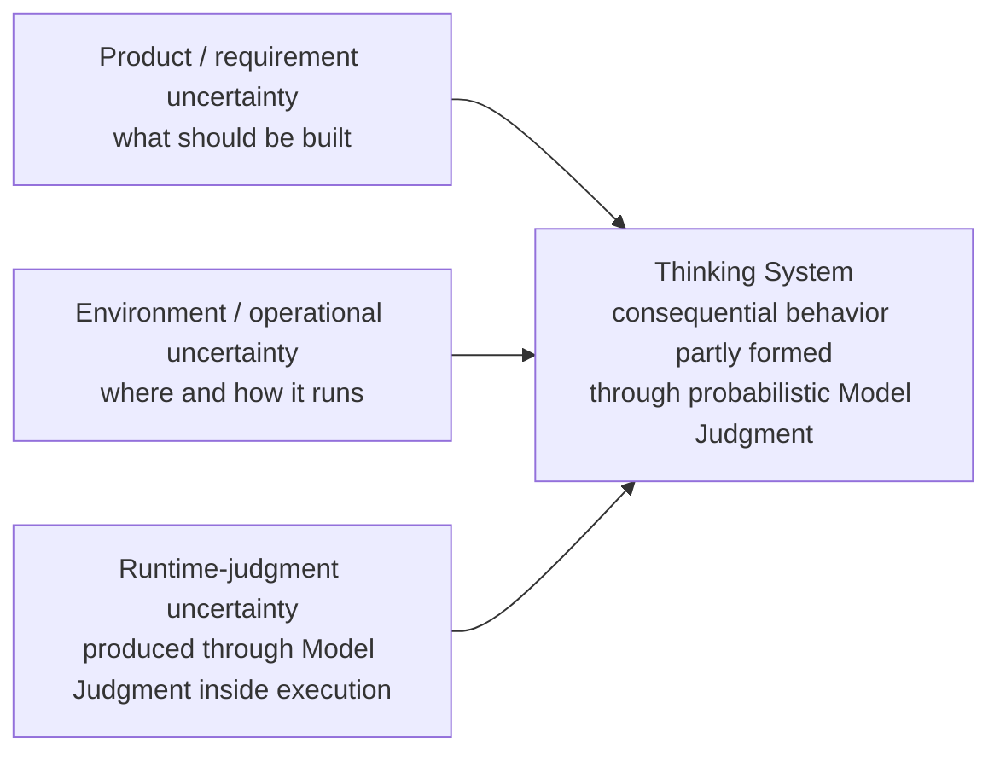

**Figure 5 — Three connected uncertainty locations.** Product and requirement uncertainty, environment and operational uncertainty, and runtime-judgment uncertainty coexist. Product methods, deterministic software engineering, DevOps, resilience, security, and incident response remain necessary; Thinking-System engineering adds explicit treatment of uncertainty produced through runtime judgment inside the controlled object.

The example exposes a broader consequence: the control perimeter of a Thinking System may cross technical, delivery, architectural, human-authority, and organizational decision boundaries. Different decisions across that perimeter require different evidence, authority, and corrective mechanisms. Before assigning those decisions to explicit horizons, however, the engineering problem is more basic: **what capabilities must exist for bounded control to be possible at all?**

Across that expanded perimeter, the concrete subject changes but a recurring control structure appears:

```text
What outcome or condition is intended?
→ What operating space is acceptable?
→ What uncertainty or disturbance can move the object outside it?
→ What evidence reveals behavior, outcome, conditions, and control state?
→ Who or what may decide that action is required?
→ Which mechanism can change operation?
→ When does new evidence require reassessment at this or an earlier level?
```

This recurrence is the bridge to control theory. The transfer is structural, not literal. Organizations, projects, delivery teams, and runtime services are not one mathematical Controller, and legal interpretation, business viability, social authority, and model behavior cannot be collapsed into one scalar error signal.

The useful transfer is that bounded control requires an intended condition, an approved operating space, evidence about the controlled process, legitimate decision authority, a path to corrective action, and a mechanism for revisiting assumptions when the control basis changes. Existing product, architecture, software-engineering, security, operations, safety, and governance disciplines remain necessary. The changed object requires their decisions to be connected around the same system rather than treated as independent practices assembled around an AI component.

The problem is therefore not merely that AI is harder to test. Part of the controlled object's consequential behavior is now produced through runtime judgment, and every decision that controls that object must account for the change.

The next section therefore asks what capabilities are required to make that expanded control perimeter operational. Only after establishing those control functions does the paper assign consequential decisions to explicit decision horizons.

## 3. From Model Quality to Bounded Control

The controlled-object shift changes what counts as sufficient engineering evidence. Once a **Consequential Runtime Responsibility** depends partly on probabilistic Model Judgment, teams naturally invest in measurement: test sets, evaluators, traces, model comparisons, cost and latency monitoring, incident data, and downstream outcome analysis. All of that is necessary. None of it, by itself, establishes control.

Measurement answers questions such as *what happened, how often, under which conditions, and with what confidence?* Control adds different questions: *relative to which approved boundary, who or what may decide that action is required, which action can actually change operation, and what happens when the assumptions behind the boundary no longer hold?*

A feedback loop becomes closed when evidence about the controlled process reaches a decision function and an authorized action can affect the process again:

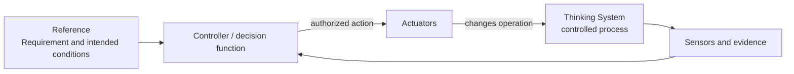

**Figure 6 — A closed feedback loop.** Evidence reaches a Controller / decision function and an authorized action changes the controlled process. Decision authority comes from the applicable authorized decision boundary; the Controller operates within that boundary rather than constituting its source. The figure deliberately does not yet claim that the loop operates inside a legitimate or adequately realized boundary.

A closed loop can still be unacceptable. It may optimize the wrong objective, react too slowly for the consequence, rely on evidence that misses the relevant failure, or possess authority that was never legitimately delegated. Its Actuator may be able to change a prompt but not prevent a transaction. It may keep an evaluator score inside tolerance while Human Authority, fallback capacity, latency, or unit economics collapse. Closing feedback is therefore weaker than bounding operation.

---

### Running Example | From Authority to a Complete Control Path

**Lens in this section:** how one refund-authority boundary becomes operational through Constraints, Sensors, Controller functions, Human Authority, and Actuators.

Take one boundary in the same support-resolution system: automated refunds are permitted only up to a delegated amount; above that amount, execution requires **Human Authority**. The important engineering object is not the sentence “large refunds require approval.” The control problem is whether that authoritative boundary survives the complete path from Model Judgment to downstream transaction.

The same boundary requires four distinct capability functions around it. They are parallel control functions, not an execution sequence:

**Constraint and Constraint Realization**
- Constraint: refunds above the delegated amount must not execute without Human Authority.
- Realization: transaction permission + amount precondition + an approval credential/state issued through the designated approval path and bound to an authenticated authorized human identity and the matching transaction scope + rejecting endpoint.

**Sensors**
- attempted and blocked high-value refunds;
- approval outcomes and bypass attempts;
- realization health and downstream transaction result;
- Human Authority latency and capacity evidence.

**Controller**
- for a given refund attempt, interpret the relevant evidence against the applicable Constraint and determine the authorized response within its delegated decision boundary;
- where substantive judgment is reserved to Human Authority, select or authorize routing of the case and evidence to that authority rather than treating the Controller as the source of the authority itself;
- for accumulated evidence, select or authorize, within delegated authority, either narrowing or disabling runtime operation or routing the evidence for reassessment by the authority that owns the challenged decision basis.

**Actuators**
- block, route, narrow, disable, roll back, fallback, or compensate within delegated authority.

If any part is missing, the sentence “large refunds require approval” has not yet become a complete control path. A policy without a credible realization can be bypassed; a realization without evidence can silently degrade; evidence without a Controller able to interpret it and act within an authorized decision boundary is observation; a Controller without an effective Actuator cannot correct the system.

**What this adds to the case:** the refund rule is no longer only policy intent; the case now has the logical anatomy of a complete control path around that boundary.

---

The four capability families describe the logical functions needed to make such a boundary operational. The order below is a pedagogical traversal, not a mandatory execution pipeline or physical stack.

### Actuators and corrective action

An **Actuator** executes an authorized change in operation or in a Constraint Realization. It is the part of the control path that can actually make the system behave differently.

In the support system, Actuators may block a transaction, route a case to Human Authority, narrow autonomous scope, switch to a manual path, disable refund execution, roll back a model or configuration, or compensate downstream state. A feature flag, API call, workflow step, deployment action, or human intervention is an Actuator only when it provides a real path from an authorized decision to changed operation.

The distinction from decision authority matters. A Controller selects or authorizes a bounded response within delegated authority; an Actuator executes the authorized change. One component may perform both, but treating them as the same concept hides who may decide, who may execute, what happens when execution fails, and what evidence proves that the requested change actually occurred. A Controller without an effective Actuator can diagnose but cannot correct.

### Constraints and their realizations

A **Constraint** is an approved condition limiting the allowed operating space. A **Constraint Realization** is the technical or socio-technical mechanism through which that condition is implemented, enforced or influenced, evidenced, and operated for a defined scope. They belong to one capability family because either side alone is incomplete: policy without realization is intent; realization without an authoritative Constraint is mechanism without a defensible boundary. **Constraint Realization is not a fifth capability family.**

For the running example, an authoritative Constraint might state that refunds above the delegated amount must not execute without Human Authority. That statement is not yet a technical guarantee. A credible realization might combine transaction permissions, an amount precondition, an approval credential or equivalent authorization state issued through the designated approval path and bound to an authenticated authorized human identity and the matching transaction scope, and a transaction endpoint that rejects execution when that valid scoped approval is absent.

This is also where **Hard** and **Soft** must be separated carefully. A Hard Constraint is a scoped claim that the complete realized path deterministically prevents or rejects violation within stated assumptions, subject, path, scope, and enforcement boundaries. A prompt saying “never issue a refund above the threshold,” a natural-language policy, a model preference, or a probabilistic evaluator is not hard by itself. Those mechanisms may influence behavior, but they do not make the prohibited transaction unreachable.

Where a prohibited consequential state can feasibly be made unreachable through deterministic enforcement, deterministic realization should carry that boundary. Where deterministic prevention is not feasible, the remaining uncertainty should stay explicit rather than being renamed “Hard” because the business intent is important. The same business rule may therefore require separate records for a hard transaction boundary and a soft semantic boundary around customer communication.

### Sensors and evidence

**Sensors** produce evidence about behavior, outcomes, operating conditions, realization state, control health, Actuator execution, and the assumptions on which authorization depends.

For the refund boundary, useful evidence includes attempted and blocked high-value refunds, approval requests and outcomes, realization health, bypass attempts, downstream transaction results, false blocks, Human Authority queue size and latency, fallback load, and the state produced after an Actuator fires. Evaluators may also estimate semantic properties such as whether the model applied policy appropriately or whether a customer explanation is grounded.

A Sensor need not produce one objective truth value. Semantic acceptability may remain uncertain. Evidence must instead be fit for the decision it informs and expose coverage, uncertainty, latency, and blind spots. For evaluators, Golden Sets, rubrics, thresholds, or structured human-review signals, that also means knowing the active version and validation or calibration basis where applicable, plus the conditions under which the instrument may lose validity as the model, population, policy, or operating environment changes. A detector that identifies a prohibited transaction only after settlement may be accurate and still be useless for prevention. An average-quality dashboard may be informative and still miss the low-frequency event that defines the relevant boundary.

Telemetry without a decision path is observation. Valuable observation is not yet control. An evaluator normally performs a Sensor function; logic that interprets its evidence and selects `block`, `canary`, or `release` performs a Controller function; the mechanism that applies that decision performs an Actuator function.

### Controllers and bounded decision functions

A **Controller** compares or interprets evidence relative to approved Requirements, Constraints, assumptions, and a defined decision boundary, then selects or authorizes action within delegated authority. What makes something a Controller is not intelligence, automation, a dashboard, or a job title. It is the control function that turns evidence into a bounded response decision. A Controller does not create its own authority: it may select or authorize action only within an applicable delegated boundary and must escalate reserved decisions to Human Authority or another authorized decision process.

In the running example, one Controller function may determine that a transaction cannot proceed automatically and must be routed to Human Authority. Another may decide, from repeated realization failures or abnormal financial behavior, that autonomous refund execution should be disabled or narrowed. The associated Actuator performs that change. A dashboard presenting the evidence is not itself the Controller.

Controllers are often socio-technical. Human decision authority may be combined with automated evidence collection, invariant checks, routing, decision support, and bounded automated decisions where delegation permits them. **Human Authority** is substantive only when the person has enough information, time, competence, capacity, independence, and power to change the outcome. An approval button attached to an overloaded queue is not a complete control path.

Automation should remove repetitive sensing, checking, routing, evidence aggregation, and safe bounded response where evidence quality, failure behavior, reversibility, consequence, and delegated authority make the automated path credible. Maximum automation is not an independent objective. Automated Controller and Actuator behavior is itself part of the control architecture: its decisions, configuration, latency, failures, execution, and resulting state must remain observable and correctable.

Read together, the four families form a bounded control relationship: Controllers turn evidence into bounded response decisions within delegated authority; Actuators execute authorized changes to operation or a Constraint Realization; Constraints define what changes and operating states are legitimate; Realizations enforce or influence those boundaries; Sensors expose behavior, outcomes, realization health, and action effects; evidence returns to Controllers.

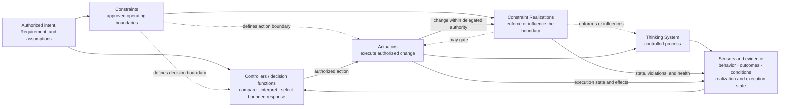

**Figure 7 — Complete bounded control architecture.** The four capability families are logical functions, not mandatory services, products, teams, layers, or one execution order. Realizations may act before, during, or after Model Judgment; Controllers and Actuators may be synchronous or asynchronous; one component may perform several functions.

This is the difference between a measured system, a closed feedback loop, and a bounded controlled system. The last requires not merely feedback but an approved and credibly realized operating boundary, evidence fit for the decisions being made, legitimate decision authority, effective corrective action, and a path for reassessment when the basis of control changes. Here, a **complete control architecture** means materially complete for the authorized scope, not maximal instantiation of every possible control mechanism or every cell in the later operating map.

What is often called AI governance is therefore not a fifth capability family and not a post-hoc checkpoint. Governance becomes operational through this socio-technical control architecture across the expanded control perimeter. Until material boundaries are credibly realized, required evidence can reach and inform legitimate decision authority, effective Actuators exist, Human Authority and fallback are viable where needed, and invalidated assumptions can trigger reassessment, the system may be demonstrable or testable but is not ready for production at the intended scope.

The capability anatomy explains **how** bounded control becomes possible. It does not yet determine **where** organizational authorization, project viability, delivery release, runtime correction, and reauthorization decisions belong. That is the role of the second model.

## 4. Four Decision Levels for Thinking Systems

The capability anatomy tells us how a bounded control relationship can work. It still does not answer a second question: **where does each consequential decision legitimately belong, and how does evidence move between those decision owners without collapsing engineering analysis, business authorization, release, and runtime control into one generic “AI governance gate”?**

The same Thinking System may require an organizational decision about whether the initiative may be pursued, a Project / Architecture conclusion about whether the proposed controlled system is viable enough for production or needs bounded research, a Delivery decision about whether one realization is releasable for its authorized scope, and Runtime decisions about whether active operation remains inside that scope. Those decisions concern one controlled object, but they require different evidence, authority, time horizons, and corrective actions.

Systems-theoretic safety engineering already provides an important antecedent for this move. **[STAMP](https://mitpress.mit.edu/9780262533690/engineering-a-safer-world/) already models hierarchical socio-technical control structures that can extend from software and operators through management and regulatory authority; [STPA](https://psas.scripts.mit.edu/home/get_file.php?name=STPA_handbook.pdf) applies that systems-theoretic model to analyze unsafe control actions and causal scenarios.** The four-horizon model does not claim to introduce socio-technical hierarchy or organizational decision rights. Its narrower research hypothesis is that model-judgment-dependent software benefits from an explicit lifecycle separation among business and authority authorization, Project / Architecture technical viability, Delivery / Release authorization, Runtime delegated correction, and reassessment of the decision basis that evidence invalidates. The comparative question is therefore bidirectional: does this separation add practitioner value beyond a well-applied STAMP/STPA control structure, merely rename existing concepts, or lose relationships that STAMP/STPA represents more faithfully?

The repository's current draft-normative **Nested Control Lifecycle** already establishes four connected decision levels, downward inheritance, local reassessment, Project Reauthorization, and Organizational review. This paper makes one additional lifecycle distinction explicit as a **research refinement under validation**: Project / Architecture owns Model-Judgment necessity, technical/design selection within the standing Organizational business and authority basis, and the engineering viability conclusion; Organization owns the business outcome and authoritative/investment basis plus the business decision to authorize specific bounded research when the proposed experiment crosses an Organizationally reserved boundary, proceed with a viable production initiative, reshape that basis, defer, or stop; and **Project Authorization is the scoped technical authorization baseline that connects the applicable Organizational decision to Delivery**. A Project Authorization may be **research-only** after a specific Organizational Bounded Research Authorization when the experiment addresses an unresolved viability question for its declared scope, or **production-capable** after a positive Organizational Business Authorization covers a technically viable production basis. Neither scope should be treated as normative UA doctrine until the distinction is deliberately reconciled into status-bearing framework sources.

The four horizons are therefore not four documents, four mandatory teams, or four sequential approval meetings:

- **Organization** owns authoritative boundaries, reserved decision rights, shared capabilities, exceptions, and business authority over whether the initiative should proceed, be reshaped, receive a specific Bounded Research Authorization for reserved-boundary research, be deferred, or stop. It establishes initial admissibility and assessment eligibility before Project analysis, then acts again where a Project viability conclusion requires an Organizational research or business decision.
- **Project / Architecture** owns Model-Judgment necessity analysis, alternatives, technical/design selection within the standing Organizational business/authority basis, the concrete control architecture, technical/control feasibility, Human Authority and fallback feasibility, complete control economics, category confirmation for the selected technical design, and the resulting **Project viability conclusion**. It then issues a versioned **research-only** or **production-capable Project Authorization** only within the Organizational decision that legitimately covers that specific scope.
- **Delivery** owns the bounded Requirement and Operating Envelope, implementation-level Judgment Nodes, concrete realizations and evidence, DoR, DoD, and the deployment-specific Release Gate within that Project Authorization.
- **Runtime** owns operation inside delegated authority: observe, decide, act, verify, restore where possible, and emit reassessment evidence when the active authorization basis no longer holds.

One person may hold several of these responsibilities in a small organization. One platform may implement pieces of several Controller functions. That does **not** collapse the decisions. Initial assessment eligibility is not Bounded Research Authorization; Bounded Research Authorization is not Organizational Business Authorization; a Project viability conclusion is not Project Authorization; a research-only Project Authorization is not production permission; Organizational Business Authorization is not a production Release Gate; and a runtime rollback is not redesign.

The decision-ownership model can now be shown with the Project–Organization handshake, the research branch, and independent exogenous Organizational change explicit:

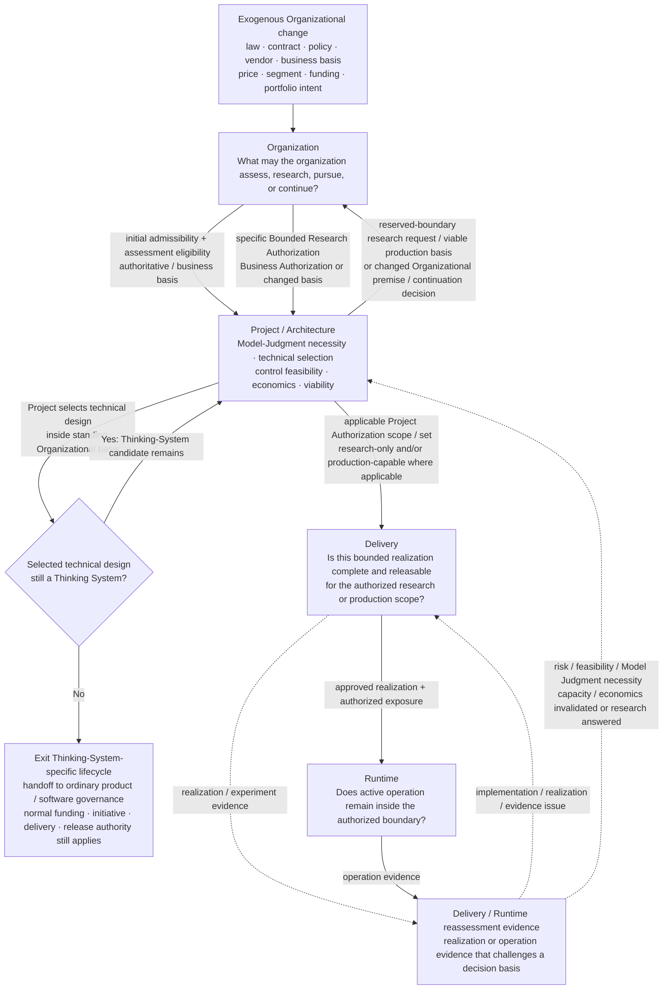

**Figure 8 — Four decision-ownership horizons around one controlled object.** Organization and Project / Architecture are connected by a recurrent decision relationship rather than a one-pass stage gate. Initial Organizational action establishes admissibility and **assessment eligibility**; it permits Project-local analysis and evidence generation inside the standing assessment envelope, but it does not authorize an experiment that crosses an Organizationally reserved boundary. Project / Architecture owns technical/design selection within the standing Organizational business and authority basis and can confirm category locally: a selected design exits the Thinking-System-specific lifecycle when no Consequential Runtime Responsibility remains materially dependent on Model Judgment, then hands off to ordinary product/software governance where normal funding, initiative, delivery, and release authorities still apply. Organization is reactivated only when Project evidence requires a specific reserved-boundary research decision, Business Authorization for a viable production basis, a changed Organizationally owned premise, or a continuation/defer/stop decision. Project turns the applicable Organizational decision into a scoped technical Project Authorization member or authorization set where one is needed. Delivery and Runtime may operate only inside the applicable scope/set and its explicit precedence or interaction semantics where multiple authorizations coexist. Exogenous Organizational change is an independent input to Organization rather than evidence generated by Delivery or Runtime.

### Two orthogonal models

The decision horizons answer **where a decision is owned**. The capability families from Section 3 answer **how boundaries, evidence, decisions, and actions become operational**. They remain orthogonal. Every horizon can require Constraints and realizations, Sensors and evidence, Controllers and legitimate decision authority, and Actuators. A legal or business decision at Organization does not become a Sensor merely because evidence informed it; a runtime service does not become the Organizational Controller merely because it executes a policy.

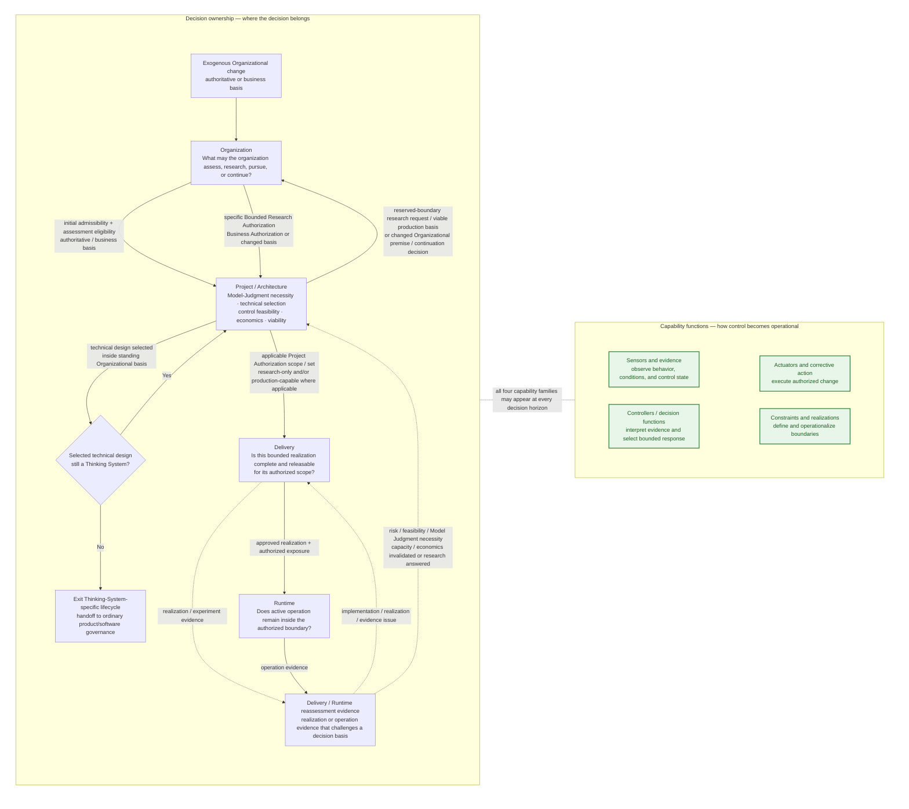

**Figure 9 — Two orthogonal models.** The left side reproduces the decision model from Figure 8: initial assessment eligibility is distinct from a later specific Bounded Research Authorization; Project / Architecture owns technical/design selection and category confirmation inside the standing Organizational basis; Organization is reactivated only when its business/authority/investment basis or an initiative-level reserved-boundary research/continuation decision is implicated; research-only and production-capable Project Authorization remain distinct scoped authorization forms and may coexist only under explicit scope/precedence semantics; Delivery/Runtime reassessment evidence returns to Delivery or Project; and exogenous Organizational change activates Organization independently. The green side is the capability anatomy. Its ordering is a reading aid, not an execution pipeline. There is no one-to-one mapping between horizons and capability families.

### The full map is a reasoning reference, not a maximum-process mandate

The complete map should be inspected before implementation depth is chosen:

```text
full map = inspect every decision horizon and capability family
implementation depth = proportionate to the actual controlled object
```

A low-consequence internal assistant with narrow authority, reversible effects, strong feedback, simple fallback, and little Human Authority load may require only a small explicit control surface, with the same people carrying several responsibilities. A system with broad downstream authority, weak reversibility, slow or uncertain evidence, fragile fallback, expensive Human Authority, or tight unit economics may require much more of the map to be explicit and operational.

The purpose of showing the whole map is therefore not to maximize governance. It is to **expose hidden complexity before deciding what can safely remain lightweight**. “One model call,” “one prompt,” “one feature,” or “one engineer” does not prove that the controlled object is simple. Consequence, reachable authority, reversibility, evidence quality and latency, realization difficulty and bypass surface, Human Authority capacity, dependency fragility, and control economics are better predictors of control depth.

Production release at the intended scope requires the **relevant** decisions and capability functions to be connected across all four horizons at a depth proportionate to the actual consequence and control problem. Research may legitimately use a smaller authorization envelope whose purpose is to generate missing viability evidence. The horizons may activate repeatedly and out of sequence. Organization may establish assessment eligibility, act again on a specific bounded-research proposal or production viability conclusion, and later react directly to an exogenous authoritative or business-basis change. Project may iterate several candidate architectures before any production-capable Project Authorization exists.

### Organization — authorization context and business authority

**Question owned:** Within which authoritative boundaries may Project / Architecture assessment proceed—and, when a Project finding implicates an Organizationally owned basis or initiative-level decision, should the organization authorize specific bounded research that crosses an Organizationally reserved boundary, proceed with a viable production initiative, reshape it, defer it, or stop it?

Two recurring authorization contexts are especially important in the Organization ↔ Project / Architecture handshake.

The first is **initial admissibility and assessment eligibility**. Before a project can treat a prototype as an engineering path, Organization supplies the authoritative context: applicable laws and contracts, prohibited uses, data and geography restrictions, vendor/deployment permissions, shared identity/audit/incident capabilities, reserved Human Authority, exception rights, and the business intent that motivates the work. Organization may prohibit the use outright or allow Project / Architecture to assess candidate designs and, where useful, design a bounded research proposal inside standing conditions. **Assessment eligibility permits Project-local analysis and evidence generation inside the standing assessment envelope; it does not authorize an experiment that crosses an Organizationally reserved exposure, authority, data, material-commitment, or external-effect boundary.**

The second is an **Organizational decision on Project findings that implicate an Organizationally owned basis or initiative-level decision**. Project-local technical/design and category outcomes do not activate this second Organizational moment when they remain inside the standing business/authority basis. When Organizational action is required, Project / Architecture returns the relevant evidence about Model-Judgment necessity, alternatives, control feasibility, Human Authority, fallback, capacity, residual uncertainty, and complete control economics. Organization may then issue one of two different positive authorizations: a **specific Bounded Research Authorization** when viability for the proposed experiment or change scope remains unresolved and Project has defined a credibly bounded experiment that crosses an Organizationally reserved boundary, or an **Organizational Business Authorization** when a technically viable production basis exists and the organization chooses to pursue it. Organization may instead reshape the basis, defer, or stop. The same Organizational horizon may also be reactivated directly by exogenous authoritative or business-basis changes, without a preceding Project finding.

For this paper, **coverage of an Organizational Business Authorization** means the Organizationally owned production envelope against which a later production change is judged: the authorized business outcome or use scope; any population, environment, or external-exposure bounds owned at that horizon; reserved or delegated authority; data, geography, vendor, deployment, or similar restrictions **when they are explicit Organizational premises or conditions**; material service, value, or investment assumptions; and any explicit conditions that require a renewed Organizational decision. It does **not** freeze a model, prompt, routing topology, tool, implementation mechanism, vendor, or other technical design choice merely because it appeared in the viable basis; such choices remain Project / Architecture-owned unless that specific choice is itself an explicit Organizational condition. A technical redesign that remains inside this envelope may therefore be reauthorized by Project after viability reassessment; a change that crosses the envelope requires renewed, reshaped, or otherwise explicit Organizational Business Authorization before the corresponding production-capable technical baseline is issued.

A specific Bounded Research Authorization is therefore downstream of Project's experiment design, not a duplicate of initial eligibility, **when the proposed experiment consumes or creates an Organizationally reserved exposure or commitment**—for example live/external exposure, reserved authority, sensitive or specially governed data access, material budget/capacity, external commitments, or another Organizationally owned premise. Project first defines the research question, technical control envelope, environment/population, data/tool access, reachable authority, stopping conditions, and required evidence. Organization decides whether acquiring that evidence is worth that reserved exposure and whether the proposed experiment fits Organizational limits. Only then may Project issue a **research-only Project Authorization**. Project-local simulation, offline/synthetic evaluation, and engineering experiments that remain entirely inside the standing assessment envelope need no additional Organizational ceremony merely because they generate evidence. Evidence from an Organizationally authorized bounded experiment returns to Project viability analysis and, where necessary, to Organization.

Organization does **not** perform the project-level analysis that decides whether Model Judgment is needed or whether a credible bounded control architecture can be built. It owns the business and authority levers around that analysis. It can change price, target segment, service promise, scope, intended outcome, funding, investment horizon, shared capabilities, or reserved authority where it legitimately owns those decisions; if it changes the basis materially, Project must reassess the resulting proposal.

This distinction matters most for two negative Project conclusions.

An **Architectural Veto** means that, for the current scope, authority, consequence profile, and assumptions, Project / Architecture cannot identify a credible complete bounded control architecture. Organization cannot override that conclusion for the unchanged proposal merely by “accepting the risk.” It may change the proposal—narrow authority, simplify the business outcome, provide a missing shared capability, change an organizational Constraint or grant an exception where it legitimately has that power—and return the changed basis to Project. But that is a new proposal requiring a new engineering viability assessment, not an override of technical impossibility or an unrealizable non-negotiable boundary.

A technically credible architecture whose **economics do not close** is different. Project can conclude that the system is technically/control viable but economically unattractive under the current business assumptions. Organization may then change price, segment, service level, scope, investment horizon, funding, Human Authority capacity, or the target outcome, authorize more research, or stop the initiative. The business owner has levers the project analysis does not.

The same separation applies to Model-Judgment necessity. Project / Architecture may conclude that a deterministic, manual, or narrower model-assisted design is preferable for the stated outcome. **If that design still satisfies the standing Organizational business outcome and authority basis, selecting it is a Project / Architecture decision, not a second Organizational architecture approval.** Project applies the category test to the selected technical design: if no Consequential Runtime Responsibility remains materially dependent on Model Judgment, the design exits this Thinking-System-specific lifecycle and hands off to ordinary product/software governance; category exit is not business authorization; if the narrower model-assisted design still has that dependency, it remains a Thinking System and is reassessed at its narrower scope. Organization is reactivated when adopting the recommendation requires changing a premise it owns—such as the intended outcome, delegated authority, price/value model, target segment, service promise, funding, investment horizon, or another strategic objective—or when it must decide whether to continue, defer, or stop the initiative. An executive preference for “using AI” does not make Model Judgment technically necessary for an unchanged outcome; if AI capability-building, market learning, or another strategic objective is genuinely intended, that objective must become part of the Organizational business basis and be reassessed by Project.

For every material Organizational boundary, downstream engineering still needs an operable relationship:

```text
authoritative source or Organizational decision
→ scoped Project Constraint or explicit assumption
→ required realization properties
→ evidence obligation
→ legitimate decision owner and expected decision latency
→ available exception, suspension, reassessment, or reauthorization path
```

The Organizational Controller is the legitimate business/authority decision function, not a committee by definition. In a large enterprise it may be distributed across product, finance, security, legal, procurement, operations, architecture, or executive authority. In an SMB, the same person may hold several bundles. Automation may track source changes, aggregate evidence, verify explicit delegated conditions, route exceptions, or prepare business/viability context. It cannot invent authority or waive an Architectural Veto for an unchanged proposal.

Organizational Actuators operate on the **business and authorization context**: establish or revoke assessment eligibility; issue, narrow, or revoke a specific Bounded Research Authorization; proceed, defer, or stop a production initiative; change price, scope, outcome, funding, service assumptions, or a shared capability; grant or reject a legitimate exception; change vendor/deployment permission; narrow or suspend permission; reserve a decision to Human Authority; or require renewed Project viability analysis.

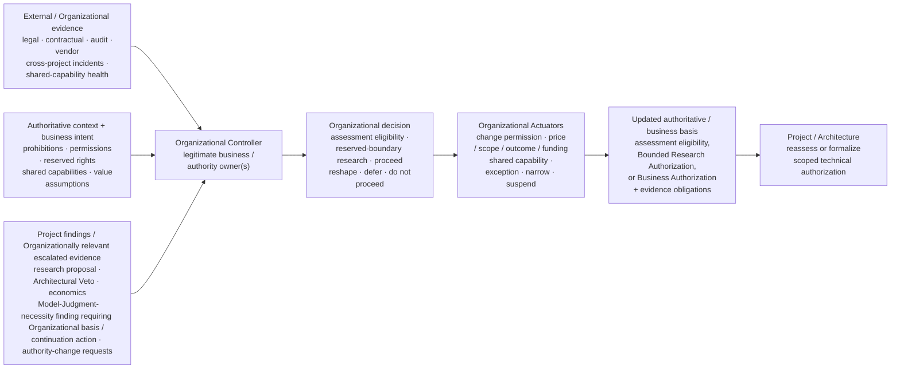

**Figure 10 — Organizational control process across the lifecycle.** Authoritative/business context, external evidence, and Project findings or Organizationally relevant escalated evidence converge on legitimate Organizational decision owners. Operational notification may occur broadly, but decision ownership still follows the basis being reassessed. Initial assessment eligibility and later specific Bounded Research or Business Authorization are different decisions at the same horizon. The figure is not a mandatory department structure or a sequential project stage. Its Actuators change the business or authority basis; they do not directly design the control architecture or perform Runtime correction.

For the support-resolution example, Organization might reserve refunds above €50 to Human Authority, constrain customer-data access to approved paths, and permit only approved transaction capabilities. Initial assessment eligibility lets Project compare candidate designs and define evidence gaps. If Project needs to validate evaluator behavior on synthetic or already-authorized offline cases with transaction tools disabled, that evidence work can remain Project-local inside the standing assessment envelope. If Project instead needs to measure real approval load using live customer cases, reserved customer data, production-like tool authority, or another Organizationally owned exposure, it first defines the concrete experiment and control/evidence envelope; Organization may then issue a specific Bounded Research Authorization, after which Project may issue the corresponding research-only technical authorization. If Project later concludes that the production architecture is credible but Human Authority makes each resolution too expensive, Organization may change the business model or scope. If Project concludes that no credible realization can prevent unauthorized transactions for the proposed path, the unchanged proposal cannot proceed merely because its expected revenue is attractive.

### Project / Architecture — Model-Judgment necessity, control architecture, and viability

**Question owned:** Is Model Judgment needed for the stated outcome, does a credible complete bounded control architecture exist, what technical/category outcome or Project viability finding follows, and does that result require Organizational action?

Project / Architecture is the analytical and architectural horizon. It receives business intent, authoritative boundaries, and assessment eligibility; it does not receive a presumption that AI is justified. The first Project question is deliberately uncomfortable: **is Model Judgment necessary at all?** The comparison should include credible deterministic logic, manual work, a narrower model-assisted path, and the broader Thinking-System design.

Project may category-test candidate alternatives during analysis, because category membership is an engineering fact about the candidate's responsibility structure. **Technical/design selection remains Project / Architecture-owned while the selected design satisfies the standing Organizational business outcome and authority basis.** If Project concludes that a deterministic/manual alternative is preferable and that design leaves no Consequential Runtime Responsibility materially dependent on Model Judgment, Project selects that technical path, confirms the category result, and the design exits this Thinking-System-specific lifecycle and hands off to the ordinary product/software lifecycle; that category exit does not itself authorize funding, initiative continuation, delivery, or release, and any otherwise applicable Organizational or ordinary product/software decision rights still apply. If the Project-selected narrower model-assisted alternative still has a Model-Judgment-dependent Consequential Runtime Responsibility, it remains a Thinking System and the full map is reapplied to that narrower scope. If the technically preferred alternative requires a changed outcome, authority, price/value premise, service promise, funding, investment horizon, or another Organizationally owned basis, Project returns that requirement and its recommendation to Organization; any changed basis then comes back for Project reassessment.

If Model Judgment remains a candidate, Project owns the project-level controlled-object model and the proposed control architecture: the intended system outcome; boundary and intended Judgment landscape; reachable authority and consequences; material scenarios; Project Constraints; required operating-contract properties and evidence obligations; candidate Constraint Realizations and guarantee strength; Sensors and evidence feasibility; Controller authority; Actuator paths; Human Authority; fallback, containment, recovery, and shutdown; dependencies and shared capabilities; active-baseline reconstructability; and the assumptions that could invalidate viability later.

For every material scenario, Project should be able to describe **at least one credible complete bounded control path through the required capability functions** before it concludes that the proposal is production-viable. That does not require final production configuration. It does require more than “we will add guardrails later.” If the relevant failure cannot be observed in time, an inherited boundary cannot be realized at the claimed strength, no effective corrective path exists, fallback shares the same critical failure, or required Human Authority cannot be supplied at the necessary volume or latency, the architecture is not yet credible.

There is one important intermediate case: a material uncertainty may be unresolved while an **experiment itself can be controlled credibly**. Project may then conclude `further research required` and specify the minimum research control envelope and evidence needed to answer the open question. This is not production viability. When the experiment stays entirely inside the standing assessment envelope—for example local simulation, offline/synthetic evaluation, or engineering work with no Organizationally reserved exposure, authority, sensitive data access, material commitment, or external effect—Project may conduct it locally under the ordinary engineering controls applicable to that envelope. When the experiment crosses an Organizationally owned boundary, the Project-defined envelope becomes the technical basis for a **specific Bounded Research Authorization decision** by Organization, followed by a research-only Project Authorization. Initial assessment eligibility alone is not enough to expose an experiment beyond that standing envelope.

The Project business-case analysis must include the control perimeter from the beginning:

```text
expected value attributable to Model Judgment
considered together with:
- solution lifecycle economics
- complete control-perimeter lifecycle economics
- residual exposure and uncertainty after proposed control
- non-negotiable authorization boundaries
→ Project viability conclusion
```

Solution lifecycle economics may include model, platform, data, integration, and ordinary operation. Control-perimeter economics may include Constraint design and realization, evaluation and evidence, Human Authority, fallback, observability, incident response, false blocks, control maintenance, reassessment, additional latency, and control-specific operational friction. These are reasoning buckets rather than a universal accounting standard.

Project does **not** turn every unfavorable economic result into technical No-Go. It distinguishes the nature of the conclusion. A useful viability vocabulary is:

- **viable as proposed**;
- **viable with conditions or narrower scope**;
- **further research required** — viability for the proposed scope or change remains open, but a bounded research envelope may be technically authorizable;
- **Model Judgment unnecessary or a simpler alternative preferred** — a Project architecture/viability conclusion; if the simpler design satisfies the standing Organizational business/authority basis, Project selects it and applies the category result directly; Organization is reactivated only when an Organizational premise or continuation decision must change;
- **technically/control viable but economically unattractive under current business assumptions**;
- **Architectural Veto** — no credible complete bounded control architecture for the current proposal.

That distinction is what makes the return path to Organization meaningful. A hard prohibition or missing capability cannot be averaged away by favorable ROI. Conversely, a technically sound architecture with poor economics may become attractive if Organization legitimately changes the business basis.

The Project / Architecture Controller is commonly socio-technical. Architecture, product, engineering, domain, risk/security, operations, and finance may contribute evidence and authority according to the decision. Automated tooling may gather evaluator evidence, compare versions, verify invariants, estimate capacity/cost, detect missing dependencies, and route deviations. Human decision owners remain accountable for architectural feasibility, Model-Judgment necessity, residual exposure, and viability judgments.

Project output has two routes rather than one mandatory return to Organization for every technical conclusion.

For a **Project-local technical outcome**, Project / Architecture may select a deterministic, manual, narrower model-assisted, or other technical design that still satisfies the standing Organizational business outcome and authority basis. It records the technical/design decision and applies the category test to the selected design. If no Consequential Runtime Responsibility remains materially dependent on Model Judgment, that design exits the Thinking-System-specific lifecycle and hands off to ordinary product/software governance without a second Organizational architecture approval; the category decision does not itself authorize funding, initiative continuation, delivery, or release. If a narrower Thinking-System candidate remains, Project continues viability analysis at that narrower scope.

When **Organizational action is required**, Project returns a **versioned Project viability conclusion**. It records the candidate design and scope, Model-Judgment necessity rationale and alternatives, candidate category result where relevant, Project Constraint Architecture, required operating-contract properties, credible bounded control paths or explicitly unresolved production questions, Human Authority/fallback/capacity assumptions, control economics, residual exposure/uncertainty, viability status, and the assumptions whose change requires reassessment. Organizational action is required when Project requests reserved-boundary bounded research, presents a viable production basis that needs Business Authorization, finds that economics or another Organizational premise must change, raises an Architectural Veto that can only be addressed by changing the proposal, or needs an initiative-level continue/defer/stop decision.

After the applicable Organizational decision, Project may issue a **scoped Project Authorization** for Delivery:

- **research-only Project Authorization** — used only after Organization issues a **specific Bounded Research Authorization** for a Project-defined experiment. It records experiment purpose, scope, environment/population, data and tool access, reachable authority, duration/stopping conditions, required Constraints and evidence, Human Authority/fallback, prohibited production paths, and the evidence that must return to Project viability reassessment;
- **production-capable Project Authorization** — used only when the candidate is technically viable and a positive Organizational Business Authorization covers that production basis. It records the exact authorized technical scope, Project Constraint Architecture, intended Judgment landscape, required operating-contract properties and evidence obligations, delegated technical/control authority, required shared capabilities, Human Authority/fallback requirements, active Organizational/business assumptions, control-economics baseline, and reauthorization triggers.

Both are technical authorizations. Neither is the Organizational decision itself, and research-only authorization does not silently mature into production permission. Multiple Project Authorizations may coexist only when their scopes are disjoint or when any overlap or nesting is explicit. A research-only Project Authorization does not supersede an active production-capable Project Authorization outside the declared experiment scope unless the authorization explicitly says so; material evidence must identify the applicable authorization set, scope relationship, and precedence or interaction well enough to reconstruct which authorization governed the event.

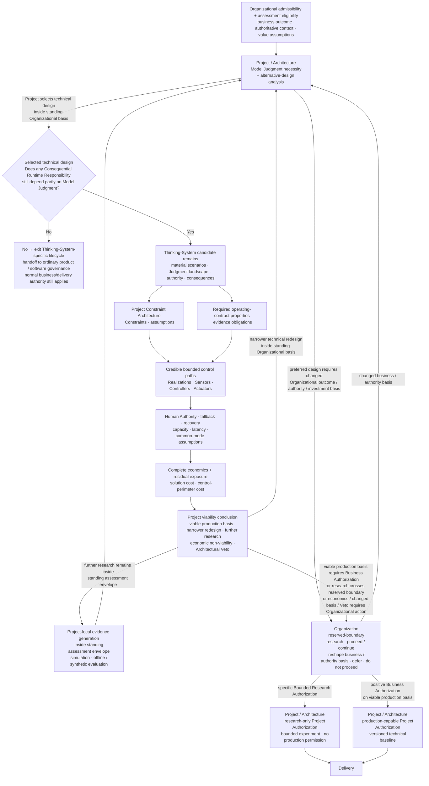

**Figure 11 — Project technical/design selection, viability conclusion, Organizational business/research decision, category exit, and authorization handshake.** Project / Architecture owns Model-Judgment necessity, alternative-design selection within the standing Organizational business/authority basis, category confirmation, architectural feasibility, control economics, and the Project viability conclusion. A simpler architecture that still satisfies that standing basis may be selected at Project and can exit the Thinking-System-specific lifecycle immediately after a negative category test; that exit is a handoff to ordinary product/software governance, not an Organizational funding, initiative, delivery, or release authorization, and it does not require an Organizational architecture-selection ceremony. Organization is reactivated when a Project conclusion requires a changed business/authority/investment premise, when proposed research crosses an Organizationally reserved boundary, or when the business decision is to proceed, reshape, defer, or stop. Research that stays inside the standing assessment envelope may remain Project-local; research that crosses an Organizationally reserved boundary follows the two-step authorization path: Project defines a controllable experiment, Organization issues a specific Bounded Research Authorization, and Project then issues the research-only technical baseline. The research-only and production-capable branches distinguish authorization sources and scoped member types; they are not mutually exclusive full-system states, and such members may coexist only with explicit scope separation or overlap/nesting/precedence semantics. Architectural Veto is a Project conclusion; “do not proceed” is an Organizational business decision.

Project Reauthorization follows the same distinction. If Delivery or Runtime evidence changes the technical design but the proposal remains viable inside the standing Organizational business and authority basis **and the resulting production scope remains covered by the applicable existing Organizational Business Authorization**, Project may reassess, select a different technical architecture, apply the category test, and—where the system remains a Thinking System—issue or update the production-capable technical baseline without a new business decision. If the resulting production scope is no longer covered by that Business Authorization, Organization must renew, reshape, or otherwise explicitly change the business authorization before Project can issue the corresponding production-capable technical baseline. Research evidence returns to Project viability analysis and cannot promote itself to production. A simpler alternative that still satisfies the standing Organizational basis is therefore Project-local. Evidence returns to Organization when business assumptions no longer close, a new bounded-research decision is needed, an Architectural Veto requires a changed proposal, or wider Organizational authority or another Organizationally owned premise must change.

#### Designing the control architecture

This remains work **inside** Project / Architecture, not a fifth decision level. Architectural analysis locates Model Judgment, the deterministic responsibilities around it, reachable tools and consequences, and scenarios that could produce unacceptable outcomes. It then derives the required Constraints, candidate realizations, Sensors, Controller decisions, Actuator paths, Human Authority, fallback, containment, recovery, and reassessment mechanisms.

Sensor design must match the property being controlled. Machine-checkable evidence can verify schema, type, permissions, tool arguments, state transitions, resource limits, and other deterministic conditions. Semantic evidence may estimate grounding, relevance, harmfulness, factual support, policy meaning, or business acceptability. Semantic Sensors remain probabilistic; their active version, coverage, uncertainty, latency, blind spots, validation/calibration basis where applicable, and validity-loss conditions must remain visible enough for the decisions they support.

Human Authority, where required, is architecture: information available, legitimate decision right, expertise, expected volume, acceptable latency, independence, fatigue, escalation power, overload behavior, and what happens when the human path is unavailable all affect viability.

Fallback, containment, and recovery are also architecture, not comforting labels. Where material, Project should have a defensible reason to expect that fallback avoids the relevant primary or common-mode failure, is available at required capacity and latency, transitions correctly, and can restore an authorized state. A fallback that shares the failed dependency or cannot carry real demand does not become credible merely because it is called a secondary path.

### Delivery — realization, evidence, and release

**Question owned:** Is this bounded realization complete, evidence-bearing, operationally supportable, and acceptable for the specific exposure permitted by the Project Authorization scope or authorization set applicable to it?

Delivery begins from the **scoped Project Authorization or explicitly defined authorization set applicable to the exposure being realized**, not from the Project viability conclusion alone and not from any Organizational decision alone. For research exposure, the applicable research-only Project Authorization exists only after a specific Bounded Research Authorization and permits only the defined experiment. For production exposure, the applicable production-capable Project Authorization carries the technical scope covered by Organizational Business Authorization. Where research-only and production-capable authorizations coexist, Delivery must preserve their explicit scope separation or overlap/nesting/precedence semantics rather than flatten them into one undifferentiated baseline.

Delivery receives the current Project Constraint Architecture, intended Judgment landscape and placement assumptions, required operating-contract properties, evidence obligations, shared-capability dependencies, delegated authority, reauthorization triggers, baseline-correlation obligations, control economics, and the Organizational business/research assumptions on which the applicable authorization scope or authorization set depends. Within those applicable baseline semantics, Delivery owns the implementation-level Judgment Nodes, approves the Requirement and Operating Envelope for the bounded scope, turns inherited decisions into a concrete realization, and proves enough about that realization for the next decision.

Whatever workflow carries these decisions, Delivery needs traceability from each material Constraint and operating-contract property to its source/version, realization, evidence, failure behavior, active scope, decision owner, and reassessment path. Business statements such as unacceptable financial exposure must become scoped technical obligations; technical evidence such as evaluator validity loss, fallback saturation, Human Authority overload, version drift, or realization degradation must be translated back into decision consequences.

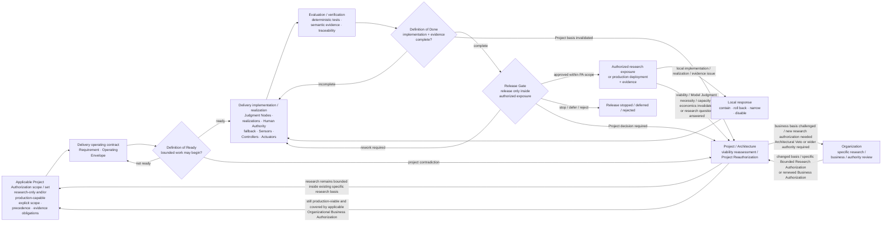

**Figure 12 — Delivery realization, bounded exposure, and release loop.** Delivery translates the applicable scoped Project Authorization or explicitly defined authorization set into a bounded operating contract and realization. DoR, DoD, and Release Gate remain distinct. The Release Gate cannot widen a research-only authorization into production. Research evidence returns to Project viability analysis; local repair remains local; and only Project / Architecture decides whether new evidence still fits the current technical authorization or requires a new viability conclusion. A new experiment outside the standing specific Bounded Research Authorization returns to Organization before Project can issue a new research-only scope.

Three Delivery decisions remain separate even when one lightweight workflow carries them.

**Definition of Ready** asks whether bounded work or an experiment may begin. Authority, scope, Judgment Nodes, required realizations, evidence plan, Human Authority, fallback, assumptions, and escalation path must be explicit enough to proceed.

**Definition of Done** asks whether implementation and evidence are complete for the reviewed scope. Required paths are covered; unavailable, bypass, and degraded behavior are tested; active versions are traceable; required Sensors and Actuators operate; and known gaps are visible.

**Release Gate** asks whether this specific exposure should be accepted, limited, conditioned, escalated, or rejected for its population, environment, active versions, evidence, residual exposure, capacity, economics, and operational readiness. Passing DoD does not force release. For research-only authorization, the gate may release only the bounded experiment defined by that authorization. A production deployment requires a production-capable Project Authorization. Evidence that invalidates the authorization or viability basis routes to Project / Architecture rather than being normalized as local QA work.

Delivery must also know whether evidence instruments remain valid for the decisions they support. Evaluators, Golden Sets, rubrics, thresholds, and structured human-review signals should carry active version, validation/calibration basis where applicable, expected coverage and uncertainty, and explicit validity-loss triggers such as changes in model, population, policy, data distribution, or operating conditions. Research or production evidence may require recalibration, replacement, revised coverage, or a changed evidence plan rather than automatic ingestion into a new baseline.

For material release, incident, experiment, and correction evidence, version traceability must support reconstruction of the **active behavioral and control baseline** rather than merely list components independently. Relevant correlation may span authoritative-source, Organizational assessment/research/business basis, the applicable Project Authorization set (including type/scope and any overlap/nesting/precedence relationship), Delivery baseline, Constraint Realization, model, prompt/instruction, context/retrieval, tool/routing, evaluator, policy/configuration, deployment scope, and fallback state. This does not require one universal UA registry; existing release, configuration, deployment, evaluation, and observability records may carry the correlation.

Fallback and recovery paths should be tested as control paths. Where material, Delivery should verify dependency/common-mode coupling, capacity and latency, transition behavior, and restoration to a known authorized state. A failed or saturated fallback is itself evidence about control adequacy.

Automation can carry repeatable invariant checks, evaluation, evidence aggregation, version comparison, routing, policy-as-code checks, blocked-action verification, release-condition checks, and safe bounded Actuation when evidence quality, failure behavior, reversibility, consequence, and delegated authority make that path credible. The automated path must itself remain observable and correctable.

For the support system, Delivery implements the actual refund guard, evaluator suite, approval routing, fallback, telemetry, and rollback/disable paths; verifies bypass behavior; correlates active versions; tests whether fallback shares a critical failure dependency; and tests whether Human Authority and fallback capacity meet the latency assumed by Project. Under a research-only authorization, it might expose the candidate only to synthetic or explicitly bounded cases with transaction execution disabled while measuring approval load and evaluator behavior. A bypassable Hard path, invalid evaluator, common-mode fallback, or approval capacity that destroys the assumed service economics can invalidate the Project basis rather than merely produce another local defect.

### Runtime — operation, correction, and reassessment

**Question owned:** Does active operation remain inside the authorized Requirement, Constraint baseline, authority, capacity, economics, **and the applicable Project Authorization scope or authorization-set semantics**—and what response is authorized when it does not?

Runtime is continuously active while the Thinking System operates, including during any authorized bounded experiment. Specific Controller decisions are activated by Sensor evidence: prohibited or unusual behavior, realization degradation or bypass, version mismatch, drift, downstream outcomes, complaints, Human Authority overload, fallback saturation, cost or latency thresholds, failed Actuators, incidents, or evidence that an authorization assumption is false.

The controlled object at runtime remains the **whole software Thinking System**. Its control perimeter remains socio-technical. Evidence may therefore include model behavior and downstream outcomes; model, prompt, retrieval, context, tool, evaluator, realization, and deployment versions; authorization failures; semantic and deterministic evidence; complaints and overrides; Human Authority capacity; fallback load; cost and latency; incident state; Actuator execution; and the resulting state after correction.

Material runtime evidence must be attributable to the baseline under which the system actually acted. Runtime therefore needs enough correlated authoritative-source, Organizational assessment/research/business basis, Project, Delivery, realization, model/prompt/context/retrieval/tool/routing/evaluator/policy/deployment/fallback identity—including the applicable Project Authorization set, each relevant authorization type/scope, and any overlap/nesting/precedence or interaction relationship—to reconstruct what was active for a material decision, incident, experiment result, or corrective action. The objective is reconstructability, not a mandatory universal registry.

A signal becomes control-relevant only when it is connected to a decision boundary. Material evidence needs an intended consumer, known coverage and uncertainty, expected decision latency, a responsible Controller, available Actuation, and a reassessment route. Sensor/evaluator validity is itself part of this obligation: an instrument calibrated for a previous model, population, policy, or operating condition cannot be presumed fit merely because it still runs.

Runtime may automate control as far as evidence quality, consequence, failure behavior, reversibility, and delegated authority make credible. Deterministic permission checks, rate limits, circuit breakers, fallback selection, exposure narrowing, or rollback may be automated. Semantic interpretation, ambiguous exceptions, or expansion of authority may still require Human Authority or an earlier horizon. Automation does not create authority simply because it can execute an action.

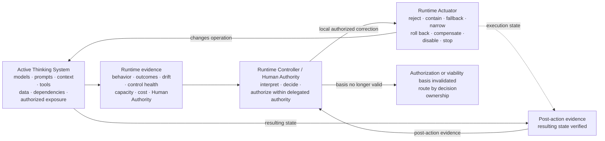

**Figure 13 — Runtime control and reassessment.** Runtime control operates through the socio-technical control perimeter around the active software Thinking System and verifies the result of corrective action. Local response may restore a previously authorized state; it does not authorize redesign, a new business basis, wider authority, or promotion from research-only to production-capable scope.

The key distinction is **restoration versus redesign**. Blocking a transaction, narrowing exposure, switching to a credible fallback, rolling back, or disabling a feature may restore a known authorized state. But fallback is not a safe state by definition: common dependencies, insufficient capacity, unavailable data or authority, or an untested restoration path can fail under the same conditions as the primary path. Persistent drift, invalid Sensor assumptions, Human Authority overload, recurring realization failure, failed fallback, new reachable consequences, or broken economics may show that there is no authorized state to “tune back to” without reopening an earlier decision.

Evidence and change route according to the **decision basis they affect**, not the team or component that first observes them. Exogenous Organizational changes are separate from Delivery/Runtime evidence:

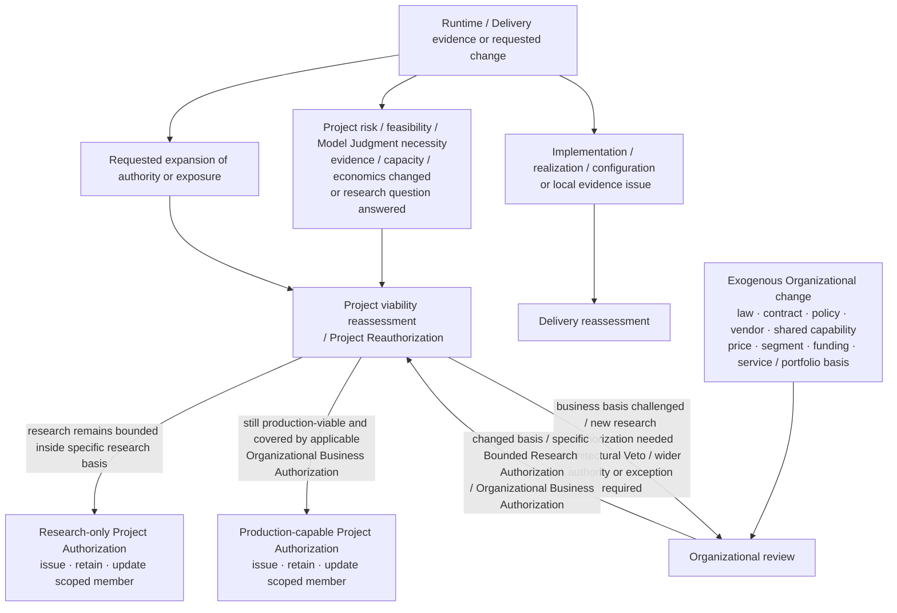

**Figure 14 — Evidence and change routing.** Local realization defects stay with Delivery. Evidence about architecture, Model-Judgment necessity, capacity, fallback, evidence sufficiency, economics, or the result of a bounded experiment first returns to Project / Architecture because Project owns the viability analysis. The research-only and production-capable branches show which scoped authorization member Project may issue, retain, or update after reassessment; they are not mutually exclusive full-system states when an explicitly separated or nested authorization set is active. A requested authority expansion also reaches Organization through Project analysis when an Organizational boundary must change. **Exogenous** authoritative or business-basis changes originate outside the Delivery/Runtime evidence lane and activate Organization directly; Project then reassesses technical consequences where the active baseline is affected. This avoids both escalation theater and false causality.

---

### Running Example | One Refund Case Across Four Decision Horizons

**Lens in this section:** how the same controlled object carries distinct standing decisions—and how assessment eligibility, bounded research, technical viability, business authorization, release, and runtime evidence remain separate.

Assume the support system may execute refunds automatically only up to **€50**, while higher-value refunds require Human Authority. The four horizons hold different standing decision bases around that same boundary.

| Horizon | Standing question / decision basis | Illustrative responsibility | What that horizon may decide |
|---|---|---|---|
| **Organization** | May this business initiative be assessed, receive a specific Bounded Research Authorization for reserved-boundary research, or pursue bounded automated refund authority—and under which authoritative/business assumptions? | Legitimate organizational business and authority owners; several bundles may be held by the same person in an SMB. | Initial admissibility/assessment eligibility; reserved refund authority; shared capabilities; exceptions; specific Bounded Research Authorization; Organizational Business Authorization to proceed, reshape, defer, or stop. |
| **Project / Architecture** | Is Model Judgment justified, which technical design best satisfies the standing Organizational basis, can the €50/Human-Authority boundary be controlled credibly, and does the full control perimeter remain viable? | Project/architecture/product/engineering decision function operating inside the Organizational basis. | Technical/design selection, category confirmation, viability conclusion, Architectural Veto, narrower/simpler alternative, economic finding; after any required Organizational research/business authorization, issue a scoped research-only or production-capable Project Authorization where applicable. |
| **Delivery** | Has the authorized boundary actually been realized and evidenced for this research or production exposure? | Delivery/release decision authority within Project Authorization. | DoR, DoD, Release Gate, local rework, narrower exposure, or escalation to Project when the technical/viability basis is challenged. |
| **Runtime** | Does active operation remain inside the authorized refund boundary and exposure, and what correction is authorized locally? | Runtime Controller and Human Authority where reserved. | Block, route, contain, verify, narrow, disable, roll back, use credible fallback, or emit reassessment evidence. |

At the start, Organization may declare the proposal eligible for Project assessment inside standing data, vendor, and authority boundaries. That eligibility may cover Project-local simulation, offline/synthetic evaluation, and other engineering evidence generation inside the standing envelope, but it **does not authorize an experiment that crosses an Organizationally reserved boundary**. Suppose Project then cannot estimate how often Human Authority will be required from offline/synthetic evidence alone. It concludes `further research required` and defines an experiment that uses live customer cases and reserved customer data to measure real approval load while transaction execution remains disabled, together with population, data, tools, duration, stopping conditions, and evidence needs. Because that experiment crosses an Organizationally reserved live-data/external-exposure boundary, Organization may now issue a **specific Bounded Research Authorization** for it. Project then issues a **research-only Project Authorization**. Delivery realizes and releases only that bounded experiment. Its evidence returns to Project; the experiment itself cannot become production simply because the results look promising.

Now suppose a later production-capable baseline exists and the model selects or proposes a **€450** refund.

- If the transaction guard deterministically blocks execution and routes the case to Human Authority, Runtime control preserved the authorized boundary. No higher-level reassessment is implied merely because the model proposed a disallowed action.
- If one release contains a bypassable amount precondition, the evidence belongs to Delivery reassessment. Delivery may repair and re-release if the authorized architecture and Project assumptions remain credible.
- If repeated evidence shows that no available realization can make the required transaction boundary credible, Project / Architecture must reassess viability. If no credible bounded control path exists for the unchanged proposal, the result is **Architectural Veto**. Organization may change the proposal, but it may not authorize the unchanged architecture simply by accepting the risk.
- If the boundary is technically credible but 35% of cases now require expensive Human Authority, approval latency is hours, and cost per resolved case exceeds the business assumption, Project first diagnoses the viability change. It may conclude **technically/control viable but economically unattractive under current assumptions**. Organization then decides whether to change price, target segment, service promise, scope, funding, investment horizon, or stop the initiative. Any materially changed basis returns to Project before a new production-capable Project Authorization is issued.
- If Project concludes that the same business outcome is better served by deterministic rules and that redesign remains inside the standing Organizational authority/business basis, it selects the deterministic architecture and records **simpler alternative preferred** in the viability conclusion. Project then confirms the category result; if no Consequential Runtime Responsibility remains materially dependent on Model Judgment, the design **exits the Thinking-System-specific lifecycle and hands off to ordinary product/software governance**; that category exit does not itself authorize funding, initiative continuation, delivery, or release. A Project-selected narrower model-assisted alternative that still materially informs a consequential responsibility remains a Thinking System and is reassessed at its narrower scope. Organization is involved only if the recommendation requires a changed outcome, authority, investment premise, strategic objective, or a business decision to continue, defer, or stop.
- If the business wants to raise the delegated threshold above the Organizationally reserved limit, Project cannot grant that authority to itself. The requested change returns to Organization, and any new authority must then be reassessed technically before Delivery receives a new baseline.
- If a law, contract, policy, vendor condition, price model, product strategy, funding decision, or other Organizationally owned basis changes independently of the system's runtime evidence, **Organization is activated directly**. Project then reassesses technical consequences if the active authorization is affected.

The point is not that every event climbs a four-step ladder. A single event activates Runtime control and only the reassessment path required by the decision basis it invalidates. Organization and Project may also iterate before Delivery ever begins, and bounded research may deliberately exist before production viability is known.

**What this adds to the case:** the €50/€450 boundary now distinguishes initial assessment eligibility, Project-owned technical/design selection and engineering viability, Organizational business/basis authority, specific Bounded Research Authorization, research-only versus production-capable technical authorization, Delivery release authority, and category exit when the Project-selected design inside the standing Organizational basis no longer depends on Model Judgment.

---

### Cross-level operating discipline — learn from negative cases without turning every deviation into governance

The current draft-normative Nested Control Lifecycle already provides downward inheritance, local reassessment, Project Reauthorization, and Organizational review. The sharper **Project viability conclusion ↔ Organizational Bounded Research / Business Authorization ↔ scoped Project Authorization** handshake developed in this section—including assessment eligibility, research-only versus production-capable authorization, and category exit after Project selects a simpler design inside the standing Organizational basis—is a paper-level lifecycle refinement under validation. The following systematic negative-case learning discipline is also a publication-facing hypothesis under validation rather than a claim of proven stabilization.

First, **measure for decisions, not dashboards**. Every material control claim or decision basis should be observable enough for its Controller to decide inside the consequence-relevant time horizon. Evidence needs a consumer, decision boundary, latency expectation, coverage, uncertainty, known blind spots, an active instrument/version identity, a validation/calibration basis where applicable, and enough baseline correlation to know which authorization/configuration state produced it.

Second, **treat a negative case as evidence requiring diagnosis, not a diagnosis by itself**. A bad output, near miss, denied action, complaint, realization failure, false block, Actuator failure, Human Authority overload, fallback saturation, economic break, experiment result, or violated assumption may later be classified as a Bug, Constraint violation, realization defect, accepted residual behavior, false positive, capacity problem, changed Project assumption, or changed Organizational business basis. It should route to the horizon that owns the affected decision basis.

Third, **analyze control failure, not only model failure**. For a material negative case ask:

```text
Did the Sensor fail to observe, observe too late, or lose validity for the decision it was meant to support?
Did the Constraint fail to express the needed boundary?
Did the Constraint Realization fail, degrade, or permit bypass?
Did the Controller have the wrong evidence, rule, authority, or latency?
Did the Actuator fail to execute or verify correction?
Did Human Authority lack information, time, capacity, independence, or power?
Did fallback share the failed dependency, lack required capacity, fail to transition, or fail to restore an authorized state?
Did automation introduce hidden failure, coupling, latency, or false confidence?
Can the event be attributed to the actual active authorization and behavioral/control baseline?
Was the Project scenario, Model-Judgment necessity rationale, feasibility assumption, or economics wrong?
Did bounded research resolve or invalidate the assumption it was authorized to test?
Was the Organizational business assumption, authoritative source, reserved decision right, or shared capability wrong or changed?
```

The visible model output is only one possible failure location.

Fourth, **improve the weakest control element and its evidence**. Corrective learning may change Sensors, Constraints, realizations, Controller logic, Actuators, Human Authority, fallback, automation, tests/evaluators, Project assumptions, Model-Judgment placement, shared capabilities, delegated authority, or economics. For evidence instruments, improvement may require recalibration, replacement, revised coverage, a changed threshold/rubric, or a new validity-loss trigger—not automatic ingestion of every incident into a baseline.

Fifth, **prefer deterministic prevention for prohibited states where feasible**, and automate control work only when the automated path is itself controllable. Repetitive sensing, invariant checks, evidence aggregation, routing, version comparison, alerting, decision support, and safe bounded Actuation are good automation candidates when evidence quality, failure behavior, reversibility, consequence, and delegated authority make them credible. Automated decisions and actions must themselves expose health, configuration, failures, and resulting state.

The stabilization objective is not zero variance from Model Judgment. It is progressive reduction of **uncontrolled or poorly understood recurrence**: make important failures structurally impossible where feasible, detect them earlier, route them faster, narrow authority where consequence demands it, improve corrective reliability, lower recovery cost, or revise the Project or Organizational basis when the original model was wrong.

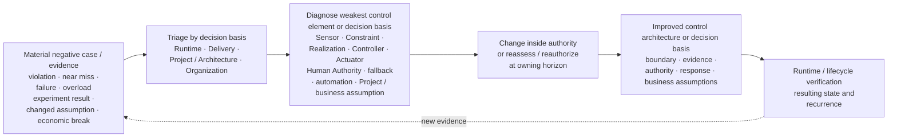

**Figure 15 — Cross-level learning and stabilization loop.** Negative cases and bounded-research evidence route to the horizon that owns the affected decision basis, then improve the weakest control element, trigger Project viability reassessment, or reopen the Organizational business/authority basis as appropriate. The figure does not imply that every case escalates, every deviation is a Bug, or the proposed stabilization effect is already empirically validated.

The four horizons therefore form a nested, recurrent lifecycle rather than a waterfall. Organizational authority and business assumptions flow into Project analysis. Initial assessment eligibility permits Project-local evidence generation inside the standing assessment envelope but not experiment exposure that crosses an Organizationally reserved boundary. Project viability evidence can return to Organization before any technical authorization exists. A Project-defined experiment that remains inside the standing assessment envelope may run under applicable Project-local engineering controls. When the experiment crosses an Organizationally reserved boundary, it may run only after specific Bounded Research Authorization and under research-only Project Authorization; in either case, research evidence returns without creating production permission. Once Organization chooses to proceed on a technically viable production basis, a production-capable Project Authorization carries the technical baseline to Delivery. Delivery realizes and releases only the authorized scope. Runtime operates it and produces evidence. Exogenous Organizational changes can also reopen the Organizational horizon directly. A simpler technical path may leave the Thinking-System-specific lifecycle at Project after category confirmation when it still satisfies the standing Organizational basis; Organization re-enters only when its business outcome, authority, investment premise, or continuation decision must change.

Lower levels may refine and narrow a higher-level authorization. They may not silently expand authority, weaken an inherited Hard Constraint, normalize evidence that Project viability has failed, promote research exposure into production, or continue under business assumptions that the owning Organizational decision no longer supports.

> **Project / Architecture owns Model-Judgment necessity, technical/design selection within the standing Organizational business/authority basis, category confirmation, and the viability conclusion. Organization owns the business outcome and basis plus the decisions to authorize specific bounded research when the experiment crosses an Organizationally reserved boundary, pursue a viable production basis, reshape that basis, defer, or stop. Project Authorization is the scoped technical baseline that connects the applicable Organizational decision to Delivery.**

> **Initial assessment eligibility permits Project-local evidence generation inside the standing assessment envelope. When needed research crosses an Organizationally reserved boundary, Project defines the experiment, Organization may issue a specific Bounded Research Authorization, and a research-only Project Authorization scopes that bounded exposure.**

> **An Architectural Veto is binding for the unchanged proposal; changing the business or authority basis creates a new proposal to reassess, not an override of engineering feasibility.**

> **A simpler alternative is a Project architecture/viability conclusion. If it satisfies the standing Organizational business/authority basis, Project may select it directly; category retest of that selected design determines whether it exits this Thinking-System-specific lifecycle.**

> **A decision owner that receives no fit-for-purpose evidence is authority on paper, not an operational Controller.**

> **The complete map should be inspected even when implementation is deliberately lightweight; proportionality is justified reduction, not permission to ignore complexity that is actually present.**

The capability anatomy and the four decision horizons now define the conceptual operating map. The next practical question is not which UA form a team must fill in. It is **how much of this map must be made explicit for this controlled object, and which existing engineering and organizational mechanisms can carry those decisions without overbuilding the process?**
