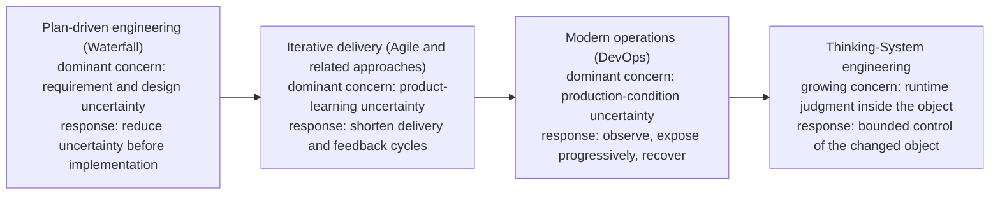
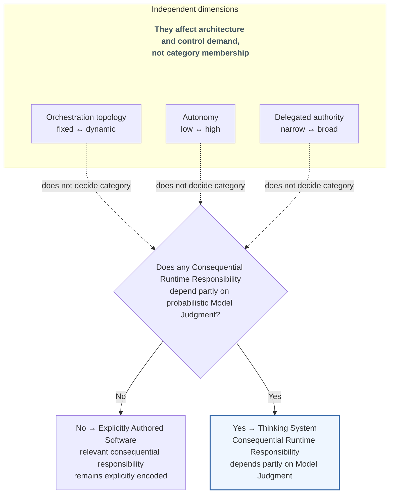
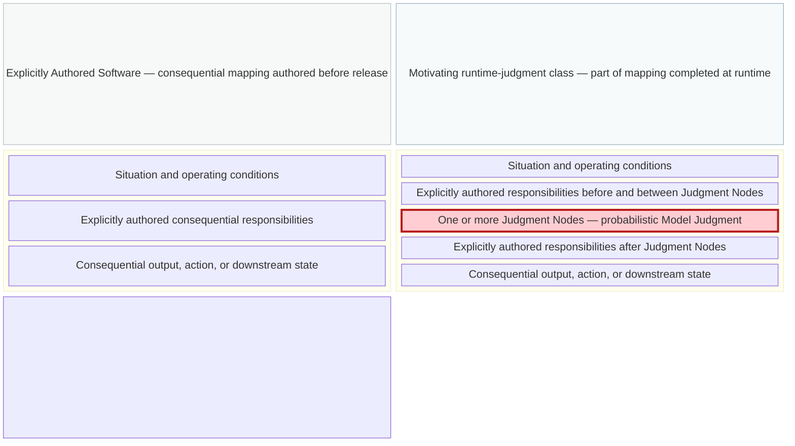
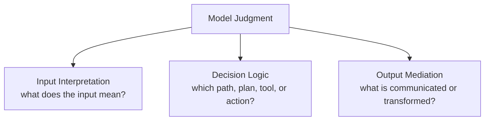
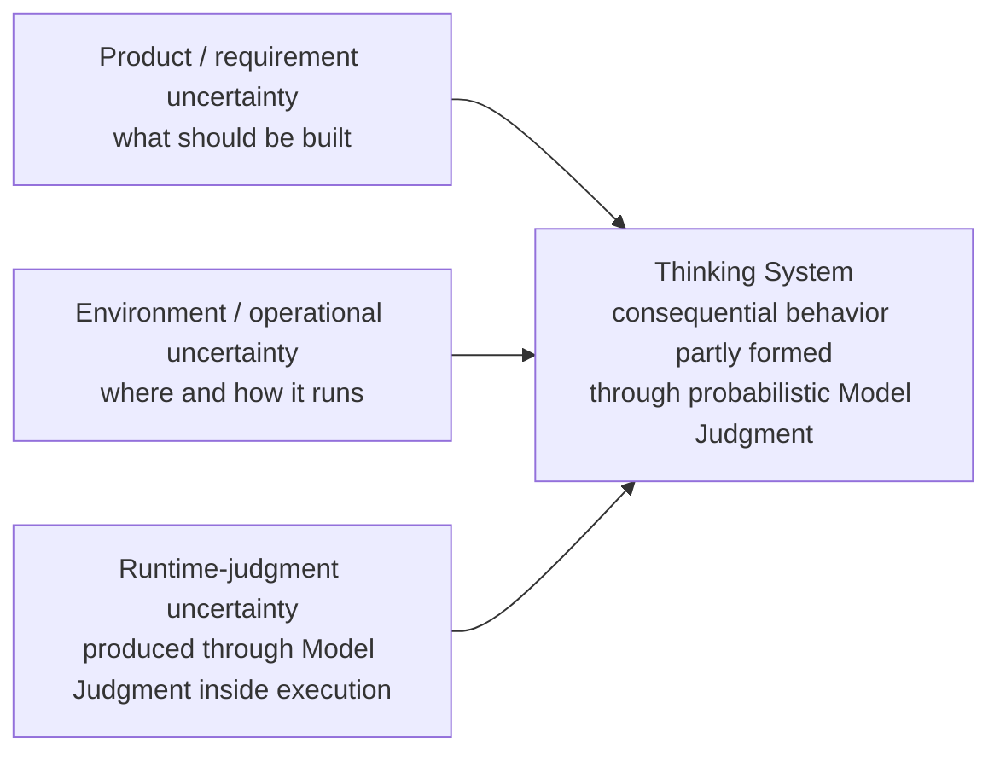
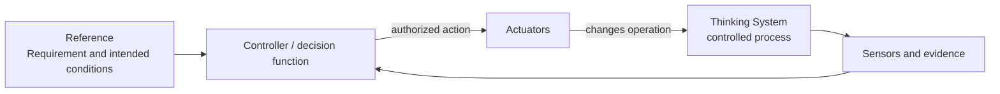
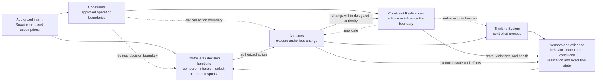
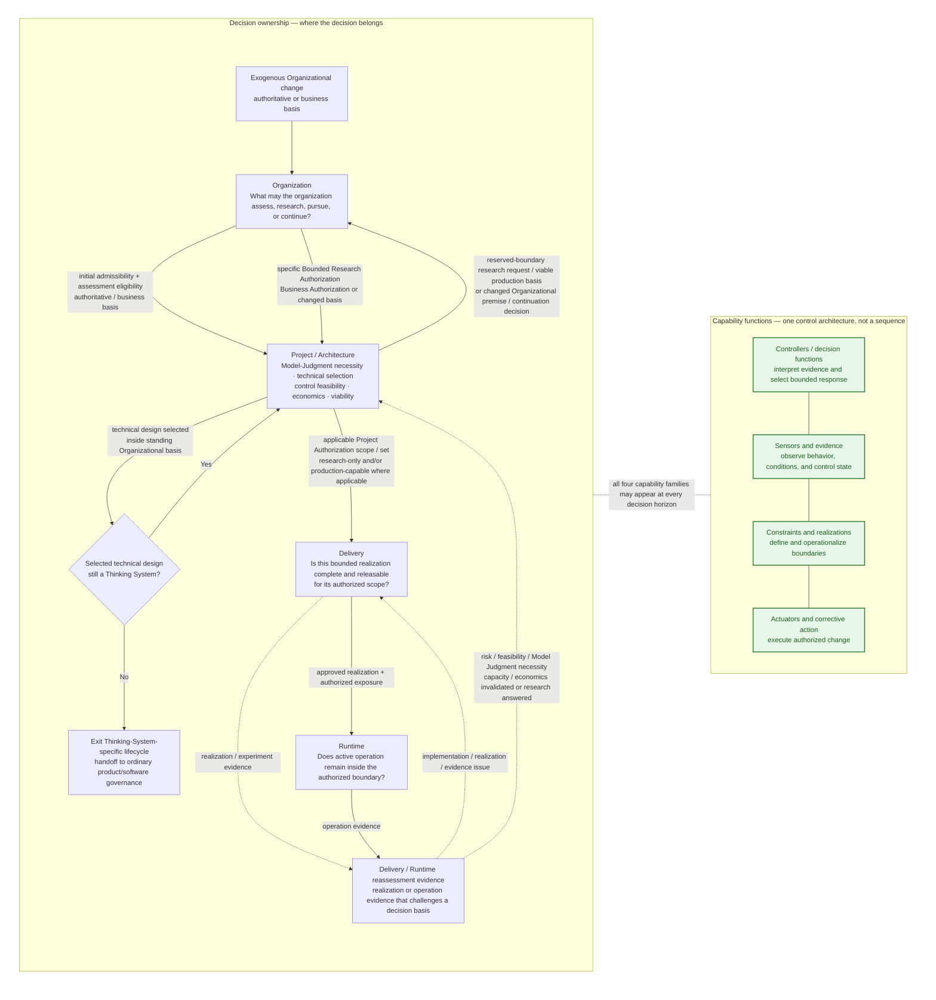

# Uncertainty Architecture: Thinking Systems — When the Controlled Object Changes

> **Publication note.** This is a shorter standalone adaptation of the living working paper [_Uncertainty Architecture: Engineering Thinking Systems with Consequential Runtime Responsibilities_](open-engineering-specification-article-draft.md). The body below deliberately stays close to the argument and terminology already established in that paper's merged Sections 1–4. It compresses detail for publication, but it is not intended to create a second conceptual version of the research. Later sections of the working paper remain unfinished so external criticism of this bounded argument can still change the larger research.

## Who this article is for

This article is intended for people who have to **design, authorize, deliver, evaluate, operate, or govern software in which one or more Consequential Runtime Responsibilities depend partly on probabilistic Model Judgment**. That includes software and solution architects; AI/ML, platform, and application engineers; QA, evaluation, reliability, and DevOps practitioners; engineering, delivery, product, and technical leaders; and risk, security, or governance practitioners who participate in real system decision rights.

It assumes familiarity with software systems and engineering delivery, but it does **not** assume prior knowledge of Uncertainty Architecture or control theory. The goal is to make the category boundary, controlled object, control capabilities, and decision-ownership model explicit enough that readers from different engineering functions can reason about the same system without first adopting a new product stack or organizational structure.

## Reader glossary

The table below is a **reader aid, not a second canonical glossary**. Where a term already exists in the [UA glossary](https://github.com/UncertaintyArchitectureGroup/uncertainty-architecture/blob/main/00-doctrine/glossary.md), the wording below is a compact restatement of that meaning. Article-specific shorthand is marked explicitly. The remaining control and lifecycle terms are introduced where they become necessary; the canonical glossary remains the terminology authority.

| Term                                     | Meaning in this article                                                                                                                                                                                                                                                                                       |
| ---------------------------------------- | ------------------------------------------------------------------------------------------------------------------------------------------------------------------------------------------------------------------------------------------------------------------------------------------------------------- |
| **Thinking System**                      | A software system in which one or more **Consequential Runtime Responsibilities** depend partly on probabilistic Model Judgment rather than being fully specified through explicitly encoded logic in advance.                                                                                                |
| **Consequential Runtime Responsibility** | A runtime responsibility whose output, decision, path, action, or downstream state can materially affect an intended outcome, an applicable Requirement or Constraint, delegated authority, resource use, or a person or system downstream. Consequential means material causal relevance, not risk severity. |
| **Model Judgment**                       | Interpretation, synthesis, classification, generation, planning, ranking, routing, or action selection performed through a probabilistic model under uncertainty.                                                                                                                                             |
| **Explicitly Authored Software** _(research term under validation)_ | Paper-level comparative label for software in which no Consequential Runtime Responsibility depends partly on Model Judgment; any such responsibilities are fulfilled entirely through explicitly encoded logic. The label concerns the consequential responsibility mapping, not whether orchestration is sequential, fixed, or dynamic, and is not yet canonical UA terminology. |
| **Judgment Node**                        | A bounded location where Model Judgment influences an output, decision, path, action, or downstream state. It is consequential for Thinking-System classification when it performs or materially influences a Consequential Runtime Responsibility.                                                           |
| **Controlled object**                    | The whole software system inside the declared boundary whose behavior engineering seeks to keep within acceptable conditions—not merely the model invocation.                                                                                                                                                 |
| **Control perimeter** _(article usage)_  | The technical and socio-technical control relationships that must follow the authority and effects of the controlled object: boundaries and their realizations, evidence, decision authority, corrective action, Human Authority where required, and reassessment paths.                                      |

## 1. Engineering Evolves Around Dominant Uncertainty

Software-engineering methods are often discussed as competing schools: planning versus iteration, development versus operations, process versus autonomy. That framing hides a more useful pattern. **Engineering expands when a consequential source of uncertainty can no longer be managed adequately by the assumptions and feedback structures already in place.**

The pattern is not a clean historical sequence, and none of the approaches below is reducible to one idea. Plan-driven development, iterative delivery, and modern operations are broader engineering responses; Waterfall, Agile, and DevOps are familiar but non-equivalent examples. The comparison here is narrower: each response can be read as characteristic of a different location of uncertainty and feedback.

**Plan-driven development (including Waterfall)** treats significant requirement and design uncertainty as something to reduce before implementation. Analysis, decomposition, specification, approval, and planned execution remain rational where the problem can be understood sufficiently in advance, the cost of change is high, and late feedback is dangerous.

**Iterative delivery (including Agile and related approaches)** starts from a different limit: important requirements often cannot be stabilized through analysis alone because users, markets, and teams learn by interacting with working software. The response is to shorten the cycle between assumption, delivery, use, and revision. Feedback moves closer to implementation and becomes part of the product-development mechanism.

**Modern operations (commonly associated with DevOps)** exposes another limit. Even a well-understood feature cannot be exhaustively validated against every production combination of traffic, infrastructure, dependency, configuration, user behavior, and failure condition. Engineering therefore extends beyond release through telemetry, progressive exposure, rollback, resilience, and incident response.

**The motivating class examined in this article adds a distinct source of uncertainty.** The uncertainty is not only in what should be built or in the environment in which software runs. It also appears where Model Judgment leaves part of a Consequential Runtime Responsibility unresolved until operation and consequential behavior is selected or constructed inside the controlled object. Whether the broader current Thinking-System definition should also include fixed learned probabilistic functions whose deployed mapping is determined before release remains under validation rather than being assumed by this argument. The engineering problem is how to build and operate systems that use probabilistic Model Judgment without surrendering explicit boundaries, evidence, decision authority, and corrective control.



**Figure 1 — Engineering expands its feedback model as consequential uncertainty moves closer to runtime and eventually enters the controlled object.** The current definition is written without an LLM-only condition, but whether fixed learned probabilistic systems and runtime judgment processes belong to one engineering category remains under validation. This transition therefore does not establish which earlier systems satisfy the category or how prevalent they were. LLMs and other general-purpose models make runtime model-mediated judgment substantially easier to instantiate across ordinary software. Waterfall, Agile, and DevOps are shown as familiar examples of broader engineering responses. The progression is conceptual, not replacement history.

In this article, a **Thinking System** is:

> A software system in which one or more **Consequential Runtime Responsibilities** depend partly on probabilistic Model Judgment rather than being fully specified through explicitly encoded logic in advance.

A runtime responsibility is a **Consequential Runtime Responsibility** when its output, decision, path, action, or downstream state can materially affect an intended outcome, satisfaction of an applicable Requirement or Constraint, the exercise of delegated authority, resource use, or a person or system downstream. **Consequential describes material causal relevance, not implementation mechanism or risk severity.** A Consequential Runtime Responsibility may be fulfilled entirely through explicitly encoded logic or may depend partly on probabilistic Model Judgment; Thinking-System classification changes only in the latter case. Harm, severity, likelihood, autonomy, regulation, control adequacy, and production readiness are separate questions. A model invocation with no material influence on any Consequential Runtime Responsibility does not establish the category by itself.

The definition identifies the changed engineering object; it does not certify control adequacy. A Thinking System can be well controlled, poorly controlled, experimental, or not ready for production. Constraints, evidence, decision rights, and corrective mechanisms belong to the engineering response around Model-Judgment-dependent Consequential Runtime Responsibilities; they are not the condition that makes the category exist.

The word **Thinking** is functional rather than anthropomorphic. It does not claim consciousness or human-like cognition; it gives engineering a stable name for software in which one or more Consequential Runtime Responsibilities depend partly on probabilistic Model Judgment.

**Model Judgment** means interpretation, synthesis, classification, generation, planning, ranking, routing, or action selection performed through a probabilistic model under uncertainty. It is useful precisely because the required behavior cannot always be exhaustively encoded in advance.

The current Thinking-System definition is written in technology-neutral terms, but this breadth remains under validation. A fixed learned model such as traditional credit scoring may produce probabilistic scores while its deployed input-to-output mapping is fully determined before release; that does not automatically establish the release-contract shift developed below, where part of the consequential mapping remains unresolved until runtime. Such pre-LLM systems are therefore boundary tests rather than established examples. A document summarizer or code-completion suggestion tests a different question: whether Output Mediation can make a low-consequence responsibility materially consequential. LLMs remain the practical trigger for this article because they make runtime model-mediated interpretation, synthesis, generation, routing, planning, and action selection general-purpose and easy to embed across ordinary software.

Category membership does not determine consequence severity or control depth. If an internal summarizer used for a reversible, inspectable prioritization decision independently satisfies the category test, it may need only a small explicit control surface; an agent able to change financial or operational state may require much stronger Constraints, evidence, Human Authority, fallback, and runtime intervention. The complete map is a diagnostic reference, not a mandate to instantiate every control mechanism for every case.

The category must not be collapsed into “agentic application.” The classification question is narrower: does any Consequential Runtime Responsibility depend partly on probabilistic Model Judgment? If not, the relevant consequential responsibility remains explicitly authored and this article calls the system **Explicitly Authored Software**, even when orchestration is dynamic. If yes, the software satisfies the current Thinking-System classification test even when orchestration is fixed. Whether every system admitted by that wording also exhibits the runtime-unresolved responsibility structure developed in Section 2 remains under `TS-SCOPE-001`. Orchestration topology, autonomy, and delegated authority affect architecture and control demand, but they do not decide the category.



**Figure 2 — Thinking-System classification turns on whether a Consequential Runtime Responsibility depends partly on probabilistic Model Judgment, not workflow topology or autonomy.** Fixed and dynamic workflows can fall on either side of the category boundary.

Broader labels remain useful, but they answer different questions.

| Label                                                                                                                        | What it primarily tells us                                                                       | What it does not tell us                                                                                                            |
| ---------------------------------------------------------------------------------------------------------------------------- | ------------------------------------------------------------------------------------------------ | ----------------------------------------------------------------------------------------------------------------------------------- |
| **[AI-based system (ISO/IEC TR 29119-11)](https://www.iso.org/standard/79016.html)**                                         | Presence of at least one AI component                                                            | Component presence alone does not say whether a Consequential Runtime Responsibility depends partly on probabilistic Model Judgment |
| **[AI system (NIST AI RMF)](https://www.nist.gov/publications/artificial-intelligence-risk-management-framework-ai-rmf-10)** | A broader system producing machine-generated outputs that influence real or virtual environments | The scope is broader than the responsibility boundary used here                                                                     |
| **LLM application**                                                                                                          | Use of a particular model technology                                                             | Technology choice does not say what consequential responsibility the model carries                                                  |
| **Agentic system**                                                                                                           | Terminology varies; commonly emphasizes agency, tool use, autonomous action, or orchestration    | Agency, autonomy, and authority are separate dimensions from the category test                                                      |
| **Autonomous system**                                                                                                        | Degree of independent operation                                                                  | Autonomy changes control demand but does not establish whether a consequential responsibility depends partly on Model Judgment      |
| **Thinking System (this article)**                                                                                           | A Consequential Runtime Responsibility depends partly on probabilistic Model Judgment            | Identifies the responsibility boundary under test; the controlled-object/release-contract shift is developed for the motivating runtime-judgment class while broader scope remains under validation |

This is a narrow analytical comparison, not a judgment that broader AI-system concepts, NIST AI RMF, ISO standards, or agentic terminology are technically shallow or operationally incomplete. **Thinking System** is not proposed as a replacement for _AI system_; it names the responsibility boundary relevant to the engineering argument developed here.

## 2. The Controlled Object Has Changed

A controlled object is the thing whose behavior engineering seeks to keep within acceptable conditions. For this category, that object is never only source code or a model invocation. It is the whole software system within its declared boundary: deployed components, data, configuration, dependencies, infrastructure, and software-operated processes and interfaces. The behavior being controlled must be assessed through the downstream effects that system can produce; those effects do not become additional software components. Relevant human roles and interactions may belong to the **socio-technical control perimeter around that object**; they do not become part of the controlled process merely because they observe, authorize, or change it. A software component may implement a control function while remaining physically inside the system boundary, but the controlled-process and control-function relationships remain conceptually distinct.

The controlled-object argument developed here concerns the motivating class in which one or more Consequential Runtime Responsibilities depend on Model Judgment in a way that leaves part of the consequential mapping unresolved until operation. The change can occur in the first model-enabled iteration; it does not require autonomous agents, dynamic orchestration, multiple models, memory, or a mature AI platform. Whether the broader current definition should also include fixed learned probabilistic functions whose deployed mapping is determined before release remains an explicit boundary question.

A useful design-contract abstraction for explicitly encoded deterministic responsibility is:

```text
y = f(x, context, configuration, system state)
```

This does not claim perfect physical repeatability. It means that the intended mapping over the relevant input, context, configuration, and state is authored through explicit logic, rules, state transitions, or other inspectable mechanisms and can be tested against specified conditions.

Over the same classes of relevant conditions, a model-mediated responsibility is better represented as selection from plausible outcomes:

```text
y ~ P(y | x, context, configuration, system state)
```

For the same apparent request, plausible behavior may vary with context, model version, instructions, retrieval results, tools, configuration, prior interaction, data distribution, or operating conditions. The system does not merely execute a fully enumerated decision; part of the consequential mapping is selected or constructed at runtime.

> **Release-contract shift.** For an explicitly authored consequential responsibility, Delivery releases an implementation whose intended situation-to-consequence mapping is specified in inspectable logic before release, even when it is branching, stateful, concurrent, or operationally uncertain. A release in the motivating class examined here also places into operation a judgment process that will complete part of that mapping at runtime. The important distinction is not the number of terminal outputs but whether the consequential decision structure is determined through explicitly authored logic before release or partly completed by Model Judgment at runtime. In LLM-based systems, a few allowed actions may still depend on Model Judgment over a large, context-dependent space of situations, meanings, and evidence. Production readiness therefore depends not only on the implementation already written, but on whether the surrounding control architecture can keep the resulting system operation, reachable authority, and consequential effects within the approved boundary despite judgment that remains unresolved until runtime.

What remains open is not necessarily the set of terminal actions, but the judgment-dependent mapping from situations and context to consequential behavior. In the LLM use cases that motivate this category, the space of possible situations, meanings, evidence, and relevant distinctions can be large and only partly characterized in advance even when downstream actions are tightly enumerated. Keep three questions separate: whether the resulting behavior is desired, accepted only within stated conditions or residual bounds, or prohibited; whether the case is sufficiently characterized or remains uncertain or unclassified; and whether execution or acceptance is within delegated authority or reserved for Human Authority. The complete distribution or decision boundary need not be known or measurable for this distinction to matter. These are different control questions rather than one model-quality score: behavioral acceptability requires an approved boundary, epistemic uncertainty requires evidence fit for the decision, authority requires a legitimate decision path, and consequential execution requires a mechanism that can actually change or stop operation. Section 3 turns those needs into the four capability families of bounded control.

This does not mean conventional software had one path, no nondeterminism, or no surprises. The difference is that unexpected behavior can now arise not only from defects or conditions around a fixed intended mapping, but also from a semantically wrong, contextually inappropriate, unsupported, or unauthorized selection inside the runtime judgment space. This is a qualitative shift in the failure surface, not a claim that every Thinking System necessarily produces more errors. A single material outcome or a repeated pattern may therefore require a local implementation correction, reassessment of the release basis, architectural redesign, or a change to the underlying authority or business premise. Section 4 formalizes these as distinct decision horizons rather than treating every negative case as the same kind of failure or escalation.

The architectural difference can be shown without pretending that conventional software consists of one linear function or that every Thinking System follows one pipeline.



**Figure 3 — The controlled-object shift for the motivating class.** Explicitly authored responsibilities remain part of the system while Model Judgment leaves part of a Consequential Runtime Responsibility unresolved until operation, so part of the consequential mapping is completed at runtime. The figure does not resolve whether fixed learned probabilistic functions with a release-time-determined mapping belong to the broader Thinking-System category. The vertical paths are schematic responsibility relationships, not a prescribed execution topology. Red marks only the Judgment Node where the responsibility structure changes; it does not imply that the whole system is probabilistic, unsafe, or erroneous.

Model Judgment can enter a system through several functional placements.

**Input Interpretation** converts ambiguous, unstructured, incomplete, or context-dependent input into a representation the rest of the system can use. It may affect what the system believes the user requested, which entities matter, which policy or context is relevant, or which deterministic path becomes available.

**Decision Logic** influences or selects a route, ranking, plan, priority, tool, or action. It may recommend an action, choose among bounded alternatives, or initiate a step only where the surrounding authority boundary permits it.

**Output Mediation** creates, adapts, filters, summarizes, explains, or transforms information for a person or downstream system. Even when underlying data remains unchanged, mediation can alter what someone understands, trusts, approves, discloses, or does next.

These are placement functions, not a mandatory three-stage pipeline.



**Figure 4 — Functional placement of Model Judgment.** Model Judgment is the parent concept; Input Interpretation, Decision Logic, and Output Mediation are functional placements beneath it. They are not mandatory stages or a prescribed execution order.

These placements are useful precisely where consequential interpretation, synthesis, or selection cannot be exhaustively specified in advance. **The engineering problem is to preserve that useful judgment while bounding the resulting operation.**

Consider one fictional bounded customer-support resolution system. It receives a customer request, retrieves authorized account and policy context, interprets the issue, selects or recommends a resolution path, prepares consequential customer communication, and may eventually execute a bounded refund or route the case to Human Authority.

The system can remain mixed. Retrieval, identity, permissions, tool access, and execution paths may stay deterministic while request interpretation, resolution selection, or response generation depends partly on Model Judgment. Its orchestration can be predefined. That does not change the category test.

Now follow the **consequential responsibility rather than the model boundary**. If Model Judgment can influence which remedy applies, what the customer is told, whether a refund is proposed, or whether an authorized tool changes downstream business state, then the engineering perimeter cannot stop at the model-serving component. That perimeter includes the path by which runtime judgment becomes a consequential outcome and connects it to the permissions, evidence, Human Authority, and corrective mechanisms needed to keep the path inside an authorized boundary.

For a material case, that control perimeter may therefore become explicitly **socio-technical** and cross technical, delivery, architectural, human-authority, and organizational decision boundaries. A bounded-refund authority may originate outside the runtime system, depend on architectural choices about where Model Judgment is permitted, require a concrete Delivery realization, and ultimately constrain whether a runtime transaction can execute. The point is the **reach of the perimeter**, not that the human organization becomes part of the controlled software process.

This does not mean every Thinking System needs separate departments, committees, or a maximal governance stack. The same people or platform may carry several responsibilities, and lower-consequence systems may realize the required control perimeter lightly. The point is causal: once probabilistic Model Judgment participates in a consequential responsibility, the required control perimeter follows the authority and effects of the **whole controlled object**, potentially all the way to organizational decision rights.

The new uncertainty also does not replace earlier uncertainty. It adds another location that engineering must connect to the others.



**Figure 5 — Three connected uncertainty locations.** Product and requirement uncertainty, environment and operational uncertainty, and runtime-judgment uncertainty coexist. Product methods, deterministic software engineering, DevOps, resilience, security, and incident response remain necessary; Thinking-System engineering adds explicit treatment of uncertainty produced through runtime judgment inside the controlled object.

The example exposes a broader consequence: the control perimeter of a Thinking System may cross technical, delivery, architectural, human-authority, and organizational decision boundaries. Different decisions across that perimeter require different evidence, authority, and corrective mechanisms.

Across that expanded perimeter, the concrete subject changes but a recurring control structure appears:

```text
What outcome or condition is intended?
→ What operating space is acceptable?
→ What uncertainty or disturbance can move the object outside it?
→ What evidence reveals behavior, outcome, conditions, and control state?
→ Who or what may decide that action is required?
→ Which mechanism can change operation?
→ When does new evidence require reassessment at this or an earlier level?
```

This recurrence is the bridge to control theory. The transfer is structural, not literal. Organizations, projects, delivery teams, and runtime services are not one mathematical Controller, and legal interpretation, business viability, social authority, and model behavior cannot be collapsed into one scalar error signal.

The useful transfer is that bounded control requires an intended condition, an approved operating space, evidence about the controlled process, legitimate decision authority, a path to corrective action, and a mechanism for revisiting assumptions when the control basis changes. Existing product, architecture, software-engineering, security, operations, safety, and governance disciplines remain necessary. The changed object requires their decisions to be connected around the same system rather than treated as independent practices assembled around an AI component.

The problem is therefore not merely that AI is harder to test. Part of the controlled object's consequential behavior is now produced through runtime judgment, and every decision that controls that object must account for the change.

## 3. From Model Quality to Bounded Control

The controlled-object shift changes what counts as sufficient engineering evidence. Once a Consequential Runtime Responsibility depends partly on probabilistic Model Judgment, teams naturally invest in measurement: test sets, evaluators, traces, model comparisons, cost and latency monitoring, incident data, and downstream outcome analysis. All of that is necessary. None of it, by itself, establishes control.

Measurement answers questions such as _what happened, how often, under which conditions, and with what confidence?_ Control adds different questions: _relative to which approved boundary, who or what may decide that action is required, which action can actually change operation, and what happens when the assumptions behind the boundary no longer hold?_

A feedback loop becomes closed when evidence about the controlled process reaches a decision function and an authorized action can affect the process again:



**Figure 6 — A closed feedback loop.** Evidence reaches a Controller / decision function and an authorized action changes the controlled process. Decision authority comes from the applicable authorized decision boundary; the Controller operates within that boundary rather than constituting its source. The figure deliberately does not yet claim that the loop operates inside a legitimate or adequately realized boundary.

A closed loop can still be unacceptable. It may optimize the wrong objective, react too slowly for the consequence, rely on evidence that misses the relevant failure, or possess authority that was never legitimately delegated. Its Actuator may be able to change a prompt but not prevent a transaction. It may keep an evaluator score inside tolerance while Human Authority, fallback capacity, latency, or unit economics collapse. Closing feedback is therefore weaker than bounding operation.

A bounded control architecture requires four distinct capability families. They are logical functions, not mandatory products, services, teams, layers, or one execution order.

**Constraints and their realizations** define and operationalize approved boundaries. A Constraint is an authoritative decision object: an approved condition limiting the allowed operating space. A Constraint Realization is the technical or socio-technical mechanism that implements, enforces, or influences that boundary.

**Sensors and evidence** expose behavior, outcomes, operating conditions, realization state, control health, Actuator execution, and the assumptions on which authorization depends. Evidence must be fit for the decision it informs and expose uncertainty, coverage, latency, and blind spots.

**Controllers and decision authority** compare or interpret evidence relative to approved Requirements, Constraints, assumptions, and a defined decision boundary, then select or authorize action within delegated authority. A Controller does not create its own authority; reserved decisions must route to Human Authority or another legitimate decision process.

**Actuators and corrective action** execute authorized change. They may block, route, narrow exposure, switch fallback, disable, roll back, compensate, or otherwise change operation or a Constraint Realization within delegated authority.

Take one boundary in the support-resolution system: automated refunds are permitted only up to a delegated amount; above that amount, execution requires **Human Authority**. The important engineering object is not the sentence “large refunds require approval.” The control problem is whether that authoritative boundary survives the complete path from Model Judgment to downstream transaction.

A credible realization may combine transaction permissions, an amount precondition, scoped approval state tied to an authenticated authorized identity and matching transaction, and an endpoint that rejects execution when valid approval is absent. Sensors must expose attempted and blocked transactions, approval outcomes, bypass attempts, realization health, downstream results, and Human Authority latency/capacity. A Controller must interpret the evidence against the applicable Constraint and select or authorize the response inside its decision boundary. Actuators must perform the selected change; Sensors must expose whether execution occurred and what state resulted.

Human Authority is substantive only when the person has enough information, time, competence, capacity, independence, and power to change the outcome. An approval button attached to an overloaded queue is not a complete control path.



**Figure 7 — Complete bounded control architecture.** The four capability families are logical functions, not mandatory services, products, teams, layers, or one execution order. Realizations may act before, during, or after Model Judgment; Controllers and Actuators may be synchronous or asynchronous; one component may perform several functions.

This is the difference between a measured system, a closed feedback loop, and a bounded controlled system. The last requires not merely feedback but an approved and credibly realized operating boundary, evidence fit for the decisions being made, legitimate decision authority, effective corrective action, and a path for reassessment when the basis of control changes. Here, a **complete control architecture** means materially complete for the authorized scope, not maximal instantiation of every possible control mechanism.

For production use of a Thinking System, these are not gaps that can be delegated to a post-release governance review. **The system is not ready for production at the intended scope while any material control responsibility remains unowned, unrealized, insufficiently evidenced for its decision, or without a credible corrective or reassessment path.** Governance becomes operational through that socio-technical control architecture; it is not a document layered over the system.

The capability anatomy explains **how** bounded control becomes possible. It does not yet determine **where** organizational authorization, project viability, delivery release, runtime correction, and reassessment decisions belong.

## 4. How Far Can the Control Perimeter Reach?

The capability anatomy tells us how a bounded control relationship can work. It still does not answer a second question: **where does each consequential decision legitimately belong, and how does evidence move between those decision owners without collapsing engineering analysis, business authorization, release, and runtime control into one generic “AI governance gate”?**

The same Thinking System can require fundamentally different decisions around the same controlled object. Someone must decide whether the intended outcome, external exposure, and delegated authority are legitimate at all. Someone must decide whether Model Judgment is actually necessary and whether a credible bounded architecture exists. Someone must decide whether the concrete realization has enough evidence to be released for its authorized scope. And during operation, someone or something must decide whether the system remains inside that boundary and what corrective action is permitted now. These decisions concern one system, but they differ in evidence, authority, time horizon, and available action even when the same person or platform carries several of them.

**[STAMP](https://mitpress.mit.edu/9780262533690/engineering-a-safer-world/) already models hierarchical socio-technical control structures that can extend from software and operators through management and regulatory authority; [STPA](https://psas.scripts.mit.edu/home/get_file.php?name=STPA_handbook.pdf) applies that systems-theoretic model to analyze unsafe control actions and causal scenarios.** The four-horizon model does not claim to introduce that reach. Its narrower hypothesis is that, for model-judgment-dependent software, explicitly separating lifecycle decision ownership across Organization, Project / Architecture, Delivery / Release, and Runtime may help practitioners distinguish business and authority authorization, technical viability, release scope, delegated runtime correction, and reassessment when a decision basis is no longer valid. Whether this adds useful operational clarity beyond a well-applied STAMP/STPA control structure remains a question for systematic comparison; the four-horizon model may instead merely rename existing concepts or lose relationships that STAMP/STPA represents more faithfully.

UA represents these distinct decision bases through four connected horizons: **Organization, Project / Architecture, Delivery, and Runtime**.

The four horizons can therefore be read first as four irreducible questions:

- **Organization:** Is the outcome, exposure, and delegated authority legitimate?
- **Project / Architecture:** Is Model Judgment necessary, and is the bounded design technically and operationally viable?
- **Delivery:** Is this concrete realization complete, sufficiently evidenced, and releasable within that basis?
- **Runtime:** Does active operation remain inside the authorized boundary, and what correction is permitted now?

The repository's current draft-normative **Nested Control Lifecycle** already establishes those four connected levels, downward inheritance, local reassessment, Project Reauthorization, and Organizational review. The long-form paper then makes one additional lifecycle distinction explicit as a **research refinement under validation**: Project / Architecture owns Model-Judgment necessity, technical/design selection within the standing Organizational business and authority basis, and the engineering viability conclusion; Organization owns the business outcome and authoritative/investment basis plus the business decision to authorize specific bounded research when the proposed experiment crosses an Organizationally reserved boundary, proceed with a viable production initiative, reshape that basis, defer, or stop; and under that refinement **Project Authorization becomes the scoped technical authorization baseline that connects the applicable Organizational decision to Delivery**. The long-form paper further distinguishes research-only and production-capable Project Authorizations; those detailed authorization forms remain part of the same research refinement and are intentionally not expanded here. **That sharper Organization / Project split is the paper's research hypothesis, not yet status-bearing UA doctrine.**

The more detailed responsibilities used in this article remain:

- **Organization** owns initial admissibility and assessment eligibility, authoritative boundaries, reserved decision rights, shared capabilities, exceptions, and business authority. Under the paper-level refinement, it also owns specific Bounded Research Authorization for research that crosses an Organizationally reserved boundary, Business Authorization for a viable production basis, changed-basis decisions, and initiative-level proceed, reshape, defer, or stop decisions.
- **Project / Architecture** owns Model-Judgment necessity analysis, alternatives, technical/design selection inside the standing Organizational basis, category confirmation for the selected design, the concrete control architecture, technical/control feasibility, Human Authority and fallback feasibility, complete control economics, and the resulting viability conclusion. After any required Organizational decision, it issues the applicable scoped research-only or production-capable Project Authorization or authorization set.
- **Delivery** owns the bounded Requirement and Operating Envelope, implementation-level Judgment Nodes, concrete realizations and evidence, Definition of Ready, Definition of Done, and the deployment-specific Release Gate inside the applicable Project Authorization scope or authorization set; it may release only the bounded research or production exposure that authorization permits.
- **Runtime** owns operation inside delegated authority: observe, decide, act, verify, restore where possible, and emit reassessment evidence when the active authorization basis no longer holds.

One person may hold several of these responsibilities in a small organization. One platform may implement pieces of several control functions. That does **not** collapse the decisions.

The decision horizons answer **where a decision is owned**. The capability families from Section 3 answer **how boundaries, evidence, decisions, and actions become operational**. They remain orthogonal. Every horizon can require Constraints and realizations, Sensors and evidence, Controllers and legitimate decision authority, and Actuators. A legal or business decision at Organization does not become a Sensor merely because evidence informed it; a runtime service does not become the Organizational Controller merely because it executes a policy.



**Figure 8 — Two orthogonal models.** The left side preserves the decision semantics of the living manuscript: initial assessment eligibility is distinct from a later specific Bounded Research Authorization; Project / Architecture owns technical/design selection and category confirmation inside the standing Organizational basis; Organization is reactivated only when its business, authority, investment basis, or an initiative-level reserved-boundary research or continuation decision is implicated; research-only and production-capable Project Authorization remain distinct scoped forms and may coexist only under explicit scope, precedence, and interaction semantics; Delivery and Runtime reassessment evidence returns to Delivery or Project according to the decision basis it challenges; and exogenous Organizational change activates Organization independently. The green side is the capability anatomy. Controllers, Sensors, Constraints, and Actuators are stacked vertically and connected with non-directional lines to show that they belong to one control architecture; the vertical order is a reading aid, not an execution sequence. There is no one-to-one mapping between horizons and capability families.

Sometimes correction is local. A realization or configuration defect may be repaired by Delivery. A deployment can be rolled back. Exposure can be narrowed. An evaluator may be replaced or recalibrated locally only when the change remains inside delegated Delivery authority and does not change the evidence semantics, applicability assumptions, or other basis underlying the applicable Delivery evidence/release decision or Project Authorization. If only the Delivery basis changes, Delivery must revalidate or reassess the affected release decision; if a Project-Authorization basis changes, the evidence routes to Project / Architecture.

Sometimes the evidence is architectural. If Human Authority is overloaded, fallback cannot carry expected traffic, Model-Judgment placement no longer produces the expected value, or a supposedly deterministic boundary cannot actually be realized, the Project / Architecture basis has changed. Runtime cannot solve that by silently widening authority or adding another retry. The design has to be reassessed.

Control economics belongs in that reassessment. Project / Architecture must expose the complete cost and feasibility of the control perimeter. Under the paper-level ownership refinement, if the architecture remains technically viable but Human Authority burden, latency, operating cost, or investment requirement makes the business case unattractive, that engineering finding reaches the owner of the business or investment basis rather than being converted into a technical veto.

And sometimes the relevant change reaches further still. An Organizationally owned legal, contractual, policy, vendor, business, or reserved-authority premise may change outside the software entirely. Or project/runtime evidence may show that such a boundary is no longer adequate. The legitimate authority that owns that basis must change it; Project / Architecture then reassesses the design against the changed context.

The larger conclusion does **not** depend on accepting every detail of that ownership refinement. Section 2 already established the more basic point: for a material case, the required control perimeter may cross technical, delivery, architectural, Human Authority, and organizational decision boundaries. **Once probabilistic Model Judgment participates in a consequential responsibility, the required control perimeter follows the authority and effects of the whole controlled object, potentially all the way to organizational decision rights.**

That does not make employees software components, nor does it make the organization part of the controlled software process. It means that people and organizational decision processes may become necessary architectural elements of the **control system around the software**. Software architecture alone can therefore be an incomplete description of the production **control architecture** required for a consequential Thinking System.

This is the engineering problem the larger **Uncertainty Architecture** research track is trying to map.

## What Changes in Engineering Practice

A Thinking System is not defined by agentic orchestration or by how autonomous it looks. It exists when one or more Consequential Runtime Responsibilities depend partly on probabilistic Model Judgment. That changes what Delivery puts into operation: not only an implementation whose consequential decision structure is already determined through explicitly authored logic, but a system in which part of that structure will be completed through judgment at runtime.

The engineering response is therefore not to pretend that Model Judgment can be made deterministic. It is to bound the **whole system that turns judgment into consequences**. That requires approved Constraints and credible realizations, evidence fit for the decisions being made, legitimate decision authority, effective corrective action, and reassessment when runtime evidence invalidates the basis on which the system was designed, released, authorized, or allowed to continue.

This is the practical consequence of the changed controlled object: **when a Consequential Runtime Responsibility depends partly on probabilistic Model Judgment, the resulting uncertainty becomes part of the engineering control problem, and control must follow that responsibility through the system to the authority and mechanisms capable of changing its effects.**

## Intellectual Context and Claim Boundary

This argument does not claim invention of feedback control, socio-technical safety, runtime assurance, software engineering for AI, human oversight, or AI risk management. It sits in continuity with established systems/safety/control traditions and current AI engineering practice.

The planned comparison extends beyond STAMP/STPA to Simplex and related runtime-assurance architectures, control-theoretic research, production ML and software-engineering practice, AI risk and management systems, and implementation approaches such as orchestration, guardrails, evaluation, observability, and integrated platforms. That work remains unfinished research and is intentionally bidirectional: it asks not only what another method leaves outside its normal scope, but what the four-horizon model itself flattens, renames, duplicates, or adds unnecessarily.

The claim under test is narrower: whether connecting **Thinking-System classification**, the **whole software system as the controlled object**, explicit control-capability functions, and **the orthogonal relationship between lifecycle decision ownership and control-capability functions** around the same consequential responsibility gives practitioners a useful engineering map—and whether an existing method or composition already does that more simply.

Relevant primary or authoritative context includes Nancy Leveson's systems-theoretic safety work in [_Engineering a Safer World_](https://mitpress.mit.edu/9780262533690/engineering-a-safer-world/), the Software Engineering Institute's [Simplex architecture](https://www.sei.cmu.edu/library/an-architectural-description-of-the-simplex-architecture/) for dependable and evolvable process-control systems, the [NIST AI Risk Management Framework 1.0](https://www.nist.gov/publications/artificial-intelligence-risk-management-framework-ai-rmf-10), and [ISO/IEC TR 29119-11:2020](https://www.iso.org/standard/79016.html) on testing AI-based systems. These are antecedents and comparison points, not claimed derivations, endorsements, or exact equivalents of UA.

The **living editorial blueprint** extends the remaining research into proportional implementation, substitution against existing engineering methods and platforms, detailed lifecycle semantics, and a broader validation agenda. The working paper itself remains under development; later sections are planned to test those questions rather than being treated here as completed analysis.

If STAMP/STPA, Simplex/runtime-assurance patterns, NIST/ISO-based practice, a managed AI platform, an internal engineering method, or another coherent composition preserves the material relationships with equal or stronger semantics and less overhead, that would be evidence to narrow UA rather than a threat to it.

## Why Publish This Before the Larger Paper Is Finished?

The larger working paper is planned to continue into proportional implementation, substitution against existing engineering methods and platforms, detailed lifecycle semantics, and a broader validation agenda. Those later sections remain research work rather than completed conclusions.

The useful questions now are earlier and more fundamental:

- Does the **Thinking System** boundary identify a real engineering distinction?
- Does consequential Model Judgment actually change the controlled object in the way described here?
- Does the required control perimeter follow the consequences and authority of the whole controlled object as argued here?
- Are Constraints/realizations, Sensors/evidence, Controllers/authority, and Actuators/action a useful functional partition?
- Does the control perimeter need to reach organizational decision rights in the cases where this article says it may?
- Which existing methods already model the same relationships more cleanly?

Those answers should shape the remaining research.

There is also a recursive aspect to the work. Increasingly, this paper and the UA repository are being developed through **agent-mediated human–AI workflows** using explicit sources of authority, bounded tasks, review loops, evidence, versioned repository state, human decision points, and escalation when an agent cannot legitimately resolve an ambiguity.

That is **not validation**. A framework cannot prove itself by being used to write about itself. But it creates another working environment in which weak boundaries, unclear authority, bad evidence routing, or false confidence become visible quickly.

The larger [working paper](open-engineering-specification-article-draft.md) and its [editorial blueprint](open-engineering-specification-article-blueprint.md) remain public in the repository. The next sections are intentionally open to change.

## Acknowledgments and Provenance

The formulation **“Thinking Systems”** entered this research through my exchange with **Arkadiy Dobkin** following his LinkedIn post [_From Fall to Rise_](https://www.linkedin.com/posts/arkadiydobkin_from-fall-to-rise-activity-7477593508879724544-8-ZL). I am grateful to Arkadiy specifically for that formulation. I use the term here for a narrower engineering category; the definition and responsibility boundary above are developed in the Uncertainty Architecture research track. This article does **not** claim coinage of the phrase.

The work has also benefited from continuing dialogue with the **Taller** team, especially **Christophe Kolb, Maximiliano Armesto, and Jan Rosen**, around the socio-technical architecture surrounding AI systems. A pre-publication review by **Maximiliano Armesto** challenged the publication-facing category label, highlighted that the definition is not LLM-exclusive, that concrete earlier systems require case-specific classification, and that proportionality should appear earlier, and asked for a direct account of the four-horizon model's relationship to STAMP/STPA. Those comments prompted the revisions reflected in this edition. This acknowledgment records review provenance; it does not imply co-authorship or endorsement.

## Try to Break the Argument

I do not particularly need readers to agree with Uncertainty Architecture.

I need people to try to break it.

Apply the category test to a real system. Show where it over-classifies or misses an important case. Show a system where consequential Model Judgment does **not** create the responsibility-structure change described here. Show a Thinking System whose required control perimeter does **not** need to follow the authority and effects of the whole controlled object in the way argued here. Find a control responsibility that cannot be represented without distorting the architecture. Show where organizational decision rights should remain completely outside the control perimeter. Point to an existing method, platform, standard, or internal process that already preserves the same relationships with less conceptual overhead.

Show what can be removed.

Uncertainty Architecture is an open-source project and an open engineering specification under validation. Critique, contradictory cases, issues, pull requests, worked applications, and serious collaboration are welcome.

If an existing approach already solves part of the problem better, the right response is not to protect the framework. It is to make the framework smaller or change it.

## Continue the work

- **Uncertainty Architecture repository:** https://github.com/UncertaintyArchitectureGroup/uncertainty-architecture
- **Full living working paper:** https://github.com/UncertaintyArchitectureGroup/uncertainty-architecture/blob/main/content/research/notes/open-engineering-specification-article-draft.md
