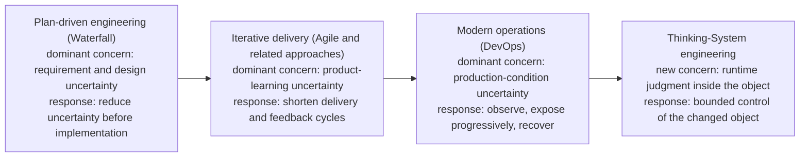
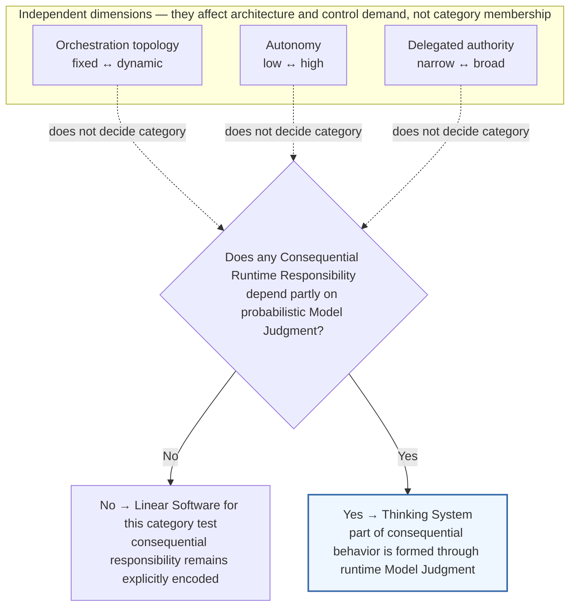
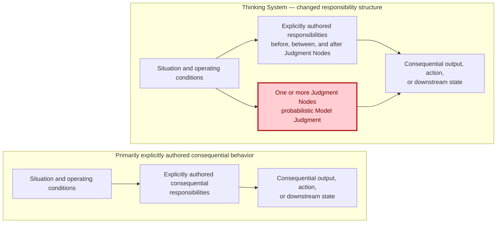
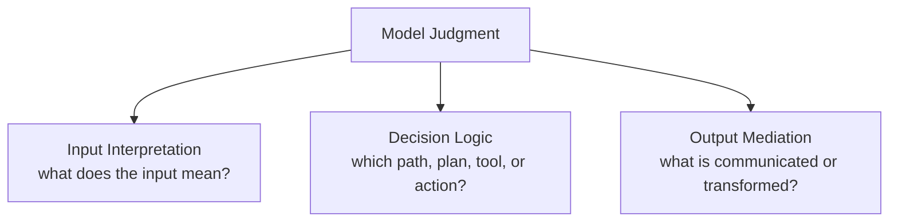
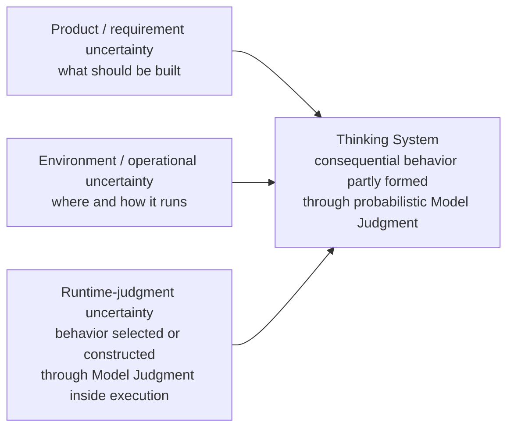
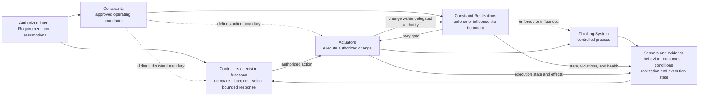
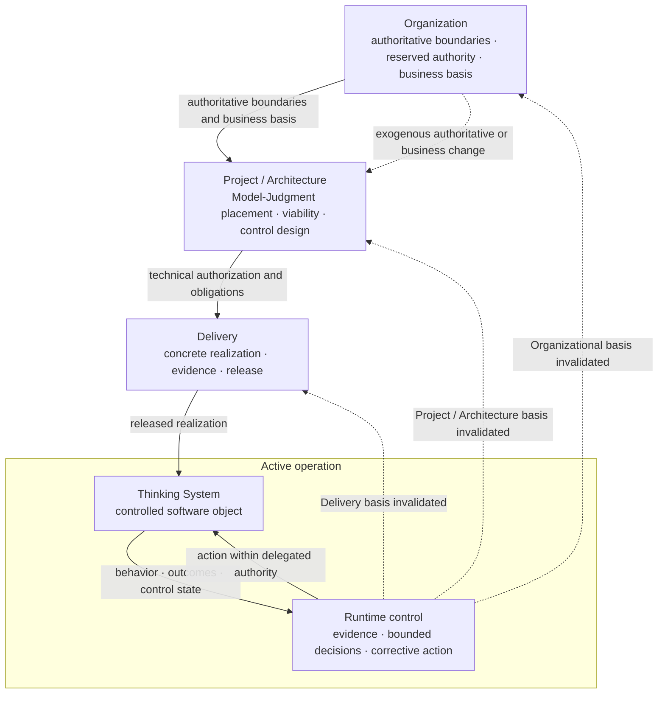

# Thinking Systems: When the Controlled Object Changes

> **Publication note.** This is a shorter standalone argument adapted from the larger living working paper, [*Uncertainty Architecture: Engineering Thinking Systems with Consequential Runtime Responsibilities*](open-engineering-specification-article-draft.md). It intentionally preserves the full deduction from dominant uncertainty through the changed controlled object, then compresses the later operating-model detail. The larger paper remains under development so external criticism of this argument can shape the next research phase rather than arrive only after the full manuscript has hardened.

Software engineering repeatedly expands when an important source of uncertainty can no longer remain outside the engineering model.

That pattern is easier to see if familiar software movements are treated not as mutually exclusive schools, but as responses to where consequential uncertainty appears and how quickly engineering can obtain feedback about it.

**Plan-driven development (including Waterfall)** tries to reduce requirement and design uncertainty before implementation. This remains rational where the problem can be understood sufficiently in advance, late change is expensive, and early specification can remove enough uncertainty to make execution predictable.

**Iterative delivery (including Agile and related approaches)** accepts that important product uncertainty cannot always be eliminated through analysis because users, markets, and teams learn by interacting with working software. Engineering therefore shortens the distance between assumption, delivery, use, and revision.

**Modern operations (commonly associated with DevOps)** recognizes another limit: production conditions cannot be reproduced exhaustively before release. Telemetry, progressive exposure, rollback, resilience, and incident response extend the engineering feedback loop into runtime.

The pattern is cumulative. Requirement uncertainty did not disappear after Agile, and operational uncertainty did not begin with DevOps. Each expansion preserved earlier responsibilities while adding mechanisms for an important source of uncertainty that could no longer be left outside the engineering model.

AI introduces another shift.

The uncertainty is no longer only in what should be built or in the environment in which software runs. Part of consequential behavior may now be selected or constructed **inside execution itself** through probabilistic Model Judgment.



**Figure 1 — Engineering expands its feedback model as consequential uncertainty moves closer to runtime and eventually enters the controlled object.** Waterfall, Agile and related approaches, and DevOps are shown as familiar but non-equivalent examples of broader engineering responses. The progression is conceptual, not replacement history.

This is the point at which a new engineering category becomes useful.

## Why call them Thinking Systems?

The formulation **“Thinking Systems”** entered this research through my exchange with **Arkadiy Dobkin** following his LinkedIn post [*From Fall to Rise*](https://www.linkedin.com/posts/arkadiydobkin_from-fall-to-rise-activity-7477593508879724544-8-ZL). I am grateful to Arkadiy specifically for that formulation. I use the term here for a narrower engineering category; the definition and responsibility boundary below are developed in the Uncertainty Architecture research track. This article does **not** claim coinage of the phrase.

A **Thinking System** is:

> A software system in which one or more **Consequential Runtime Responsibilities** depend partly on probabilistic Model Judgment rather than being fully specified through explicitly encoded logic in advance.

A runtime responsibility is **consequential** here when its output, decision, path, action, or downstream state can materially affect an intended outcome, satisfaction of an applicable Requirement or Constraint, the exercise of delegated authority, resource use, or another person or system downstream.

Consequential does **not** mean dangerous, autonomous, regulated, or high-risk. It describes material causal relevance. Severity, likelihood, reversibility, residual exposure, autonomy, and production readiness remain separate questions.

The category also does not certify adequate control. A Thinking System can be well controlled, poorly controlled, experimental, or not ready for production. Constraints, evidence, decision rights, and corrective mechanisms are part of the engineering response to the changed object; they are not what creates the category.

**Model Judgment** means interpretation, synthesis, classification, generation, planning, ranking, routing, or action selection performed through a probabilistic model under uncertainty. It is useful precisely because the relevant interpretation or decision space cannot always be exhaustively encoded in advance.

The word **Thinking** is functional, not anthropomorphic. It makes no claim about consciousness, sentience, or human-like cognition. It names the responsibility structure that changes when consequential behavior depends partly on runtime Model Judgment.

### Why existing labels are not enough

Broader labels remain useful, but they answer different questions.

| Label | What it primarily tells us | What it does not tell us |
|---|---|---|
| **[AI-based system (ISO/IEC TR 29119-11)](https://www.iso.org/standard/79016.html)** | An AI component is present | Whether a Consequential Runtime Responsibility depends partly on probabilistic Model Judgment |
| **[AI system (NIST AI RMF)](https://www.nist.gov/publications/artificial-intelligence-risk-management-framework-ai-rmf-10)** | A broader system produces machine-generated outputs that influence real or virtual environments | Whether this narrower responsibility boundary has changed |
| **LLM application** | A particular model technology is used | Which consequential responsibility the model carries |
| **Agentic system** | Agency-oriented behavior or orchestration is present | Whether consequential responsibility depends partly on Model Judgment |
| **Autonomous system** | The system operates with some degree of independence | Whether probabilistic judgment is the mechanism carrying consequential responsibility |
| **Thinking System (this article)** | A Consequential Runtime Responsibility depends partly on probabilistic Model Judgment | It does not by itself say whether the system is safe, well controlled, autonomous, or production-ready |

This is a category-boundary comparison, not a claim that NIST, ISO, agent frameworks, or broader AI-system concepts are technically shallow or incomplete. **Thinking System** is not proposed as a replacement for *AI system*. It names the specific controlled-object change examined in the rest of this argument.

The category question is therefore narrower than “Does this application contain AI?” and different from “Is it agentic?” or “How autonomous is it?”



**Figure 2 — Thinking-System classification turns on a responsibility boundary, not workflow topology or autonomy.** Fixed and dynamic workflows can fall on either side of the category boundary. Autonomy and delegated authority remain additional dimensions that affect consequence and control design.

The term matters because the engineering object has changed.

## The controlled object has changed

A controlled object is the thing whose behavior engineering seeks to keep within acceptable conditions.

For a Thinking System, that object is not merely the model invocation. It is the whole software system inside its declared boundary: deployed components, data, configuration, dependencies, infrastructure, deterministic identity/access/retrieval/tool/execution paths, and one or more responsibilities in which Model Judgment participates.

A useful design-contract abstraction for explicitly encoded deterministic responsibility is:

```text
y = f(x, context, configuration, system state)
```

This does not claim perfect physical repeatability. It means the intended consequential mapping is authored through explicit logic, rules, state transitions, or other inspectable mechanisms.

A model-mediated consequential responsibility is different:

```text
y ~ P(y | x, context, configuration, system state)
```

Part of the relevant mapping is selected or constructed at runtime. The same apparent request may lead to different plausible behavior because context, model version, instructions, retrieval, tools, state, or operating conditions differ.

That does not make the entire application probabilistic. Thinking Systems remain mixed systems. Deterministic responsibilities can exist before, between, and after Model Judgment.



**Figure 3 — The controlled-object shift.** Explicitly authored responsibilities remain part of the system, but one or more consequential responsibilities now depend partly on probabilistic Model Judgment. Red marks the structural addition, not an error state or a claim that the whole system is probabilistic.

Model Judgment can enter through several functional placements.

**Input Interpretation** affects what the system believes the user, document, environment, or upstream signal means.

**Decision Logic** influences or selects routes, rankings, plans, priorities, tools, or actions.

**Output Mediation** creates, adapts, filters, summarizes, explains, or transforms information for a person or downstream system.

These are placement functions, not a mandatory pipeline.



**Figure 4 — Functional placement of Model Judgment.** Model Judgment is the parent concept; the three placements are possible responsibility locations rather than sequential stages.

### Follow the consequential responsibility, not the model boundary

Consider a fictional bounded customer-support resolution system. It retrieves authorized account and policy context, interprets a request, selects or recommends a resolution, prepares consequential customer communication, and may eventually execute a bounded refund or route the case to Human Authority.

The model may occupy only one or two points in that workflow. But if Model Judgment influences which policy applies, what remedy is selected, what the customer is told, whether a refund is proposed, or whether an authorized tool changes downstream business state, then the engineering perimeter cannot stop at the model-serving component.

It has to follow the path by which runtime judgment becomes a consequential outcome.

That path includes deterministic software around the model, permissions, identity, tool access, transaction boundaries, evidence, fallback, and—where a decision is reserved—the people and organizational authority that can legitimately decide what happens next.

This is the first important consequence of the changed controlled object: **the control perimeter may become explicitly socio-technical**.

A bounded-refund rule, for example, may originate in an organizational business or financial decision, require a Project / Architecture decision about where Model Judgment is permitted, require Delivery to realize a concrete transaction boundary, and finally constrain whether Runtime can execute a downstream action.

None of those responsibilities makes the human organization part of the software process itself. But the people and decision structures may become architectural elements of the **control system around the software**.

The new uncertainty also does not replace earlier uncertainty. It adds another location that must be connected to them.



**Figure 5 — Three connected uncertainty locations.** Product/requirement uncertainty and operational uncertainty remain. Thinking-System engineering adds explicit treatment of uncertainty arising because consequential behavior is partly selected or constructed through runtime Model Judgment inside the controlled object.

This is why the engineering problem is not simply that AI is harder to test. Part of the controlled object's consequential behavior is now selected or constructed through runtime judgment, and every decision that controls that object must account for the resulting uncertainty.

## If the object changed, control must change

Thinking Systems require decision-relevant measurement across additional behavioral and control surfaces: evaluations, traces, downstream outcomes, drift, cost, latency, realization health, incidents, Human Authority load, and the effects of corrective actions.

Measurement is necessary. It is not control.

Measurement asks *what happened, how often, under which conditions, and with what confidence?*

Control adds different questions:

- relative to which approved boundary is the evidence interpreted?
- who or what has legitimate authority to decide that action is required?
- which mechanism can actually change operation?
- what evidence confirms that the corrective action worked?
- when does new evidence invalidate the assumptions or authorization on which current operation depends?

A dashboard can describe an uncontrolled system perfectly.

A policy can be authoritative without being technically realized.

A human approval button can exist while the reviewer lacks information, competence, time, capacity, independence, or real power to change the outcome.

A rollback path can exist without evidence that it restores a known authorized state.

A feedback loop can be closed and still be unacceptable because it is optimizing the wrong objective, reacting too slowly, using invalid evidence, or exercising authority that was never delegated.

A bounded control architecture therefore needs four distinct capability functions. They are logical functions, not mandatory products, services, teams, or execution layers.

**Constraints and their realizations** define the approved operating boundary and make that boundary operational. A Constraint is the authoritative boundary object; a Constraint Realization is the technical or socio-technical mechanism that implements, enforces, or influences it.

**Sensors and evidence** expose behavior, outcomes, operating conditions, realization state, control health, and the effects of corrective action.

**Controllers and decision authority** interpret evidence relative to approved Requirements, Constraints, assumptions, and a legitimate decision boundary, then select or authorize a response inside delegated authority.

**Actuators and corrective action** execute that response: block, route, narrow exposure, switch fallback, roll back, disable, compensate, or otherwise change operation within authority.

Take the support example. Suppose the organization reserves refunds above a delegated amount to Human Authority.

The sentence “large refunds require approval” is not yet a control architecture.

Project / Architecture must translate the boundary into a realizable design. Delivery may realize it through deterministic transaction permissions, an amount precondition, scoped approval state tied to an authenticated authorized identity, and an endpoint that rejects execution when the required approval is absent. Sensors must expose attempted and blocked transactions, realization health, downstream outcomes, and Human Authority latency/capacity. A Controller must know when to block, route, narrow, or escalate within its authority. An Actuator must actually perform the selected action and evidence whether it worked.

The human path is also architectural. If reserved cases require Human Authority, the person must receive usable evidence, possess the legitimate decision right, have adequate competence and time, remain operational at the expected volume, and genuinely be able to change the outcome. A decorative `Approve` button is not a complete control path.



**Figure 6 — Complete bounded control architecture.** The four capability families are logical functions. One product, platform, person, or organizational process may implement several functions; the distinctions remain important because authority, sensing, decision, realization, and action can fail independently.

The central production-readiness implication is stronger than “use evals” or “add governance”:

> **A Thinking System is not ready for production at the intended scope while any material control responsibility remains unowned, unrealized, insufficiently evidenced for its decision, or without a credible corrective or reassessment path.**

“Complete” does not mean maximal. A low-consequence internal assistant may need a small explicit control surface. A system that communicates consequential decisions directly, changes business state, exercises delegated authority, or creates difficult-to-reverse effects may need much more.

The point is that the object delivered to production is no longer merely **application + model**. Where the consequence requires it, Delivery must make operational the surrounding control relationships as well: realized boundaries, decision-useful evidence, corrective paths, Human Authority, fallback, and the connection to whatever authority must reassess the system when its basis changes.

This is why governance cannot be postponed as paperwork around the software. For a Thinking System, the relevant governance decisions become operational only when they are realized inside the socio-technical control architecture.

## How far can the control loop reach?

Once the controlled object and the control relationship are visible, one final question matters for this shorter argument:

**How far does correction have to reach when evidence says the current system is no longer inside its authorized basis?**

Sometimes the answer is local.

A realization or configuration defect may be repaired by Delivery. A deployment can be rolled back. Exposure can be narrowed. An evaluator may be replaced or recalibrated locally **only when the change remains inside delegated Delivery authority and does not change the evidence semantics, applicability assumptions, or other decision basis underlying Project Authorization**. These actions restore a previously authorized state rather than redefine the basis on which the system was approved.

Sometimes the evidence is architectural.

If Human Authority is overloaded, the fallback cannot carry expected traffic, model placement no longer produces the expected value, or a supposedly deterministic boundary cannot actually be realized, the Project / Architecture basis has changed. Runtime cannot solve that by silently widening authority or adding another retry. The design has to be reassessed.

Control economics belongs in that reassessment too, but it requires a separate ownership distinction. Project / Architecture must expose the complete cost and feasibility of the control perimeter. If the architecture remains technically viable but the resulting Human Authority burden, latency, operating cost, or investment requirement makes the business case unattractive, that is an engineering finding that must reach the owner of the business or investment basis. **Organization—not Project / Architecture—owns the proceed, reshape, defer, or stop decision when that Organizationally owned basis must change.**

And sometimes the evidence or change reaches further still.

An **Organizationally owned** legal, contractual, policy, vendor, business, or reserved-authority premise may change outside the software entirely. Or runtime/project evidence may show that an Organizationally owned boundary is no longer adequate. Only the legitimate organizational authority can change that basis. Project / Architecture must then reassess the design against the new organizational context before Delivery realizes and releases a changed system.



**Figure 7 — The control perimeter can reach organizational authority without making the decision horizons a runtime stack.** Runtime control acts around the active Thinking System within delegated authority. Evidence routes to the owner of the decision basis it invalidates, while an exogenous Organizational change can reactivate Organization directly. Lower levels may repair or narrow inside delegated authority; they may not silently redefine a higher-level decision basis.

This is the larger consequence of the controlled-object shift.

**When consequential operation depends on an Organizationally owned authority boundary, the organization can no longer be treated merely as external governance context for that control problem. Its legitimate decision authority becomes part of the socio-technical control architecture required to keep the software bounded.**

That does not mean employees become software components. It means people and organizational decision processes can become necessary architectural elements of the control system around the software.

For consequential Thinking Systems, **software architecture alone may therefore be an incomplete description of the production control architecture for that system**. The effective control architecture is socio-technical: software, deterministic and probabilistic mechanisms, evidence, Human Authority, engineering decisions, and legitimate organizational authority participate in keeping one controlled object inside an authorized boundary.

This is where the control-theoretic framing becomes useful. The transfer is structural, not literal. A company is not one mathematical Controller, and business viability, legal authority, human judgment, and model behavior cannot be reduced to one scalar error signal. But the same engineering questions recur across the perimeter:

```text
What outcome or condition is intended?
→ What operating space is acceptable?
→ What uncertainty can move the object outside it?
→ What evidence reveals behavior, outcome, conditions, and control state?
→ Who or what may decide that action is required?
→ Which mechanism can change operation?
→ When does new evidence require reassessment at this or an earlier decision level?
```

The important shift is that those questions now surround **one system in which consequential behavior subject to uncertainty is partly selected or constructed inside the controlled object at runtime**.

That is the engineering problem the larger Uncertainty Architecture research track is trying to map.

## Intellectual context and claim boundary

This argument does not claim invention of feedback control, socio-technical safety, runtime assurance, software engineering for AI, human oversight, or AI risk management. It sits in continuity with established systems/safety/control traditions and current AI engineering practice.

The claim under test is narrower: whether connecting **Thinking-System classification**, the **whole software system as the controlled object**, explicit control-capability functions, and lifecycle decision ownership around the same consequential responsibility gives practitioners a useful engineering map—and whether an existing method or composition already does that more simply.

Relevant primary or authoritative context includes Nancy Leveson's systems-theoretic safety work in [*Engineering a Safer World*](https://mitpress.mit.edu/9780262533690/engineering-a-safer-world/), the Software Engineering Institute's [Simplex architecture](https://www.sei.cmu.edu/library/an-architectural-description-of-the-simplex-architecture/) for dependable and evolvable process-control systems, the [NIST AI Risk Management Framework 1.0](https://www.nist.gov/publications/artificial-intelligence-risk-management-framework-ai-rmf-10), and [ISO/IEC TR 29119-11:2020](https://www.iso.org/standard/79016.html) on testing AI-based systems. These are antecedents and comparison points, not claimed derivations, endorsements, or exact equivalents of UA.

The **living editorial blueprint** extends the remaining research into proportional implementation, substitution against existing engineering methods and platforms, detailed lifecycle semantics, and a broader validation agenda. The working paper itself remains under development; later sections are planned to test those questions rather than being treated here as completed analysis.

If STAMP/STPA, Simplex/runtime-assurance patterns, NIST/ISO-based practice, a managed AI platform, an internal engineering method, or another coherent composition preserves the material relationships with equal or stronger semantics and less overhead, that would be evidence to narrow UA rather than a threat to it.

## Why publish this before the larger paper is finished?

The larger working paper is **planned to continue** into proportional implementation, substitution against existing engineering methods and platforms, detailed lifecycle semantics, and a broader validation agenda. Those later sections remain research work rather than completed conclusions.

I could complete that entire structure first and ask for feedback later.

I think that would be the wrong order.

The useful questions now are earlier and more fundamental:

- Does the **Thinking System** boundary identify a real engineering distinction?
- Does consequential Model Judgment actually change the controlled object in the way described here?
- Is the socio-technical control perimeter a useful consequence of that shift, or does it overreach?
- Are Constraints/realizations, Sensors/evidence, Controllers/authority, and Actuators/action a useful functional partition?
- Does the control perimeter really need to reach organizational authority in the cases where this article says it does?
- Which existing methods already model the same relationships more cleanly?

Those answers should shape the remaining research.

There is also a recursive aspect to the work. Increasingly, this paper and the UA repository are being developed through **agentic workflows**. I am not treating AI as a text generator attached to the side of the research. I am increasingly using explicit sources of authority, bounded tasks, review loops, evidence, versioned repository state, human decision points, and escalation when an agent cannot legitimately resolve an ambiguity.

In other words, I am beginning to use the same architectural ideas to structure the human–agent system through which the framework itself is developed.

That is **not validation**. A framework cannot prove itself by being used to write about itself. But it does create another working environment in which weak boundaries, unclear authority, bad evidence routing, or false confidence become visible quickly.

The larger [working paper](open-engineering-specification-article-draft.md) and its [editorial blueprint](open-engineering-specification-article-blueprint.md) remain public in the repository. The next sections are intentionally open to change.

## Acknowledgments and provenance

I want to thank **Arkadiy Dobkin** specifically for the formulation **“Thinking Systems”** and for the exchange that pushed me to sharpen the engineering boundary around it. The phrase provenance is distinct from the specific UA engineering definition and control model developed in this research.

The work has also benefited from continuing dialogue with the **Taller** team, especially **Christophe Kolb, Maxi Armesto, and Jan**, around the socio-technical architecture surrounding AI systems. Those exchanges have helped pressure-test how authority, human participation, workflow, tooling, and control mechanics fit around the model rather than inside the model alone.

These acknowledgments record intellectual provenance and dialogue. They do not imply co-authorship, endorsement of UA, or agreement with the specific definitions and claims in this article.

## Try to break the argument

I do not particularly need readers to agree with Uncertainty Architecture.

I need people to try to break it.

Apply the category test to a real system. Show where it over-classifies or misses an important case. Show a consequential AI system whose controlled object does **not** need to expand in the way argued here. Find a control responsibility that cannot be represented without distorting the architecture. Show where the organization should remain completely outside the control perimeter. Point to an existing method, platform, standard, or internal process that already preserves the same relationships with less conceptual overhead.

Show what can be removed.

Uncertainty Architecture is an open-source project and an open engineering specification under validation. Critique, contradictory cases, issues, pull requests, worked applications, and serious collaboration are welcome.

If an existing approach already solves part of the problem better, the right response is not to protect the framework. It is to make the framework smaller or change it.