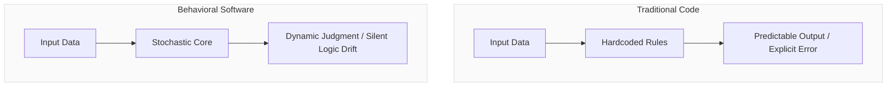
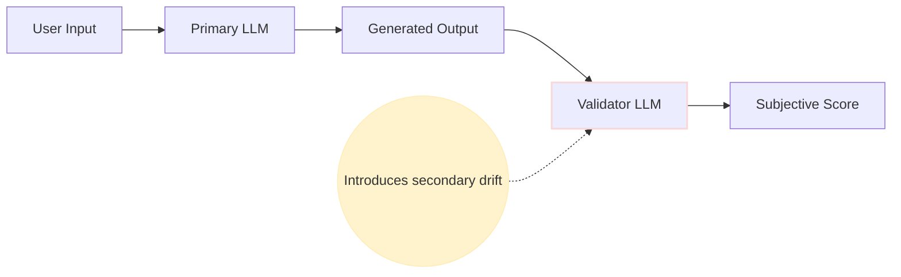
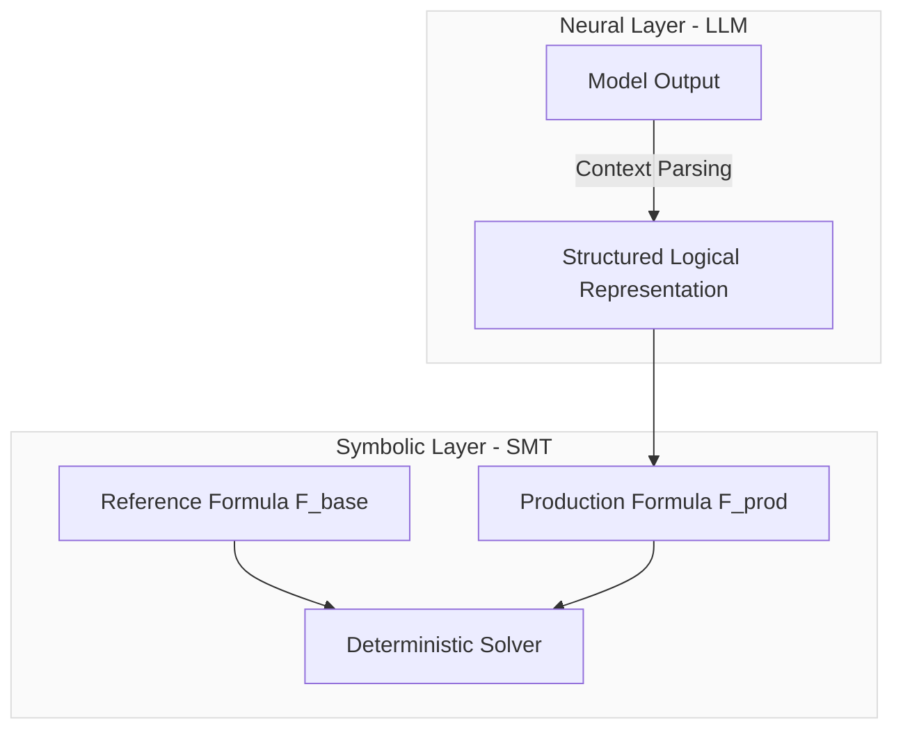
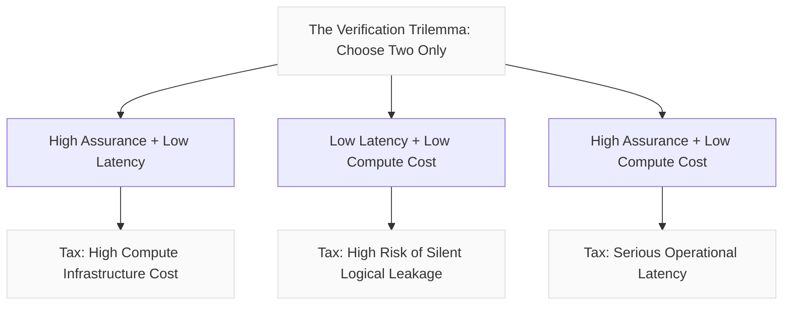
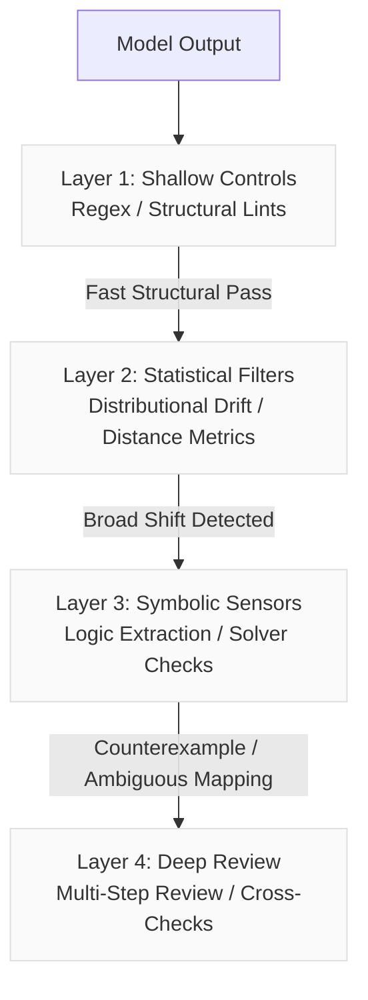
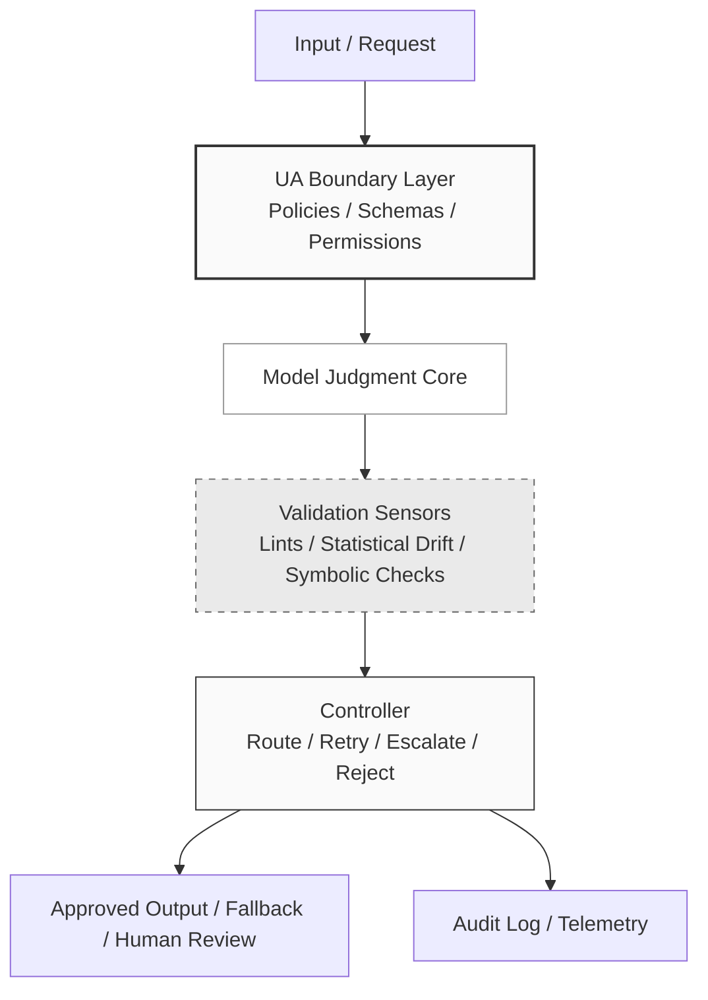
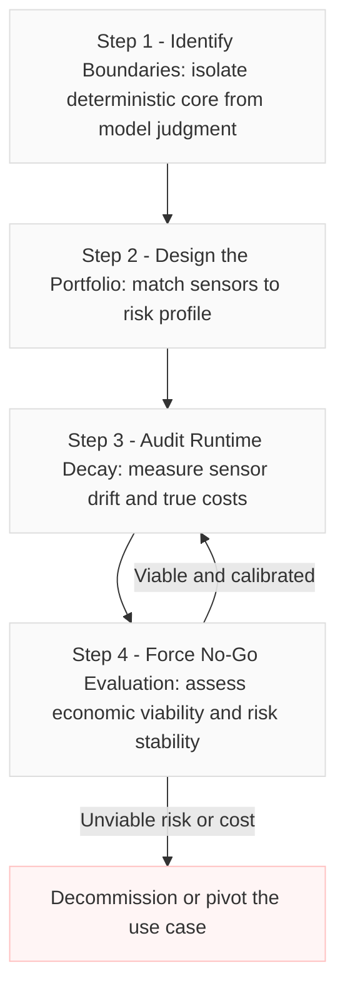
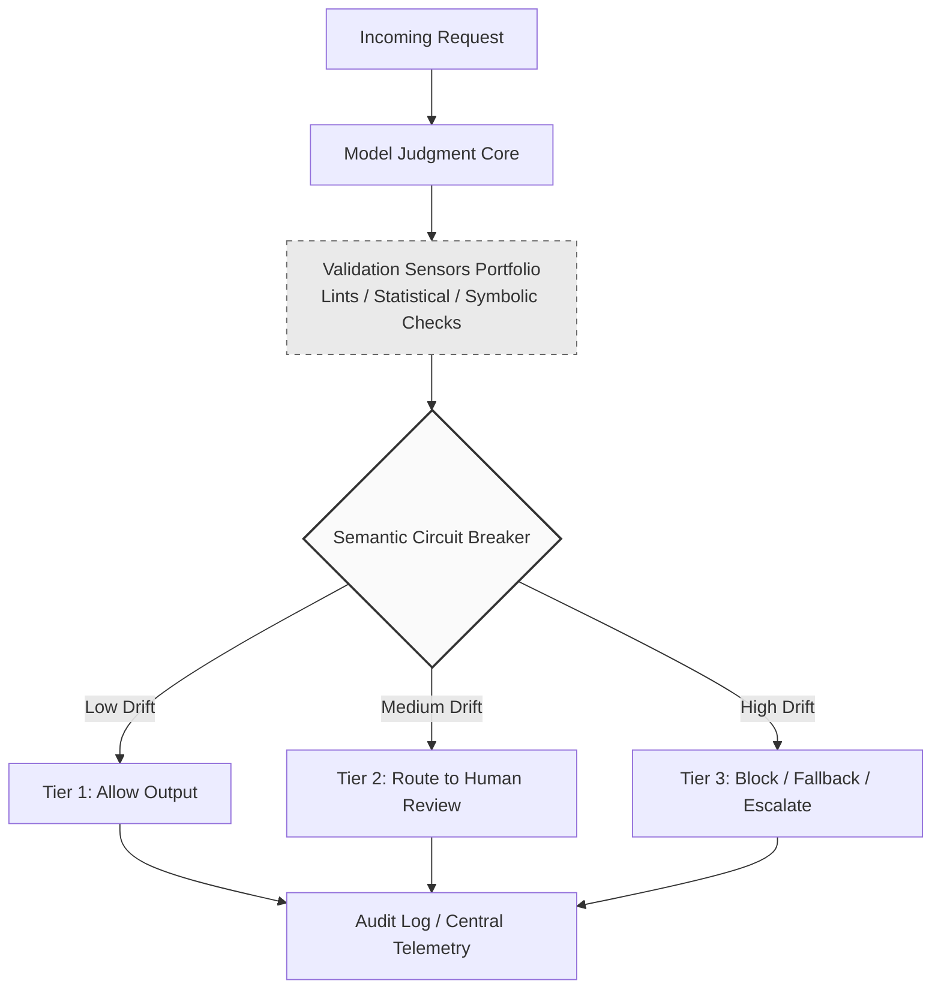
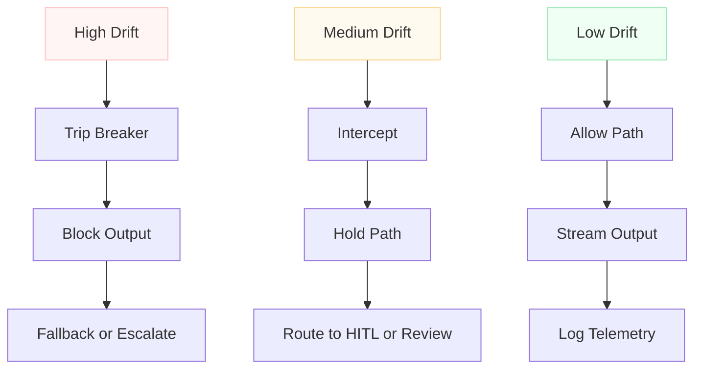
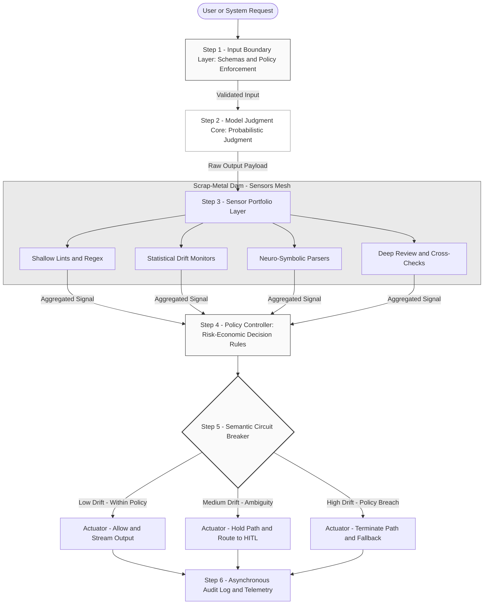

# Beyond Embeddings: Architecting Risk and Logic in the Age of Behavioral Software

> **Repository status:** Historical research publication. This repository edition preserves the substantive argument while removing publication-platform residue and normalizing Markdown. It is research evidence, not automatically a normative UA requirement.

## Publication provenance

- **Original source filename:** `Uncertainty Architecture - Beyond Embeddings- Neuro-Symbolic Verification of Semantic Drift in LLMs - EN.md`
- **Publication platform:** Not established from the source snapshot
- **Canonical URL:** Not established from the source snapshot
- **Transformations performed:** Removed trailing blank space; repaired copied citation labels and tracking query parameters; nested chapter and reference headings beneath the repository title; preserved the introductory note, code blocks, examples, and references.
- **Substantive wording corrected:** No.

---
NOTE:
This article argues that LLM-powered applications are not just classical software with an AI API attached. They are behavioral systems where part of the business logic is delegated to probabilistic model judgment.

That shift breaks many assumptions behind traditional QA, monitoring, and LLMOps dashboards. Embedding similarity can detect topical proximity, but it cannot guarantee logical equivalence. LLM-as-a-judge can help qualitative review, but it is weak as final authority for high-risk logical invariants.

The article examines one bounded neuro-symbolic pattern for logic-level drift detection, then places it inside a broader Uncertainty Architecture approach: sensors, controllers, actuators, audit trails, economic risk thresholds, and no-go decisions.

The thesis is simple: enterprise AI will not be made reliable by trusting models harder. It will be made governable by designing control systems around model judgment.

## Chapter 1: From Linear Software to Behavioral Software
### The Probability Paradox and the Cynefin Shift
For most of the last 50 years, software engineering has been built around one dominant goal: to reduce variance and eliminate unmanaged uncertainty. Most classical business logic is designed to behave deterministically. When you write a cascade of if/else statements or design a relational database schema, you are laying down rigid, linear tracks where the cause-and-effect relationship is intended to be explicit and traceable.
Traditional software engineering mostly operates within the **Clear** and **Complicated** domains of the Cynefin framework. In these spaces, the link between inputs and outputs is either obvious or discoverable through expert analysis. The rules may be complicated, but they are stable enough to engineer against. Many errors are still diagnosable as either flaws in human logic, incorrect assumptions, or infrastructure failures.
Introducing Large Language Models (LLMs) into the production loop shatters this cozy engineering world. When we delegate tasks like evaluating transaction compliance against policy or formulating customer responses according to corporate standards, we do something previously unthinkable: we **delegate business judgment to a model-judgment core**.
With this transition, the system moves part of its behavior into the **Complex** domain. If unmanaged, that complexity can degrade into operational chaos. Software ceases to be just a static set of instructions and transforms into **behavioral software**, introducing an entirely new class of operational and business risk that cannot be managed using classical testing methodologies alone.
### The Shift: From Functions to Distributions
Traditional software behaves like a deterministic function:
```text
y = f(x)

```
In this world, if you feed Input A into the system, you must get Output B. Every single time. The expected variance is effectively zero. If the output changes without the code changing, it is a defect.
Large Language Models do not follow these rules. They are not databases, and they are not deterministic processing modules; they are probabilistic engines. They do not yield a single hardcoded answer; they give you a sample from a distribution of plausible outputs conditioned on context:
```text
y ~ P(y|x)

```
When you query an LLM, you are not retrieving a stored record. You are drawing from a weighted distribution. Even when the model returns structured output, the semantic judgment that produced it remains probabilistic. Even when generation is configured to be as deterministic as possible, production behavior can still shift because of model updates, provider routing, context changes, prompt sensitivity, tool state, and infrastructure-level variation.
This reality leads us directly to **The Probability Paradox**:
> **The Probability Paradox**
>  * **Old Engineering:** Uncertainty is a defect.
>  * **AI Engineering:** Uncertainty is the raw material.
>
We do not want all variance. We want useful variance: contextual adaptation, semantic synthesis, and flexible judgment. If we completely eliminate the distribution, we turn a reasoning engine into an incredibly slow, expensive, and unreliable database. The goal of AI Engineering is not to eliminate the distribution, but to manage its shape: narrowing the useful region of the distribution while cutting off the long tails where hallucinations, policy violations, logical inversions, and unsafe business behaviors live.
### The Trap: Trying to Unit Test a Liquid
Much of the current LLMOps crisis comes from trying to manage Behavioral Software using tools designed for Linear Software. When traditional engineering teams encounter stochastic behavior, their default reflex is to attempt to strangle the uncertainty: they write rigid unit tests expecting exact string matches, set temperature to zero, or hardcode logic to force the model into a narrow path.
This is an **architectural category error**.
You cannot manage a probability distribution if you treat the parameters that define it as magic strings scattered across your codebase. If a prompt is buried deep inside application code, it is being treated like a constant variable. It is not. It is the configuration of your distribution. Changing a single adjective in a prompt shifts the entire probability curve of the output.
Traditional QA and monitoring frameworks fail here because they are built to handle low-entropy data structures. Treating regular expressions or rigid schemas as the primary semantic control layer can lead to brittle downstream behavior. The system begins to "flicker" in production—a small semantic or formatting shift can cascade into downstream failure.
This shifts high-stakes LLM development away from routine feature delivery and closer to an applied research program running under model uncertainty.
### The Open-Loop Challenge: No Universal Recipe
In this new paradigm, we must treat the language model as a black box operating within an open loop. The core challenge is mastering the operational discipline required to close this loop deliberately, measurably, and economically.
There is no universal silver-bullet methodology or single out-of-the-box recipe for this. Real-world behavioral applications cannot be built using a copy-paste framework; they require a **modular control toolkit**. Depending on the specific risk profile of the business scenario, teams must dynamically select and compose technical tools, sensors, and guardrails, balancing their safety value against the real cost of creation and long-term maintenance.
One of the most critical and difficult points in this entire lifecycle is the measurement problem: how do we reliably evaluate high-entropy model output? In the upcoming chapters, we will examine one possible method for measuring logic-level drift in model outputs—but it is vital to establish early that this method is not a universal cure. It is a targeted tool optimized only for specific use cases.
Furthermore, as we evaluate this modular control toolkit, we must remain ruthlessly pragmatic. Some high-stakes business scenarios simply will not have an acceptable risk-control profile with a positive ROI given today's technical limitations. Until there are deeper breakthroughs in evaluation, verification, formal methods, model reliability, or the economics of control, the wisest architectural decision for certain use cases will be not to build them at all.

## Chapter 2: The Economic and Architectural Coupling (The Price of Judgment)

### The Price of Judgment: When Model Output Becomes Business Exposure

In traditional enterprise software, application architecture and business risk are tightly connected, but the connection is usually explicit, inspectable, and encoded in deterministic rules. If a payment gateway API fails, it throws an explicit, predictable error code; a circuit breaker trips, and the system rolls back the state transactionally. The code itself does not autonomously decide to rewrite the terms of the transaction.

When you introduce behavioral software, these boundaries start to dissolve. Because an LLM operates on a stochastic engine to simulate and generate business judgment, we face a completely different paradigm. Not every token is a liability. But every generated judgment in a critical workflow can become one.



This reality forces a brutal architectural law: **The complexity and cost of your engineering control loop must scale with the business risk, reversibility, and cost of failure.**

*   **Low-Stakes Domain:** A chatbot summarizing internal documentation. If it gets a nuance wrong, the employee clarifies it. The cost of failure is low and usually recoverable, meaning the control architecture can be as simple as basic prompt-level instructions and passive log collection.
*   **High-Stakes Domain:** An autonomous agent evaluating insurance claims, adjusting credit limits, or interpreting compliance rules. If the model hallucinates a clause or misinterprets an exclusion rule, it may create financial exposure, mislead the user, violate policy, or trigger regulatory consequences. Managing this requires a dense, multi-layered defensive perimeter of deterministic constraints and verification layers.

---

### The Grim Math of AI Safety Economics

Many enterprise AI initiatives bleed out after the prototype phase because teams fail to calculate the financial overhead of controlling uncertainty. They assume that if a base API call costs fractions of a cent, the feature is highly margin-positive.

In reality, to make a stochastic system safe for enterprise usage, you must pay a steep **Control Tax**. This Control Tax consists of latency, token overhead, compute costs, evaluation maintenance, human review capacity, incident handling, and the operational burden of keeping golden baselines alive.

The numbers below are illustrative, not universal, but they highlight the hidden structural multiplier:

| Economic Component          | The Baseline Generation                           | The Control Infrastructure (The Safety Perimeter)                                                      |
| :-------------------------- | :------------------------------------------------ | :----------------------------------------------------------------------------------------------------- |
| **Compute / Token Cost**    | 1x API cost for the primary model response.       | Often higher; in some architectures, multiple validation calls can multiply the baseline cost.         |
| **Latency Profile**         | ~1.5 seconds for the user to get an answer.       | Multi-step validation can add noticeable latency.                                                      |
| **Infrastructure Overhead** | Standard application server and a logging bucket. | Evaluation pipelines, golden baseline storage, sensor orchestration, audit trails, and policy engines. |

Before writing a single line of code, an architect must calculate the tipping point where the system becomes economically unviable. Let us look at the calculation for the expected net business value:

$$\text{Expected Net Business Value} = \text{Automation Savings} - \text{Cost of Control} - (\text{Probability of Failure} \times \text{Cost of Failure})$$

If you save $5 per transaction by replacing a human reviewer with an AI agent, but your control stack costs $3 in token and operational overhead per check, and the remaining risk of an unmitigated error costs $3 more on a weighted probability scale, **your automation initiative is actively losing money.** The system is structurally unviable, not because the model is useless, but because the economics of controlling its uncertainty do not match the margin of the business process.

---

### Designing for Drift: Architectural Planning Before Implementation

A common fatal mistake in LLM projects is treating guardrails as a post-deployment monitoring problem. Teams build an impressive prototype, throw it into production, and then ask: "How do we make sure it does not say something stupid, expensive, or legally inconvenient?"

Uncertainty Architecture treats semantic and logical drift tolerances as design-time constraints, not post-deployment cosmetics. These tolerances must be defined during the business design phase, acting as hard architectural boundaries.

> **The Architectural Rule of Drift Planning:** If your engineering team cannot design a credible mechanism to detect and contain a critical logic violation within a defined business boundary, you do not yet have a deployable architecture.

Before implementation begins, architects, product owners, risk/legal stakeholders, and business owners must establish a clear contract on three specific thresholds:

1.  **Semantic Boundaries:** Define the decision space and communication boundary. What is the model allowed to explain, infer, recommend, or decide? For example, the model may discuss policy coverage limits but must not interpret statutory law or create binding legal guidance.
2.  **Logical Tolerance:** What logical changes are tolerable, and which ones are absolute failure modes? For specific underwriting eligibility or exclusion rules, the tolerance may be effectively zero. A flipped boolean operator (such as `AND` interpreted as `OR`), or a modal shift where `must` is softened into `may`, represents an absolute breakdown.
3.  **The Containment Protocol:** What happens when the system detects drift? The architecture must have a pre-engineered fallback ready. If you cannot afford the latency of a fallback or do not have the human review capacity for a Human-in-the-loop queue, then the business cannot afford the use case, only the demo.

## Chapter 3: The Illusion of Cheap Fixes (Why Vector Analytics Fail at Logic)
### The Mathematical Blindness of Vector Spaces
When engineering teams wake up to the reality of behavioral software, they quickly realize that traditional metrics like latency, throughput, or raw token counts are blind to most forms of logic-level semantic corruption. Many then seek the path of least resistance. In many LLMOps stacks, that path is vector-based similarity.
The naive version of this playbook looks like this: the team takes a validated "golden baseline" response, computes its embedding using a standard embedding model (for example, OpenAI, Cohere, or open-source sentence embedding models), computes the embedding of the live production output, and calculates the cosine similarity between them. If this score clears a threshold chosen as an operational heuristic rather than a logical guarantee—say, 0.95 in an illustrative implementation—the system assumes the logic is intact and allows the workflow to proceed.
This becomes dangerous when teams mistake high-dimensional proximity for logical preservation. Vector embeddings are optimized to represent semantic proximity, contextual relatedness, and retrieval usefulness. They project text into a continuous geometric space where proximity indicates what the text is *about*, not whether the text preserves the same logical conditions.
The standard metric used by many similarity-based monitoring systems is cosine similarity, which measures only the cosine of the angle between two non-zero vectors:

cosine_similarity(A, B) = (A · B) / (||A|| ||B||)

If two texts share most of their vocabulary, syntax, and domain context, their embeddings can remain very close in a high-dimensional space, even when a small logical operator changes the meaning. The embedding representation is not designed to reliably preserve discrete truth conditions. Geometry maps semantic neighborhoods; it does not compute formal logic.
### The Logical Catastrophe of Inversion
In high-stakes behavioral software, the addition, deletion, or modification of a single token can invert the operative meaning of a business policy, turning a compliant operation into a source of potentially catastrophic financial, legal, or regulatory exposure. Vector similarity alone is not a reliable mechanism for catching these inversions because the shared domain, entities, syntax, and lexical structure can dominate the representation, causing severe logic mutations to look like negligible noise.
Consider a realistic enterprise failure mode within a compliance engine evaluating customer onboarding workflows. The system compares these two statements:
 * **Statement A (Golden Baseline):** "The corporate client is eligible for an immediate wire transfer payout, provided that the enhanced KYC verification has been fully completed."
 * **Statement B (Production Output):** "The corporate client is eligible for an immediate wire transfer payout, provided that the enhanced KYC verification has not been fully completed."
To a human risk officer, or even to a narrow deterministic rule checking for negation, Statement B is an unambiguous compliance breach. It represents a total inversion of corporate risk controls. In a vector similarity dashboard, however, the near-identical lexical content masks the danger:

| Evaluation Dimension     | Result                              |
| :----------------------- | :---------------------------------- |
| **Lexical Overlap**      | Very high                           |
| **Domain Context**       | Identical                           |
| **Logical Meaning**      | Inverted                            |
| **Embedding Similarity** | Likely high (depending on model)    |
| **Monitoring Verdict**   | Risk of false positive / false pass |

In many embedding models, a single negation token may not move the representation enough to reflect the full logical inversion. The embedding model may place Statement B in a very similar semantic neighborhood to Statement A. Consequently, the monitoring layer stays green, and the system may open the gate to an unverified, high-risk transaction.
### Missing Quantifiers and Negations
The structural weakness of vector spaces extends far beyond simple negations. High-dimensional continuous embeddings can smooth out or underweight critical logical constraint operators. These include:
 * **Quantifiers:** all, some, none, exactly one.
 * **Conditional Exclusions:** unless, except, provided that.
 * **Restrictive Conditions:** only if, if and only if, at least, no more than, within X days.
 * **Modal Operators:** must, should, may, permitted.
Consider an insurance underwriting agent generating a coverage determination. The baseline rule states: *"The insurer covers water damage claims except those caused by regional flooding."* The production model outputs: *"The insurer covers water damage claims, including those caused by regional flooding."*
Because both statements share the same domain, entities, claim type, and syntactic frame, the embedding can remain close despite the operator-level inversion where *except* became *including*. A vector similarity system may still register a high score, because the domain, entities, and surface structure remain almost unchanged. The system reports that the model is behaving within safe parameters, while the business unknowingly assumes liability that was never priced into the product model.
> **The Core Architectural Law of Behavioral Software:** Semantic similarity may correlate with topical proximity. It does not guarantee logical equivalence.
>
When an architect uses vector embeddings as a proxy for runtime verification of business logic, they are using a tool designed for fuzzy search to solve a problem that demands explicit verification of logical conditions. You cannot secure a high-risk behavioral system by measuring how closely its vocabulary matches an approved baseline. For high-risk rules, the question is not whether two answers sound similar. The question is whether the relevant logical relationships remain intact.

## Chapter 4: The Neuro-Symbolic Sensor Pattern
### An Elegant but Bounded Approach
#### Escaping the Recursive Trap of "LLM-as-a-Judge"
When enterprise architecture teams realize that high-dimensional vector representations cannot reliably catch logical inversions, they frequently default to a useful qualitative tool that becomes dangerous when treated as the final authority for high-risk logical invariants: the "LLM-as-a-judge" pattern. In this paradigm, a secondary language model—often a larger, more expensive model—is deployed to monitor the primary model. This secondary model is prompted to read the production output, compare it to a baseline, and grade its apparent logical accuracy on a subjective scale from 1 to 5, or output a binary Pass/Fail classification.
This approach introduces a recursive engineering trap. By using a stochastic engine to validate another stochastic engine, you do not eliminate uncertainty; you compound it.

The validator model remains vulnerable to many of the same failure modes as the generator: prompt variations, context window degradation, and non-deterministic evaluation criteria. This does not make LLM-as-a-judge useless. It makes it insufficient as the final authority for high-risk logical invariants. A score of "4 out of 5" may be useful for human review, but it has no stable architectural meaning unless it can be mapped to a deterministic control action.
To reduce this uncertainty into something a control system can act on, we should strip the language model of the authority to decide correctness. Instead, we narrow its role from evaluator to semantic parser, decoupling semantic interpretation from logical verification.
#### The Dual-Engine Pipeline Architecture
The neuro-symbolic sensor pattern splits the monitoring task into two distinct, isolated execution layers: a neural parsing layer and a symbolic verification layer. Instead of asking a language model to evaluate correctness, the architecture constrains it to translate natural language or semi-structured outputs into structured logical representations.

> **Critical Architectural Disclaimer:** The symbolic solver verifies the logical equivalence of the extracted formal representations, not the original natural language meaning itself. The system’s integrity remains heavily dependent on the fidelity of the translation layer.
>
Depending on the stability of the reference logic, this architecture can be deployed in two distinct operational modes:
 * **Static Policy Schema (Schema-Bound):** The reference logic is formalized by engineers and domain experts during the system design phase. The runtime parser is constrained to map production output directly into a predefined variable schema. This is more stable and usually preferable for strict enterprise compliance workflows.
 * **Simultaneous Contextual Parsing:** When the golden baseline changes dynamically based on user input, both the reference text and the live output are passed to the parsing window simultaneously. The model maps both texts into a shared runtime variable map.
In both modes, the execution pipeline follows the same general shape, although the source of the reference formula differs:
##### 1. Reference Formalization
The approved policy baseline is formalized into a boolean expression. For a simplified banking eligibility example, the baseline formula might be structured as:
```text
KYC_Complete AND (Credit_Score_High OR Asset_Backed) AND NOT Risk_Country

```
##### 2. The Neural Parsing Layer
At runtime, the primary model generates a natural language or semi-structured response. This live output is passed to a highly constrained semantic parsing model. The parser should emit a structured logical representation, ideally JSON constrained by a strict JSON Schema, mapping factual claims directly to the defined schema variables. It should emit only schema-constrained logical claims, not free-form reasoning or subjective grades.
The parser prompt, schema, and model version must therefore be treated as versioned evaluation infrastructure, not as disposable prompt glue.
##### 3. The Symbolic Evaluation Layer
Deterministic code ingests the structured JSON payload and converts it into an Abstract Syntax Tree (AST) or native solver expression, yielding the production formula F_prod. This expression, alongside the reference formula F_base, is passed to a deterministic symbolic solver, such as Microsoft’s Z3 for SMT-style constraints or SymPy for simpler boolean simplification and satisfiability checks.
#### Formal Verification and the Counterexample Lifecycle
Once both formulas are represented in the symbolic domain, determining whether the extracted production logic matches the approved reference logic becomes a matter of deterministic proof over the extracted formal representation. The solver does not estimate proximity; it systematically evaluates whether F_base and F_prod are logically equivalent across all possible truth assignments.
To accomplish this, the architecture tests for the negation of equivalence. The two formulas are logically equivalent if there is no assignment under which one formula evaluates to true while the other evaluates to false. The solver attempts to find at least one assignment that demonstrates the divergence:
If the solver returns UNSAT (Unsatisfiable) for the negation of equivalence, it proves that the extracted production formula is logically equivalent to the approved reference formula under the current variable mapping. No logic-level drift is detected within the extracted representation.
If the solver returns SAT (Satisfiable), it has found at least one variable assignment where the extracted production logic diverges from the reference logic. That assignment becomes the counterexample for debugging and control action.
To help localize the region of logical disagreement, the sensor can evaluate an XOR expression between F_base and F_prod. XOR identifies where the formulas disagree, not the root cause by itself.
```text
[Illustrative Variable Attribution Mapping]
F_base = KYC_Complete AND Verified
F_prod = KYC_Complete AND NOT Verified

F_base XOR F_prod is true whenever:
KYC_Complete = TRUE

When KYC_Complete = FALSE, both formulas evaluate to FALSE, so there is no observable disagreement.
When KYC_Complete = TRUE, the disagreement is exposed.
The changed condition is then localized through AST diff: Verified -> NOT Verified

```
In production, localization should combine the XOR expression with solver counterexamples, AST diff, and variable-level attribution. XOR alone is not a complete debugging mechanism.
This dual-engine approach provides a far more deterministic and inspectable method for monitoring logic-level drift in bounded behavioral software workflows. However, its formal elegance must not mask its operational vulnerability. The solver is deterministic; the fragile part is the semantic-to-symbolic bridge. This reality brings us to the real problem: not solving the formula, but trusting the extraction that created it.

## Chapter 5: The Myth of the Universal Tool
### Why No Single Method Can Guarantee Semantic Reliability
#### The Foundational Limits of Text Verification
The neuro-symbolic sensor pattern detailed in the previous chapter represents an elegant architectural boundary, but it is not a silver bullet. It is an engineering compromise designed to mitigate a problem for which there is no general-purpose practical solution today.
Automated verification of arbitrary unstructured natural language remains an open problem, especially when the goal is business-level semantic correctness rather than syntactic validity. In traditional computing, we parse source code into a deterministic abstract syntax tree because the syntax rules are formal and explicitly defined. Natural language is brutally plastic: the same logical intent can be expressed through countless ambiguous forms.
Every practical verification system for open-ended LLM outputs must accept a hard trilemma of constraints:

In practice, you can optimize for two of these vertices, but not maximize all three at once in a behavioral system. If you demand high assurance across complex semantic logic, you must pay a serious tax in latency, compute, and operational complexity by running multiple multi-step extraction and evaluation loops. If you optimize for low latency and minimal cost, you must accept a higher probability of logical leakage: cases where the output remains fluent and plausible while the underlying business rule silently changes.
Every monitoring stack is an intentional compromise. Believing that any single tool can completely eliminate uncertainty without extracting an operational tax is an illusion that frequently derails enterprise deployments.
#### The Neuro-Symbolic Failure Directory
To deploy a neuro-symbolic control loop responsibly, an architect must understand how it can break under real production conditions. The deterministic nature of the symbolic layer can make the architecture look safer than it really is. The solver may be stable, but the neural bridge leading to it remains fragile under production noise.
In practice, the system is vulnerable to three structural failure modes:
##### 1. Symbol and Mapping Drift
The symbolic solver assumes that each variable refers to a stable concept. The fragile part is not the solver, but the semantic parser that maps language into those variables. If the semantic parsing model shifts its terminology or mapping logic across consecutive API calls, the logic loop can fail before the solver even becomes useful.
With weak schema constraints, the model may emit alternative variable names. With strict schemas, the more dangerous failure is false mapping: the model assigns the claim to the wrong allowed variable. When this happens, the solver is asked to reason over mathematical garbage. It may trigger a system-level false positive through SAT, or produce a mathematically valid but semantically unsafe UNSAT result, not because the business logic drifted, but because the translation layer lost its symbol alignment.
##### 2. Nested Logic Failures
Enterprise business rules are rarely flat. They are networks of nested dependencies, structural exclusions, and conditional overrides. Consider a simplified clause: *"Condition X applies unless condition Y is met, except when condition Z is true."*
When translating these structures into formal boolean expressions, even strong language models can struggle with operator precedence and parenthesis placement. The parser may correctly extract the variables but misalign their scope:
 * Intended Logic: X AND NOT (Y AND NOT Z)
 * Extracted Logic: (X AND NOT Y) AND NOT Z
This subtle misplacement of a logical boundary completely transforms the truth table of the formula. The solver then executes a correct verification pass over a broken representation, clearing the extracted representation while the original business meaning was already lost.
##### 3. Combinatorial State Explosion
The reliability of a language model acting as a semantic parser tends to degrade as the target schema scales. Once the parser is asked to handle dozens of unique logical variables in a single pass, the extraction loop destabilizes. Within this context, handling 20 to 30 variables should be treated as an illustrative danger zone, not a universal threshold.
As schema complexity grows:
 * **Context fragmentation** can cause the model to miss restrictive conditions located deep within long generation outputs.
 * The token footprint of the schema definition consumes vital context space, increasing parsing and extraction errors.
 * The model may infer unsupported relationships between distant variables to satisfy the JSON structural layout.
If your business rules require this level of density, asking a stochastic parser to build the entire formula in a single pass can fail before the data ever reaches the solver engine.
#### The Ephemerality of Production Stability
The fatal operational mistake teams make after implementing a robust drift sensor is assuming the problem is permanently solved. In traditional software, passing tests at least gives teams a stable artifact to reason about: the code does not change its decision logic unless code, configuration, data, or dependencies change. In behavioral systems, stability is highly ephemeral.
An isolated evaluation layer can break down at any moment without a single line of your application code changing. An upstream provider might update model weights, routing, inference settings, safety layers, or the behavior behind a model alias. This minor shift can subtly change output style, formatting, or sensitivity to context.
Suddenly, your production generator alters its phrasing style, or your semantic parser changes its symbol mapping pattern. The monitoring layer begins throwing false positives, or worse, slips into a state of silent logic drift where genuine breaches pass through unhindered.
Alternatively, a shift in user behavior—such as a new customer demographic adopting a specific slang, structural formatting, or terminology—can introduce unfamiliar inputs that degrade the parser's extraction accuracy.
The evaluation stack is not purely deterministic either. Its parser, heuristics, thresholds, and baselines are themselves operational assets that can drift. You are not building a static wall; you are maintaining a living system that decays when ignored. If you treat your neuro-symbolic sensor or your evaluation infrastructure as static, disposable prompt glue rather than versioned, continuously audited enterprise assets, the control loop will eventually fail. The solver may remain perfectly deterministic, but the representation it verifies may no longer correspond to production reality.

## Chapter 6: The Scrap-Metal Dam
### Architecture as a Portfolio of Imperfect Controls
When you step out of theoretical research and into the gritty production environment of enterprise behavioral software, you quickly learn that a robust evaluation layer is never built from a single component. No individual tool—whether it is an embedding model, a custom classification prompt, a rule-based filter, or the neuro-symbolic sensor detailed in Chapter 4—is capable of holding back model uncertainty on its own.
In practice, guarding high-stakes workflows is less like constructing a monolithic, pristine concrete dam from an academic textbook and more like reinforcing a dam in a storm with imperfect materials: regex, schemas, statistical filters, symbolic sensors, human review, and escalation paths. It is a messy, active composition of overlapping defenses where the weaknesses of one control are compensated by another.
Building an effective "scrap-metal dam" requires architects to design a defensive portfolio of varied, decoupled control layers. Instead of relying on a single final authority, the runtime layer routes the generated output through an intentional cascade of imperfect verification filters:

 * **Shallow Linting and Structural Controls:** The cheapest, fastest line of defense. These are traditional, deterministic regular expressions and schema validators designed to ensure the model output adheres to basic string formats, avoids banned keyword combinations, or matches required JSON schemas. They catch structure, not meaning, but they instantly filter out low-level garbage before it wastes downstream compute.
 * **Statistical and Distributional Filters:** These tools track macro-level drift. By calculating embedding distance thresholds or tracking distributional shifts, embedding clusters, output length, refusal rates, or classification changes over time, they detect when a model's output begins to wander into unfamiliar thematic territory. They are useful for highlighting broad behavioral decay, though they cannot verify a specific truth condition.
 * **Neuro-Symbolic Parsing Sensors:** Placed exactly where the workflow shifts from fuzzy context into rigid invariants. As discussed, these models map natural language or semi-structured outputs into structured logical representations, converting semantic output into solver-ready structures that can be tested for equivalence within the extracted formal representation.
 * **Deep Review Loops:** The final and most expensive defensive layer. Reserved exclusively for high-risk edge cases or ambiguous outputs that fail symbolic validation, this layer runs multi-model review, rubric-based critique, adversarial checks, or cross-examination prompts to provide additional evidence for ambiguous cases.
No single layer in this stack is bulletproof. The regex filters miss complex logical inversions; the statistical metrics may miss fine-grained rule breaches; the neuro-symbolic sensors are vulnerable to translation mapping drift; and deep review loops are slow and non-deterministic. Yet, when stacked sequentially, they can form a more resilient mesh. A logical mutation that slips through the statistical filter may be caught by the symbolic sensor; an extraction error in the symbolic sensor can route the case to the deep review layer.
### The Cost Curve of Imperfect Controls
An architect cannot design a behavioral control system in a fiscal or operational vacuum. Every additional control layer welded onto the dam introduces a tax on latency, compute, maintenance, and operational complexity. Every new evaluation node you inject into the execution pipeline is a conscious decision to exchange cloud infrastructure budget for a reduction in business risk.
To balance this equation effectively, engineering teams must evaluate the cost-to-risk profiles of each individual layer within the validation portfolio:
> **Note:** The values below are illustrative and will vary by model, vendor, traffic pattern, and architecture.
>

| Control Layer             | Latency Footprint                               | Financial Cost (Token/Compute)     | Risk Mitigation Profile                                                           |
| :------------------------ | :---------------------------------------------- | :--------------------------------- | :-------------------------------------------------------------------------------- |
| **Shallow (Regex/Lints)** | Sub-millisecond                                 | Negligible                         | Catches malformed outputs, missing fields, invalid formats, or forbidden patterns |
| **Statistical Filters**   | Low (5–50ms)                                    | Low (local compute / vector index) | Highlights thematic decay and macro-level domain drift                            |
| **Symbolic Sensors**      | Moderate, usually dominated by semantic parsing | Moderate                           | Tests logical alignment within extracted formal representations                   |
| **Deep Review Loops**     | High                                            | High                               | Adds evidence for ambiguous or high-risk semantic cases                           |

If the control loop costs more than the failure it is supposed to prevent, this is not risk management. It is engineering theatre. Conversely, if a single inverted conditional clause in an automated underwriting workflow can trigger a multi-million dollar fine or open the enterprise to material legal and regulatory exposure, running a multi-layer verification pipeline is simply the non-negotiable cost of doing business.
Runtime controllers must therefore be designed to be as dynamic as the models they evaluate. Mature behavioral software architectures do not evaluate every trivial payload with the maximum level of scrutiny. Instead, they dynamically scale their verification efforts up or down based on transaction criticality, risk score, uncertainty signals, or feedback from earlier sensor layers. You build the dam only as high as the seasonal flood requires.
### The Competitive Edge: Teams That Can Govern Uncertainty
Navigating this shifting balance between model behavior, business risk, and infrastructural complexity is undeniably one of the most difficult engineering assignments of the modern era. There are few clean, standardized playbooks, and the tooling changes fast enough that static playbooks decay quickly. Yet, it is precisely this volatility that creates a real strategic advantage.
Many enterprise engineering teams currently deploying large language models are trapped in a cycle of fragile prompt tuning and blind optimism. They push model judgment into production, cross their fingers, and hope that their system prompt holds. When the model drifts, they scramble to patch the prompt, unconsciously shifting the logic lines and introducing fresh, unmonitored vulnerabilities.
The teams and architectures capable of abandoning the illusion of a single perfect tool—those who lean into the messy reality of the portfolio approach and master the construction of the scrap-metal dam—are moving into a strategic gap most teams have not learned to operate in.
By building systems that explicitly acknowledge, measure, and actively bound model uncertainty, these teams are doing something far larger than just shipping stable applications. They are expanding the boundary of what software systems can responsibly automate. They are moving the industry beyond purely static pipelines, where every meaningful behavior must be hard-coded in advance, toward resilient behavioral systems with explicit correction mechanisms.
The opportunity is not in finding the perfect evaluator. It is in learning how to compose imperfect controls into economically viable reliability envelopes. That is where behavioral software stops being a demo and starts becoming enterprise architecture.
## Chapter 7: The No-Go Zone: When the Control Loop Costs More Than the Use Case
### The Strategic Matrix of Automation Feasibility
Moving a large language model from a proof-of-concept demo into a production environment is ultimately a decision about risk, economics, and architecture, not only a technical one. In the previous chapters, we established that containing model uncertainty requires a portfolio of overlapping controls—the scrap-metal dam. However, an architect's job is not simply to build a dam at any cost. The critical question is whether the business case can actually survive the financial and operational weight of the safety infrastructure required to support it.
To evaluate whether an AI deployment is a legitimate business asset or a risk amplifier, we must map the use case across two primary axes: the **Real Business Value of Automation** versus the **Cost and Fragility of the Risk Control Framework**.

|  | Low Control Cost / Low Fragility | High Control Cost / High Fragility |
|---|---|---|
| **High Business Value** | **Sweet Spot** | **Danger Zone / No-Go Candidate** |
| **Low Business Value** | **Playground** | **Vanity Trap** |
This alignment creates four distinct operational quadrants:
 * **The Sweet Spot (High Value, Low-to-Moderate Control Cost):** Workflows where the model acts on high-volume, contextual tasks, but the guardrails are deterministic or cheap to enforce (e.g., structured extraction, template-driven formatting, or low-stakes drafting). Here, the economic equation can be favorable.
 * **The Playground (Low Value, Low Control Cost):** Low-risk exploratory projects. These are internal efficiency experiments—such as search tools for internal technical documentation or simple copywriting assistants. If the model drifts or hallucinates, the blast radius is contained within the organization, requiring lighter monitoring and clear containment.
 * **The Vanity Trap (Low Value, High Control Cost):** Projects born out of pure corporate hype. These occur when an organization attempts to automate a niche, complex human task that has little material impact on the bottom line. Because the task is complex, it requires a heavy, fragile multi-layer sensor stack. The cost of building and maintaining the safety net may consume the ROI. These should be killed early or redesigned before they consume serious delivery capacity.
 * **The Danger Zone / The No-Go Zone (High Value, High Control Cost):** The most treacherous territory in enterprise architecture. These are high-stakes, consumer-facing or regulatory-bound workflows—such as automated financial underwriting, real-time medical triage, or binding contract generation. The automated task offers massive potential savings on paper, but the failure modes carry extreme business risk. To make it safe, you must deploy a control stack that may become too dense, slow, and expensive to justify.
Recognizing when a project has drifted into the No-Go Zone is one of the defining characteristics of a mature engineering organization.
### Calculating the Economic Breaking Point
The fundamental failure of standard AI project accounting is the naive ROI calculation. Teams often calculate the financial viability of a behavioral software deployment using a deeply flawed equation:
```text
Naive Savings = Human Operational Cost Avoided - Base LLM API Cost

```
This calculation assumes that the model operates in a pristine, static vacuum. It ignores the reality that a model-judgment core requires a continuous, active tax to prevent logical failure. To find the true economic breaking point, an architect must calculate the total cost of uncertainty governance:
```text
True Operational Cost = Primary Model Cost + Sensor Infrastructure Tax + Maintenance and Governance Cost + Residual Risk Premium

```
Let us break down the components that can turn an innovative AI agent into an operational money pit:
 * **The Sensor Infrastructure Tax:** As detailed in Chapter 6, catching subtle logic mutations requires cascading checks. A single primary model generation might cost fractions of a cent, but if verifying that generation requires an embedding lookup, one or more semantic parsing calls, and an adversarial deep review check, your true token and compute cost per transaction can scale by multiples.
 * **The Operational Latency Penalty:** Every validation layer adds processing time. In customer-facing transaction systems, adding two seconds of validation latency to prevent logical drift can degrade user conversion rates. If the safety net makes the system too slow to use, the automation defeats its own purpose.
 * **Maintenance and Governance Cost (The Drift Tax):** Behavioral software can degrade over time if its evaluation and control assets are not maintained. Upstream model updates, shifting user prompts, and evolving business rules mean your sensor stack requires ongoing engineering governance. Prompts must be re-audited, schemas must be revised, and solver inputs and logical mappings must be updated. This converts expected variable cost savings back into ongoing fixed operational costs.
 * **The Residual Risk Premium:** No portfolio of imperfect controls is absolute. There is always a non-zero probability of logical leakage. If a leaked error carries a high financial penalty, that risk must be priced into every single transaction.
When you run the complete equation, you may find an economic breaking point where the total cost of validating the model-judgment core completely swallows the financial advantage of automating the human process. At that precise crossroad, the project stops being automation and becomes engineering theatre.
### When to Say No: The Architect as a Business Critic
The hardest part of modern technology leadership is standing in a room full of hyped executives and delivering a definitive, defensible "No."
When an organization is blinded by the desire to showcase AI capabilities to board members or shareholders, engineering teams are routinely pressured to automate workflows that still require human domain experts as the primary decision-makers. In these moments, the architect cannot act as a passive order-taker who simply strings together API calls. They must act as a disciplined risk manager.
You must enforce a hard boundary and treat a use case as a No-Go Zone candidate when these conditions converge:
 1. **The Blast Radius Is Material or Irreversible:** A failure in the model's logic directly translates to material legal liability, heavy regulatory fines, immediate financial loss, or a serious compromise of systemic data integrity.
 2. **The Input Space is Unbounded:** The task cannot be confined to a predictable, tight logical schema. It requires interpreting highly fluid human context, emotional nuance, shifting compliance laws, or user behavior in environments where adversarial behavior is plausible.
 3. **The Control Loop Is Not Economically Viable:** The required sensors, fallback paths, latency, and human review capacity consume the expected business value.
If the price of a logical error is material, irreversible, or regulator-facing, and the only way to prevent that error is to build an excessively complex, slow, and expensive cascade of multi-layered validation sensors, you are looking at an architecture that is fundamentally non-viable.
Deploying under these conditions is not innovation; it is economic suicide. The solver may remain perfectly deterministic, but the cost of ensuring that the input data matches production reality will bleed the project dry. A mature architect must have the courage to state clearly that some processes are handled best by human experts, deterministic code, or not automated at all. The goal of Uncertainty Architecture is to govern uncertainty where it can be bounded, and to reject use cases where the risk-control profile cannot be made acceptable.

## Chapter 8: Uncertainty Architecture (UA) as a Compass, Not a Silver Bullet
### The Core Philosophy: Managing What Cannot Be Eliminated
Uncertainty Architecture (UA) is not a framework you can download from a package manager, nor is it a boxed software product that promises to magically solve model uncertainty. Any tool or vendor claiming to permanently eliminate semantic drift or hallucination from a large language model is selling an illusion.
UA is an architectural posture. It is a systematic method for engineering organizations that must deploy systems relying on probabilistic model judgment in high-stakes environments using the imperfect tooling available here and now.
The philosophy of UA rejects the naive assumption that we can patch or prompt a model into absolute compliance before deployment. Instead, it accepts model uncertainty as an invariant property of the system. The objective is not to destroy the probabilistic nature of the model—which is precisely where its cognitive value originates—but to surround the model-judgment core with deterministic control surfaces capable of measuring, bounding, and governing its behavior at runtime.

When you accept that every validation layer—whether it is a statistical drift detector, a regular expression lint, or a neuro-symbolic logic validator—is limited and imperfect, your engineering focus shifts. You stop searching for the perfect silver-bullet evaluator. Instead, you focus on composing a dynamic portfolio of imperfect controls into an economically viable reliability envelope. UA is the map that helps teams orchestrate that composition deliberately.
### The Risk-to-Technical Translation Layer
One of the greatest points of failure in enterprise AI initiatives is the linguistic and conceptual chasm between the executive suite and the engineering team. Business leaders express risk in terms of legal exposure, financial loss, and regulatory compliance. Engineers express model performance in terms of eval pass rates, F1 scores, error rates, latency, and token cost.
UA serves as a translation layer, mapping high-level business constraints into runtime controls, sensor thresholds, escalation paths, and fallback behavior. It forces the organization to establish a concrete risk-economic contract before production integration begins.

| Business Risk Vector | UA Sensor Mapping | Runtime Actuator Response |
|---|---|---|
| **Regulatory Non-Compliance** | Neuro-Symbolic Sensors mapping output to explicit compliance constraint schemas. | Hard intercept via Semantic Circuit Breaker; immediate fallback to deterministic template. |
| **Thematic Brand Drift** | Statistical embedding distance monitors tracking macro-level cluster shifts. | Alert generated for background telemetry; soft routing for asynchronous review. |
| **Systemic Logic Mutation** | Multi-layer validation cascading from lints to deep review loops. | Transaction escalated to human-in-the-loop validation queue before external release. |
| **Unbounded Operational Cost** | Token expenditure and latency tracking per transaction. | Explicit cost gate; scope reduction, cheaper safe path, human routing, or transaction rejection. |
By using this structured mapping, the architect can systematically balance the risk appetite of the enterprise against the hard technical limitations of the available model stack. If the enterprise becomes less willing to tolerate residual risk, the UA controller increases the depth of the sensor cascade. If the operational infrastructure budget drops, the controller should not silently weaken controls. It should force an explicit decision: accept higher residual risk, reduce scope, route more cases to humans, or reject the transaction.
### The Delivery Roadmap: Navigating Non-Linear Systems
When model judgment pushes part of the system into the Complex domain, traditional linear delivery methods become insufficient on their own. You cannot design a fixed software pipeline, hand it to a delivery team, and expect it to remain compliant indefinitely. Systems driven by model judgment can begin to drift as soon as they interact with production data, shifts in user behavior, and upstream model updates.
To navigate this volatility, delivery teams require a pragmatic, continuous lifecycle model. UA provides this operational roadmap through a four-stage execution loop:

#### 1. Identify Boundaries
Before any model integration begins, the engineering team must draw an explicit boundary around the deterministic core. You must explicitly isolate tasks that require fuzzy context interpretation from tasks that require rigid math, database access, or transaction execution. In high-stakes workflows, model judgment must never be allowed to write directly to a stateful system without a validation barrier.
#### 2. Design the Portfolio
Match the density of your scrap-metal dam directly to the financial and legal weight of the transaction. Avoid the trap of over-engineering low-risk internal utilities with multi-layered review loops. Conversely, never permit a high-stakes, unbounded consumer-facing workflow to operate without a multi-layered sensor mesh. Every use case must have an explicit control profile defined before deployment.
#### 3. Audit Runtime Decay
Systems built on model-judgment cores can degrade over time due to upstream model updates, prompt drift, and changing consumer behaviors. Your evaluation assets require the same level of versioning, ownership, and review discipline as primary application code. Delivery teams must treat sensor telemetry as a primary indicator of system health. A sudden drop in symbolic sensor matching or an uncharacteristic spike in deep review escalations indicates that your evaluation layer may be losing alignment with production reality and requires re-calibration.
#### 4. Force No-Go Evaluation
The delivery lifecycle must include an enforced economic checkpoint. If auditing reveals that the sensor infrastructure tax, the latency penalty, and the human-in-the-loop verification capacity are consistently consuming the expected business value of the automation, the use case must be evaluated for decommissioning.
The ultimate metric of success for an Uncertainty Architect is not the number of AI features pushed into production. It is the systemic reliability of the entire software ecosystem. UA provides the compass that allows teams to innovate aggressively where risk can be technically, economically, and operationally bounded, and the structural discipline to pull the plug where it cannot.
## Chapter 9: From Metrics to Active Control: Semantic Circuit Breakers
### The Illusion of the Dashboard: Moving to Active Defense
In much of traditional software engineering, monitoring is often treated as a largely passive exercise. Teams build elaborate dashboards, configure metric aggregators, and set alert thresholds on latency, CPU saturation, or memory footprints. If an error rate spikes, an on-call engineer is paged to investigate. This reactive posture works when the software is deterministic because many failures are observable through stable technical signals and can be mitigated through established incident response patterns.
In behavioral software driven by a model-judgment core, passive monitoring is a dangerous operational strategy. Waiting for a weekly telemetry review or a midnight PagerDuty alert means letting corrupted logic, silent extraction failures, or non-compliant responses bleed directly into production systems and customer-facing workflows. Dashboards show you what went wrong in the past; they do nothing to protect the transaction occurring right now.
To reduce uncontrolled exposure in high-risk workflows, an architecture must transition from passive observation to active runtime control. We must turn the noisy verdicts of our imperfect validation sensors into actionable runtime mitigation signals. If the scrap-metal dam detects a logic-level boundary breach, the runtime system must possess the authority to intercept, route, block, or fall back before the output reaches the user or downstream system.
### The Semantic Circuit Breaker Pattern
To implement active defense, we borrow a pattern from industrial and electrical engineering: the circuit breaker. In an electrical grid, a circuit breaker does not merely log a voltage spike on a dashboard for later review; it mechanically interrupts the current the instant a threshold is breached to protect downstream infrastructure from damage.
A **Semantic Circuit Breaker** is an architectural runtime control layer situated between the validation sensors and the external system output. It acts as an inline interceptor. As the model-judgment core streams or delivers a payload, the controller pipes the evaluation data through the sensor portfolio. If a key sensor or a configured decision rule over sensor signals indicates that the output has moved outside the accepted semantic or policy boundary, the circuit breaker trips, preventing the model output from reaching production state, downstream tools, or the user interface.

By decoupling the evaluation logic from the primary application logic, the circuit breaker reduces exposure to semantic drift without forcing all defensive logic into the prompt layer or the primary business controller. It converts noisy model behavior into explicit routing decisions governed by policy thresholds.
### The Three-Tier Runtime Response Framework
A binary circuit breaker—one that is either completely open or completely closed—is too blunt an instrument for behavioral software. Because the sensor portfolio may combine probabilistic scores with deterministic invariants, the controller must deploy a multi-tiered response system based on the severity of the detected variance.
A mature Uncertainty Architecture implementation structures this response into three distinct operational bands:
#### Tier 1: Low Drift (Telemetry Ingestion)
When the payload passes all structural lints, falls well within statistical baselines, and matches required logical invariants, the control path remains in allow mode.
 * **Actuator Action:** The system allows the output to proceed to the client or downstream system without interruption.
 * **Operational Tax:** Minimal latency. The transaction data, sensor scores, and token footprints are asynchronously routed to background log aggregators to continuously recalibrate baseline metrics.
#### Tier 2: Medium Drift (Dynamic Escalation)
This tier is triggered when the sensor stack detects ambiguity rather than an outright violation. For example, a statistical filter flags a suspicious shift in thematic distribution, or an evaluation layer returns a borderline compliance signal, but the structural schema remains intact.
 * **Actuator Action:** The circuit breaker enters a conditional state, intercepting the automated transaction and dynamically routing the payload into an asynchronous Human-in-the-Loop (HITL) review queue or an intermediate verification pipeline.
 * **Operational Tax:** High latency or temporary process suspension. The system sacrifices instant execution for containment. If the sensor portfolio no longer provides enough confidence for automatic release, the risk becomes an explicit operational hold rather than an unmanaged production leak.
#### Tier 3: High Drift (Immediate Circuit Break)
This occurs when a hard boundary condition is violated. A neuro-symbolic sensor detects an inverted logic clause, a strict rule detects forbidden terms, missing disclosures, or prohibited output patterns, or a validator flags an explicit safety breach.
 * **Actuator Action:** The circuit breaker trips instantly. The release path is terminated, and the model's output is blocked from leaving the system boundary.
 * **Operational Tax:** The controller completely discards the unsafe generation and falls back to a deterministic, pre-approved execution script, an error mitigation template, or, where appropriate, retries generation under stricter constraints after blocking the unsafe output.



By structuring the controller around these three operational tiers, the architect reduces reliance on fragile model self-correction. We cease asking the model to behave nicely. Instead, we construct an external control plane that enforces policy at the architectural perimeter, so that when model behavior fails, the failure is more likely to be contained inside an explicitly bounded control zone.

## Chapter 10: From AI Demos to Governed Behavioral Systems
### The End-to-End Lifecycle of an Uncertain Request
Throughout this work, we have disassembled the naive, monolithic approach to AI integration. We have replaced the hope of perfect model behavior with a realistic, multi-layered control blueprint. To see Uncertainty Architecture (UA) function as a unified operational discipline, we must trace how data flows through this system in real time.
When a transaction enters a production environment governed by UA, it does not merely hit an API endpoint and return an unchecked string. It moves through a deterministic control loop designed to intercept risk at critical operational transitions.

#### 1. Ingestion and the Input Boundary Layer
The lifecycle begins at the architectural perimeter. Before the request ever reaches the primary model, it is intercepted by a deterministic validation layer. This layer validates incoming parameters against explicit type definitions, applies traditional security policies (such as rate limits and injection filters), and ensures the input falls within the expected bounds of the use case.
#### 2. Execution within the Model-Judgment Core
Once cleared, the request transitions from the deterministic environment into the model-judgment core. Here, the primary model exercises its semantic utility—interpreting context, mapping fluid user intent, or processing unstructured payloads. This is the only phase where probabilistic model judgment is permitted to operate.
#### 3. Verification through the Sensor Portfolio
The raw, unvetted payload generated by the model-judgment core is immediately isolated within the validation perimeter. It is routed through the scrap-metal dam: a dynamic cascade of specialized, imperfect sensors. Shallow lints check structural formats; statistical monitors scan for thematic drift; neuro-symbolic sensors convert semantic output into structured logical representations to check policy, compliance, or business-rule invariants.
#### 4. Decision-Making at the Policy Controller
The individual validation signals—ranging from strict binary regex flags to probabilistic drift distances—are aggregated by the runtime controller. The controller evaluates these incoming signals against the predefined risk-economic contract established by the enterprise. It converts noisy technical outputs into a clear, unified control state.
#### 5. Intervention by the Semantic Circuit Breaker
The policy verdict directly actuates the runtime behavior of the circuit breaker. If the payload passes the configured control checks, it is allowed to pass to the user or downstream systems. If the signals indicate ambiguity, the transaction path is suspended, and the payload is routed to a human-in-the-loop review queue. If a hard policy boundary is breached, the circuit breaker trips immediately, blocking the generation and activating a deterministic fallback scenario.
#### 6. Ingestion into the Asynchronous Audit Log
Every decision, sensor score, input payload, and actuator response is recorded in an append-only or auditable telemetry stream. This telemetry stream runs asynchronously to minimize added latency in the primary control loop. It becomes the operational record for tracking system health, auditing compliance, and calculating the true operational cost of uncertainty governance.
### The Pragmatism Manifesto: The Next Generation of Enterprise AI
The first wave of enterprise AI adoption often encouraged organizations to bypass standard engineering discipline. Driven by market hype, organizations treated large language models as magical, self-contained software systems that could be prompt-engineered into infallibility. Many organizations spent heavily on fragile, under-instrumented production features that relied entirely on the hope that a model would remain stable in production.
We are now entering the second era: the era of architectural realism.
The future of enterprise AI does not belong to the organizations running the largest or newest models, nor does it belong to teams that blindly chase the latest foundation model release notes. The future belongs to the pragmatists. It belongs to the engineering organizations that accept the persistent uncertainty of model-judgment cores and choose to build disciplined, resilient control planes around them.
> **The Core Tenet of Uncertainty Architecture:**
> Real software innovation is not achieved by hoping your tools are perfect. It is achieved by building architectures that degrade safely when your tools fail.
>
When we strip away the marketing consultancy vocabulary, the architectural mandate becomes entirely clear:
 * **We stop building demos and start engineering systems.** A prompt is a suggestion; a runtime sensor portfolio is a control surface.
 * **We reject the illusion of absolute model safety.** We replace it with active runtime control, proactive monitoring of decay, and continuous tracking of true operational cost.
 * **We embrace the authority of the No-Go Zone.** We accept that the most valuable architectural decision a technology leader can make is to refuse to automate a workflow when the required safety infrastructure destroys the economic viability of the project.
By adopting this posture, we do not restrict innovation; we enable it. We move beyond fragile pipelines and build a new generation of enterprise software—systems that responsibly harness the creative, contextual power of probabilistic AI while maintaining deterministic control surfaces and auditable risk boundaries where modern commerce demands them. This is where the demo ends, and enterprise architecture begins.

## References and Further Reading

This article is not intended as an academic literature review. It is an architectural essay that draws from several adjacent bodies of work: complexity theory, AI risk management, LLM evaluation, neuro-symbolic reasoning, symbolic solvers, and practical agentic system design.

### Complexity, Risk, and Governance

Snowden, D. J., & Boone, M. E. — “A Leader’s Framework for Decision Making.” Harvard Business Review, 2007.
Useful background for the Cynefin distinction between Clear, Complicated, Complex, and Chaotic domains.  [Harvard Business Review](https://hbr.org/2007/11/a-leaders-framework-for-decision-making)

NIST — “Artificial Intelligence Risk Management Framework (AI RMF 1.0).”
A useful reference point for AI risk framing, including governance, measurement, risk tolerance, and lifecycle risk management.  [NIST](https://www.nist.gov/itl/ai-risk-management-framework)

Anthropic — “Building Effective Agents.”
A practical engineering reference for agentic system design, especially the emphasis on simple, composable patterns rather than overbuilt frameworks.  [Anthropic](https://www.anthropic.com/research/building-effective-agents)

### LLM Evaluation and LLM-as-a-Judge

Chang, Y. et al. — “A Survey on Evaluation of Large Language Models.” ACM Computing Surveys, 2024.
A broad survey of LLM evaluation methods, dimensions, and challenges.  [ACM Digital Library](https://dl.acm.org/doi/10.1145/3641289)

Zheng, L. et al. — “Judging LLM-as-a-Judge with MT-Bench and Chatbot Arena.” NeurIPS, 2023.
A foundational paper on LLM-as-a-judge evaluation, including both its usefulness and known limitations such as position bias, verbosity bias, self-enhancement bias, and limited reasoning ability.  [arXiv](https://arxiv.org/abs/2306.05685)

Szymanski, A. et al. — “Limitations of the LLM-as-a-Judge Approach for Evaluating LLM Outputs in Expert Knowledge Tasks.” 2024/2025.
Useful evidence that LLM judges may diverge from subject-matter experts in specialized domains, reinforcing the need for human expertise and bounded evaluation workflows in high-risk settings.  [arXiv](https://arxiv.org/abs/2410.20266)

OpenAI — “Working with Evals.”
Official documentation describing evals as a core practice for testing model outputs against task-specific expectations, especially during model upgrades and workflow changes.  [OpenAI Developers](https://developers.openai.com/api/docs/guides/evals)

OpenAI — “Evals.”
Open-source evaluation framework for building custom evaluation suites for LLM systems and workflows.  [GitHub](https://github.com/openai/evals)

### Embeddings, Similarity, and Negation

“Enhancing Negation Awareness in Universal Text Embeddings.” 2025.
Relevant to the article’s argument that generic embedding similarity is often insufficient for detecting negation-sensitive logical drift.  [arXiv](https://arxiv.org/html/2504.00584v1)

Dasgupta, I. et al. — “Evaluating Compositionality in Sentence Embeddings.” CogSci, 2018.
Useful background on the difficulty of representing compositional meaning and negation in sentence embeddings.  [cocolab.stanford.edu](https://cocolab.stanford.edu/papers/DasguptaEtAl2018-Cogsci.pdf)

Fodor, J. et al. — “The Effects of Antonymy and Polysemy.” IWCS, 2023.
Relevant to the broader limitation of embedding spaces in distinguishing semantic opposition, antonymy, and context-sensitive meaning.  [ACL Anthology](https://aclanthology.org/2023.iwcs-1.17.pdf)

### Neuro-Symbolic Reasoning and Formal Verification

Pan, L., Albalak, A., Wang, X., & Wang, W. Y. — “Logic-LM: Empowering Large Language Models with Symbolic Solvers for Faithful Logical Reasoning.” Findings of EMNLP, 2023.
One of the closest academic references to the neuro-symbolic pattern discussed here: LLMs translate natural language into symbolic formulations, while deterministic solvers perform the reasoning step.  [arXiv](https://arxiv.org/abs/2305.12295)

Microsoft Research — “Z3.”
Z3 is a widely used SMT solver for symbolic logic, software verification, program analysis, and satisfiability checking.  [Microsoft](https://www.microsoft.com/en-us/research/project/z3-3/)

Z3Prover — “Z3 Theorem Prover.”
Open-source implementation and development repository for Z3.  [GitHub](https://github.com/z3prover/z3)

SymPy — “Logic Module.”
Reference documentation for symbolic logic operations in SymPy, including satisfiability checking for Boolean expressions.  [docs.sympy.org](https://docs.sympy.org/latest/modules/logic.html)

### Structured Outputs and Practical Control Surfaces

OpenAI — “Structured Outputs.”
Official documentation for constraining model outputs to match supplied JSON Schemas, a practical building block for structured parsing and downstream validation.  [OpenAI Developers](https://developers.openai.com/api/docs/guides/structured-outputs)

Microsoft Azure OpenAI — “Structured Outputs.”
Useful reference for structured outputs in enterprise/cloud deployments, including schema-constrained generation for multi-step workflows.  [Microsoft Learn](https://learn.microsoft.com/en-us/azure/foundry/openai/how-to/structured-outputs)
