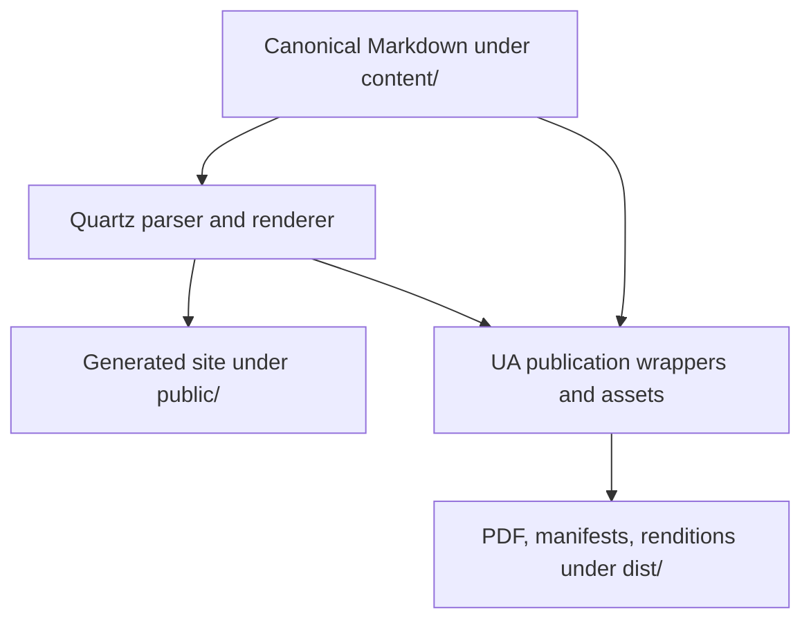

# Quartz integration architecture

This directory contains the Quartz-derived site generator and the UA-owned publishing, rendition, and verification layer built around it. It is implementation infrastructure. It renders and transports maintained content but does not create specification or research authority.

The repository is a maintained Quartz fork rather than an automatically synchronized vendor subtree. Package metadata preserves the upstream Quartz origin, but files under `quartz/` must not be assumed to be unchanged upstream code. Keep changes narrow so a future Quartz comparison or upgrade remains reviewable.

## Upstream provenance and local delta

The comparison baseline is the official [`jackyzha0/quartz`](https://github.com/jackyzha0/quartz) repository at tag `v4.5.2`, commit `4923affa7722dfc751f1074348e6dad214fe0c08`. The package version alone is not sufficient provenance: this exact commit is the reference for reviewing local changes and evaluating a future upgrade. This repository is not automatically synchronized with upstream.

The maintained local delta is grouped as follows:

| Delta group | Adapted or repository-owned surfaces |
|---|---|
| Root integration and compatibility | `.gitignore`, `.prettierignore`, `.prettierrc`, `package.json`, `package-lock.json`, `quartz.config.ts`, `quartz.layout.ts`, `tsconfig.json`, `vercel.json`, `globals.d.ts`, and `index.d.ts` |
| Quartz build and configuration | `quartz/build.ts`, `quartz/cfg.ts`, and `quartz/cli/helpers.js` |
| Components and browser behavior | `quartz/components/renderPage.tsx`; Explorer, Mermaid, Search, and SPA scripts; `search.test.ts`; and the corresponding Darkmode, Explorer, Mermaid, Reader mode, and Search styles |
| Parsing, emission, and links | `componentResources.ts` plus the Citations, Frontmatter, LaTeX, Links, Obsidian callout, and OxHugo transformers |
| Localization, resources, and shared presentation | the locale index; Hebrew, Italian, Kazakh, and Vietnamese locale files; `quartz/util/resources.tsx`; and base, callout, and custom styles |
| UA publication integration | `quartz/scripts/`, `quartz/publication/`, `PDF-EXPORT.md`, and `PLATFORM-RENDITIONS.md` |

The upstream `globals.d.ts` and `index.d.ts` files are required TypeScript and browser/SCSS compatibility declarations. Preserve them unless an upgrade supplies a demonstrably equivalent replacement and `npm run check:types` passes. Upstream documentation, funding, issue templates, preview/deployment workflows, and Docker packaging are intentionally outside the imported generator surface; local repository policy and publishing workflows own those responsibilities.

The upstream `.prettierrc` is the formatting baseline for the maintained fork, and `.prettierignore` excludes generated output, installed dependencies, and the Quartz cache. The changed-code validator passes both files explicitly to the locked local Prettier binary so a missing configuration fails closed instead of silently selecting tool defaults. The upstream `.gitattributes`, `.npmrc`, and `.node-version` are not currently imported: Node selection is owned by `package.json` plus the pinned CI setup, while no equivalent repository-wide Git EOL or npm `engine-strict` file is declared. A future upgrade must review those differences explicitly rather than assuming root tooling matches upstream.

Reproduce the root-and-generator delta inventory from the repository root with:

```bash
git diff --name-status 4923affa7722dfc751f1074348e6dad214fe0c08 HEAD -- \
  .gitattributes .gitignore .node-version .npmrc .prettierignore .prettierrc \
  globals.d.ts index.d.ts package-lock.json package.json quartz.config.ts \
  quartz.layout.ts tsconfig.json vercel.json quartz/
```

For a Quartz upgrade:

1. Record the proposed upstream tag and full commit SHA before changing files.
2. Compare that commit with the current baseline and classify every locally adapted path above as retained, ported, superseded, or removed.
3. Port local behavior onto the new upstream files instead of replacing the fork wholesale; preserve UA configuration, path safety, provenance, atomic finalization, publication contracts, and compatibility declarations.
4. Update this baseline and delta inventory in the same change.
5. Run `npm run check:types`, `npm test`, `npm run build`, the changed-code validator, repository-policy suites, and publication integration for every affected rendering path.

## Ownership boundary

| Surface | Current responsibility | Default change rule |
|---|---|---|
| `quartz/build.ts`, `cfg.ts`, `cli/`, `components/`, `plugins/`, `processors/`, `util/`, base styles and locale support | Quartz-derived site-generation core with selected repository adaptations | Prefer configuration or an existing extension point; modify only when the required behavior cannot be implemented coherently outside the core |
| `quartz.config.ts`, `quartz.layout.ts`, `quartz/styles/custom.scss` | Repository site configuration, layout, and UA presentation | Own repository-specific site behavior here when the Quartz extension model supports it |
| `quartz/scripts/` | UA-owned PDF, publication, asset, platform-rendition, provenance, safety, and verification tooling plus its JavaScript regression tests | Refine the existing module and invariant owner before creating another pipeline or helper |
| `quartz/publication/` | Machine-readable platform publication profiles | Treat profile changes as publishing-contract changes and update their verifiers and fixtures together |
| `quartz/PDF-EXPORT.md` | Human-readable PDF and publication-grade rendering contract | Update with any intentional PDF safety, provenance, finalization, or verification change |
| `quartz/PLATFORM-RENDITIONS.md` | Human-readable LinkedIn and Medium rendition contract | Update with any intentional platform packaging, link, image, furniture, or copy-ready change |
| `.github/scripts/`, `.github/tests/`, `.github/policy/` | Repository-policy validators, mutation fixtures, and machine-readable protection | Keep validators deterministic and dependency-light; do not encode subjective editorial judgment |
| `.github/workflows/` | CI orchestration and manual artifact generation | Extend an existing workflow when it already owns the lifecycle; pin third-party actions and keep permissions minimal |
| `public/`, `dist/` | Generated site, PDF, manifest, visual-review, and platform artifacts | Never treat as editable sources; do not commit routine generated output unless an explicit release or publication record requires it |

## Execution architecture



### Site path

`npm run build` invokes the Quartz CLI and produces the ordinary draft-filtered site. `quartz.config.ts` selects plugins and behavior; `quartz.layout.ts` composes the visible page; `quartz/styles/custom.scss` carries repository presentation changes.

### Generic PDF path

`npm run pdf -- <content/file.md>` invokes `quartz/scripts/export-pdf.mjs`. The exporter validates a real Markdown source under `content/`, builds a temporary draft-inclusive Quartz rendition, serves it locally to headless Chromium, rewrites cross-document links to durable targets, verifies critical resources and Mermaid readability, stages the PDF, validates its header/trailer and minimum size, and atomically installs only the generated PDF under `dist/pdf/`.

Path-containment, symbolic-link, hard-link, source-alias, and atomic-write logic is shared through `publication-path-safety.mjs`. Do not create a parallel output-safety implementation.

### Publication PDF path

`render-publication-pdf.mjs` wraps the generic exporter with publication furniture, strict source provenance, a schema-versioned manifest, optional contents pages, page furniture, curated Figure 8 handling, and rollback-capable PDF/manifest pair installation. `verify-publication-pdf.mjs` uses Poppler tools to verify manifest identity, page structure, fonts, links, figures, page furniture, and likely blank pages, then creates visual-review assets.

The detailed non-regression contract is owned by [`PDF-EXPORT.md`](PDF-EXPORT.md).

### Platform rendition path

The platform toolchain reads the standalone publication source and the profile under `quartz/publication/`, renders reviewed figures and hero assets, expands structures that do not survive Medium or LinkedIn transport, protects linked headings, adds standard author/research-path furniture, produces copy-ready review surfaces, and verifies the complete package. Outputs remain under `dist/publication/`.

The detailed platform contract and manual-publication boundary are owned by [`PLATFORM-RENDITIONS.md`](PLATFORM-RENDITIONS.md).

## Test and validation architecture

Tests are layered by the contract they can prove. A green unit suite does not replace a production build, publication render, visual inspection, or live GitHub policy evidence.

| Layer | Command or owner | Covers |
|---|---|---|
| TypeScript static analysis | `npm run check:types` | Compiler-level contracts across the Quartz core, UA integration, browser globals, and SCSS module declarations |
| Quartz TypeScript regressions | `npm run test:quartz` | Search tokenization, file trie behavior, path transforms, and other Quartz-core unit behavior |
| UA publication regressions | `npm run test:publication` | PDF containment/finalization, provenance, Figure 3/8 semantics, platform assets, renditions, links, furniture, and package verification |
| Combined JavaScript/TypeScript suite | `npm test` | Runs both test groups above |
| Production site build | `npm run build` | Quartz configuration, parsing, plugin composition, and site emission against maintained content |
| Local executable baseline | `npm run check` | Runs TypeScript static analysis, the combined test suite, and the production build without rewriting the repository |
| Changed-code quality | `python3 .github/scripts/validate_code_quality.py --base <current-target-tip> --head HEAD` | Incremental Prettier conformance for changed repository-owned web/config sources and syntax validation for changed Python |
| Changed-code formatting | `npm run format -- --base <current-target-tip> --head HEAD` | Writes Prettier output only to selected committed candidate paths; it never formats the legacy tree by default |
| Code-quality regression fixtures | `python3 .github/tests/code_quality/test_code_quality.py` | File-scope selection, NUL-safe diff behavior, formatter success/failure/configuration behavior, and Python syntax failure behavior |
| Publication-impact regression fixtures | `python3 .github/tests/publication_impact/test_publication_impact.py` | Renderer/configuration path coverage, non-impacting changes, and NUL-safe rename handling that preserves both path sides |
| Repository-policy suites | Commands in root `AGENTS.md` | Structure, metadata, change coupling, agent checkpoint, trusted-base, research register, links, Mermaid, and supply-chain policy |
| Publication integration | `Build Integrity` and manual export workflows | Chromium/Poppler rendering, strict manifests, visual artifacts, current article/working-paper paths, and upload packaging |
| Workflow analysis | `actionlint`, `zizmor`, and the supply-chain validator | Workflow syntax, permissions/security findings, immutable action references, and container digests |

`Build Integrity` runs the incremental changed-code validator, its regression fixtures, publication-impact fixtures, TypeScript static analysis, both JavaScript/TypeScript test groups, the Quartz production build, maintained Mermaid rendering, and workflow-policy analysis. Publication-impact detection treats every `quartz/` change plus root renderer configuration, publication sources, and publication assets as requiring the Chromium/Poppler render path. Manual export workflows create downloadable review artifacts; they do not publish a website or change research state.

## Change protocol

1. Identify the owning surface and read its human-readable contract.
2. Compare the requirement with existing configuration, helper, test, and workflow boundaries before adding a new path.
3. Preserve canonical Markdown, path containment, strict provenance, atomic finalization, deterministic manifests, and fail-closed verification.
4. Add a regression that fails without the intended change and covers relevant failure/preservation behavior.
5. Run the smallest affected layer, then `npm test` and `npm run build`; run publication integration when rendering behavior or inputs changed.
6. Run repository-policy validators when code, workflows, tests, contracts, or protected paths changed.
7. Update this architecture map only when ownership or execution topology changes. Update `PDF-EXPORT.md` or `PLATFORM-RENDITIONS.md` when behavior within those contracts changes.

Follow the repository-wide code contribution rules in [`CONTRIBUTING.md`](../CONTRIBUTING.md#code-contributions). Comments should explain why an invariant, boundary, workaround, or threshold exists; tests remain the executable proof.
