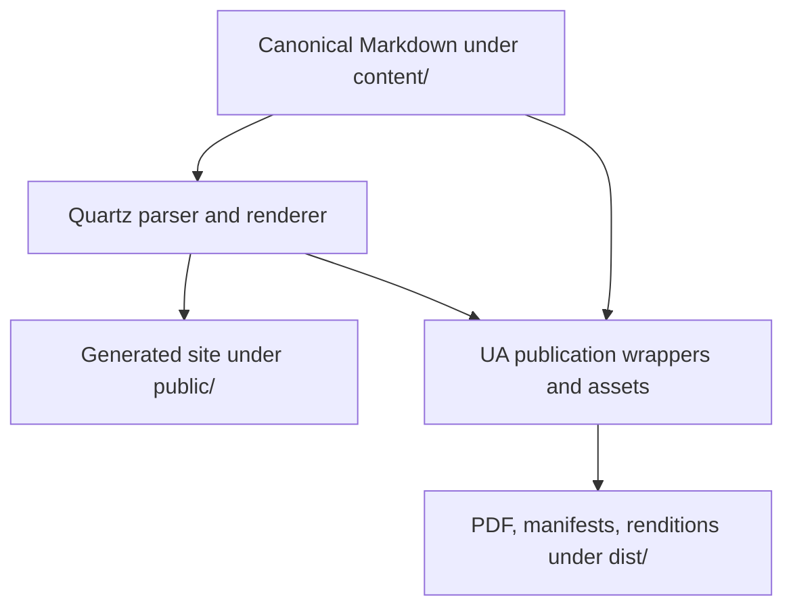

# Quartz Integration Architecture

This directory contains the Quartz-derived site generator and the UA-owned publishing, rendition, and verification layer built around it. It is implementation infrastructure: executable code does not acquire specification or research authority merely because it renders canonical content.

The repository is a maintained Quartz fork rather than an automatically synchronized vendor subtree. Keep repository-specific behavior in configuration or UA-owned extensions when possible so the local delta remains reviewable.

## Upstream provenance and local delta

The comparison baseline is the official [`jackyzha0/quartz`](https://github.com/jackyzha0/quartz) tag `v4.5.2`, commit `4923affa7722dfc751f1074348e6dad214fe0c08`. The package version alone is not sufficient provenance; this exact commit is the reference for reviewing local changes and future upgrades.

Current local responsibilities are grouped rather than treated as one undifferentiated fork:

| Surface | Local role |
|---|---|
| `quartz.config.ts`, `quartz.layout.ts`, `quartz/styles/custom.scss` | repository site configuration, layout, and presentation |
| Quartz parser/renderer/components/processors/utilities | upstream-derived core with selected repository adaptations |
| `quartz/scripts/` and `quartz/publication/` | UA-owned PDF, publication, asset, platform-rendition, provenance, safety, and verification tooling |
| `quartz/types/` | upstream-compatible browser, event, and SCSS declarations required by the maintained fork |
| `.github/config/prettier.json` and `.github/config/prettierignore` | explicit formatter baseline used by bounded code-quality validation |

Reproduce the relevant root-and-generator delta inventory with:

```bash
git diff --name-status 4923affa7722dfc751f1074348e6dad214fe0c08 HEAD -- \
  package-lock.json package.json quartz.config.ts quartz.layout.ts tsconfig.json vercel.json quartz/
```

For an upgrade: record the proposed upstream tag/SHA, classify each local adaptation as retained/ported/superseded/removed, port local behavior onto the new upstream files rather than replacing the fork wholesale, update this baseline, and rerun the complete validation matrix.

## Ownership boundary

| Surface | Default change rule |
|---|---|
| Quartz-derived core | Prefer configuration or an existing extension point; modify core only when the requirement cannot be implemented coherently outside it |
| Repository site configuration | Own repository-specific site behavior here when Quartz supports it |
| `quartz/scripts/` | Refine the existing publication/safety owner before creating another pipeline or helper |
| `quartz/publication/` | Treat profiles as publishing contracts and update verifiers/fixtures with intentional changes |
| [`PDF-EXPORT.md`](PDF-EXPORT.md) | Human-readable PDF rendering, provenance, finalization, and verification contract |
| [`PLATFORM-RENDITIONS.md`](PLATFORM-RENDITIONS.md) | Human-readable LinkedIn/Medium packaging contract |
| `.github/` policy/tests/workflows | Deterministic repository enforcement and CI orchestration, governed by scoped [`.github/AGENTS.md`](../.github/AGENTS.md) |
| `public/`, `dist/` | Generated output; never editable sources unless an explicit publication/history record requires the artifact |

AI contributors working here must follow [`AGENTS.md`](AGENTS.md) in addition to the root routing protocol.

## Execution architecture



`npm run build` produces the ordinary Quartz site. `npm run pdf -- <content/file.md>` invokes the generic PDF exporter. Publication-specific wrappers add strict provenance, furniture, manifests, verification, and platform packaging while keeping Markdown canonical.

Path containment, source identity, staging, atomic finalization, and rollback behavior are safety properties rather than convenience helpers. A failed generation or verification path must not replace the last valid artifact.

## Test and validation architecture

Tests are layered by the contract they can actually prove:

| Layer | Command | Covers |
|---|---|---|
| TypeScript static analysis | `npm run check:types` | compiler-level contracts across Quartz, UA integration, browser globals, and SCSS declarations |
| Quartz regressions | `npm run test:quartz` | TypeScript/Quartz unit behavior |
| Publication regressions | `npm run test:publication` | PDF, provenance, figures, assets, renditions, links, furniture, and package verification |
| Combined JS/TS tests | `npm test` | both test groups |
| Production site | `npm run build` | real Quartz configuration, parsing, plugin composition, and site emission |
| Local executable baseline | `npm run check` | typecheck + tests + production build |
| Changed-code check | `npm run format:check -- --base <current-target-tip> --head HEAD` | bounded Prettier plus changed Python syntax validation |
| Changed-code write | `npm run format -- --base <current-target-tip> --head HEAD` | writes formatting only to selected candidate paths |
| Policy regressions | `python3 -m unittest discover -s .github/tests/code_quality -p 'test_*.py'` | changed-path safety, formatter behavior, and protected code-quality contract |
| Publication routing | `python3 -m unittest discover -s .github/tests/publication_impact -p 'test_*.py'` | impact classification and NUL-safe rename handling |

The changed-code validator always passes `.github/config/prettier.json` and `.github/config/prettierignore` explicitly to the locked local Prettier binary. It rejects symbolic-link and hard-link aliases before write mode can touch a selected path.

Publication-impact detection covers executable `quartz/` changes, root renderer/configuration surfaces, publication inputs, and assets. Scoped guidance such as `quartz/AGENTS.md`, `quartz/README.md`, `PDF-EXPORT.md`, and `PLATFORM-RENDITIONS.md` is explicitly non-executable and does not trigger the expensive Chromium/Poppler render by itself.

`Build Integrity` runs changed-code validation, policy self-tests, TypeScript static analysis, Quartz/publication regressions, production build, Mermaid rendering, and workflow policy checks. Publication-impacting changes additionally run the publication render path.

## Change protocol

1. Read [`AGENTS.md`](AGENTS.md), [`../CONTRIBUTING.md#code-contributions`](../CONTRIBUTING.md#code-contributions), and the narrower owning contract.
2. Prefer existing configuration, helper, test, and workflow boundaries before adding new structure.
3. Preserve canonical Markdown, path containment, strict provenance, atomic finalization, deterministic manifests, and fail-closed verification.
4. Add a regression that fails without the intended change and covers relevant failure/preservation behavior.
5. Run the smallest affected layer, then `npm test` and `npm run build`; run publication integration when render behavior or inputs changed.
6. Run repository-policy validators when code, workflows, tests, contracts, or protected paths changed.
7. Update this architecture map only when ownership, upstream provenance, execution topology, or test architecture changes.

Comments should explain why an invariant, boundary, workaround, or threshold exists; tests remain the executable proof.
